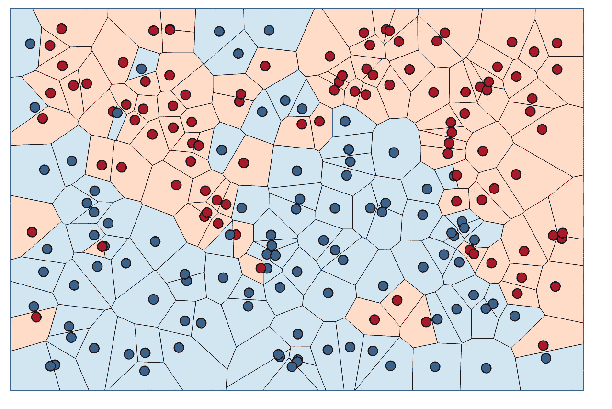
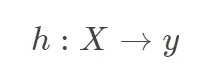
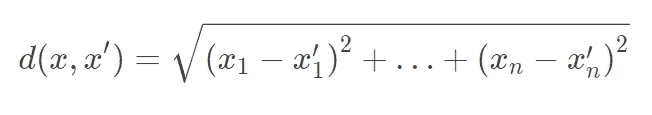
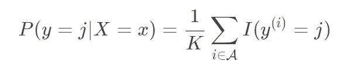
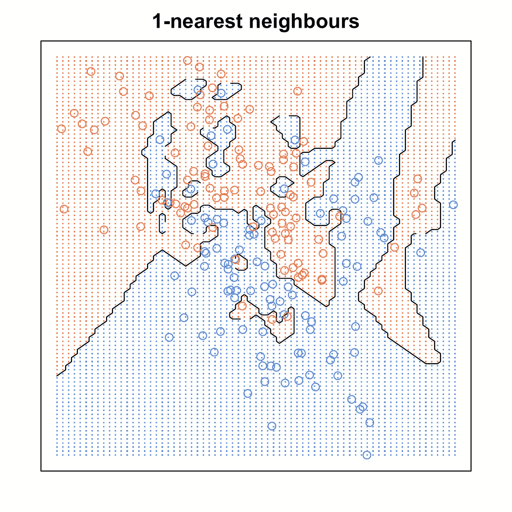
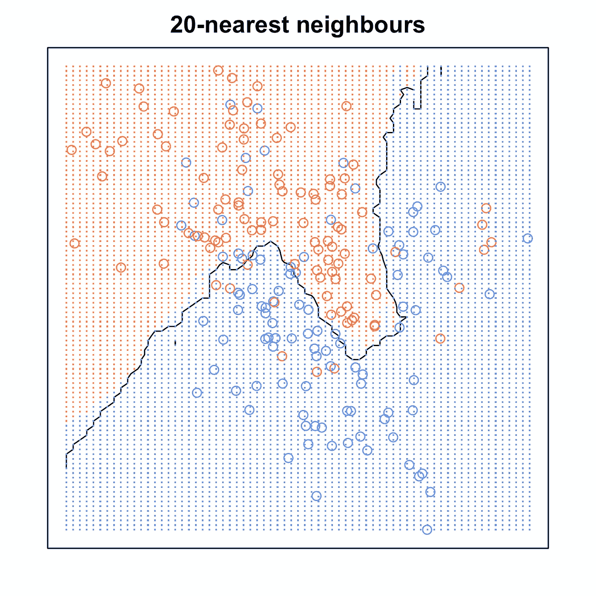

# 用 30 分钟理解一篇文章中的 K 近邻(KNN)

> 原文：<https://medium.com/analytics-vidhya/%E4%B8%80%E6%96%87%E6%90%9E%E6%87%82k%E8%BF%91%E9%82%BB%E7%AE%97%E6%B3%95-knn-a1c3571562c1?source=collection_archive---------7----------------------->

## 从 KNN 出发潜入 ML

## 内容

*   什么是 K-最近邻？
*   KNN 是如何运作的
*   如何应对 k
*   Python 中的 KNN:Scikit-Learn & Scratch
*   KNN 的利弊
*   改进
*   KNN 面试问题和其他材料
*   摘要

# 什么是 K-最近邻

我们都已经熟悉了用 X 来代表**特征**，用 y 来代表**目标**。KNN 是一个**监督学习算法**，即我们有一个目标结果的数据集(X，y)，我们想发现它们之间的关系，这意味着我们想找到一个方程 h(x)，这样 X 就可以用来预测 y

KNN 分类器也是一个基于**非参数**和**实例的**算法。

*   **非参数化**意味着它不对函数 h(x)做任何显式的假设，从而避免了对数据分布进行不正确建模的风险。比如我们的数据是高度非高斯的，但是我们选择的学习模型是高斯分布的( [LDA](https://zg104.github.io/Naive_bayes#362) )，结果会很不理想。
*   **基于实例的**意味着我们的算法没有真正的学习模型。相反，它选择记住经过训练的实例，并将其用作预测阶段的“知识”。具体来说，这意味着只有当对我们的数据库进行查询时(即，当我们要求它预测给定输入的标签时)，算法才会使用经过训练的实例来给出结果。

值得注意的是，KNN 的最小训练阶段不仅需要“内存成本”(因为我们在测试过程中必须存储庞大的数据集)，还需要计算成本(因为对给定的观察值进行分类需要整个数据组)。其实这是不可取的。

# KNN 是如何运作的

在进行分类时，K 近邻算法本质上归结为在给定的“看不见的”K 个最相似的实例中，基于“少数服从多数”的投票(所以也叫投票算法)。

如何定义相似度？我们基于两个数据点之间的距离度量来定义相似性。欧几里德距离定义如下:

但是还有其他的选择比如**曼哈顿**、**切比雪夫**和**海明距离**。

给定一个正整数 *K* ，一个未知的观测值 *x* ，一个特定的测量方法 *d* ，KNN 通过以下步骤进行分类

*   该算法遍历整个数据集，以计算 *x* 与每个训练集中的观察值之间的距离。我们将训练数据集中最接近 *x* 的 *K* 点称为 a。注意，为了防止平局， *K* 通常是奇数。
*   接下来，它估计每个类别的条件概率，即给定类别标签的点在集合 *A* 中所占的比例。(注意 I(x)是一个指标函数，当其参数 x 为真时返回 1，否则为 0)

最后，我们输入的输入按照最大概率被分配到相应的类别。

> *KNN 在记忆的训练观察中搜索与新实例最相似的 K 个实例，并将它们最常见的类别分配给新实例。*

具体算法如下:

# 如何应对 k

那么现在，你应该知道 KNN 算法是如何工作的了，但是 *K* 的选择还是很关键的。与其他机器学习算法类似， *K* 是一个超参数，用于控制决策边界的形状。

当 K 较小时，我们将“眼睛”局限于给定的预测区域，对分类器的整体分布“视而不见”。它将具有低偏差但高方差(过拟合)的性质。从图形上看，决策边界会更加不均匀。

另一方面，更大的 *K* 意味着每种预测情境下的平均“投票者”更多(即我们更侧重于全局考虑，每次考虑的数据点更多，模型的泛化能力更强)，因此，对异常值的适应性更高。更大的 *K* 将具有更平滑的决策边界，这意味着方差更小，但偏差增加(欠拟合)。

当 *k* 为 1 时，也就是说，在计算出新的测试点与所有训练集的点之间的距离以及排序后，只取最近的**单个**点进行分析。如果这个点属于某个类别，那么我们就断言这个测试点属于这个类别。显然，这太绝对了。我们应该允许更多的点参与比较，以使投票结果更有说服力！

当我们将 *k* 增加到 20 时，我们发现整个决策边界的形状发生了很大的变化，锯齿状的形状减少了，投票点的数量从 1 个增加到 20 个，为了避免过拟合，使模型更加一般化。

*   k 越小，越容易过拟合；k 越大，越容易欠填。
*   k 是一个超参数，需要通过交叉验证进行调整。

# Python 中的 KNN:sk learn & Scratch

# KNN 的利弊

> 赞成的意见

*   容易理解
*   没有关于数据分布的初步假设
*   适用于多类别情况

> 骗局

*   处理大型数据集时的低效计算。
*   偏斜数据的效果很差。如果一类数据出现的频率极高，就会严重压制其他类型。投票的时候，我们会忽略他们的存在。
*   处理高维数据时性能不好。在这种情况下，距离度量变得模糊。

# 丰富

*   改善部分分布的一个简单有效的方法是使用“加权投票”。每个 *K* 邻居的类别乘以与从该点到给定测试点的距离的倒数成比例的权重。这确保了较近的邻居比较远的邻居对最终投票的贡献更大。
*   改变测量距离的方法。
*   将数据归一化，使距离的概念更加明显
*   降维
*   近似最近邻(例如，使用 k-d 树来存储训练观察值)可以用来减少测试时间。然而，这种方法通常在高维(20+)中表现不佳。如果维数太高，尝试使用区域敏感哈希(LHS)

# KNN 面试问题和其他材料

> 面试问题

*   [30 个问题测试一位数据科学家的 K 近邻(kNN)算法](https://www.analyticsvidhya.com/blog/2017/09/30-questions-test-k-nearest-neighbors-algorithm/)
*   [访谈案例研究# 1:KNN 参数优化统计](/@cornell_data/interview-case-study-1-sampling-methods-and-parameter-changes-4799c580aa42)
*   [KNN 面试问题(中文版)](https://www.cnblogs.com/xueyunqing/p/10281656.html)

> 其他材料

*   [斯坦福斯**cs 231n**KNN 笔记](https://cs231n.github.io/classification/#nn)
*   [Scikit-learn 的 KNN 文档](https://scikit-learn.org/stable/modules/neighbors.html)
*   [KNN 刘建平总结](https://www.cnblogs.com/pinard/p/6061661.html)

stat quest:K-最近邻，解释清楚

# 摘要

K——最近邻法(KNN)是一种非常基础的机器学习方法，在我们的日常生活中也是不由自主的应用。比如判断一个人的性格，我们只需要观察和他交往最密切的那几个人的性格。这里用到了 KNN 的想法。KNN 方法可以进行分类和回归，这与决策树算法相同。

KNN 回归和分类的主要区别在于进行预测时的决策方法不同。KNN 在进行分类预测时，一般选择多数投票法，即将训练集中最接近预测样本特征的 *K* 个样本预测为类别数最多的类别。KNN 进行回归时，一般选择平均法，即取最近的 *K* 个样本的样本输出的平均值作为回归预测值。由于两者之间的细微差别，虽然本文主要解释了 KNN 分类法，但这一思想也适用于 KNN 回归法。由于 scikit-learn 只使用了蛮力、KDTree 和 BallTree，所以本文只讨论这些算法的实现原理。其余的实现方法，如 BBF 树、MVP 树等。，这里不讨论。

*原发布于*[*https://ZG 104 . github . io*](https://zg104.github.io/KNN_tutorial)*。*