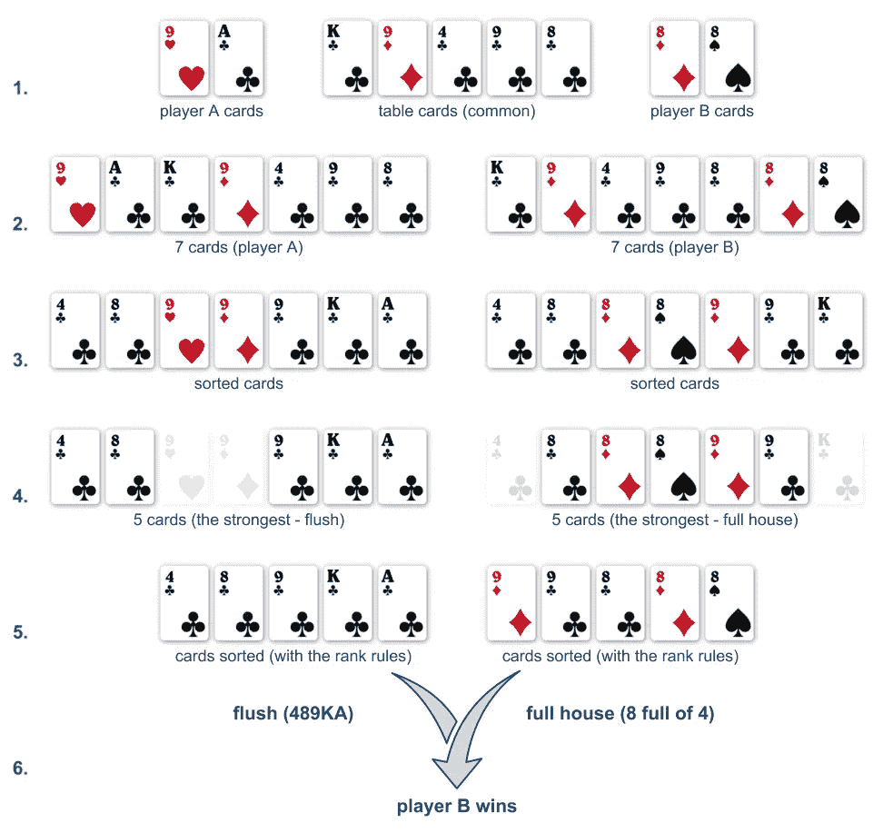
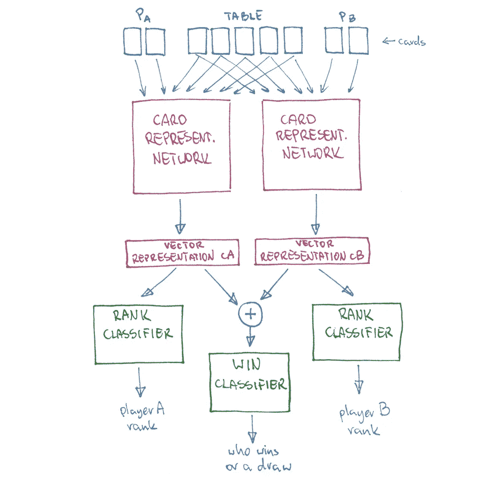
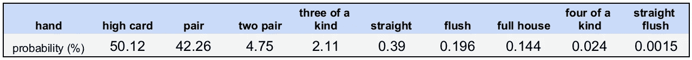
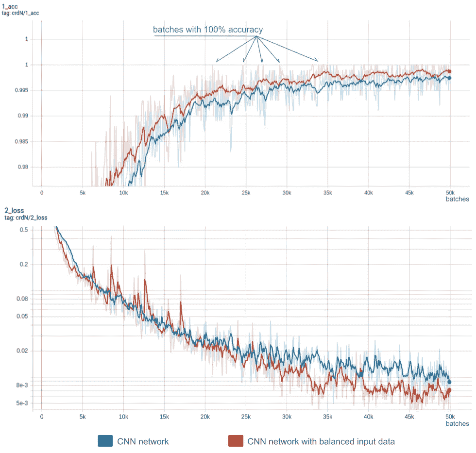
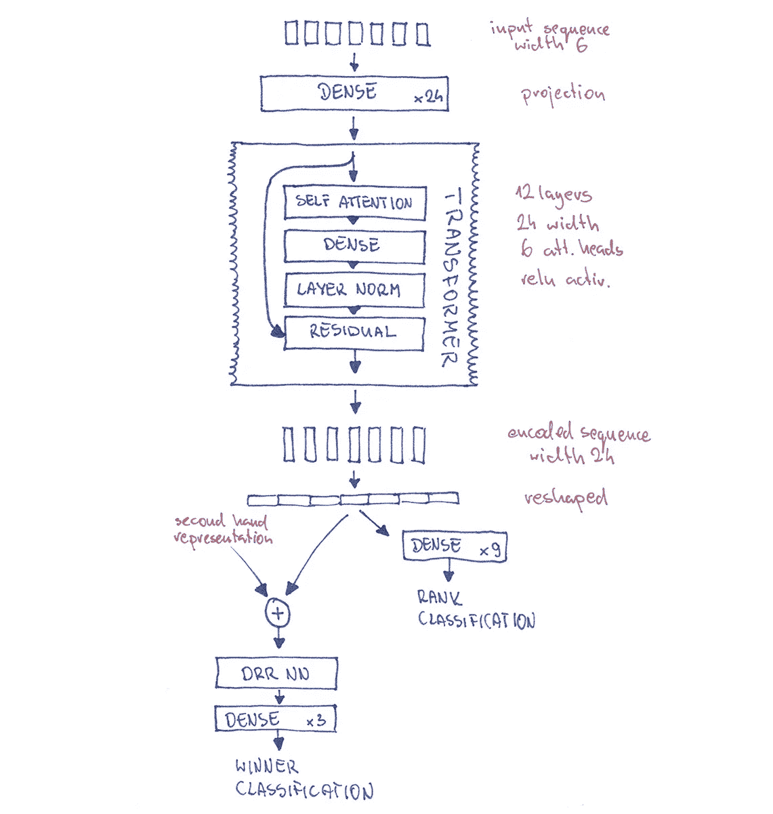
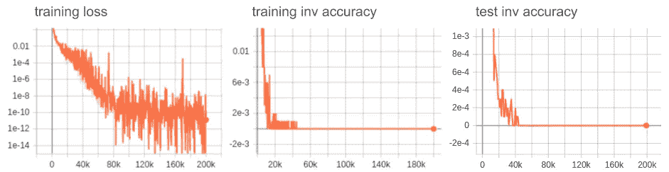

# 用卡片学习神经网络

> 原文：<https://medium.com/analytics-vidhya/002-cards-neural-network-812effd68b36?source=collection_archive---------3----------------------->

## 第 002 部分:构建 Cards 神经网络

让我们为我在[上一篇文章](/@piotrniewiski_71032/001-neural-network-learns-poker-hands-c2ef8aa8dae5)中介绍的任务建立一个神经网络(NN)。我期望网络**从给出的例子中学习一个扑克[手牌排名](https://en.wikipedia.org/wiki/List_of_poker_hands)的算法**。这只是用强化学习(RL)和神经网络解决扑克游戏的一部分，但正如我们将在后面看到的，这是非常有趣和重要的一部分。

让我们看看下面的例子(两个玩家一手牌的情况)。它显示了排序算法的可能步骤。

扑克牌局排名和赢家分类程序示例

*我们在寻找什么类型的神经架构:前馈(密集)、CNN、RNN 或其他？*

# 数据

首先，我将介绍这些数字:

*   一副牌中有 52 张牌
*   2，598，960 套不同的 5 张牌(一副 52 张牌中 5 张牌的组合数)

在真实的扑克游戏中，与上面的例子类似，一组中有 7 张牌需要考虑(2 张玩家牌和桌上的 5 张)，我们必须选择其中 5 张等级最高的牌，因此还有另一个数字需要考虑:

*   133，784，560 套不同的 7 张卡

如果我们的神经网络只能识别(分类)排名，这将是大数的终结，但我们必须比较两个玩家的手。假设两个玩家都有 2 张牌，并且牌桌上有 5 张共享的牌，我们必须考虑 9 张牌可能的赢或平。

*   3，679，075，400 套不同的 9 张卡

这是一个相当大的数字！

为什么我提到这些数字？它给了我们一个问题复杂性的轮廓。如果一个神经网络必须记住数据，它可能是一个相当大的网络，但我希望网络能够学习算法。这意味着一个具有良好架构的神经网络应该能够用少量的参数(变量)来解决任务。它应该**对从给定数据样本中学习到的依赖关系和规则**进行建模，而不是存储所有的输入数据案例。

但是什么是好的架构，网络变量的数量可以有多小呢？你会在下面的课文中找到答案。

# 神经网络模型概述

核心 NN(卡片编码器网络)采用 7 张卡片作为输入，并输出(这 7 张卡片的)单一向量表示。我希望该表示能够存储所有信息，以便轻松地对编码卡片的等级进行分类。比较这两种表现，我们应该很容易选择赢家或把给定的情况归类为平局。我所说的“简单分类”是指使用一个简单的分类器(比如一个带有 softmax 的密集层),建立在准备好的表示上。如果任务以 100%的准确率完成，我们可以说神经网络完全理解纸牌和扑克牌。以下是建议系统的总体方案:

# 输入数据表示

我将使用**嵌入**对牌进行编码，对于副牌，精确地说是 53: 52，对于没有“牌”的牌，精确地说是 53:52(“没有牌”嵌入将在后面解释)。这是相当小数量的嵌入，应该只保留关于牌阶和花色的信息。因此，与典型的 NLP 情况相反，我希望嵌入不会消耗太多的变量空间。我将用随机的浮点数来初始化它们。

我们可以把七张卡想象成七个向量的序列(嵌入)。在这个序列中，顺序并不重要(我将在下一篇文章中讨论)，所以它更多的是一个集合而不是一个序列，但是让我们继续讨论序列术语。我们的序列长度固定为 7。这一特性为神经结构研究提供了许多机会。

# 建筑

为了简单起见，我从一个由七张卡嵌入连接而成的向量开始，并使用了一个深度密集的网络进行编码和分类。对于单个向量分类任务，我通常使用在[这篇论文](https://arxiv.org/abs/1906.01515)中描述的深度正则化残差神经网络(DRR NN)架构网络。

DRR NN 单块

你可以把它看作是卷积 ResNet 的密集等价物。由于增加了图层归一化和残差，它的性能通常比密集图层的深度叠加要好。网络越深，结果越好，但它们从未达到高精度。具体来说:等级分类很容易达到 100%的准确率，但获胜者的分类从未超过 85%。

至此，我已经发现了输入数据的一些有趣的统计数据。如果我们从一副牌中随机抽取牌，我们会得到非常不平衡的数据。下面是随机选择的 5 张牌的等级概率表:

扑克牌的概率

我们可以看到，我们会有一个同花顺(最强排名)，概率为 0.001544%。意思是我们每 64767 手牌会挑一次同花顺。同样，两个玩家平局的概率也很低——大约 2%。这是一个非常直观的观察，神经网络在平局和罕见的排名中犯了最多的错误。用这样不平衡的数据训练网络将是一项艰巨的任务。我修改了批次准备算法以平衡等级(在单个批次中等级的频率相等)并强制给定的抽取次数(最终设置中批次样本的 10%)。实现后，赢家分类的准确率略微提高到 92%以上。这是以前错误率的一半，但仍然不是我想要的。

# CNN 编码器

我意识到给卡片编码更像是在一张图片(或一个序列)中寻找一些模式——我希望你能理解这个类比。我试过卷积(CNN)。我用卷积和残差建立了一个网络，效果更好。我时不时能对整批产品达到 100%的准确率。一批等于 2 手 1000 个样本= 1000*(2+2+5)张牌。然后，我微调了许多参数:层数、过滤器大小、学习率和优化策略、辍学和许多其他参数，但正如你在下面的图表中看到的，我从未获得永久的 100%的准确性。此时，我对结果相当失望，找不到失败的原因。卷积通常可以很好地处理编码序列，特别是对于短时间依赖，这里我们在一个序列中只有 7 张卡。看起来我需要更强大的东西。

CNN 网络的损失和准确性，网络在大约 50K 批次后停止改善

# 变压器编码器

我决定试试**变形金刚**。Transformer ( [注意力是你所需要的全部](https://arxiv.org/abs/1706.03762))是一个真正强大的序列处理架构。我们在 NLP 领域有很多变形金刚——至少有几个提线木偶([伯特](https://arxiv.org/abs/1810.04805)、[罗伯塔](https://arxiv.org/abs/1907.11692)、[艾伯特](https://arxiv.org/abs/1909.11942)、 [XLNet](https://arxiv.org/abs/1906.08237) 等。).

经过微调的变压器编码器架构，输入层和分类器，我终于得到了完美的结果。仅仅经过 25 分钟的训练，我就在训练和测试集上获得了永久的 100%准确率。在训练之前准备了 20，0 00 手(2 个玩家的 10，0 00 手)的测试集。在训练网络时，测试集中没有出现手。这是**卡变压器编码器**架构的图纸:

卡片转换器编码器架构(带分类器)

下面是网络的训练和测试性能图。训练损失降低到远低于先前网络的损失。我记录了颠倒的准确性(错误率？)因为它符合更好的对数标度(inv 精度= 1-精度)。inv 精度越低越好，0 是完美的。

卡片变压器编码器性能

总之，用上述架构构建的网络在经过大约 **45 000 批**的训练数据后，学会了牌局排序和比较的算法。用了大约 90，0 00，0 00 手有正确答案的手来“检测”算法的所有规则。这低于训练数据中所有可能扑克牌组合的 **3%** 。这意味着网络仅从所有可能情况的一部分中学习所有的相关性。最终的架构有大约 290 000 个变量。如果有更多的变量(更大的网络)，它甚至可以更快地完成任务。我已经做了测试，一个更大的网络在 30 000 批次后做了测试。类似地，较小的网络也可以解决这个问题，但是需要更长的训练时间。

这个用强化学习和神经网络解决扑克游戏的子任务导致了一个重要的结论。扑克是一个有很多未知数据的高方差游戏。据说打了几十万手牌就能点一个好的扑克手！此外，许多牌局在摊牌前就结束了(摊牌是玩家亮出他们的牌的时刻，一个有趣的事实是，即使在摊牌期间，通常也不是桌上的每个玩家都必须亮出牌)。事实上，大多数牌都不会摊牌，因为除了一个玩家，所有人都弃牌，只有一个人赢。如果有人期望一个 NN 代理从游戏中学习所有的扑克规则和战术**而仅仅是**，这肯定会花费很多时间。也许正因为如此，问题仍然没有以那种方式解决。

纸牌理解的子任务是整个扑克环境的一小部分。我们可以假设，在开始游戏之前，桌上的每个玩家都应该知道纸牌的排序算法。我可以说上面的 NN 对扑克手很了解。在未来，我将尝试用部分数据的情况来扩展这一知识，当一些卡未知时。然后，该模型应该仅**根据当前它拥有的所有信息来估计手的力量**。我想你现在可以猜到“无卡”嵌入是为了什么。