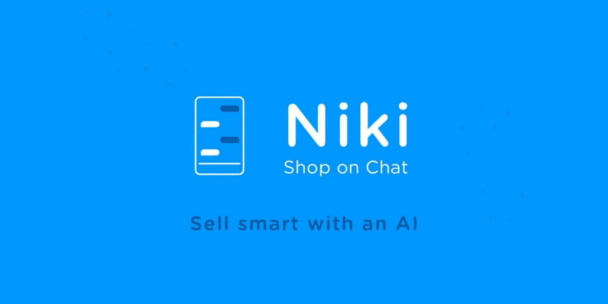

# 你应该知道的印度 10 家人工智能(AI)初创公司

> 原文：<https://medium.com/analytics-vidhya/10-artificial-intelligence-ai-startups-in-india-you-should-know-7d027263c5c8?source=collection_archive---------4----------------------->

# 概观

*   看看印度 10 家最棒的人工智能(AI)初创公司
*   我们专注于人工智能创业公司的多元化领域，包括医疗保健、物流、金融科技等领域的创业公司
*   有我们错过的人工智能创业公司吗？请在评论中告诉我们！

# 介绍

> “人工智能是新的电力。”—吴恩达

当吴恩达讲话时，你放下一切，集中注意力。当吴恩达把我们的人工智能时代比作电的发现时，我(和成千上万的其他人)就是这么做的。

我们真正生活在[人工智能](https://courses.analyticsvidhya.com/bundles/ai-blackbelt-beginner-to-master?utm_source=blog&utm_medium=10-ai-startups-india)的时代。公司花费数十亿美元仅仅是为了在当今不断变化的环境中保持相关性。如果你与人工智能不兼容，人们普遍认为你很快就会成为这个行业的失败者。

这让我开始思考——我能让印度的人工智能初创公司真正带来一场全球革命吗？这是一个有趣的探索。我制定了一个框架或标准来筛选印度顶尖的人工智能初创公司(我们很快就会看到)。

所以，这篇文章重点介绍了印度顶尖的人工智能初创公司，顶尖的发起人，他们正在使用人工智能为我们建设更美好的未来。准备好深入研究我用来创建这个列表的框架了吗？

*如果你对人工智能完全陌生，这里有几篇文章可以帮你入门:*

*   [*机器学习和人工智能初学者必读书籍*](https://www.analyticsvidhya.com/blog/2018/10/read-books-for-beginners-machine-learning-artificial-intelligence/?utm_source=blog&utm_medium=10-ai-startups-india)
*   [*10 个必看视频，展示人工智能(AI)的惊人应用*](https://www.analyticsvidhya.com/blog/2018/05/10-videos-machine-intelligence/?utm_source=blog&utm_medium=10-ai-startups-india)
*   [*10 场激动人心的关于人工智能的 TED 演讲&每位数据科学家、商业领袖必看的*](https://www.analyticsvidhya.com/blog/2018/09/best-ted-talks-artificial-intelligence-must-watch/?utm_source=blog&utm_medium=10-ai-startups-india)

# 筛选初创企业的框架

这份名单是根据某些参数筛选出来的，这些参数是衡量初创公司成功与否的指标。评估初创企业的参数包括:

*   **行业/市场:**初创公司所处的行业以及在该市场中可以利用的机会
*   **投资:**创业公司是否已筹集资金，收到的资金数量和质量
*   当然，首要的标准是创业公司应该在**印度**！

# 我们挑选的印度最佳人工智能初创公司:

对话式人工智能初创公司

*   Haptik.ai
*   阿瓦莫

医疗保健创业公司

*   尼拉迈
*   多克斯珀

物流创业公司

*   LogiNext
*   Locus.sh

金融科技初创公司

*   鲁比克
*   伦丁卡特

其他令人敬畏的人工智能创业公司

*   克罗平
*   Niki.ai

# 对话式人工智能初创公司

# [Haptik.ai](https://haptik.ai/)

聊天机器人现在无处不在。从企业到研究实验室，它们已经成为一个组织战略不可或缺的一部分。学习如何从头开始创建聊天机器人是数据科学中一项被大肆吹嘘的技能。

Haptik.ai 是全球最大的对话式 ai 平台。我是 Haptik 的超级粉丝。该公司于 2013 年推出，作为所有日常任务的一站式应用程序，现在无疑是该领域的市场领导者。

Haptik 提供了 16 种不同的文本和语音通道，供用户构建、部署和管理对话应用程序。Haptik 只关注在十亿多条消息的真实对话数据背后实现终端消费者参与的用例。

在人工智能的帮助下，Haptik 帮助了包括我在内的数百万人的日常工作。它的快速响应和查询解决能力是非常显著的。确实是个人助理。

# [Avaamo](https://avaamo.ai/)

Avaamo 是另一家对话式创业公司，目前服务于六个行业:保险、金融服务、医疗保健、电信、零售。

Avaamo 成立于 2014 年，现在已经在大约 40 个国家建立了自己的名字。相当令人印象深刻！

Avaamo 专注于对话界面，以解决企业中特定的高影响问题。**它使用人工智能使企业对话计算成为现实。**

与第一代对话式人工智能不同，用户只能通过类似于*播放音乐*或*打开摄像头*的命令，Avaamo 带来了第二代对话式人工智能体验，可以执行丰富的多回合对话，能够处理客户服务中的查询，生成保险报价，或回答医疗保健中的索赔查询。

# 医疗保健创业公司

# [尼拉麦](https://www.niramai.com/)

这个人工智能初创公司会引起你们很多人的共鸣。医疗保健是人工智能需要做出成绩的一个领域。由于各种原因，进展缓慢，但在过去几年里，情况看起来很有希望。

**NIRAMAI** 代表“具有机器智能的非侵入式风险评估”。在梵语中，Niramai 的意思是远离疾病。这是一种新的乳腺癌筛查解决方案。

乳腺癌是当今女性癌症死亡的主要原因。

> 根据世卫组织的调查，每 12 名女性中就有一人有乳房异常的风险。印度女性只有大约 50%的生存机会。

**Niramai 提供了一种经济高效的方法来检测乳腺癌**，并且是需要高资本成本的现有乳房 x 线摄影方法的更好替代方法。乳房 x 线照相术的主要缺点是它只能用于 45 岁以上的妇女，因为它不能有效地识别年轻妇女的肿瘤。

NIRAMAI 解决方案的核心是 Thermalytix，这是一个由人工智能驱动的计算机辅助诊断引擎。通过[此链接](https://www.niramai.com/about/thermalytix/)了解更多关于 Niramai 如何使用人工智能进行癌症早期检测的信息。

# 多克斯珀

Doxper 是另一家在医疗保健领域工作的印度人工智能初创公司。

你看过医院记录吗？保存病人的记录是一项令人兴奋的任务——这的确是一项令人生畏的职能。Doxper 有助于简化医疗保健数据的记录方式。

Doxper 也帮助医生、医院和病人。它改善了医患互动。 **Doxper 旨在提供方便的存储&检索、自动患者随访和自动数据转录。**

当使用 Doxper 写入信息时，它会存储在云中，并立即自动与患者共享。这有助于保持记录的安全，并使与患者的沟通变得非常简单。

医院可以使用它来立即数字化急诊、OPD 和 ICU。这也可以通过直观的 API 在现有的 his 系统中使用。

这是一个了不起的产品，帮助医疗保健部门数字化他们的病人的记录。

# 物流启动

# [逻辑下一步](https://www.loginextsolutions.com/)

艾没有留下一块未被碰过的石头。它在几乎每个领域都找到了自己的位置，甚至是以前庞大的人工物流领域。有不少人工智能驱动的物流初创公司如雨后春笋般涌现，LogiNext 无疑是目前的领导者之一。

LogiNext 帮助管理现场服务。它在单一地图界面上实时跟踪和优化现场代理的移动。

LogiNext 帮助组织以最经济的方式计划和管理配送计划、配送路线和运输能力。

它赋予用户每分钟跟踪(实时)货物的能力。它提供基于预测和大数据分析的见解和可视化。Logistics analytics 帮助用户利用算法支持的位置智能准确预测未来，并优化物流和现场服务管理操作。

它提供了从提货到送货的每一个细节。它还提供完整的现场服务管理分析。

物流和现场劳动力管理解决方案是完全自动化的、有效的、安全的，并且可以与多个平台无缝集成，提供完整的物流自动化。

# [Locus.sh](https://locus.sh/)

名单中的另一家物流初创公司是 Locus。早在 2015 年，该公司就提供路线规划和优化、实时车队跟踪、洞察和分析以及自动化货物分拣和骑手分配等设施。

Locus.sh 提供了许多功能，包括:

*   **智能地理编码**:将最模糊的地址转换成精确的地理坐标。这增加了订单交付，减少了车辆数量，降低了燃料成本
*   **调度概述:**该功能允许您在规划后会议中通过三种不同的指标(地理、时间&车辆)在屏幕上可视化您的计划。这有助于可视化聚类形式，并确保路线重叠最小
*   **预测警报:**它会在任何违规情况下向您发出警告。此功能有助于跟踪地面资源。如果出现任何偏离计划路线、非指定停车、超过休息时间等情况，您会收到即时警报。
*   **实时跟踪:** Locus.sh 的系统允许与客户共享订单的配送详情。当前经纬度、司机联系方式等。从而提高客户参与度
*   **途中分析:**此功能有助于比较计划和执行的交货路线。这也有助于分析驾驶员的驾驶行为

# 金融科技初创公司

# [红宝石](https://www.rubique.com/)

金融中的人工智能只是直觉上有意义。金融就是数字运算(嗯，差不多吧！)而机器在这一点上已经做好了处理数字的准备。真是绝配。因此，毫不奇怪，金融科技领域的人工智能应用大幅增长。

Rubique 就是这样一家金融科技初创公司，它通过使用人工智能来简化金融。

Rubique 希望通过引入可预测性来彻底改革金融业。**这有助于其用户在基于人工智能的推荐引擎和 Rubique 的金融匹配平台的帮助下，找到最符合他/她的信用要求的匹配。**

Rubique 的多边借贷平台提供电子 KYC、银行对账单分析、信用局检查、信用备忘录生成和 MCA 集成以及实时应用跟踪等功能，使其成为无纸化体验。

Rubique 在为整个贷款领域提供顶级解决方案方面做得非常好。

# LendingKart

LendingKart 是另一家通过向小企业提供贷款来应对金融领域的优秀创业公司。LendingKart 遍布 1300 多个城市，正在成为全球领先的金融科技公司之一。这是他们的官方声明:

> *LENDINGKART Group 的目标是让企业家可以随时获得营运资金，这样他们就可以专注于业务，而不是担心现金流的缺口。*

**LendingKart 开发了基于大数据分析的技术工具，帮助贷款人评估借款人的信誉。**他们不关注供应商的过往记录。LendingKart 的主要目的是提供资本资金，帮助企业家专注于他们的业务，而不是担心现金流的缺陷。

# 其他令人敬畏的人工智能创业公司

# [CropIn](https://www.cropin.com/)

农业部门是印度价值观的同义词。这是这个国家不可分割的一部分，也是我们的全部。那么人工智能可以做些什么来加速这一领域的进展呢？总部位于孟加拉鲁鲁的初创公司 CropIn 让人们得以一窥农业的未来。

**CropIn 是一款智能农业应用，为整个行业提供面向未来的农业解决方案。这是一个直观、智能和自我进化的系统。该公司提供实时解决方案来预测趋势，存档模式，并为未来的业务制定蓝图。**

CropIn 有现场报道的能力，它还提供地理分析，解释和洞察力。通过智能手机应用程序收集数据可确保您的现场代理始终高效运营、降低成本并获得更好的可见性。

> *CropIn 的愿景是实现每英亩价值最大化，使命是让每个农场都具有可追溯性。*

实时洞察有助于做出有计划、有响应的业务决策。产量和质量的可预测性，加上运营成本的降低，提高了企业的生产率。

# [Niki.ai](http://niki.ai/)

想象一个人工智能帮助你端到端地进行在线交易。听起来太不真实了。但是好消息是——它已经出现了！

Niki.ai 是一个虚拟代理，为您在各个领域进行端到端的在线交易。从后付费充值到酒店预订，Niki 无所不包。

Niki 在接受用户的一些输入后，使用人工智能进行预订和支付。这减少了客户和服务提供商的端到端交互时间，有助于提供快速响应的服务。

预订电影票、家庭账单、巴士预订、活动预订等。-你说出它的名字，尼基就去做。

# 结束注释

在这篇文章中，我们看到了印度一些最令人惊叹的人工智能初创公司，它们正在改变我们的生活方式。这绝不是一份详尽的清单。现在有很多人工智能初创公司涌现出来，带来了他们自己独特的品牌。

如果你遇到任何其他基于人工智能的印度创业公司，他们有能力以积极的方式影响数百万人，请在评论区告诉我。直到那时——继续学习！

你也可以在分析 Vidhya 的 Android 应用上阅读这篇文章

*原载于 2019 年 7 月 2 日*[*【https://www.analyticsvidhya.com】*](https://www.analyticsvidhya.com/blog/2019/07/10-ai-startups-india/)*。*