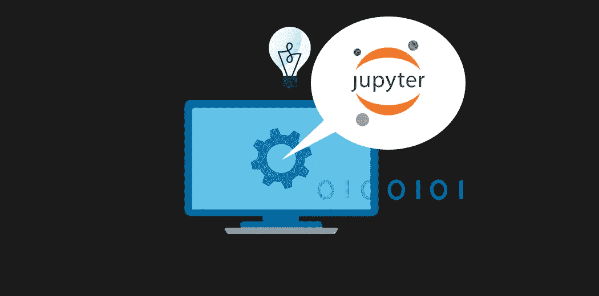
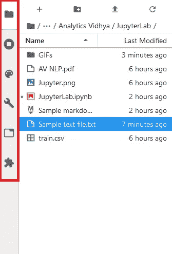

# 您应该使用 JupyterLab 进行数据科学编码的 10 个令人信服的理由

> 原文：<https://medium.com/analytics-vidhya/10-compelling-reasons-you-should-use-jupyterlab-for-data-science-coding-a721798b2cf4?source=collection_archive---------21----------------------->

# 概观

*   JupyterLab 是执行数据科学任务的优秀编码环境
*   这 10 个理由将说服我们从 Jupyter 笔记本转向 JupyterLab，进行数据科学编码

# 讨好朱庇特？是时候搬到木星实验室了！

问 Python 程序员他们更喜欢哪种编码环境，答案总是 Jupyter 笔记本。老实说，在谈论数据科学时，Jupyter 是同义词。我们理所当然地认为这是最好的 Python 编码环境。连我都被这种想法迷住了！

让我与你分享我的一位数据科学导师不久前告诉我的话——“是时候放弃 Jupyter 笔记本了，外面有更好的东西”。我吃了一惊。比 Jupyter 笔记本好？我在 Jupyter 的帮助下迈出了数据科学的第一步，我该如何继续前进？

另外，替代的编码环境是什么？站出来，朱庇特实验室。正如我们所知，Jupyter 已经转变为 JupyterLab，拥有急需的升级以及所有良好的旧功能。相信我，你会喜欢在 JupyterLab 完成数据科学任务的。

所以在这篇文章中，我会给你 10 个让你想马上迁移到 JupyterLab 的理由。

*注:如果你是数据科学行业的新手，或者以前从未使用过 Jupyter，我推荐浏览一下* [*这篇文章*](https://www.analyticsvidhya.com/blog/2018/05/starters-guide-jupyter-notebook/?utm_source=blog&utm_medium=10-powerful-reasons-jupyterlab-data-science) *，它是对 Jupyter 笔记本的一个很好的介绍。你也应该看看这个漂亮的关于数据科学的免费课程***。**

# *目录*

1.  *原因 1——所有东西都在一个屋檐下*
2.  *原因 2——灵活的布局*
3.  *原因 3——细胞重排*
4.  *原因 4 —在笔记本之间复制单元格*
5.  *原因 5 —同样的笔记本，更多的视图*
6.  *原因 6 —代码控制台*
7.  *原因 7——主题无处不在*
8.  *原因 8 —从文本文件中运行代码*
9.  *原因 9——降价同步预览*
10.  *原因#10 —轻松切换到经典笔记本视图*

# *原因 1——所有东西都在一个屋檐下*

*您知道吗，除了流行的笔记本之外，经典的 Jupyter 笔记本还支持**文本编辑器**和终端。没有多少数据科学家意识到这一点！*

*但这不是我们的错，因为这些功能并没有集成，使用它们也没有什么乐趣。老实说，这感觉就像用三个不同的软件工作，而不是一个！但是多亏了 JupyterLab，你将会有更好的体验来使用这些不同的特性。*

> *JupyterLab 将经典的笔记本、文本编辑器、终端和目录查看器都放在一个屋檐下！这是一个你一定会喜欢的统一体验。*

*JupyterLab 还支持其他文件格式，如 jpeg、pdf、CSV 等！*

# *原因 2——灵活的布局*

*但是查看这么多这样的窗口会变得很麻烦。这就是为什么 JupyterLab 配备了**灵活布局**的原因，你可以用任何你喜欢的方式组织你的工作空间！*

*你所要做的就是拖放，并以任何你想要的方式调整标签的大小。这使您可以轻松地同时使用多个选项卡:*

*JupyterLab 提供了一个可折叠的**左侧栏**，其中包含一些最常用的选项卡，如文件浏览器、运行内核和命令面板，使您的工作更加高效:*

**

# *原因 3——重新排列单元格*

*作为一名数据科学家，我经常在 Jupyter 笔记本上展示我的工作和成果。更多的时候，我们最终会重新排列我们的细胞，以便对我们的观众有意义。*

*正是在这样的时候，我们希望 Jupyter 有一个固有的功能，允许我们轻松地将单元格拖放到我们想要的任何地方，而不是使用旧的剪切和粘贴方式。这在木星实验室里是可能的。*

*您可以拖放代码单元格，并将其放置在您想要的任何位置，这使得重新排列任务变得轻而易举。现在你一定会得到更多的赞扬，因为你的笔记本是如此优雅，更有意义。*

# *原因 4 —在笔记本之间复制单元格*

*在笔记本中拖放单元格是一回事，但在不同的笔记本之间做同样的事情完全是另一回事。*

*JupyterLab 让您只需使用拖放选项即可将单元格从一个笔记本复制到另一个笔记本:*

# *原因 5 —同样的笔记本，更多的视图*

*使用长笔记本有时会很烦人，尤其是当您想同时浏览笔记本的不同部分时。这就是多视图功能的来源。现在你可以在 JupyterLab 中并排放置同一笔记本的多个视图进行比较。*

*不仅如此，一旦你创建了一个新的视图，你对其中任何一个视图所做的任何更改都将反映在其中任何一个视图中，并保存在笔记本中！*

*当我想从数据框中选择某些列，但不记得它们的名称时，我发现这个功能很有用。因此，我不再一次又一次地打印数据帧，而是在一个单独的视图中打开数据帧。这就避免了我一边查看必要的信息，一边写多余的代码——一举两得！*

# *原因 6 —代码控制台*

*我们都喜欢代码控制台，因为它们非常简单。想测试一段代码或检查如何运作？使用代码控制台！因为它们提供的交互性，所以它们是我们首选的测试场所。*

*我喜欢在 JupyterLab 中使用代码控制台的原因之一是，你可以将它们用作你在笔记本中所做的计算的日志。当您想查看代码的历史时，这很有帮助。*

*你所要做的就是右击笔记本的任何地方，为笔记本选择一个**新控制台。然后前往新的控制台，选择**显示所有内核活动**，就大功告成了。现在，您笔记本电脑的所有日志都将保存在控制台中:***

# *原因 7——主题无处不在*

*谁不爱题材？JupyterLab 为笔记本配备了内置的黑暗主题，这是我们都非常渴望的，尤其是在昏暗的灯光下工作到深夜的时候。但是朱庇特并没有就此止步。*

*他们已经为文本编辑器和终端设计了主题。他们真的希望你能适应你的工作:*

# *原因 8 —从文本文件中运行代码*

*共享一个包含一段代码的文本文件？发送前仔细检查——错误的代码不会给人留下长久的印象。*

*JupyterLab 允许你为你的文本文件创建一个控制台。从这里，您可以简单地在文本文件中突出显示您的代码，按下 **SHIFT + ENTER** ，并验证它的工作情况:*

# *原因 9——降价同步预览*

*通常，您会希望与社区分享您的数据科学项目。正是在这样的时候，你会求助于减价文件来记录你的工作。*

*降价文件很棒，因为它们提供了所有的灵活性和功能。但是当你不得不一次又一次地运行你的单元来查看你的文件看起来如何或者你是否使用了正确的语法时，在 Jupyter 中工作就有点累了。*

*为了解决这个问题，JupyterLab 允许您在处理 markdown 文件的同时预览它。这不仅效率更高，而且让使用减价文件变得很愉快:*

# *原因#10 —轻松切换到经典笔记本视图*

*我不太愿意添加最后一个功能，因为我不想让你回去使用 Jupyter 笔记本。但我确实意识到，对于你们中的一些人来说，要放弃开始数据科学之旅的东西是很难的。*

*因此，当你怀念使用老式 Jupyter 笔记本工作的日子时，有一种简单又好的方法可以让你回到原来的工作场所。你所要做的就是将 URL 中的 **/lab** 替换为 **/tree** :*

# *结束注释*

*我写这篇文章很开心，我希望它足够有说服力，让你尝试 JupyterLab。*

*关于 JupyterLab 肯定还有很多我没有在这里介绍的内容。请在评论中告诉我你最喜欢搬到 JupyterLab 的理由。我很想听听你的想法和反馈。*

*此外，我推荐阅读这篇关于 [Jupyter hacks、tips 和 tricks](https://www.analyticsvidhya.com/blog/2020/04/10-productive-jupyter-notebook-hacks-tips-tricks/?utm_source=blog&utm_medium=10-powerful-reasons-jupyterlab-data-science) 的精彩文章，因为即使你将使用 JupyterLab，基本的 Jupyter 笔记本仍然是一样的！*

*您也可以在我们的移动应用程序上阅读这篇文章*

****

**原载于 2020 年 6 月 24 日 https://www.analyticsvidhya.com**[*。*](https://www.analyticsvidhya.com/blog/2020/06/10-powerful-reasons-jupyterlab-data-science/)**