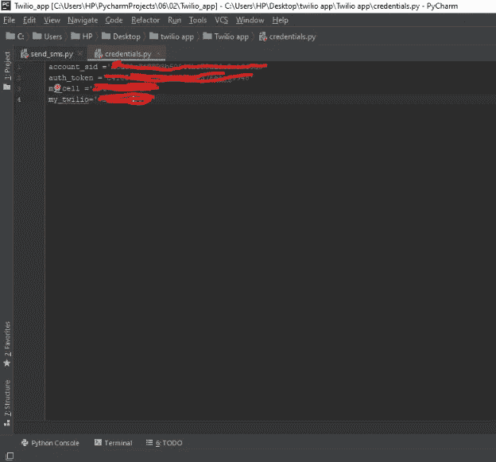
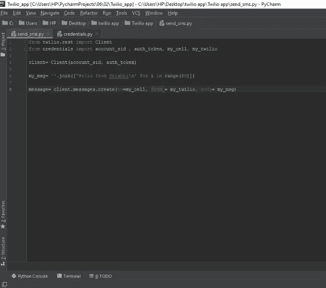
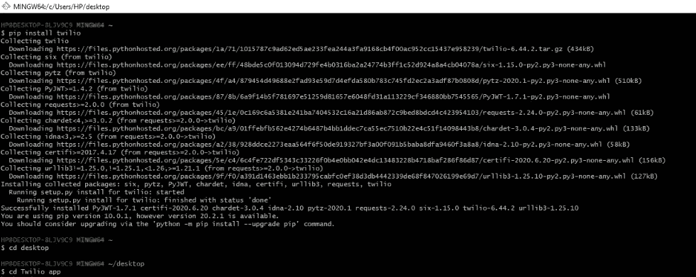

# 创建“使用 twilio API 的 Python 文本应用”的 10 个简单步骤

> 原文：<https://medium.com/analytics-vidhya/10-easy-steps-to-create-a-python-texting-app-using-twilio-api-afd2fbe57514?source=collection_archive---------15----------------------->

以下是创建迷你 Python 项目的方法

*下面是我如何使用 twilio API 通过简单的 10 个步骤创建我的 Python 文本应用程序:*

## 首先，让我们熟悉一下我们将在本应用中使用的术语:

1.  **什么是 API？**

难道你不想知道如何通过简单的点击，你可以从任何网站(官方网站或任何旅行社网站)预订任何机票，或者你的卡如何在不同的网站上支付等等。API 基本上负责所有这些功能，

让我们用非常简单的语言通过一个例子来理解 API(即不同于传统的定义)，

*   API 代表“应用程序编程接口”，现在假设你在一家餐厅，同样也有很多其他人，你的订单已经被服务员接受并交付给厨师，厨师会将你想要的所有规格的食物拿回来，然后他会将你想要的完全相同的订单返回给你，同样，对于同一厨师的其他人，API 只是一个服务员，他充当你和你对多个软件中介的请求之间的接口。

2.**什么是 Twilio？**

*   Twilio 提供 REST APIs，通过它我们可以构建与世界上每个人通信的应用程序，为每个应用程序提供语音和视频、消息和认证 API。

3.什么是 REST API？

*   REST 代表“表述性状态转移”，REST API 负责在客户端和服务器之间使用 https/http 协议进行通信，以使功能流成为可能。

> 传统的语法是:-' http://vidly.com/api/customers'

# 现在，让我们开始使用 Twilio API 构建 Python 文本应用程序的 10 个简单步骤:

1.  **创建 GitHub 账户:-**

*   首先您需要创建 GitHub 帐户，在那里您需要创建一个新的存储库，
*   我会在下面链接我的 GitHub，你可以通过简单地克隆回购文件来复制我的‘Pyhton-texting-app-twilio-API’库。

2.**在 Twilio 上创建帐户:** -

*   然后去 twilio 官网通过填写所有细节创建一个新账户，
*   然后，Twilio 将为您提供一个通用免费号码，您只需选择提供的号码，或者如果您不喜欢 Twilio 提供的号码，您可以申请另一个号码。

3.**在 Twilio**[https://www.twilio.com/console/phone-numbers/verified](https://www.twilio.com/console/phone-numbers/verified)，**上验证您要发送短信的电话号码:-**

*   Twilio 只会让你发短信给验证过的号码，并添加到验证列表中
*   这一步是为了安全的目的，而不是误用，为增加号码在验证名单将有 pin 发送到该号码进行验证，您可以设置的方法通过呼叫或文本接收 pin。

4.**获取 Twilio 凭证:-**

*   首先，您需要复制 twilio 提供的以下凭证:-
*   打开 Twilio 仪表盘:-【https://www.twilio.com/console 
*   在那里得到账户 SID
*   获取身份验证令牌

5.**获取电话号码:-**

*   从提供给您的网站获取您的 Twilio 号码
*   然后是你想发短信的验证过的号码

6.**在你的 python IDLE 上创建你的项目:-**

*   因此，现在我们通过创建项目标题“twilio app”来开始编码部分，
*   并在“桌面”上创建一个名为 twilio 的新文件夹，以便在终端上运行代码时不会产生歧义。

7.**在 credentials.py 中输入您的 twilio 凭据和 twilio 电话号码:-**

*   现在，我们在 credentials.py 中创建第一个 Python 文件
*   我们需要将所有需要的凭证指定为变量，然后将从 twilio 网站复制的字符串值指定给它们，

从 twilio 网站获得所有必需的“证书”

8.**创建另一个文件“send _ SMS . py”:**-

*   现在，我们将编写代码，并在其中导入 credentials.py 文件:
*   以下是负责通过 twilio API 创建发送文本的代码:

send_sms.py 的代码

*   我们的第一行是:-从 twilio.rest 导入客户端，这里我们从 twilio 库导入文件。
*   从 credentials 导入 account_sid、auth_token、my_cell、my_twilio，这里我们从 credentials.py 文件导入属性。
*   client = Client(account_sid，auth_token)，这里我们指定了要作为参数传递的客户机属性。
*   my_msg = "您的消息放在这里……"，您可以写任何您想发送的内容。
*   message = client . messages . create(to = my _ cell，from_=my_twilio，body=my_msg)，最后我们会传递这些属性:单元格编号(验证过的一个)、twilio 编号和您分配的文本消息。

9.打开 GIT Bash 终端并安装 twilio:

*   首先打开您的 Git Bash 终端并运行以下命令:- " pip install twilio "
*   然后运行以下命令:-CD desktop > ls > CD twilio \ app > ls > credentials . py send _ SMS . py

Git Bash twilio 安装

10.在空闲状态下打开 send_sms.py 并运行！

*   这是你需要运行的最后一个命令，wallah 它会将你想要的文本发送到你想要的号码，发送次数不限。
*   在 Git Bash 终端上输入“python send_sms.py”并运行它。

python send_sms.py 命令

恭喜你，你刚刚通过使用 twilio API 的 python 文本应用程序发送了你的第一条文本。

玩得开心，写代码，保持安全，永远保持学习。如果你喜欢这些内容，请支持我在 GitHub(@Srishti-17)和 linkedIn(https://www . linkedIn . com/in/Sri shti-Singh-935 a 2812 b)上的工作。我很快会发布更多有趣的项目。