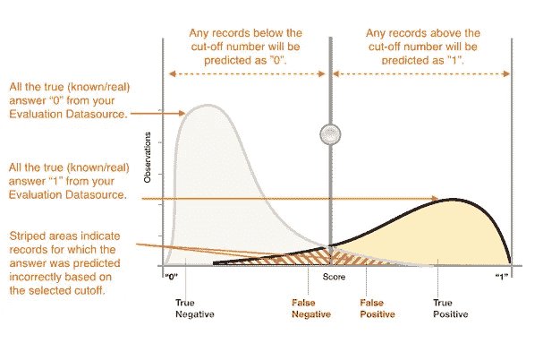
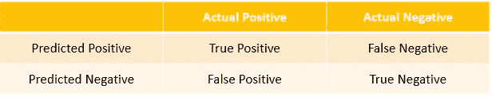
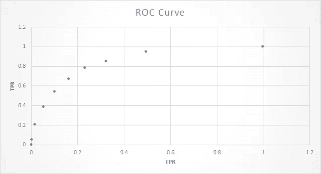
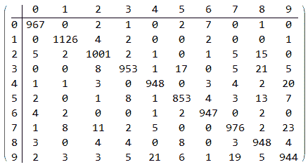
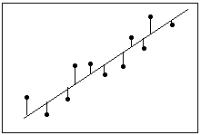
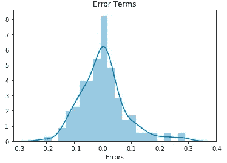
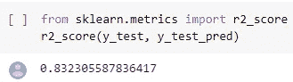

# 评估机器学习模型性能的 10 种基本方法

> 原文：<https://medium.com/analytics-vidhya/10-essential-ways-to-evaluate-machine-learning-model-performance-6bf6e11f9502?source=collection_archive---------4----------------------->

机器学习模型的目标是学习在看不见的数据上很好地概括的模式，而不是仅仅记住它被训练的数据。当您的模型准备好时，您可以使用它来预测评估或测试数据集的答案，然后将预测的目标与实际答案(基本事实)进行比较。这是评估模型性能的典型方法。然而，预测值和实际值之间的这种比较是基于许多不同的度量来执行的。实际度量的选择取决于手头的 ML 问题。

让我们基于分类和回归问题进一步理解这一点。

# 二元分类

许多二元分类算法的实际输出是预测分数(例如逻辑回归提供概率得分)。分数表示模型对给定观察值属于某一类的置信度。作为该分数的消费者，要决定观察结果应被分类为正面还是负面，您将通过选择分类阈值(截止值)来解释该分数，并将概率分数与其进行比较。分数高于阈值的任何观察结果被预测为正类，分数低于阈值的被预测为负类。

为了前任。概率得分预测在范围[0，1]内。决定将示例分类为 1 或 0(肯定或否定类别)的分数阈值通常默认设置为 0.5。但是，您可以回顾选择不同分数阈值的含义，并选择符合您业务需求的合适阈值。

二元分类模型的分数分布(参考— AWS SageMaker)

现在，根据实际已知答案和预测答案，预测分为四组。实际值和预测值的以下表示称为 ***混淆矩阵。***

*   正确的积极预测——真正的积极
*   正确的负面预测——真正的负面
*   不正确的阳性预测—假阳性
*   不正确的负面预测——假阴性

分类问题的典型度量是准确度、精确度、召回率、假阳性率、F1-measure，这些都是从混淆矩阵中导出的。每个指标衡量预测模型的不同方面。

1.  **准确性** —衡量正确预测的比例。

*准确率=(真阳性+真阴性)/(真阳性+真阴性+假阳性+假阴性)*

**2。Precision** —测量预测为阳性的实例中实际阳性的比例。它显示了预测的“是”实际上是“是”的概率。它是一种相关性的度量，显示相关结果或正确阳性的百分比。

*精度—真阳性/真阳性+假阳性*

该指标在医疗筛查或药物测试中非常有用。

**3。回忆** —测量有多少实际阳性被预测为阳性。它是正确预测实际“是”情况的概率。它也被称为**敏感度或真阳性率(TPR)或完整性**。

*灵敏度=真阳性/真阳性+假阴性*

当假阴性的检测对欺诈检测等更重要时，此指标特别有用。在 BFS 领域，确保您的模型不会将实际的欺诈性交易归类为非欺诈性交易至关重要。

**4。特异性** —当负面类别对您更重要时，此指标会很有帮助。也被称为**真负率**。

*特异性=真阴性/真阴性+假阳性*

**5。假阳性率(FPR)** —这个术语给出了假阳性(预测为 1 的 0)数除以阴性总数。你可以看到假阳性率(FPR)的公式就是 **(1 —特异性)**

*FPR =假阳性/真阴性+假阳性*

考虑您试图解决的整体业务问题，以决定您想要最大化或最小化的指标，这一点非常重要。根据需求，您可以遵循“灵敏度-特异性”视图或“精确度-召回”视图。

6。F1 得分 —它是精确度和召回率的调和平均值。当你想要在精确度和召回率之间寻求平衡，并且存在不均匀的类别分布(大量的实际否定)时，需要 F1 分数。

*F1 得分= 2 *(精度*召回)/(精度+召回)*

*F1 得分= 2 *真阳性/(2*真阳性)+假阳性+假阴性*

**7。ROC 曲线** — ROC 曲线显示了真阳性率(TPR 或召回)和假阳性率(FPR)之间的权衡。从上面的公式可以确定，TPR 和 FPR 只不过是灵敏度和(1-特异性)，因此它也可以被看作是灵敏度和特异性之间的权衡。真阳性率与假阳性率之间的关系被称为 ROC 曲线。正如你从下图中看到的，TPR 值越高，FPR 值也越高，这可能不好。所以这一切都是为了在这两个指标之间找到平衡。好的 ROC 曲线是触及图形左上角的曲线；所以 ROC 曲线的曲线下面积(AUC)越高，你的模型就越好。

*   **AUC(曲线下面积)** —是一种不同类型的指标。它衡量模型预测正面示例比负面示例得分更高的能力。它独立于选定的阈值，您可以从 AUC 度量中获得模型预测性能的感觉，而无需选择阈值。如果 ROC 曲线更偏向图形的左上角，说明模型非常好。

# 多类分类

与二元分类问题的过程不同，您不需要选择概率得分阈值来进行预测。预测答案是具有最高预测分数的类别(即标签)。在某些情况下，您可能希望仅在预测的答案得分较高时才使用它。在这种情况下，您可以选择预测分数的阈值，根据该阈值您是否接受预测答案。

多分类中使用的典型度量与二分类情况中使用的度量相同。在将所有其他类分组为属于第二类之后，通过将每个类视为二元分类问题来计算每个类的度量。然后，对所有类别的二进制度量进行平均，以获得宏平均(平等对待每个类别)或加权平均(按类别频率加权)度量。多个类别的混淆矩阵是一个表，显示评估数据中的每个类别以及正确预测和错误预测的数量或百分比。为了前任。下面是一个 0 到 9 位数分类混淆矩阵的例子。

# 回归

对于回归任务，典型的精度指标是均方根误差(RMSE)。

**9。RMSE —** 该指标衡量预测数字目标和实际数字答案(真实情况)之间的距离，称为 ***残差或误差项。*** 回顾回归问题的残差是常见的做法。

残差表示模型无法预测的目标部分。正残差表示模型低估了目标(实际目标大于预测目标)。负残差表示高估(实际目标小于预测目标)。

*残差= Y _ 实际—Y _ 预测*

绘制评估数据的残差直方图是分析误差项的方法之一。当以钟形分布并且以零为中心时，表示模型以随机方式出错，并且没有系统地过度或不足预测任何特定范围的目标值。如果残差没有形成以零为中心的钟形，则模型的预测误差中存在某种结构。为了前任。下图显示残差呈正态分布。

使用 Seaborn 库的剩余绘图

10。R-Squared(R)-R-Squared 是一种统计测量方法，表示回归模型中由自变量或变量解释的因变量的方差的比例。r 平方值的范围从 0 到 1，通常表示为 0%到 100%的百分比。100%的 R 平方意味着因变量的所有变动完全可以用自变量的变动来解释。[**又称测定系数。**](https://en.wikipedia.org/wiki/Coefficient_of_determination)

*R = 1 —残差平方和(RSS)/总平方和(TSS)*

为了前任。下面的值表明，83%的方差是由模型在测试数据中解释的。

使用 Sklearn 库获得的样本 R 值

上述指标是评估模型性能的众多指标中的一小部分。

你可能在第一次迭代中得不到想要的预测模型(阅读— [机器学习—为什么它是一个迭代过程？或者您可能想要改进您的模型以获得更好的预测。获得一个符合你需求的 ML 模型通常包括迭代通过](/analytics-vidhya/machine-learning-why-it-is-an-iterative-process-bf709e3b69f2?source=friends_link&sk=bd1a8523526500ba8268a274a5607acc) [ML 过程](/analytics-vidhya/6-stages-to-get-success-in-machine-learning-project-2900555327bc?source=friends_link&sk=aa4004ac2124966f04525a70233f1342)，尝试一些变化，并对选择的度量标准进行重复评估。为了提高性能，您需要按照以下步骤在模型中实现偏差和方差的正确平衡——“在 ML 模型中实现偏差和方差正确平衡的 5 种方法[”](/analytics-vidhya/5-ways-to-achieve-right-balance-of-bias-and-variance-in-ml-model-f734fea6116?source=friends_link&sk=7e2102cfb0894351d9eab0160ed30aaa)

快乐阅读！！