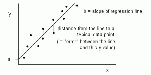
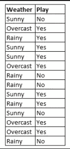
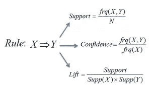
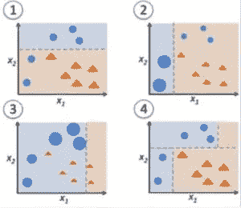

# 对初学者最有用的 10 种机器学习算法

> 原文：<https://medium.com/analytics-vidhya/10-most-useful-machine-learning-algorithm-for-beginners-52aa3c8491b1?source=collection_archive---------21----------------------->

由于《哈佛商业评论》将“数据科学家”称为“21 世纪最性感的任务”，研究系统学习的兴趣在过去几年中飙升。但如果你刚刚开始机器学习，那么它可能有点难以分割。这就是为什么我们正在评估我们关于新手的伟大机器学习算法的非常受欢迎的文章。

这篇文章是面向新手的。如果您在数据科学和机器学习方面有一些专业知识，您可能会对这篇关于使用 sci-kit-learn 执行机器学习 Python 的深入教程更感兴趣，甚至会在我们从这里开始的系统学习课程中感兴趣。如果你还不清楚“数据科学”和“机器学习”之间的差距，这份报告提供了一个很好的解释:机器学习和信息科学——是什么让它们不同？

机器学习算法是可以从信息中学习并从专业知识中增强的应用程序，无需人工干预。学习任务可以包括学习将输入映射到输出信号的函数，研究未标记数据中的隐藏结构；或者“基于实例的学习”，其中，通过将新案例(行)与来自训练数据的案例进行比较，生成类别标签以获得新案例，训练数据已经保存在存储器中。“基于实例的学习”不会从特定案例中产生抽象概念。

## **有 3 种机器学习(ML)计算:**

监督学习利用带标签的训练数据来找出将输入因子(X)变成输出(Y)的映射函数。换句话说，它从下一个方程求解 f:*Y = f(X)。*这使我们能够在给定新输入时正确创建输出。

## **我们将讨论两种形式的监督学习:分类和回归。**

**分类**用于在输出为类别形式时预测某个样本的结果。分类版本可以查看输入并尝试预测诸如“生病”或甚至“健康”的标签

**回归**用于预测某个样本的结果，一旦输出是实际价值的形式。举例来说，回归模型可以处理输入信息来预测降雨量、个人的海拔等..

**集成**是另一种监督学习。这意味着将多个单独较弱的系统学习模型的预测结合起来，以对新样本进行更精确的预测。本文的算法 9 和 10——使用随机森林打包，使用 XGBoost 优化——是集成方法的例子。

## 无监督学习版本

当我们只有输入因子(X)而没有相应的输出因子时，就使用它们。他们利用未标记的训练数据来模拟他们信息的固有结构。

我们将围绕三种学习方式展开讨论:

**关联**用于检测集合中事物共现的概率。它被广泛应用于市场篮子评估。举例来说，可以利用机构模型来发现当客户购买面包时，她/他有 80%的可能也购买鸡蛋。

**聚类**可用于设置样本，使得完全相同聚类中的项目与其他聚类中的项目相比彼此相似。

**降维**用于减少数据集合中的因素数量，同时确保重要信息仍能传达。可以使用特征提取方法和特征选择过程来实现维度减少。特征选择选择第一因素的子集。特征提取执行高维距离到低维空间的数据变换。例证:PCA 算法是一种特征提取策略。

**强化学习**

这是一种机器学习算法，它使经纪人能够通过研究将优化利益的行为，根据其当前条件确定最佳的下一步行动。

强化算法通常通过反复试验来学习最佳活动。举例来说，想象一个视频游戏，玩家应该在特定的时间移动到特定的地方来得分。玩这项运动的心理学家算法可以从随机移动开始，但是，随着时间的推移，通过反复试验，它可能会发现在哪里以及是否需要操纵游戏中的角色，以充分利用整体优势。

这样的记录很可能本身就是主观的。像这样的研究已经测量了 10 个最著名的数据挖掘算法，但是，它们仍然依赖于调查答案的主观反应，通常是高级学术专业人员。

这篇信息丰富的文章中记录的前 10 个算法是根据机器学习新手的想法挑选的。主要是计算，我已经包括了前两个算法(装备方法)，特别是因为它们经常被用来获得 Kaggle 比赛。

## 1.线性回归

在机器学习中，我们有一组输入因素(x ),用来确定一个结果变量(y)。输入变量和输出因子之间有联系。ML 的目标是衡量这种关系。

来源

在线性回归中，输入因子(x)和输出因子(y)之间的关系表示为 y = a + bx 类型的方程。

目标是匹配一条与所有这些事物最接近的线。

## 2.逻辑回归

线性回归预测是常量值(即，以厘米为单位的降雨量)，逻辑回归预测是应用变换目的后的不同值(即，学生是否通过/未通过)。

逻辑回归最适合二元分类:y = 1 或 0 的信息集，其中 1 表示默认类别。作为一个例子，在预测一个事件是否会发生时，只有两种可能性:发生(我们用 1 表示)或不发生(0)。如果我们一直在预测一个病人是否生病，我们会在我们的数据收集中利用值 1 来标记生病的病人。

逻辑回归在其使用的转换工作之后被调用，它被称为逻辑函数 h(x)= 1/ (1 + ex)。这产生了一个 S 形曲线。

因为这是一个概率，结果可以在 0-1 的选择中找到。因此，作为一个例子，如果我们试图预测患者是否生病，我们知道生病的患者已经被表示为 1，因此如果我们的算法将 0.98 的评级分配给患者，那么它认为该个体很可能生病。

然后使用一个阈值将这种可能性引入外汇交易。

图 2:确定肿瘤是良性还是癌性的逻辑回归。归类为癌性事件的几率 h(x)p 0.5。来源

在图 2 中，为了确定肿瘤是否是癌性的，默认因子是 y = 1(肿瘤=癌性的)。x 因子可能是肿瘤的尺寸，如肿瘤的大小。

逻辑回归的目的是利用训练信息来发现系数 b0 和 b1 的值，从而减少预测结果和实际结果之间的误差。所有这些系数都是用最大似然估计法来估计的。

## 3.手推车

分类和回归树的非终端节点将是原始节点以及内部节点。每个非终端节点代表一个输入因子(x)加上该因子上的分界点；叶节点表示输出(y)。该设计可以如下用于创建预测:遍历该树的断点以到达叶节点，并输出叶节点中存在的值。

图 3 中的决策树根据一个人的年龄和婚姻状况对他是购买跑车还是小型货车进行了分类。如果这个男人已经 30 多岁了，还没有结婚，我们就这样走进树里:“30 多岁？”->是的——我结婚了？->没有了。

图 3:决策树的组成部分。来源

## 4.朴素贝叶斯

为了计算一个事件发生的可能性，假设另一个事件已经发生，我们使用贝叶斯定理。

*P(h|d)= (P(d|h) P(h)) / P(d)*

其中:

*   P(h|d) =后验概率。假设 h 为真的概率，给定数据 d，其中 P(h|d)= P(d1| h) P(d2| h)…P(dn| h)
*   P(d|h) =可能性。假设假设 h 为真，数据 d 的概率。
*   P(h) =类别先验概率。假设 h 为真的概率(不考虑数据)
*   P(d) =预测值先验概率。数据的概率(不考虑假设)

这种算法被称为“天真”,因为它假设所有的因素都是相互独立的，在现实生活中这是一个天真的假设。

图 4:使用朴素贝叶斯预测“戏剧”的状态和“天气”因素。

以图 4 为例，如果天气=晴朗，结果会怎样？

为了确定结果，玩“是”或“否”游戏，得出变化天气的值=“晴朗”，计算 P(是|晴朗)和 P(不再晴朗)并选择可能性较大的结果。

明亮)= (P(明亮

明亮)= (P(明亮

因此，如果天气‘晴朗’，结果就是玩‘是’。

K-最近邻算法利用整个数据集作为训练组，而不是将数据分成训练集和测试集。

一旦新数据示例需要某个结果，KNN 算法就会遍历整个数据集，以发现与该新案例最接近的 k 个案例或与该新文档相似的 k 个案例，然后输出其结果的表达式(对于回归问题)或分类问题的模式(最常见的过程)。

使用欧几里得空间和汉明空间等步骤来计算案例之间的相似性。

## 5.推测的

Apriori 算法用于事务数据库中挖掘频繁项集和产生关联规则。它在市场购物篮分析中被广泛使用，在市场购物篮分析中，人们对数据库中经常同时出现的商品混合物进行测试。一般来说，我们把“当有人买了 X 商品，他就买了 Y 商品”的制度规则写成 X -> Y。

例证:如果有人买糖和牛奶，那么她很可能会买咖啡粉。这种关联规则可以写成 undefined -> java powder。关联规则是在跨过阈值后创建的，以获得信心和支持。

图 5:支持、保证和提升关联规则 X->Y 的公式。

支持步骤有助于减少在常规项目集创建期间要考虑的候选项目集的数量。这个服务步骤是由先验原则指导的。先验原则认为，如果一个项目集是正则的，那么它的所有子集也必须是正则的。

## 6.k 均值

K-means 是一种迭代算法，它将相似的信息分组到聚类中。它计算 k 个簇的质心，并向该观众分配一个在其质心和信息台之间具有最小距离的数据点。

图 6:K-means 算法的度量。来源

它是这样工作的:

我们从选择 k 的值开始，这里，我们用 3 来表示。然后，我们将每个数据点随机分配给 3 个集群中的一些。计算所有这些聚类的聚类质心。

然后将每个点重新分配给最近的聚类质心。从上图中，获得的前五个点分配给了使用所有蓝色质心的观众。按照相同的方法为包含绿色和红色质心的簇指定点。

然后，计算新簇的质心。

最后，重复第 2-3 步，直到一个观众和另一个观众之间完全没有转移。一旦连续两步完全没有移动，就脱离 K-means 算法。

## 7.KNN

K-最近邻算法利用整个数据集作为训练组，而不是将数据分成训练集和测试集。

一旦新数据示例需要一个结果，KNN 算法将遍历整个数据集，以发现与新案例最接近的 k 个案例或与该新文档相似的 k 个案例，然后输出其结果的表达式(对于回归问题)或分类问题的模式(最常见的过程)。

使用欧几里得空间和汉明空间等步骤来计算案例之间的相似性。

## 8.主成分分析

主成分分析(PCA)可以通过减少因素的数量来创建易于研究和可视化的数据。这是通过将信息中的最大差异捕捉到一个新的坐标系中来实现的，该坐标系具有被称为“主分量”的轴。

元素之间的正交性表明这些元素之间的相关性为零。

第一个主成分捕获信息中最易变的管理。第二个主成分从信息中捕获残差方差，但是具有与初始元素不相关的因子。以同样的方式，所有连续的主要成分(PC3、PC4 等)捕捉方差的剩余部分，同时仍然与现有技术不相关

图 7:3 个初始因子(基因)降低为两个新因子，称为主要成分(PCs)。来源

集成学习方法:

集成意味着通过平均或投票来组合多个学生(分类器)的结果以获得增强的结果。在分类期间可以使用投票，并且通过回归使用平均。这种观点认为学生群体比单独的学生表现得更好。

我们不太可能在这里支付“打桩”的费用，但是如果你想要一个详细的解释，下面是 Kaggle 的一个不错的首次亮相。

## 9.使用随机森林装袋

bagging 的第一步是使用 Bootstrap 抽样方法收集数据，制作多个版本。在 Bootstrap 采样中，每个创建的训练集都由初始数据集合中的随机子样本组成。

这些培训位置中的每一个都与初始数据集合的大小完全相同，但是有些文档会复制多次，有些文档不会以任何方式出现。然后，整个原始数据集合被用作评估集。因此，如果初始数据集的维数是 N，那么每一个生成的训练集的维数也可以是 N，加上特殊文档的数目大约是(2N/3)；这个测试集的维数也可以是 n。

bagging 的下一步是在各种生成的训练位置上使用相同的算法制作多个版本。

这就是随机森林进入的地方。与决策树不同，在决策树中，每个节点都根据减少错误的理想属性进行划分，在随机森林中，我们随机选择属性来构建理想的划分。随机性背后的主要原因是:通过 bagging，当选择树选择理想的属性进行分割时，它们会得到相似的结构和相关的预测。但是在属性的随机子集上划分后的 bagging 意味着来自子树的预测的重要性降低。

在每个分割点要搜寻的属性数量被定义为随机森林算法的一个参数。

因此，在随机森林的 bagging 中，每棵树都是用随机样本的文档构造的，每个部分都是用随机样本的预测值组装的。

## 10.adaboost 算法

图 9: Adaboost 得到一个决策树。来源

在图 9 中，措施 1、2、3 要求被称为结论树桩的弱学生(1 级选择树，仅基于 1 个输入特征值创建预测；其原点立即连接到其自身叶子的决策树)。

培养弱势学生的实践会一直持续下去，直到聚集了一定数量的中学后弱势学生，或者直到辅导期间完全没有额外的进步。度量 4 组合了那些最后版本的三个决策树桩(因此在决策树中包括 3 个划分规则)。

首先，从一个选择树桩开始，对单个输入因子进行确定。

这些数据点的尺寸表明，我们采用了相等的权重将它们归类为三角形或圆形。选择树桩在上半部分创建了一条扁平线来对这些因素进行分类。我们可以意识到有两个圆被错误地称为三角形。因此，我们将为这两个圆分配更高的权重，并使用另一个选择树桩。

其次，移动到一些其他选择树桩来创建对不同输入因子的确定。

我们看到前一步中两个错误分类的圆的尺寸都大于其余的点。现在，下一个选择树桩将试图正确地预测这两个圆圈。

作为分配较高权重的结果，这两个圆都由左侧的垂直线正确分类。然而，这导致了在最上面的 3 个圆圈的错误分类。因此，我们将为顶部的三个圆圈分配更高的权重，并使用另一个选择树桩。

第三，训练另一个选择树桩来创建对不同输入因子的决定。

最后一步中的三个错误分类的圆大于剩余的数据点。现在，产生了一条垂直线来分类圆形和三角形。

第四，融合决策树桩。

我们结合了前三个版本中的分隔符，并观察到这个版本中复杂的规则将数据点准确地分类，与那些个别的弱学生相比。

结论:

概括地说，我们已经讨论了许多对信息科学最重要的机器学习算法:

编者按:这篇文章最初发表在 KDNuggets 上，经允许后转载。作家 Reena Shaw 是一名程序员和信息科学作家。