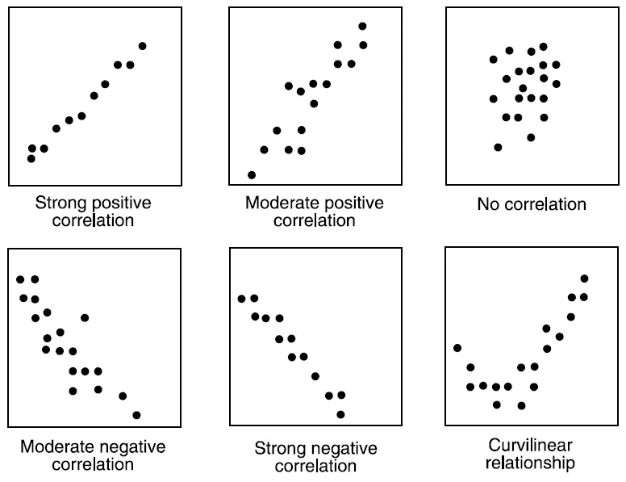
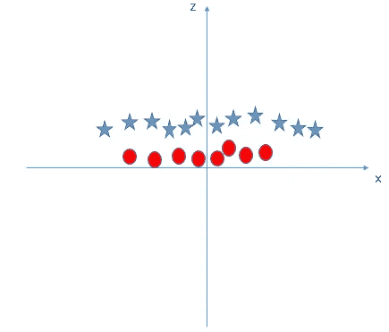
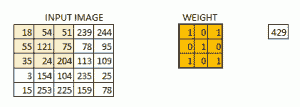

# 线性代数在数据科学中的 10 个强大应用

> 原文：<https://medium.com/analytics-vidhya/10-powerful-applications-of-linear-algebra-in-data-science-c9c0b6018074?source=collection_archive---------3----------------------->

## 拥有多种资源

# 概观

*   线性代数为各种各样的数据科学算法和应用提供了动力
*   在这里，我们提出 10 个这样的应用，线性代数将帮助你成为一个更好的数据科学家
*   我们将这些应用分为不同的领域——基础机器学习、降维、自然语言处理和计算机视觉

# 介绍

如果数据科学是蝙蝠侠，线性代数就是罗宾。这个忠实的伙伴经常被忽视。但在现实中，它推动了数据科学的主要领域，包括自然语言处理和计算机视觉的热门领域。

我个人看到许多数据科学爱好者跳过这个主题，因为他们发现数学太难理解了。当用于数据科学的编程语言提供了大量处理数据的包时，人们就不会太在意线性代数了。

那是一个错误。线性代数是我们如此熟悉的所有强大的机器学习算法的背后。这是数据科学家技能组合中至关重要的一环。正如我们很快会看到的，你应该考虑线性代数作为一个必须知道的数据科学的主题。

相信我，线性代数真的是无孔不入的！它将开启你以前想象不到的工作和操作数据的可能性。

在本文中，我详细解释了线性代数在数据科学中的十个令人敬畏的应用。我将应用程序大致分为四个领域，供您参考:

我还为每个应用程序提供了资源，因此您可以更深入地了解吸引您注意力的应用程序。

*注:在你继续阅读之前，我推荐你浏览一下这篇出色的文章——***【数据科学线性代数】。它不是理解我们将在这里讨论的内容的强制要求，但它对你的初学技能是一篇有价值的文章。**

# *目录*

*   *为什么要学习线性代数？*

## *机器学习中的线性代数*

*   *损失函数*
*   *正规化*
*   *协方差矩阵*
*   *支持向量机分类*

## *降维中的线性代数*

*   *主成分分析*
*   *奇异值分解*

## *自然语言处理中的线性代数*

*   *单词嵌入*
*   *潜在语义分析*

## *计算机视觉中的线性代数*

*   *作为张量的图像表示*
*   *卷积和图像处理*

# *为什么要学习线性代数？*

*这个问题我遇到过太多次了。当您可以简单地用 Python 导入一个包并构建您的模型时，为什么要花时间学习线性代数呢？这是一个公平的问题。因此，让我提出我对此的观点。*

*我认为线性代数是数据科学的基础之一。没有坚实的基础，你不可能建造摩天大楼，是吗？想想这个场景:*

> **您希望使用主成分分析(PCA)来降低数据的维数。如果您不知道将如何影响您的数据，您将如何决定保留多少主成分？显然，你需要知道算法的机制来做这个决定。**

*通过对线性代数的理解，你将能够对机器学习和深度学习算法产生更好的直觉，而不是将它们视为黑盒。这将允许您选择适当的超参数并开发更好的模型。*

*你也可以从头开始编写算法，并对它们进行自己的修改。这不正是我们当初热爱数据科学的原因吗？试验和摆弄我们的模型的能力？将线性代数视为开启全新世界的钥匙。*

# *机器学习中的线性代数*

*最大的问题是——线性代数适合机器学习吗？让我们来看四个大家都很熟悉的应用程序。*

# *1.损失函数*

*您必须非常熟悉模型(比如线性回归模型)如何拟合给定的数据:*

*   *你从一些任意的预测函数(线性回归模型的线性函数)开始*
*   *对数据的独立特征使用它来预测输出*
*   *计算预测输出与实际输出的差距*
*   *使用这些计算值，通过梯度下降等策略来优化您的预测函数*

***但是等等——你怎么能计算出你的预测和预期的产出有多大的差异呢？当然是损失函数。***

*损失函数是线性代数中**向量范数**的应用。向量的范数可以简单地是它的大小。向量范数有很多种。我将很快解释其中的两个:*

*   ***L1 标准**:也被称为曼哈顿距离或出租车标准。如果唯一允许的方向是平行于空间的轴，L1 范数就是你从原点到向量的距离。*

**

*在这个 2D 空间中，您可以通过沿 x 轴移动 3 个单位，然后平行于 y 轴移动 4 个单位来到达向量(3，4)(如图所示)。或者，您可以先沿 y 轴移动 4 个单位，然后平行于 x 轴移动 3 个单位。无论哪种情况，您都将总共旅行 7 个单位。*

*   ***L2 范数**:又称欧氏距离。L2 范数是矢量到原点的最短距离，如下图中红色路径所示:*

**

*这个距离是用毕达哥拉斯定理计算出来的(我可以看到旧的数学概念在你的脑海中闪现！).它是(3 + 4)的平方根，等于 5。*

*但是如何使用范数来找出预测值和期望值之间的差异呢？假设预测值存储在一个向量中，期望值存储在一个向量中**E。那么 ***P-E*** 就是差向量。 ***P-E*** 的范数为预测的总损失。***

# *2.正规化*

*正则化是数据科学中一个非常重要的概念。这是我们用来防止模型过度拟合的技术。*正则化其实是范数的另一种应用。**

*当一个模型与训练数据拟合得太好时，就称之为过度拟合。这种模型对新数据表现不佳，因为它甚至已经学习了训练数据中的噪声。它将无法对以前没有见过的数据进行归纳。下图很好地总结了这个想法:*

**

*正则化**通过将权重向量的范数添加到成本函数来惩罚过于复杂的模型。由于我们想要最小化成本函数，我们需要最小化这个范数。这使得权重向量的不需要的分量减少到零，并防止预测函数过于复杂。***

*您可以阅读下面的文章，了解正则化背后的完整数学原理:*

*   *[如何使用正则化避免过拟合？](https://www.analyticsvidhya.com/blog/2015/02/avoid-over-fitting-regularization/?utm_source=blog&utm_medium=10-applications-linear-algebra-data-science)*

*我们上面讨论的 L1 和 L2 规范用于两种类型的正则化:*

*   *L1 正则化与**套索**配合使用**回归***
*   *L2 正则化与**岭回归**一起使用*

*参考我们的[Python 中脊和套索回归的完整教程](https://www.analyticsvidhya.com/blog/2016/01/complete-tutorial-ridge-lasso-regression-python/?utm_source=blog&utm_medium=10-applications-linear-algebra-data-science)来了解更多这些概念。*

# *3.协方差矩阵*

*双变量分析是数据探索的重要步骤。我们想研究变量对之间的关系。协方差或相关性是用于研究两个连续变量之间关系的度量。*

***协方差表示变量之间线性关系的方向。正协方差表示一个变量的增加或减少伴随着另一个变量的增加或减少。负协方差表示一个协方差的增加或减少伴随着另一个协方差的增加或减少。***

**

*另一方面，**相关性是协方差**的标准化值。相关值告诉我们线性关系的强度和方向，范围从-1 到 1。*

*现在，你可能认为这是统计学的概念，而不是线性代数。还记得我告诉过你线性代数是无孔不入的吗？使用线性代数中的**转置和矩阵乘法**的概念，我们有一个非常简洁的协方差矩阵表达式:*

**

*这里，X 是包含所有数字特征的标准化数据矩阵。*

*我鼓励你阅读我们的[数据探索完全教程](https://www.analyticsvidhya.com/blog/2016/01/guide-data-exploration/?utm_source=blog&utm_medium=10-applications-linear-algebra-data-science)，以了解更多关于协方差矩阵、双变量分析和探索性数据分析中涉及的其他步骤。*

# *4.支持向量机分类*

*是的，支持向量机。最常见的分类算法之一，经常产生令人印象深刻的结果。是线性代数中**向量空间**概念的一个应用。*

*支持向量机，或 SVM，是一种通过寻找决策面来工作的判别分类器。这是一种受监督的机器学习算法。*

*在该算法中，我们将每个数据项绘制为一个 n 维空间**中的一个点**(其中 n 是您拥有的特征的数量)，每个特征的值是特定坐标的值。然后，我们通过找到能够很好地区分两类的**超平面**来执行分类，即具有**最大间隔**，在这种情况下是 C。*

**

*超平面是一个**子空间**，它的维数比它对应的向量空间小一，所以它对于 2D 向量空间是一条直线，对于 3D 向量空间是一个 2D 平面，等等。再次使用向量范数来计算差值。*

*但是如果数据不是像下面这种线性可分的呢？*

**

*我们的直觉告诉我们，决策面必须是圆形或椭圆形，对吗？但是怎么找呢？这里，**内核转换**的概念开始发挥作用。从一个空间转换到另一个空间的思想在线性代数中很常见。*

*下面我们介绍一个变量 ***z = x + y*** 。如果我们沿着 z 轴和 x 轴绘图，数据看起来是这样的:*

**

*现在，这显然可以通过一条线 ***z = a*** 进行线性分离，其中 *a* 是某个正常数。在转换回原来的空间，我们得到的决策表面，这是一个圆！*

**

*最棒的是。我们不需要自己添加额外的功能。SVM 有一种技术叫做**内核技巧**。阅读这篇关于支持向量机的[文章，了解 SVM、内核技巧以及如何用 Python 实现它。](https://www.analyticsvidhya.com/blog/2017/09/understaing-support-vector-machine-example-code/?utm_source=blog&utm_medium=10-applications-linear-algebra-data-science)*

# *降维*

*您将经常使用包含数百甚至数千个变量的数据集。这就是这个行业的运作方式。查看每个变量并决定哪个更重要是否实际？*

*那真的没有意义。我们需要减少变量的数量来进行任何一种连贯的分析。这就是降维。现在，我们在这里看两种常用的降维方法。*

# *5.主成分分析*

*主成分分析(PCA)是一种无监督的降维技术。PCA 找到最大方差的**方向**，并沿着它们投影数据以降低维数。*

*不用进入数学，这些方向就是数据的协方差矩阵的 [**特征向量**](https://www.youtube.com/watch?v=PFDu9oVAE-g) **。***

**

*方阵的特征向量是特殊的非零向量，其方向即使在对矩阵应用线性变换(这意味着相乘)后也不会改变。它们在下图中显示为红色向量:*

**

*您可以使用 scikit-learn 包中的 PCA 类轻松地在 Python 中实现 PCA:*

*我对来自 sklearn 的[数字数据集](https://scikit-learn.org/stable/auto_examples/datasets/plot_digits_last_image.html)应用了 PCA 一组 8×8 的手写数字图像。我得到的情节令人印象深刻。数字看起来很好地聚集在一起:*

**

*前往我们的[综合指南，使用 Python 代码实现 12 种降维技术](https://www.analyticsvidhya.com/blog/2018/08/dimensionality-reduction-techniques-python/?utm_source=blog&utm_medium=10-applications-linear-algebra-data-science)，深入了解 PCA 和 11 种其他降维技术。老实说，这是你在任何地方都能找到的关于这个话题的最好的文章之一。*

# *6.奇异值分解*

*在我看来，奇异值分解(SVD)被低估了，没有得到足够的讨论。这是一个惊人的技术**矩阵分解**具有不同的应用。我将在以后的文章中尝试介绍其中的一些。*

*现在，我们来谈谈降维中的奇异值分解。具体来说，这就是所谓的**截断 SVD** 。*

*   *我们从大的 m×n 数字数据矩阵 A 开始，其中 m 是行数，n 是特征数*
*   *将它分解成 3 个矩阵，如下所示:*

**

**来源:hadrienj.github.io**

*   *基于对角矩阵选择 k 个奇异值，并相应地截断(修剪)3 个矩阵:*

**

*【researchgate.net】来源:T4*

*   *最后，将截断的矩阵相乘，得到变换后的矩阵 *A_k* 。它的尺寸为 m×k。因此，它有 k 个特征，k 为 n*

*下面是用 Python 实现截断 SVD 的代码(与 PCA 非常相似):*

*对数字数据应用截断奇异值分解，我得到了下图。您会注意到，它没有我们在 PCA 后获得的聚类好:*

**

# *自然语言处理*

*[自然语言处理(NLP)](https://courses.analyticsvidhya.com/courses/natural-language-processing-nlp?utm_source=blog&utm_medium=10-applications-linear-algebra-data-science) 是目前数据科学中最热门的领域。这主要归功于过去 18 个月的重大突破。如果你还没有决定选择哪个分支，你应该考虑 NLP。*

*让我们来看看线性代数在 NLP 中的一些有趣的应用。这应该有助于改变你的决定！*

# *7.单词嵌入*

*机器学习算法无法处理原始文本数据。我们需要将文本转换成一些数字和统计特征来创建模型输入。从文本数据中获取工程特征的方法有很多，例如:*

1.  *文本的元属性，如字数，特殊字符数等。*
2.  *使用词性标签和语法关系(如专有名词的数量)的文本的 NLP 属性*
3.  *词向量符号或词嵌入*

*单词嵌入是一种将单词表示为数字的低维向量的方式，同时保留它们在文档中的上下文。这些表示是通过在大量文本上训练不同的神经网络获得的，这些文本被称为**语料库**。它们还有助于分析单词之间的句法相似性:*

**

***Word2Vec** 和 **GloVe** 是创建单词嵌入的两种流行模型。*

*在使用 Word2Vec 进行了一些简单的预处理之后，我在[莎士比亚语料库](https://norvig.com/ngrams/shakespeare.txt)上训练了我的模型，并获得了单词“world”的单词嵌入:*

**

*相当酷！但更棒的是我获得的词汇表的下图。注意到句法上相似的单词靠得更近。我已经突出了几个这样的单词组。结果并不完美，但仍然相当惊人:*

**

*有几种其他方法可以获得单词嵌入。阅读我们的文章，对单词嵌入有一个直观的理解:从计数向量到 Word2Vec。*

# *8.潜在语义分析(LSA)*

*当你听到这组词——“王子、皇室、国王、贵族”，你的第一个想法是什么？这些非常不同的词几乎是同义词**。***

***现在，考虑下面的句子:***

*   ***主队的*投手*似乎状态不佳***
*   ***桌子上有一大罐果汁供你享用***

***单词 pitcher 根据两个句子中的其他单词有不同的意思。它在第一句话里意味着一个棒球运动员，在第二句话里意味着一罐果汁。***

***对于我们这些有着多年语言经验的人来说，这两组单词都很容易理解。但是机器呢？这里，主题建模的 NLP 概念开始发挥作用:***

******

***[**主题建模**](https://www.analyticsvidhya.com/blog/2016/08/beginners-guide-to-topic-modeling-in-python/?utm_source=blog&utm_medium=10-applications-linear-algebra-data-science) **是一种跨各种文本文档寻找主题的无监督技术。这些话题不过是一串相关的词。每个文档可以有多个主题。主题模型输出各种主题、它们在每个文档中的分布以及它包含的不同单词的频率。*****

***潜在语义分析(LSA)，或潜在语义索引，是主题建模技术之一。是**奇异值分解**的另一个应用。***

***潜伏的意思是“隐藏的”。顾名思义，LSA 试图通过利用单词周围的上下文来捕捉文档中隐藏的主题或话题。***

***我将简要描述 LSA 中的步骤，所以请确保您查看了这个[使用 Python 代码的潜在语义分析进行主题建模的简单介绍](https://www.analyticsvidhya.com/blog/2018/10/stepwise-guide-topic-modeling-latent-semantic-analysis/?utm_source=blog&utm_medium=10-applications-linear-algebra-data-science)以获得正确和深入的理解。***

*   ***首先，为您的数据生成**文档术语**矩阵***
*   ***使用 SVD 将矩阵分解为 3 个矩阵:***

1.  *****文档-主题**矩阵***
2.  *****主题重要性**对角线矩阵***
3.  *****主题-术语**矩阵***

*   ***根据主题的重要性截断矩阵***

***为了获得自然语言处理的实践经验，您可以使用 Python 查看我们关于 [NLP 的课程。该课程是初学者友好的，你可以建立 5 个现实生活中的项目！](https://courses.analyticsvidhya.com/courses/natural-language-processing-nlp?utm_source=blog&utm_medium=10-applications-linear-algebra-data-science)***

# ***计算机视觉***

***深度学习的另一个领域正在掀起波澜——[计算机视觉](https://courses.analyticsvidhya.com/courses/computer-vision-using-deep-learning-version2?utm_source=blog&utm_medium=10-applications-linear-algebra-data-science)。如果你想把你的技能扩展到表格数据之外(你应该这样做)，那就学习如何处理图像。***

***这将拓宽你目前对机器学习的理解，也有助于你快速破解面试。***

# ***9.作为张量的图像表示***

***你如何解释计算机视觉中的“视觉”？显然，计算机不像人类那样处理图像。就像我之前提到的，机器学习算法需要数字特征来处理。***

***数字图像由称为像素的不可分割的小单元组成。考虑下图:***

******

***这个数字 0 的**灰度图像**由 8×8 = 64 个像素组成。每个像素的值在 0 到 255 的范围内。值 0 表示黑色像素，255 表示白色像素。***

***方便的是，*m×n*灰度图像可以表示为具有 *m* 行和 *n* 列的 **2D 矩阵**，其单元包含各自的像素值:***

******

***但是一个**彩色图像**呢？彩色图像通常存储在 RGB 系统中。每个图像可以被认为是由三个 2D 矩阵表示的，每个矩阵对应一个 R、G 和 B 通道。R 通道中的像素值 0 表示红色的零强度，像素值 255 表示红色的全强度。***

***每个像素值是三个通道中相应值的组合:***

************

***实际上，不是使用 3 个矩阵来表示图像，而是使用张量**来表示图像。张量是一个**广义的 n 维矩阵**。对于 RGB 图像，使用三阶张量。想象一下，这是三个 2D 矩阵，一个在另一个后面:*****

******

***来源:slidesharecdn***

# ***10.卷积和图像处理***

*****2D 卷积**是图像处理中非常重要的运算。它由以下步骤组成:***

******

1.  ***从一个小的权重矩阵开始，称为内核或过滤器***
2.  ***在 2D 输入数据上滑动这个内核，执行逐元素乘法***
3.  ***将获得的值相加，并将总和放入单个输出像素中***

***该函数看起来有点复杂，但它被广泛用于执行各种图像处理操作，如**锐化和模糊图像以及边缘检测**。我们只需要知道我们要完成的任务的正确内核。这里有一些您可以使用的内核:***

******

***你可以下载[我用的图像](https://drive.google.com/file/d/1aM4otWKSsDz1Rof3LZkY055YkYXeO-vf/view)，用上面的代码和内核亲自尝试这些图像处理操作。还有，试试这个[关于图像分割技术的计算机视觉教程](https://www.analyticsvidhya.com/blog/2019/04/introduction-image-segmentation-techniques-python/?utm_source=blog&utm_medium=10-applications-linear-algebra-data-science)！***

******

***很神奇，对吧？这是迄今为止我最喜欢的线性代数在数据科学中的应用。***

***现在你已经熟悉了计算机视觉的基础知识，是时候用 16 个令人敬畏的 OpenCV 函数开始你的计算机视觉之旅了。我们还有一门关于使用深度学习的[计算机视觉的综合课程](https://courses.analyticsvidhya.com/courses/computer-vision-using-deep-learning-version2?utm_source=blog&utm_medium=10-applications-linear-algebra-data-science)，在这门课程中，您可以进行现实生活中的计算机视觉案例研究！***

# ***结束注释***

***我在这里的目的是让线性代数变得比你以前想象的更有趣。对我个人来说，学习一门学科的应用激励我去学习更多。***

***我相信你和我一样对这些应用程序印象深刻。或者你知道一些我可以添加到列表中的其他应用程序？请在下面的评论区告诉我。***

****原载于 2019 年 7 月 23 日*[*https://www.analyticsvidhya.com*](https://www.analyticsvidhya.com/blog/2019/07/10-applications-linear-algebra-data-science/)*。****