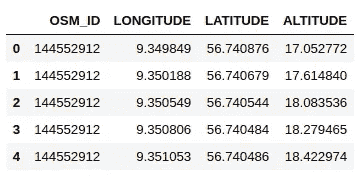
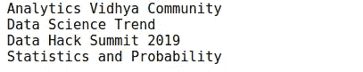
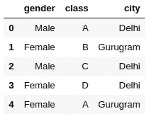
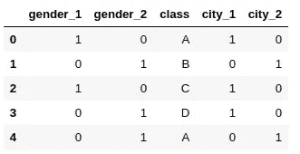
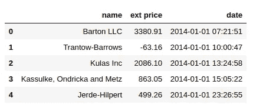
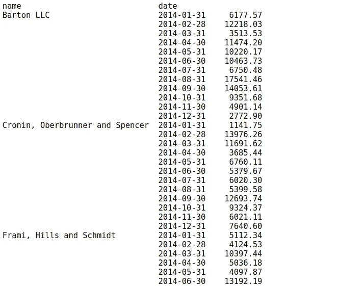
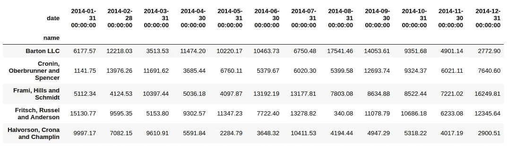
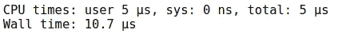
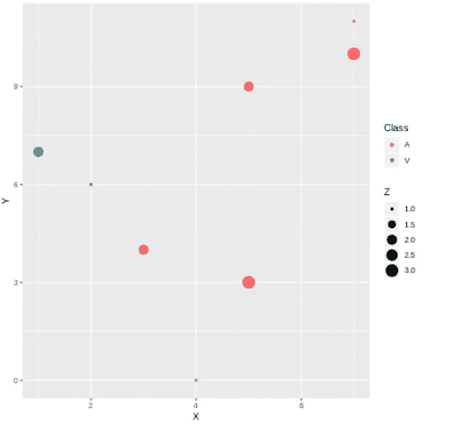

# 您今天需要尝试的 10 个强大的数据科学 Python 技巧

> 原文：<https://medium.com/analytics-vidhya/10-powerful-python-tricks-for-data-science-you-need-to-try-today-d227035db195?source=collection_archive---------7----------------------->

你上一次学习新的 Python 技巧是什么时候？作为数据科学家，我们习惯于使用熟悉的库，每次都调用相同的函数。是时候打破老套路了！

Python 不仅仅局限于熊猫、NumPy 和 scikit-learn(尽管它们在[数据科学](https://courses.analyticsvidhya.com/courses/introduction-to-data-science-2/?utm_source=blog&utm_medium=10-powerful-python-tricks-data-science)中是绝对必要的)！我们可以使用大量的 Python 技巧来改进我们的代码，加速我们的数据科学任务，并提高编写代码的效率。

更重要的是——学习我们可以用 Python 做的新东西是一件非常有趣的事情！我喜欢尝试不同的软件包和功能。每隔一段时间，一个新的技巧会吸引我的眼球，我会把它融入到我的日常生活中。

所以我决定把我最喜欢的 Python 技巧整理到一个地方——这篇文章！这个列表包括从加速基本的数据科学任务，如预处理到在同一个 [Jupyter 笔记本](https://www.analyticsvidhya.com/blog/2018/05/starters-guide-jupyter-notebook/?utm_source=blog&utm_medium=10-powerful-python-tricks-data-science)中获得 R 和 Python 代码。有很多知识在等着我们，所以让我们开始吧！


# 1.gmplot:在谷歌地图上绘制数据集中的 GPS 坐标

我喜欢使用谷歌地图数据。想想看，这是你在任何地方都能找到的最丰富的数据应用之一。这就是为什么我决定从这个 Python 技巧开始。

当我们想了解两个变量之间的关系时，散点图是非常好的。但是如果变量是一个位置的经纬度坐标，你会使用它们吗？大概不会。最好将这些点绘制在真实的地图上，以便我们可以轻松地可视化和解决特定的问题(例如优化路线)。

*gmplot* 提供了一个惊人的界面来生成 HTML 和 JavaScript，以在谷歌地图上呈现我们想要的所有数据。让我们用一个例子来看看如何使用 gmplot。

## 安装 gmplot

```
!pip3 install gmplot
```

## 在谷歌地图上标出位置坐标

你可以在这里下载这个代码[的数据集。让我们导入库并读取数据:](https://drive.google.com/file/d/1VS292bhx_caAamNGY1bRrAySABMNSAhH/view?usp=sharing)

```
import pandas as pd
import gmplotdata = pd.read_csv('3D_spatial_network.csv')
data.head()
```



```
# latitude and longitude list 
latitude_list = data['LATITUDE'] 
longitude_list = data['LONGITUDE']# center co-ordinates of the map 
gmap = gmplot.GoogleMapPlotter( 56.730876,9.349849,9)# plot the co-ordinates on the google map 
gmap.scatter( latitude_list, longitude_list, '# FF0000', size = 40, marker = True)# the following code will create the html file view that in your web browser 
gmap.heatmap(latitude_list, longitude_list)gmap.draw( "mymap.html" )
```

上面的代码将生成 HTML 文件，您可以看到经纬度坐标绘制在 Google Maps 上。热图以红色显示了点密度较高的区域。很酷，对吧？

# 2.zip:在 Python 中组合多个列表

我们经常会编写复杂的 for 循环来将多个列表组合在一起。听起来很熟悉？那你一定会喜欢 zip 功能。这个 zip 函数的目的是“创建一个迭代器，从每个可迭代对象中聚合元素”。

让我们通过一个简单的例子来看看如何使用 zip 函数并组合多个列表:

```
# Combining multiple lists using zip functionlist1 = ['Analytics', 'Data', 'Data', 'Statistics']list2 = ['Vidhya', 'Science', 'Hack', 'and']list3 = ['Community', 'Trend', 'Summit 2019', 'Probability']for w1, w2, w3 in zip(list1,list2,list3) :
    print(w1,w2,w3)
```



就是这样！看到合并多个列表有多容易了吧？

# 3.category_encoders:使用 15 种不同的编码方案对分类变量进行编码

我们在早期数据科学数据集方面面临的最大障碍之一是——我们到底应该对分类变量做些什么？我们的机器在眨眼之间处理数字，但处理类别是一个完全不同的问题。

一些机器学习算法可以自己处理分类变量。但是我们需要将它们转换成数字变量，为此， **category_encoders** 是一个了不起的库，它提供了 15 种不同的编码方案。

让我们看看如何利用这个图书馆。

## 安装类别编码器

```
!pip3 install category-encoders
```

## 将分类数据转换成数字数据

```
import pandas as pd 
import category_encoders as ce# create a Dataframe 
data = pd.DataFrame({ 'gender' : ['Male', 'Female', 'Male', 'Female', 'Female'],
                      'class' : ['A','B','C','D','A'],
                      'city' : ['Delhi','Gurugram','Delhi','Delhi','Gurugram'] }) 

data.head()
```



```
# One Hot Encoding 
# create an object of the One Hot Encoderce_OHE = ce.OneHotEncoder(cols=['gender','city'])# transform the data 
data = ce_OHE.fit_transform(data) 
data.head()
```



*category_encoders* 支持大约 15 种不同的编码方式，例如:

*   哈希编码
*   LeaveOneOut 编码
*   顺序编码
*   二进制编码
*   目标编码

所有的编码器都与 *sklearn-transformers* 完全兼容，所以它们可以很容易地在你现有的脚本中使用。另外， *category_encoders* 支持 NumPy 数组和 Pandas 数据帧。你可以在这里阅读更多关于[类别编码器的信息](https://github.com/scikit-learn-contrib/categorical-encoding)。

# 4.progress_apply:监控你在数据科学任务上花费的时间

您通常在清理和预处理数据上花费多少时间？数据科学家通常会花 60–70%的时间来清理数据，这句话非常正确。追踪这个对我们来说很重要，对吗？

我们不想花很多时间清理数据，而忽略其他数据科学步骤。这就是***progress _ apply***函数让我们的生活变得如此轻松的地方。让我演示一下它是如何工作的。

让我们计算所有的点离一个特定点的距离，看看这个任务的完成进度。你可以在这里下载这个[的数据集。](https://drive.google.com/file/d/1VS292bhx_caAamNGY1bRrAySABMNSAhH/view?usp=sharing)

```
import pandas as pd
from tqdm._tqdm_notebook import tqdm_notebook
from pysal.lib.cg import harcdist
tqdm_notebook.pandas()
data = pd.read_csv('3D_spatial_network.csv')
data.head()
```


```
# calculate the distance of each data point from # (Latitude, Longitude) = (58.4442, 9.3722)def calculate_distance(x): 
   return harcdist((x['LATITUDE'],x['LONGITUDE']),(58.4442, 9.3722)) 

data['DISTANCE'] = data.progress_apply(calculate_distance,axis=1)
```

您可以看到跟踪我们代码的进度是多么容易。简单、高效、救命稻草。

# 5.pandas_profiling:生成数据集的详细报告

我们花了大量的时间去理解给我们的数据。这是公平的——我们不想在不了解我们在做什么的情况下直接跳到模型构建。这是任何数据科学项目中必不可少的一步。

**pandas_profiling** 是一个 Python 包，它减少了进行初始数据分析步骤的大量工作。这个包只用一行代码就生成了我们数据的详细报告！

```
import pandas as pd 
import pandas_profiling# read the dataset 
data = pd.read_csv('add-your-data-here') 
pandas_profiling.ProfileReport(data)
```

我们可以看到，只用一行代码，我们就得到了数据集的详细报告:

*   **类似于** *的警告 Item_Identifier* 具有很高的基数:1559 个不同值警告
*   **所有分类变量的频率计数**
*   **数字变量的分位数和描述性统计**
*   **相关图**

# 6.分组器:对时间序列数据进行分组

在这一点上谁不熟悉熊猫？它是目前最流行的 Python 库之一，广泛用于数据操作和分析。我们知道熊猫有惊人的能力处理和总结数据。

我最近在解决一个[时间序列问题](https://courses.analyticsvidhya.com/courses/creating-time-series-forecast-using-python/)，注意到熊猫有一个 [Grouper](https://pandas.pydata.org/pandas-docs/stable/reference/api/pandas.Grouper.html) 功能，我以前从未用过。我对它的用途变得非常好奇(数据科学家诅咒！).

事实证明，这个 Grouper 函数对于时间序列数据分析是一个相当重要的函数。所以，让我们试试这个，看看它是如何工作的。你可以在这里下载这个代码[的数据集。](https://drive.google.com/file/d/1UXHlP2TcenRFQJi5ZoaFtWpRuSU6AwQk/view?usp=sharing)

```
import pandas as pddata = pd.read_excel('sales-data.xlsx') 
data.head()
```



现在，处理任何时间序列数据的第一步是将日期列转换为日期时间格式:

```
data['date'] = pd.to_datetime(data['date'])
```

假设我们的目标是查看每个客户的月销售额。我们大多数人试图在这里写一些复杂的东西。但这正是熊猫对我们更有用的地方(开始喜欢熊猫吧！).

```
data.set_index('date').groupby('name')["ext price"].resample("M").sum()
```



我们可以通过 ***groupby*** 语法来使用一种简单的方法，而不必去摆弄重新索引。我们将通过提供更多关于如何对日期列中的数据进行分组的信息，为这个函数添加一些额外的内容。它看起来更干净，工作方式完全相同:

```
data.groupby(['name', pd.Grouper(key='date', freq='M')])['ext price'].sum()
```


# 7.拆分:将索引转换成数据帧的列

我们刚刚看到了 grouper 在对时间序列数据进行分组时是如何起作用的。现在，这里有一个挑战—如果我们想将 ***名称*** 列(在上面的例子中是索引)作为我们的数据框的列，该怎么办？

这就是*拆垛*功能变得至关重要的地方。让我们对上面的代码样本应用 *unstack* 函数，看看结果。

```
data.groupby(['name', pd.Grouper(key='date', freq='M')])['ext price'].sum().unstack()
```



挺有用的！*注意:如果索引不是多索引，输出将是一个序列。*

# 8.%matplotlib 笔记本:您的 [Jupyter 笔记本](https://www.analyticsvidhya.com/blog/2018/05/starters-guide-jupyter-notebook/?utm_source=blog&utm_medium=10-powerful-python-tricks-data-science)中的互动情节

我是 ***matplotlib*** 库的忠实粉丝。这是我们在 [Jupyter 笔记本](https://www.analyticsvidhya.com/blog/2018/05/starters-guide-jupyter-notebook/?utm_source=blog&utm_medium=10-powerful-python-tricks-data-science)中用来生成各种图形的最常见的可视化库。

为了查看这些图，我们通常使用一行代码— **%matplotlib inline** —同时导入 ***matplotlib*** 库。这很好地工作，但是它渲染了 Jupyter 笔记本中的静态图。

只需把线 ***%matplotlib 内联*** 换成**% matplotlib 笔记本** 就可以看着神奇展开了。您将在笔记本中获得可调整大小和可缩放的绘图！

```
%matplotlib notebook
import matplotlib.pyplot as plt# scatter plot of some data # try this on your dataset
plt.scatter(data['quantity'],data['unit price'])
```

太棒了。只需一个单词的变化，我们就可以得到交互式的绘图，允许我们在绘图中调整大小和缩放。

# 9.%%time:检查特定 Python 代码块的运行时间

解决一个问题可以有多种方法。作为数据科学家，我们非常了解这一点。计算成本在行业中至关重要，尤其是对于中小型组织。您可能希望选择在最短时间内完成任务的最佳方法。

在 Jupyter 笔记本中检查特定代码块的运行时间实际上非常容易。

只需添加**%*%*%**命令来检查特定单元的运行时间:

```
%%time 
def myfunction(x) : 
    for i in range(1,100000,1) : 
        i=i+1
```



这里，我们有 **CPU 时间**和**墙壁时间**。CPU 时间是 CPU 专用于某个进程的总执行时间或运行时间。墙时间是指从进程开始到“现在”这段时间内，时钟所测量的时间。

# 10: rpy2: R 和 Python 在同一个 Jupyter 笔记本里！

r 和 Python 是数据科学世界中最好和最流行的两种开源编程语言。r 主要用于统计分析，而 Python 提供了一个简单的接口来将数学解翻译成代码。

好消息是，我们可以在一个 Jupyter 笔记本上同时使用这两种功能！我们可以利用这两个生态系统，为此，我们只需要安装 ***rpy2。***

因此，让我们暂时搁置 R 与 Python 的争论，在我们的 Jupyter 笔记本中享受绘制 ggplot 级别的图表吧。

```
!pip3 install rpy2
```

我们可以一起使用这两种语言，甚至在它们之间传递变量。

```
%load_ext rpy2.ipython
%R require(ggplot2)# create a dataframe
import pandas as pd
df = pd.DataFrame({
        'Class': ['A', 'A', 'A', 'V', 'V', 'A', 'A', 'A'],
        'X': [4, 3, 5, 2, 1, 7, 7, 5],
        'Y': [0, 4, 3, 6, 7, 10, 11, 9],
        'Z': [1, 2, 3, 1, 2, 3, 1, 2]
    }) %%R -i df
ggplot(data = df) + geom_point(aes(x = X, y= Y, color = Class, size = Z))
```



这里，我们用 Python 创建了一个数据框 **df** ，并使用 R 的 ggplot2 库(函数 **geom_point** )创建了一个散点图。来吧，试试这个——你肯定会喜欢的。

# 结束注释

这是我基本的 Python 技巧集。我喜欢在日常工作中使用这些包和函数。老实说，我的生产率提高了，这使得用 Python 工作比以往任何时候都有趣。

除了这些，还有什么你想让我知道的 Python 技巧吗？请在下面的评论区告诉我，我们将交换想法！

*原载于 2019 年 8 月 20 日*[*https://www.analyticsvidhya.com*](https://www.analyticsvidhya.com/blog/2019/08/10-powerful-python-tricks-data-science/)*。*