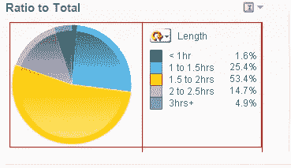
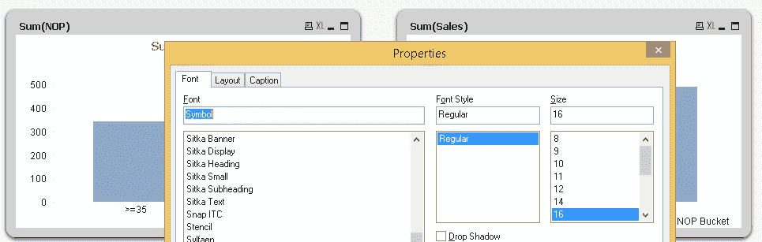

# QlikView 中数据可视化的 10 个终极提示和技巧

> 原文：<https://medium.com/analytics-vidhya/10-ultimate-tips-and-tricks-on-data-visualization-in-qlikview-6fc7f186676e?source=collection_archive---------1----------------------->

# 介绍

QlikView 是一款流行且简单易学的数据可视化工具。其简单的界面使其成为分析新手的最爱。我也很喜欢。事实上，我的商业智能之旅始于 QlikView。作为一个非编程背景的人，我不可能要求一个更好的开始。

多年来，我发现了一些在 QlikView 提高工作效率的方法。在花了无数时间研究这个工具后，我找到了这些方法。最后，我找到了这 10 个可以帮助你更快工作的窍门。如果没有这些技巧，我几乎要花 15 分钟完成一项任务，而现在不到 3 分钟就能完成。

在这篇文章中，我分享了这 10 个终极技巧和窍门，在使用这个工具时，它们可以节省你的时间，提高你的工作效率。

# 涵盖的提示和技巧列表

1.  复制对象
2.  复制表达式
3.  移动图表组件
4.  选择多个对象
5.  限制图表的尺寸
6.  向表格添加可视元素
7.  有条件地显示或隐藏对象
8.  在脚本中使用注释
9.  在脚本中使用制表符
10.  快捷键

# 复制对象

我们经常创建与现有对象相似的对象，只是在尺寸、表达式或任何其他参数上有微小的变化。这是一个耗时的过程。

但是，你现在可以做得更快。只需复制现有的对象并进行必要的更改。您可以复制工作表和图表对象。方法如下:

*   **图表对象:**右键单击图表标题，然后选择**克隆**命令。这将创建图表对象的副本。另一种方法是按住 **CTRL** 键点击图表标题，拖动对象到不同的位置，释放鼠标按钮。
*   **工作表对象:**右击工作表标签，选择命令“**复制工作表**”。这将创建一个类似的工作表，其名称为“当前工作表名称>的副本”。这个新工作表将在所有工作表的末尾创建。

# 复制表达式

在仪表板开发期间，我们编写多个表达式(简单的和复杂的)。有些情况下，我们最终会为不同的图表对象编写相似的表达式。为了提高效率，我们可以重用现有的表达式。让我们看看方法:

*   开放式表达。将其复制并粘贴到新的表达式中
*   右键单击表达式。选择**复制**命令。然后，将其粘贴到表达式窗口。在这里，您不仅要复制表达式代码。创建的新列与源表达式具有完全相同的属性。这包括列宽、对齐、数字格式等。

*   在仪表板开发中，有一些不同图表对象通用的表达式。在这种情况下，我们可以将表达式存储在一个变量中，并使用一个**美元扩展**通过变量名来访问它。为此，首先在变量中存储表达式(进入设置- >变量概述和存储表达式)。

*   要在任何图表对象中访问它，请将表达式写成$(变量名称)。

*   这提高了整个仪表板的准确性和相似性，因为我们使用了相同的表达式。

# 移动图表组件

默认情况下，图表组件的位置固定在右侧。但是，在某些情况下，为了更好的可视化，我们需要改变位置。对此，没有直接的选择。我也没有任何解决这个问题的方法。但是，随着时间的推移，我找到了一种方法。这可以通过使用键盘快捷键的组合来完成。诀窍是:

*   比方说，我们想将饼图下方的图表图例向左移动

*   现在，选择图表并按 Ctrl+Shift。您会看到每个图表对象周围都有红色边框

*   现在，将单个组件拖放到左侧位置(或所需位置)。

*   上面，你已经看到图表图例移到了左边。您也可以使用双向箭头调整单个组件的大小。

# 选择多个对象

有时我们想执行类似的操作，如改变字体大小，布局，删除多个对象。在这种情况下，我们选择所有对象并执行所需的操作。对于选择，最初，我们选择一个对象，然后按下 **SHIFT** 键。然后，点选其他物件的标题。现在，您可以对这些对象执行分组操作(适用),如删除，使用属性选项(右键单击任何选定的对象)更改布局、字体和标题。

# 向表格添加可视元素

通常，我们在表格中只显示数字。但是，我们可以通过在表格中添加可视元素来增加表格的信息量。在 Qlikview 中，我们可以对表格应用三种可视化技术:

# 限制图表的维度

看下面的图表，它有太多的维度，很难对数据做出推断。

我们可以通过以下方式解决这一挑战:

*   **限制维度**:在图表对象的属性窗口中，可以找到“**维度限制**的一个，在这里可以根据值限制维度，比如只显示最大的 10 个，前 10 个，最小的 10 个，显示大于或等于总数的 5%的值，显示累计到总数的 80%的值。

*   **启用维度的滚动条:**此选项在图表属性窗口的显示选项卡上可用。您可以在 x 轴上启用滚动条，并设置显示项目的数量限制(请看下面的快照)。这是 Qlikview 鲜为人知的有用功能之一。在这里，您还可以通过根据表达式以降序或升序对图表进行排序来显示前 10 名和后 10 名。

# 有条件地显示或隐藏对象

我们可以根据需要显示或隐藏 Qlikview 对象。它有助于有效地优化片状对象的面积。在“属性”窗口的“布局”选项卡下，有一个显示或隐藏工作表对象的选项(总是或有条件地)。在这里你可以写表达式或者使用变量来控制它。通常，开发人员使用“按钮”来更改变量的值，例如一个按钮将值 0 赋给变量，另一个按钮将值 1 赋给变量。

我们还可以显示或隐藏图表对象的维度和表达式，此功能的最佳用途是“**临时报告**或“**定制报告**”。您可以参考文章“[Qlikview](https://www.analyticsvidhya.com/blog/2014/01/customize-reporting-qlikview/)中的定制报告”。

# 在 Qlikview 脚本中使用注释:

伟大的程序员总是用不同的代码段添加注释。这使得阅读和调试代码更加容易。在 Qlikview scripting 中，也强烈推荐这种做法。有几种方法可以在脚本中创建注释。

*   //用于单行注释
*   /* …*/用于块编辑

# 在 Qlikview 脚本中使用脚本选项卡

为了保持脚本的可维护性，我们在编码中遵循模块化结构。同样，我们应该使用脚本选项卡来标准化我们的脚本。它有助于更快地编辑和调试脚本。Qlikview 脚本在每个选项卡上从上到下运行，从最左侧选项卡到右侧。

上面，你可以看到不同的标签，例如，电影数据库，评级和字典。

# 快捷键

在检查这些快捷键之前，首先打开“**在屏幕提示中显示快捷键**”选项。这样，每当我们将鼠标指针悬停在菜单图标上时，它就会显示快捷键。就像微软的 Excel 一样。这对记忆键盘快捷键很有帮助。

要启用它，右击工具栏区域->选择命令“自定义”->转到选项选项卡->选中“在屏幕提示中显示快捷键”复选框。以下是一些有用的键盘快捷键:

# 结束注释

这些建议不仅会让你工作得更快。但是，你也会有更多的时间去探索新事物。可视化数据与分析数据同等重要。因此，您应该努力在数据可视化方面日臻完善。

在本文中，我们了解了 QlikView 的提示和技巧，它们将增强您的仪表板开发体验。在这里，我主要介绍了与前端或设计者观点相关的提示和技巧，如复制对象和表达式、使用图表组件、选择多个对象、限制维度、表格可视化、有条件地显示或隐藏对象、编写最佳实践脚本以及键盘快捷键。

你觉得这篇文章有用吗？你想再增加一些提示和技巧吗？请随意与我们分享你的经验，我很想听听你的意见。

*原载于 2015 年 12 月 9 日*[*【https://www.analyticsvidhya.com】*](https://www.analyticsvidhya.com/blog/2015/12/10-tips-tricks-data-visualization-qlikview/)*。*