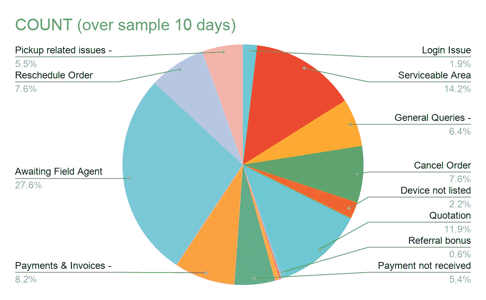
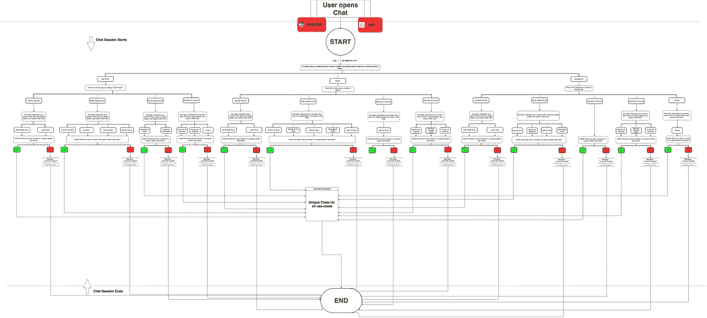
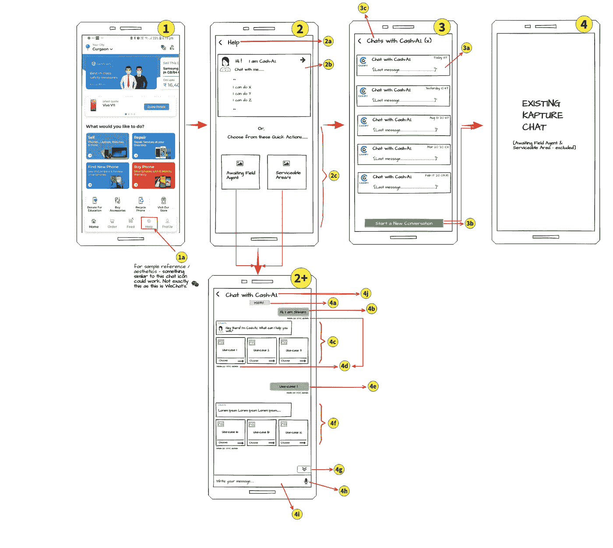
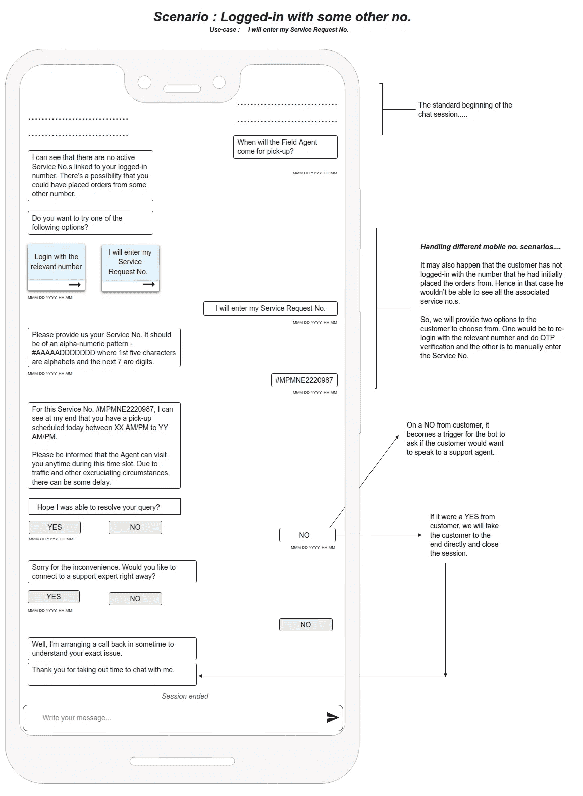
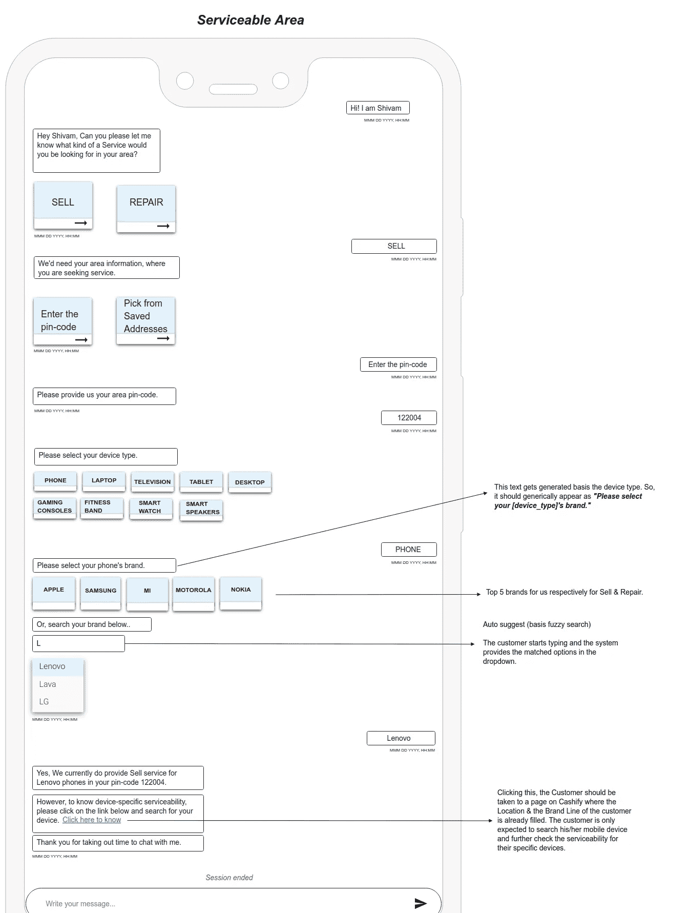

# RASA 聊天机器人 100 天！

> 原文：<https://medium.com/analytics-vidhya/100-days-to-rasa-chatbot-2ff92f945c81?source=collection_archive---------7----------------------->

**cash fy 的 RASA 堆栈**

***我在这个组织的第七天，有人告诉我，我们需要建立一个 NLP 驱动的聊天机器人，或者俗称的对话式人工智能***

好吧，让我们倒回去一点！

我于 2020 年 8 月加入 Cashify，担任[人工智能产品经理](https://www.antwak.com/author/1621-shivam-dutt-sharma)。虽然我雄心勃勃地期待着为该组织创造一些真正前沿的基于 ML 和数据科学的产品，但我实际上并没有预料到 RASA Chatbot 会成为名单上的第一个。

从我在该组织的第一个周一上午的会议中出来，我知道这将是一个令人兴奋的旅程，建立一个对话式人工智能。我最近完成了机器学习的研究生毕业，巧合的是，我的最后一个行业项目也是一个基于 RASA / LSTM 的聊天机器人，我选择了这两个，但真的很喜欢 RASA，特别是 TBH！

我将试着带你快速浏览我们在 Cashify 制作对话人工智能的 100 天，我们现在称之为**“cash bot”。**

# **第 01 天至第 05 天**

**业务需求收集**

前 5 天是通常的业务需求收集和问题陈述理解日。然而，我从一开始就知道的是，问题陈述必须被正确理解，否则我们最终将乘坐错误的火车，下一站非常远，以便我们下车并能够回到我们出发的地方。

**我将分享一下我与我的业务部门进行的业务需求收集讨论:-**

**— — — —业务需求收集— —**

**BU :** 我们目前使用的是非常基础的常规第三方聊天机器人。显然，它本质上甚至不是一个聊天机器人，而是一个用户选择驱动的下钻流程，它将让用户从可用的选项/用例中做出选择，然后最终将它们连接到支持代理。

我:所以你的意思是用户别无选择，只能在最后联系支持代理？对于最终用户来说，这不是有点烦人而且很平常吗？我确信我们有一些有意义的数据可以在聊天实例中提供给用户。我建议立即解决。有些 API 是要整合的，我们是排序的。不是吗？

**BU :** 对！现在，您已经了解了它的要点，让我告诉您，到目前为止，我们在 10 天内收到了以下不同类型的客户查询，以及每种查询在所有票证中所占的份额。随着我们的逐步发展，我们的新 RASA 聊天机器人将不得不处理这些问题

**cash fy 客户查询的分解**

从这个饼图中可以看出，我们通常会收到很多客户询问的两个最重要的使用案例是:-

**1)等待提货专家** -这是在 Cashify 上下了销售/维修订单的客户询问他们的提货专家/服务技术人员在服务当天的到达状态。
**2)服务能力-** 这是收银员的潜在和现有消费者询问其所在区域/位置(pin 码)的销售(回购)/维修服务能力的地方。类似地，还有一些用例，但是我们可以在接下来的阶段中逐步实现它们。

**我:**明白了！我现在应该调整我的 API&设计需求，然后，我们可以开始了。

**— — — —业务需求收集— —**

现在，在我进一步向你们介绍聊天机器人开发的剩余 95 天之前，让我先给你们看一下我们试图通过对话式人工智能产生的东西。

您将在下面看到的是之前在 Cashify 上运行的第三方聊天小部件所覆盖的整体用户流。我们知道要构建的东西很多，但是很高兴，我们在第一阶段只发布了两个最重要的用例

你可能需要放大一点😆

# **第 05 天至第 10 天**

**线框|对话流程/蓝图创建| API 的采购**

线框:我总是对一个典型的奇特的对话机器人应该是什么样子有一个公平的想法。现在，我只需要画一些线，并在这些线框架中安装机器人。那是我为我们的第一阶段聊天机器人制作线框的地方。

你看到的下面是我们设计团队共享的初始线框。后来显然有了一些更新和改进。然而，这些线框应该给你一个公平的想法，最终机器人的灵感来自哪里。

**实际聊天机器人的蓝图！**

现在，我将快速描述 RASA 聊天机器人第一阶段的两个用例，并展示它们各自的对话流程

**等待提货专家:**这是一个用例，Cashify 的客户联系我们的支持人员，询问他们的提货专家的到达状态。这种情况主要发生在他们有销售/维修订单，而他们指定的提货专家或维修技术人员没有在预定的访问日期准时到达他们的位置时。有时，客户也会提前几天询问代理的预计到达时间，只是为了提前计划他们的服务日。

现在，当客户来到我们的 Bot 时，我们获取与客户登录的联系号码相关联的所有销售和维修服务号码。客户可以从列出的订单 ID 中选择，也可以手动输入服务请求编号(订单 ID)。一旦机器人从客户那里获得订单 ID，就会有一系列 API 调用，这些调用基本上通过查询 Cashify 的物流部门并考虑提货专家当前的经度坐标、他们最后服务的客户和他们的轮班开始时间来提供一个大概的代理 ETA。

显然，这不是全部的食谱！

只是给你一个我们如何计算时间的好主意。实际的整体方法相当冗长和复杂。

客户现在可以确认提供给他们的信息并简单地结束会话，或者也可以与我们的支持代理进行实时聊天，或者要求回电。让我们来看一下这种情况下的对话流示例:-

**等待接站专家—对话流程**

**服务能力:**这是两者的一个更简单的用例，然而，可能是一个更鼓励业务的用例。在这里，一个 Cashify 客户基本上是主动联系我们，询问 Cashify 在其所在地是否提供回购(出售)或维修服务。

在这种情况下，机器人只需要客户的 pin 码，以检查他们所在地区的回购/维修服务能力。有两种方法可以实现这一点。一种是用户可以手动输入他们的区号，另一种方式是他们也可以从他们保存的地址中选择。

无论哪种方式，bot 都需要一个 pin 码来调用集成的 API，这基本上要求在请求中提供一个 pin 码，并向客户提示一个二进制响应(是或否)，即 Cashify 是否以该 pin 码提供特定的销售/维修服务！然而，该机器人还提供了一个客户链接，客户可以点击并登陆 Cashify 的网站，检查其特定设备变体的可服务性。
***这显然也为我们提供了一些平台上的引荐流量。他们中的一些人也可能是潜在的消费者。😉***

**服务能力—对话流程**

## 现在，为了不让你们读得太长，我想在另一篇文章中继续剩下的 90 天的聊天机器人开发。

点击 [**此处**](https://shivamdutt606.medium.com/100-days-to-rasa-chatbot-tech-b26f960a67a5) 即可前往那篇文章。

我们将主要讨论聊天机器人开发的技术部分。
如果你无论如何都想快进到 RASA 概念，即**意图**、**故事**、**领域**、**行动**等等。在聊天机器人开发中实现，那么让我们在另一边见。

