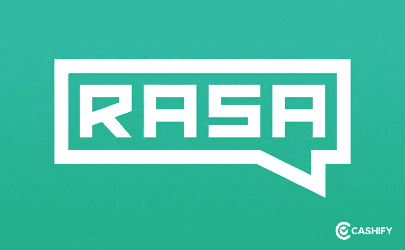

# RASA 聊天机器人技术 100 天

> 原文：<https://medium.com/analytics-vidhya/100-days-to-rasa-chatbot-tech-b26f960a67a5?source=collection_archive---------5----------------------->

RASA 聊天机器人在 Cashify 中的实现

我想我可以有把握地假设，你来这里是想知道在我们基于 RASA 的聊天机器人开发的剩余 90 天里会发生什么。
如果你还没有，那么我想请你看看这个基于 RASA 的聊天机器人开发的产品&业务方面。我们开发聊天机器人的前 10 天非常重要，因为我们专注于正确理解问题陈述，并在与我们的业务部门讨论的基础上制定预期的流程。

点击 [**这里**](https://shivamdutt606.medium.com/100-days-to-rasa-chatbot-2ff92f945c81) 了解前 10 天都发生了什么。

# 第 10 天到第 15 天

**设计|新 API 开发|事件、分析& UTM 跟踪设置**

我将避免在这里分享设计。你自己检查一下新机器人怎么样？只需进入 [https://cashify.in](https://cashify.in) 滚动到网页底部，点击“与我们聊天”。瞧啊。

谈到新的 API 开发，我们创建了几个新的 API 来服务于我们的一些用例。

(I)现场代理物流 API:该 API 基本上为我们提供了现场代理一天的客户线索数据，这基本上也是计算代理 ETA 以向查询它的客户展示它所需要的。我们从这个 API 中获得了几个重要的数据属性。代理的轮班开始时间、他当前的经纬度坐标、最后一次提前服务时间等。

(ii)用于 is_Logistics 信息的通用 API:这是一个通用 API，创建它主要是为了通过这个 API 向我们提供针对“is_Logistics”关键字的真/假值。这个 API 基本上告诉我们某个回购订单是由物流还是由合作伙伴提供服务？

“事件”是另一件需要注意的重要事情。顾名思义，“事件”基本上是用户参与的实例，主要以点击、键入的消息、用户的选择和各种其他类型的交互的形式出现。

我们如何处理这些事件？—重要的是，这些事件需要保存在我们的数据库中，以便从中获得洞察力。

这些事件主要给了我们什么样的启示？:-

-客户主要执行或与之互动的对话是什么？

-在什么情况下会发生回退？

-哪些故事(用例)最常被执行？

-假设我们的对话流中有按钮，那么哪些是客户主要点击的按钮？

-同样，我们也可以看到所有那些相对较少被客户执行的用例/故事。

我们到底为什么需要这些事件？

这些事件提供的见解，从本质上为我们创造了改进的范围，我们可以在以后将这些改进包括在我们的产品路线图中。

我们计划如何跟踪/保存事件？

我们只是将事件日志推送到 MongoDB 中。我们为我们的聊天机器人上正在进行的所有对话维护一个专用的集合。每个对话(聊天会话)都有一个唯一的对象 ID。

让我们向您展示一个示例事件是怎样的

> {
> " _ id ":ObjectId(" * * * * * * * * * * * * * * * * * * * ")，
> "sender_id" : "default "，
> ，【active_form" : {}，
> " events ":[
> {
> " event ":" action "，
> " timestamp ":* * * * * * * * * * * * * * * * *，
> " name ":" action _ session _ start "，
> "policy" : null，
> "confidence" : null
> }，
> {
> 。

出于一些合规性原因，我隐藏了关键信息。但是，您可以大致了解 RASA 如何提供事件日志。你可以探索更多关于 [RASA 的事件代理](https://rasa.com/docs/rasa/event-brokers/)。

我们还做了一点 UTM 跟踪。在我们聊天机器人的一个流程中，当我们向用户传达我们是否在用户所在地提供销售/维修服务时，我们还提供一个链接，用户单击该链接可以进入 Cashify 的产品列表页面，并搜索他们想要销售或维修的特定设备型号/型号。

# 第 15 天到第 75 天

**NLP 模型创建:故事|意图|操作| API 端点集成|前端(ReactJS)组件创建**

现在到了部分，我觉得很多 RASA 爱好者会很快快进到。这基本上定义了任何基于 RASA 的聊天机器人开发中最重要的部分。

在这里，我们(主要是开发人员)定义意图、故事、域、配置、凭证文件等。

让我们快速浏览一下这些文件及其意义:-

意图文件:这是开发者定义用户的所有可能意图的地方，机器人可以服从这些意图。例如，在我们的聊天机器人的例子中，我们可以主要识别出两种广泛的意图。一个是“等待提货专家”，另一个是“服务可用性”。intents 文件中所做的是，用户为每个定义的 Intents 提供一些示例消息/话语，机器人可以从客户那里接收这些消息/话语。

一个示例意图文件应该是这样的:-

> # # intent:waiting _ pick up _ Specialist
> -提货专员什么时候来提货？
> -我有其他的顾虑。
> 
> ##意向:服务 _ 可用性
> -我想卖我的手机
> -我想修我的手机

上面显示的显然是一个样本意图文件。出于显而易见的原因，我们实际的 intents 文件看起来更加冗长。出于合规原因，不能在此分享细节。

Stories 文件:这是一个文件，开发人员在其中定义了聊天机器人中预期要发生的所有故事(流程)。故事基本上是用户和人工智能助手之间对话的表示，转换成特定的格式，其中用户输入被定义为意图(和必要的实体)，助手的响应和动作被表示为动作名称。

请接受你方的缩进。

> ##回退
> -绝对默认
> 
> ##等待 _ 接送 _ 专家 _ 故事
> *等待 _ 接送 _ 专家
> -完全等待 _ 接送 _ 专家
> -返回
> 
> ##服务 _ 可用性 _ 故事
> *服务 _ 可用性
> -完全服务 _ 可用性

域文件:这是开发人员定义 RASA NLU 和 RASA 核心功能的 5 个关键部分的文件，即插槽、实体、意图、动作和模板。你可以在这里阅读更多关于他们的信息[。一个示例域文件如下所示:-](https://rasa.com/docs/rasa/)

**请假设你方缩进。*

> 插槽:
> 
> 人物:
> 类型:文字
> 实体:
> -出售
> -维修
> 
> 意向:
> -等待 _ 提货 _ 专家
> -服务 _ 可用性
> 
> 动作:
> -动作 _ 重启
> -发出 _ 服务 _ 可用性
> -发出 _ 等待 _ 接送 _ 专家
> -发出 _ 再见
> -发出 _ 默认
> 
> 模板:
> 
> 绝对服务可用性:
> - text:嘿{PERSON}！你想要销售或修理服务吗？
> -正文:您好{PERSON}！我可以知道你想要什么样的服务吗？
> 
> ut _ waiting _ pick up _ specialist:
> -text:嘿{PERSON}！请告诉我你的接送专家/相关问题是什么？

类似地，也有配置和凭证文件。

Config 文件是一个 yaml 格式的文件，包含环境变量和命令行参数。

凭证文件包含 API 端点、大多数语音/文本聊天机器人的认证/登录凭证，或者我们希望与我们的聊天机器人集成的其他第三方平台或消息流服务。

你可以访问 RASA 的官方网站，阅读他们的文档来了解更多。

# 第 75 天至第 80 天

**本地| A/B【受众分割】测试设置上的 Bot 模拟**

这是我们定期在开发人员的本地机器上测试机器人并建议任何流程改进的时候，就在那里。发生了许多谷歌会议/电话，交换了电子邮件，只是为了确保我们在进行阶段环境时，能够向前推进一个稳定的聊天机器人版本。

A/B(受众分群)测试是在此期间完成的另一项重要工作。我们使用 GTM 来控制观众的划分，因为我们的计划是将这个新的 RASA 聊天机器人展示给一组有限的用户，并衡量这些有限观众的表现。

随着我们的进展，我们最终使用 GTM 来控制曾经加载到网站上的 iframe 的大小/维度。我告诉你，GTM 是一把瑞士军刀😎

*只是为了让你快速了解一个普通的 GTM 脚本是什么样子的(假设你的末尾有缩进):-*

# 第 80 天到第 90 天

**在准备阶段进行 Bot 测试|错误修复|预生产 API &流程调整**

我们没有做任何背离各公司正常测试理论的事情。就像其他公司一样，在我们的临时服务器上部署我们的聊天机器人并测试端到端的流量对我们来说非常重要。

通常在这个阶段，产品经理会在 QA 的帮助下对他的产品特性进行彻底的测试。冒烟测试、单元测试、集成测试、自动化测试等。是一些你通常会习惯的流行的 QA 技术。

正如所料，有几个 bug 被及时发现并修复。

为了更大的微调目标，还做了一些 API 级别的更改。

# 第 90 天到第 95 天

**Beta 版 Bot 测试|负载/压力测试|服务器消耗分析**

一旦聊天机器人的稳定版本被确认，我们就把它放到了测试环境中。我们的想法是在 Cashify 的测试网站上发布我们的聊天机器人，它主要使用生产数据库和 API 来服务前端。我们下了真正的订单，带着真正的生产情绪进行聊天机器人对话。

技术负责人还通过 Jmeter & Postman 进行了负载和压力测试。

# **第 95 天至第 100 天**

**对 Beta | Pre-prod 最终外观的群体测试&逻辑修复**

聊天机器人现在提供给内部观众进行人群测试。

正如已经预料到的那样，我们收到了很多来自联席项目经理和其他内部人员的关于外观改进和逻辑增强的条目。

我们试图迎合最关键的问题，并将其余的问题留待将来发布。

# 第 100 天:

然后，我们开始直播！—2020 年 11 月 20 日

让我不要分享我们的 RASA 机器人的任何图像。相反，我会请你访问[https://www . cash fy . in](https://www.cashify.in/?utm_source=cashifyrasamedium&utm_medium=blog&utm_campaign=rasa_medium)并快速向下滚动到页面底部。点击“与我们聊天”将带您到我们新的 RASA 聊天机器人。

是的，别忘了卖掉你的旧手机！

现在你将访问印度领先的消费卖家二手设备市场，查看一下你的旧手机的一些真正的价格报价。

我们的维修服务在该领域也很有优势，仅供参考:)

**感谢阅读！**