# 101 对文本的分析和分类

> 原文：<https://medium.com/analytics-vidhya/101-of-text-analysis-and-classification-67dbc9a82f?source=collection_archive---------12----------------------->

## 开始使用 Python 进行文本分析所需要知道的一切


我们生活在一个有趣的时代。组织正在演变为在其运营中对数据进行灌洗。尽管不是全部，但大多数人都在逃避直觉决策，而接受基于数据的决策。各行业开始意识到，数据是推动其运营和市场战略以获得巨大利润所需的新燃料。全球咨询巨头麦肯锡指出，“数据驱动的组织获得客户的可能性是 23 倍，保留这些客户的可能性是 6 倍，因此盈利的可能性是 19 倍。”我参加过几次数据峰会，与几位企业高管有过互动。我敏捷地注意到他们偶尔会抛出一些引用，比如:“我们相信上帝，所有其他人都会带来数据”，“数据是新的石油”，“没有大数据，你会变得又盲又聋，还在高速公路上”，“数据战胜了情绪”，“最重要的是，展示数据”等等。关键是，我们不再处于数据科学是个谜的时代。如今市场上的巨大差异是对运营和客户数据的掌握。谁了解客户数据，谁就能更好地赢得客户。

在这个行业快速发展的时代，要想成为一名数据科学家，流畅地处理结构化和非结构化数据是必须的，也是不可避免的。我喜欢把数据想象成一条高速公路，把数据科学想象成带我到达目的地的汽车——解决一个商业问题。你对道路越熟悉，你的旅程将会越顺畅和快速。请记住，数据科学的主要目标是构建从数据中提取以业务为中心的洞察力的方法。不用说，花哨的数据总是胜过花哨的算法。

## 结构化数据和非结构化数据有什么区别？

结构化数据是最常见的数据类型。正如您可以从名称中推断的那样，结构化数据是一种格式良好且高度组织化的数据类型。此数据类型符合表格格式，具有清晰的带标签的列和行。在很多情况下，术语“结构化”是指通常所说的定量数据。处理结构化数据和运行一些分析算法非常简单。成千上万的免费在线学习资源。

另一方面，非结构化数据是没有整齐地组织或格式化的信息。维基百科将非结构化数据定义为没有预定义的数据模型或者没有以预定义的方式组织的信息。非结构化信息通常以文本为主，但也可能包含日期、数字和事实等数据。非结构化数据的常见示例包括 pdf、Word 文件、音频、视频文件或非 SQL 数据库。

这篇博客将向您介绍一些有价值的分析和机器学习技术，您需要掌握这些技术才能顺利地介绍文本分析。玩得开心，享受😊😊

# 什么是自然语言处理？

我可以简单地定义自然语言处理，通常被称为 NLP，作为数据科学的一个分支，帮助计算机处理、分析和操纵人类的自然语言。NLP 试图在人类交流和计算机理解之间架起一座桥梁。NLP 的发展可以追溯到 20 世纪 50 年代，尽管由于人类对机器通信的兴趣增加以及大数据和增强算法的可用性，它在现代已经快速发展。

虽然这个领域非常有趣，但我不得不承认，训练一台机器理解我们如何交流并不是一件容易的事情。

# 自然语言处理的使用

NLP 的应用广泛贯穿于所有产生和使用大数据的行业。基本上，NLP 是所有虚拟助手、语音转文本、聊天机器人、基于计算机的翻译等等背后的技术。下面是 NLP 在现代商业世界中的一些常见用法。你可以在这里阅读更多关于同一[的内容。](https://becominghuman.ai/8-thought-provoking-cases-of-nlp-and-text-mining-use-in-business-60bd8031c5b5)

*   聊天机器人
*   情感分析
*   雇用和招聘
*   广告
*   市场情报

在这篇博客中，我们将会处理一组被归类为垃圾邮件的信息。目标是研究数据，然后创建准确的分类模型来识别邮件是否是垃圾邮件。你可以在这里 下载数据集 [*！*](https://www.kaggle.com/uciml/sms-spam-collection-dataset)

# 1.加载所需的包

*   [**自然语言工具包**](https://www.nltk.org/)**(NLTK)**——这是 python 中自然语言处理的领先模块。它提供了易于使用的接口和非常丰富的库和函数。
*   **停用词-** 停用词是常用词，对一个句子或我们的模型没有多大意义，“the”、“a”、“is”、“on”。停用词模块包含所有的英语停用词，我们将训练我们的模型忽略这些停用词。
*   [**sk learn**](https://scikit-learn.org/)**-**sk learn 是 python 中最流行的机器学习和预测分析模块。它在准备要素、创建监督和非监督模型以及测量模型性能方面提供了广泛的功能。
*   [**word cloud**](https://python-graph-gallery.com/wordcloud/)**-**这是我们将用来创建数据文本的一些可视化表示的包。
*   **Pandas 和 Numpy-** 我们要求这两个包能够处理数据帧。
*   [**Matplotlib 和 Seaborn**](/@muturidavid8/python-visualization-101-3aee09809100) **-** 这是 python 中的绘图包。我已经在这个酷博客 [***里全面的讨论过了！***](/@muturidavid8/python-visualization-101-3aee09809100)

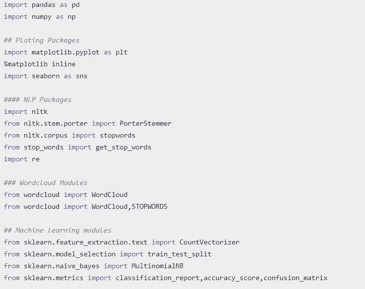

文本分析的必备包

# 2.加载和准备数据

我们使用熊猫来加载和整理数据集。

```
## Importing the dataset
df=pd.read_csv("spam.csv",encoding="latin-1")
df.head()
```

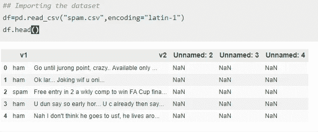

数据集的前 5 行

嗯，我们需要做一些事情来组织我们的数据并为分析做好准备。

*   去掉带有`NaN`值的未命名列
*   重命名列
*   然后添加一列标签，其中 **0** 代表火腿， **1** 代表垃圾邮件

```
## Droping the unceccesary columns and renaming 
df.drop(["Unnamed: 2","Unnamed: 3","Unnamed:4"],axis=1,inplace=True)
df.columns=["Class","Text"]
df["Lable"]=df.Class.map({"ham":0,"spam":1})
df.head()
```

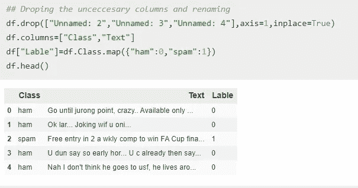

# 3.探索数据

现在我们的数据已经组织好了，我们可以执行一些探索性的分析。
让我们通过使用`describe`功能来查看每个类别的频率汇总。

```
df.groupby('Class').describe(include='O')
```

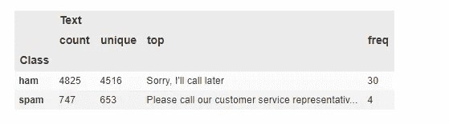

我们有 4825 行被归类为 ham 消息，其中有 4516 行是不重复的。垃圾邮件有 747 条，其中 653 条是唯一的。我们可以使用`seaborn countplot` 功能来可视化频率。

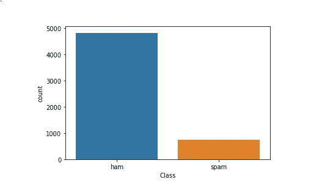

## 统计每篇文章中的常用词

我们想知道哪些词在垃圾短信中常见，哪些词在垃圾短信中常见。在我们创建单词 frequent summary 之前，我们需要清理数据。我说的清洁是指:

*   把所有的句子分解成单词
*   去掉标点符号
*   将所有单词转换成小写
*   去掉停用词和所有少于两个字符的词。

我们创建一个`words_cleaner`函数，其中一个参数`data`被清理，并返回一组干净的单词。

```
def words_cleaner(data):
    words=[re.sub('[^a-zA-Z]', ' ',i) for i in df['Text']]
    words=[i.lower() for j in data for i in j.split()
    words=[i for i in words if not i in   set(stopwords.words('english'))]
    words=[i for i in words if len(i)>2]
    return words
```

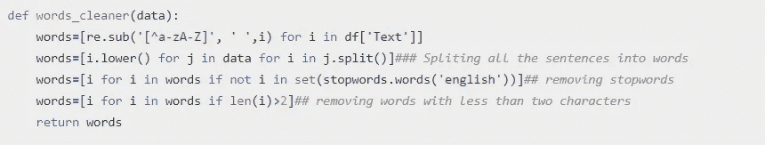

Words_cleaner 函数

现在，我们可以提取 ham 消息中的所有单词，并创建它们频率的数据帧。

```
Ham_texts=df.query("Class=='ham'")['Text']
ham_words=words_cleaner(Ham_texts)
ham_words_freq=nltk.FreqDist(ham_words)
ham_words_freq=pd.DataFrame(ham_words_freq.most_common(10),
                            columns=['Top_Words','Frequency'])
```

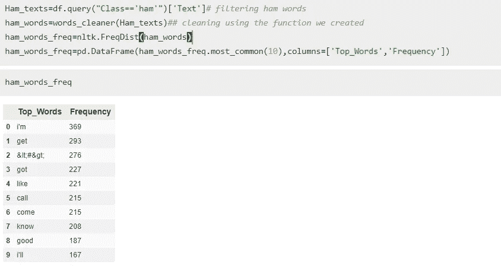

完美！现在我们有了一个在业余爱好者信息中最常用的 10 个单词的数据框架。我们现在可以创建一个柱状图来直观显示频率。

```
plt.figure(figsize=(8,6))
sns.set_style('whitegrid')
ax=sns.barplot(x='Top_Words',y='Frequency',data=ham_words_freq)
```

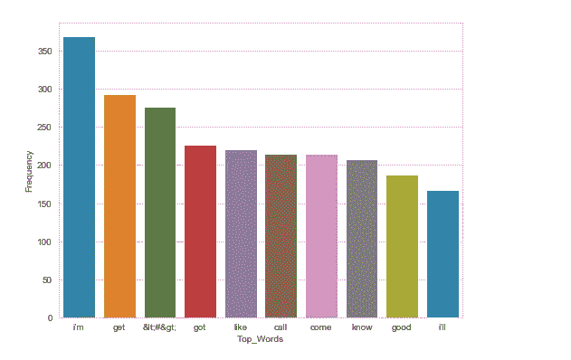

火腿信息中最常用的词。

是的，我知道，太酷了！😎现在，您可以对垃圾邮件进行同样的操作。

## 创建思维导图

为了全面了解这两个类中的词频，我们可以利用词云。用 python 创建单词云非常容易，我们只需要创建一个带有两个参数的函数——数据和背景颜色——然后返回一个单词云。

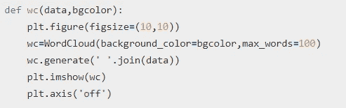

创建单词云的功能

## 火腿消息词云

现在我们有了一个创建单词云的函数，只需要一行代码就可以返回单词云。在词云中，越大的词出现的频率越高。

`wc(words_cleaner(Spam_texts),’black’)`

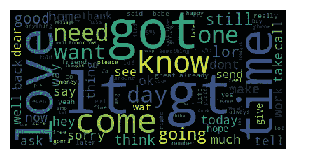

火腿消息词云

## 垃圾短信

```
wc(words_cleaner(Spam_texts),'black')
```

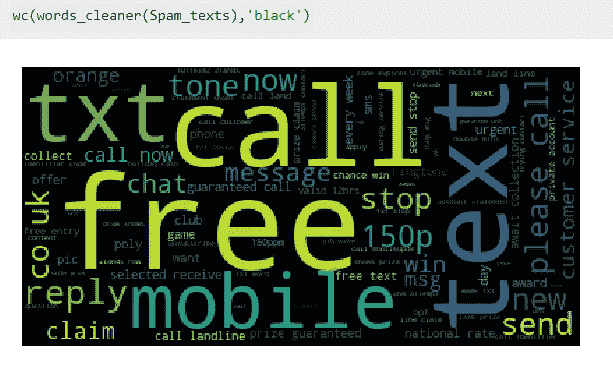

垃圾短信的词云

垃圾短信大多包含免费、通话、短信、手机、认领、立即通话等词语。

# 机器学习

**创建模型，将邮件分类为垃圾邮件或垃圾邮件。**

在创建分类器之前，我们需要清理我们的特征/独立变量，即(文本列)。为了清洁我们的功能，我们将遵循以下简单的程序:

*   删除每条短信中的所有标点符号
*   将文本消息转换为小写
*   将每封邮件拆分成单个单词
*   删除所有停用词
*   使用`PorterStemmer` 功能对单词进行词干处理。这包括将每个单词切割成其词根形式。例如，这些单词的词干:*【汽车，汽车，汽车的，汽车的】*是 ***汽车。*** *一词干为**loving，【爱，可爱的爱人】**为* ***Lov***
*   我们把清理过的单词连接成句子。

为了实现这一点，我们将创建一个函数，通过一次清理一条消息来循环遍历我们的数据，然后返回一个清理后的单词数组。

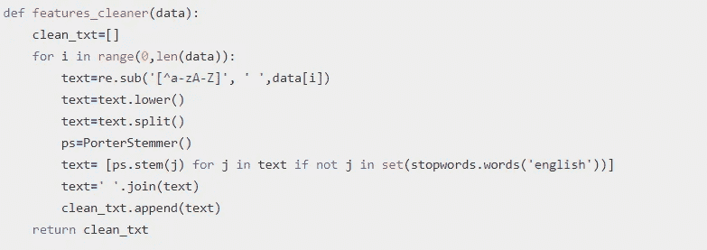

清理数据中所有要素的函数

查看数据集清理后的外观

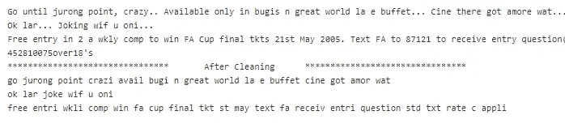

原始数据的前 3 条消息以及清理后的相同消息。

我觉得区别很明显！😊

## 训练模型。

我们将使用朴素贝叶斯分类器，它被证明在文本分类中提供统计上令人满意的结果，特别是[电子邮件过滤](https://en.wikipedia.org/wiki/Naive_Bayes_spam_filtering)。
下面是一小段特征准备([矢量化](https://scikit-learn.org/stable/modules/generated/sklearn.feature_extraction.text.CountVectorizer.html) `**CountVectorizer**`)和模型训练。

```
cv=CountVectorizer() 
X=cv.fit_transform(X)
X_train,X_test,y_train,y_test=train_test_split(X,y,
                                               test_size=0.25,
                                               random_state=50)
classifier=MultinomialNB() 
classifier.fit(X_train,y_train)
y_pred=classifier.predict(X_test)
```

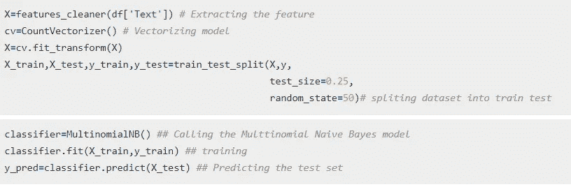

测试模型的准确性

```
accuracy_score(y_pred,y_test)
```

我们的模型有 97.77%的准确率。那是一次值得称赞的表演。
我们还可以生成一个[混淆矩阵](https://www.geeksforgeeks.org/confusion-matrix-machine-learning/)来放大模型的性能。领先的对角线值表示我们的模型正确预测的测试值。

```
confusion_matrix(y_test,y_pred)
```

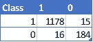

混淆矩阵

你可以在这里 **访问整个脚本 [**。**](https://github.com/pyPRO2019/Medium-Blogs/blob/master/NLP%20Intro.ipynb)**

# 建议

这个博客的灵感来自于我帮助设计的一个用户请求自动响应程序[](http://www.esquekenya.com/)****。*** 他们是学校管理和后勤解决方案的领先提供商 ***。*** 你可以在这里勾选[](http://www.esquekenya.com/)**。***

**如果你喜欢这个博客，别忘了👏🏼👏🏼👏🏼并继续努力。**

**注意安全！**