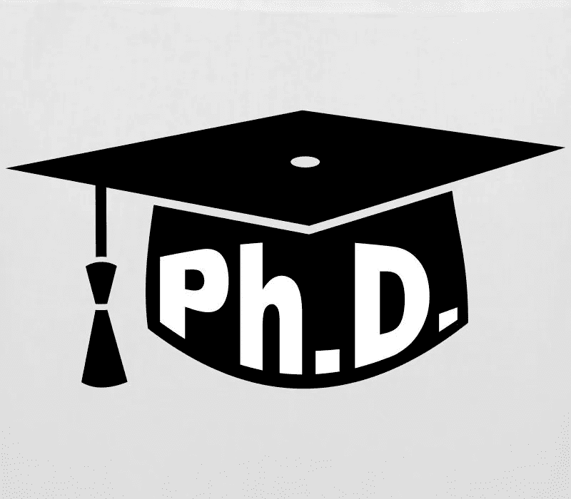
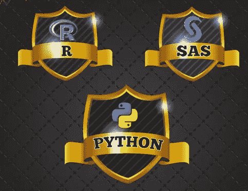
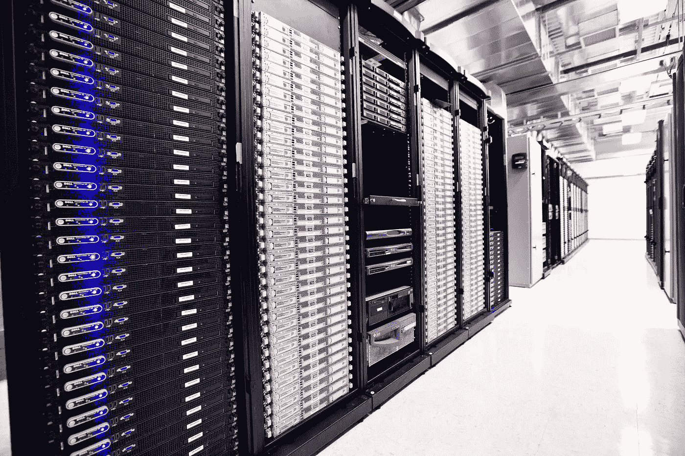
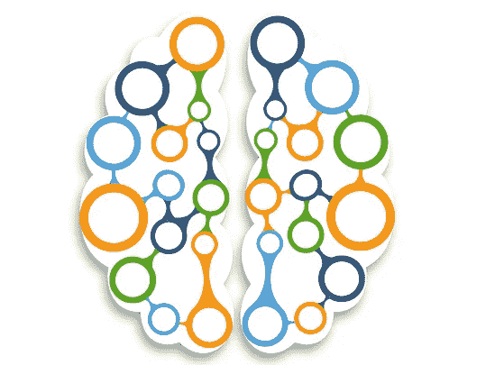
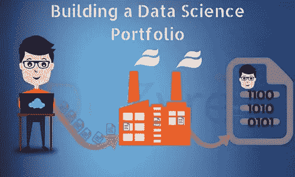

# 终结了。数据科学转型者需要避免的 11 个误区

> 原文：<https://medium.com/analytics-vidhya/11-myths-data-science-transitioners-should-avoid-2d118fe784ff?source=collection_archive---------0----------------------->

向数据科学的过渡是艰难的，甚至是可怕的！这并不是因为你需要学习数学、统计学和编码！你需要这样做，但你也需要战胜你从周围人那里听到的神话，并从中找到你自己的道路！

我自己也有这些“流行”的神话，它们让我的生活变得艰难。以下是我听到的几个例子:

> “你需要一个博士学位才有机会成为一名数据科学家。两个更好！”
> 
> “参加数据科学竞赛，这将告诉你这个行业是如何运作的。”
> 
> “你需要大量的计算资源来建立深度学习模型。你只能在顶尖的科技公司里找到这种感觉。”

我曾向自己承诺，一旦我看透了它们，我会通过揭穿这些神话来帮助别人。

有许多神话流传开来，给数据科学角色增添了一层虚假的光环。不要上他们的当！

这些神话经常让你觉得只有天才才能从事数据科学。这不是真的。**无论你是刚毕业的学生、有经验的专业人士还是领导者，了解数据科学的工作原理都很重要，这样你才能在行业中找到自己的位置。**

这篇文章是我对那些神话的报复！

我也做了一些聚类🙂并展示了三种类型的神话——与职业相关的神话、与工具和框架相关的神话以及与数据科学角色相关的神话。阅读他们，并确保你不会上当受骗！

*你也可以看看我的文章* [*业余数据科学家常犯的 13 个错误*](https://www.analyticsvidhya.com/blog/2018/07/13-common-mistakes-aspiring-fresher-data-scientists-make-how-to-avoid-them/) *。它充满了资源，所以你不想错过它！*

# 与职业相关的神话

# 1.成为数据科学家必须获得博士学位

拥有博士学位是一项了不起的成就。这需要多年的努力和奉献。我非常尊重那些愿意付出这么多努力的人。

但是为了成为一名数据科学家，读博士是必须的吗？这是一个严重依赖于角色的问题。这里有几层要剥离，所以让我们开始吧。

# 打破神话

为了理解这一点，让我们将数据科学家的角色大致分为两类:

*   应用数据科学角色
*   研究角色

理解这两种角色之间的区别很重要。应用数据科学主要是关于使用现有算法并理解它们如何工作。换句话说，就是在你的项目中应用这些技术。这个角色不需要博士学位。

大多数人都属于上述类别。你看到或听到的大多数职位空缺和工作描述都是针对这些角色的。

但是如果你对研究工作更感兴趣呢？是的，你可能需要一个博士学位，从零开始创造新的算法，研究它们，写科学论文等等。—这些符合博士候选人的心态。如果博士增加了你想工作的领域，也会有所帮助。例如，语言学博士学位将对 NLP 的职业生涯有极大的帮助。

博士的另一个被误解的方面是机会成本。这是你一方的巨大承诺——无论是精神上还是经济上。 [Rachel Thomas 在这里写了关于这个问题的文章](https://www.fast.ai/2018/08/27/grad-school/)，我建议你去看看。这是该领域一位主要研究者的平衡观点。

正如 Rachel 在她的帖子中提到的，有大量的数据科学先驱没有博士学位:

*   fast.ai 联合创始人杰瑞米·霍华德
*   广受欢迎的《应用人工智能》一书的作者姚
*   CrowdAI 的联合创始人 Devaki Raj

那么你认为自己会扮演什么角色呢？在进入数据科学之前，这是一个需要回答的关键问题。

# 2.全日制数据科学学位是实现这一转变的必要条件

很像博士的困境，这是我见过的另一个有抱负的数据科学专业人士陷入的神话。在过去几年中，数据科学引起了人们的极大兴趣，您将如何在竞争中脱颖而出？花钱获得学位似乎是一个很好的起点。这是可以理解的反应。

好消息是——这是一个主要由机构传播的神话。

# 打破神话

**在数据科学这样一个庞大而复杂的领域，实践经验才是王道。现在有很多项目你可以选择并着手去做。或者找到一个你热衷于解决的问题，看看数据科学技术是否可以在那里应用。**

网上有大量可供学习的资源。书籍、MOOCs、博客、视频等等。从[开始分析 Vidhya 的学习路径](https://trainings.analyticsvidhya.com/courses/course-v1:AnalyticsVidhya+LPDS2019+LPDS2019_T1/about)。它是完全免费的，本质上是全面的(包含前面提到的所有资源)，并围绕您的学习提供了一个结构——这是一个无价的特性。

**由于缺乏该领域的正规教育，过渡到数据科学归结为纯粹的艰苦工作、纪律和实践经验。这些是招聘经理会考虑的差异化因素。**

OpenAI 的联合创始人兼 Greg Brockman 连大学学历都没有！

# 3.你以前所有的工作经验都将转化到数据科学领域

你在某个行业有 5-10 年的丰富经验。你是一个受人尊敬的专业人士。但你最近迷上了数据科学以及它能为你的业务和职业带来的一切。你迫不及待地想把这些经验带到你的新领域。

听起来很熟悉？很好。但是如果你认为你的整个经历会转化为你的新角色，我建议你重新考虑。

# 打破神话

这个故事有两个方面:

*   你正在彻底改变你的领域，进入数据科学
*   你坚持你以前的领域，但正在寻找一个数据科学的角色

让我们来理解每一点的含义。

## 完全改变你的领域

如果你正在彻底改变你的领域(例如，在多年的软件测试后进入数据科学)，你的工作经验很可能毫无价值。你不仅要转换到一个全新的工作领域，还要寻找一个新的角色。当招聘人员看你的简历时，第一个想法是——“他/她会给组织/项目增加什么价值？”。不幸的是，这种情况下的答案通常接近于零。

为什么？因为作为一个新人，你对这个领域的运作没有任何经验。当您获得真实世界的数据时，如果您不了解这些特征如何影响最终决策，您将如何处理这些数据？

这是大多数人忽略或不愿面对的现实。这是一种完全错误的职业转换方式，最终只会损害你的前景。**了解情况，与做出这种转变的人交谈，并相应地调整你的期望。盲目地做出如此重大的决定注定会失败。**

## 停留在同一个域中

回到场景#2，如果你留在同一个领域，但转向数据科学，你应该期待什么？那么你的前景看起来会好很多。你有了解行业的额外优势。您应该已经意识到该领域中存在的细微差别，这样您就可以理解您正在处理的数据。这是一个巨大的好处。招聘经理会在最终决定中考虑这个因素。

如果可能的话，我强烈推荐第二种情况。留在你一直从事的领域，了解如何在那里应用数据科学。

[**Kunal Jain 的这篇文章**](https://www.analyticsvidhya.com/blog/2014/05/no-analytics-work-experience/) **包含了大量实用的技巧和诀窍，可以帮助你克服在这一领域缺乏经验的问题。**

# 4.需要有计算机科学/数学/统计/编程背景

这本质上是我们所涉及的前两个神话的延续。你在数据科学领域遇到的大多数人都有工程/计算机科学背景。他们至少在以下一个或多个领域有经验:

*   计算机科学
*   数学/定量分析
*   统计数字
*   编程；编排

这是否意味着来自完全不同背景的人不能进入数据科学领域？

# 打破神话

绝对不行！相信我，我是凭经验说话的。**在转入数据科学之前，我在学习和开发部门工作了 5 年。**可以做到。

然而，有些事情你需要考虑，来自这种背景的人已经有了。数据科学是一个包含几个方面的微妙领域。作为初学者，你需要从头开始学习概念。这通常会是一次令人沮丧的经历。你的技术同事可能知道更多。他们可能一开始在每个路口都领先于你。

这就是我们之前谈到的**奉献和纪律特征发挥作用的地方。**

例如，具有计算机科学背景的人已经掌握了编程是如何工作的。他们可以相对容易地在不同语言之间切换。另一方面，我最初在学习 r 时很困难。当谈到编码时，我不知道左右。但我坚持下来了，最终突破了。

没有任何迹象表明你不能这样做。一旦你决定这是你的领域，你应该全力以赴。还是怀疑？然后**看看这些鼓舞人心的故事，这些故事来自那些没有技术背景的人，他们成功地完成了转型:**

# 工具和框架相关的神话

# 5.学习一个工具就足以成为一名数据科学家

Python 和 R——你应该学习哪个工具？如果我每次遇到这个问题都能得到一便士..

人们普遍认为，掌握数据科学就是学习如何应用 Python 或 r .或任何其他工具中的技术。该工具已经成为所有其他数据科学功能的中心点。

假设(或神话)是能够使用现有的库(numpy、scikit-learn、caret 等)编写代码。)应该足以给自己贴上专家的标签了。为什么工作邀请还没有到来？

这真的会让招聘经理抓狂。

# 打破神话

数据科学需要多种技能的结合。**编程不是数据科学领域的中心，它只是整体的一部分。**让我们将技能分为两部分:

*   技术素质
*   非技术素质或软技能

## 技术素质

了解某种技术的工作原理将有助于你成为更好的数据科学家。这也是我们鼓励大家从零开始学习算法的原因。了解更改某个参数将如何影响最终模型。当你在业内从事大型项目时，这最终会有回报。

当利益相关者介入时，错误和试验的余地很小。我们的博客上有大量的文章从头开始解释机器学习和深度学习技术。仔细阅读它们，并尝试自己理解和复制代码。

这将是你技能的无价之宝。

## 软技能

有抱负的数据科学家经常会忽略软技能。他们当然不会在任何在线课程或离线课堂上被教授。然而，这些都是面试官寻找的品质。

*   解决问题的技巧
*   结构化思维
*   通讯技能

你如何学会这些技能？！通过遵循严格的方法，抓住每一个机会练习。这里有一些资源供您参考:

# 6.深度学习需要只有顶级公司才有的计算能力

深度学习似乎比我遇到的任何其他数据科学分支都传播更多的神话，包括:

*   DL 是机器学习的另一种说法
*   你需要有研究背景才能开始深度学习
*   深度学习没有太多实际应用

但是我听到的最常见的神话是——你需要相当数量的硬件来执行深度学习任务。当我第一次听说深度学习时，我想象着一屋子的 IBM 超级计算机由几十名数据科学家操作。

# 打破神话

不要误解我的意思，当深度学习模型有一个强大的硬件设置运行时，它总是会更有效地执行。但是你不需要一台超级计算机来进行深度学习。在您的机器上训练模型可能需要比预期更长的时间。

如果您正在处理的数据非常庞大，该怎么办？在本地运行它可能不起作用。谷歌一如既往地给出了答案。 [**Google Colab**](https://colab.research.google.com/) **是一个免费的云服务，可以兼作编码笔记本。但最棒的是——Colab 附带免费的 GPU 支持！**

没错，你可以免费利用 GPU 的能力，在那里运行你的深度学习模型。Colab 通过你的网络浏览器运行，所以你的机器没有计算成本。深度学习爱好者还能要求什么？

这里有几个资源可以让你了解大多数人不会教的深度学习的各个方面:

# 7.一旦建成，人工智能系统将继续自我进化和推广

好莱坞尽最大努力以拥有人类水平智能的机器人的形式展示人工智能系统。正是因为这个原因，像《银翼杀手》和《终结者》这样的电影成为了狂热的经典。他们描绘的共识是，一旦一个人工智能系统被建立起来，它将继续自己工作和进化。

因此，一旦你建立了一个模型，比如说，欺诈检测，该模型将适应任何变化。如果整个金融格局发生了变化，或者数据中添加了新的功能，预计该系统将继续正常运行。

# 打破神话

人工智能系统自行进化的这种状态被称为人工通用智能(AGI)。不幸的是，我们还没有达到那种状态。差远了。

我们现在处于非常狭窄的阶段。我们建立的模型不能推广到其他任务，甚至不能推广到数据的大变化。让我们以去年的 GDPR 政策为例。如果没有人工干预，现有系统能适应这些变化吗？我们构建的系统是否足够聪明，能够包含伦理方面的内容？一个为向客户推荐产品而构建的人工智能系统，能在没有任何事先信息的情况下集成一个新产品吗？

这就是为什么在物体检测问题中标记图像是如此重要的任务。这种智能水平对机器来说还不存在。

是的，DeepMind 和其他类似的高水平研究机构在这方面肯定是有进步的。你可能听说过神经网络创造自己的神经网络的新闻。但是这些发展太少了。我们还没有想出如何让它们进入商业应用。

我强烈推荐看下面迈克尔·B·乔丹关于人工智能现状和我们面临的挑战的视频。如果你能在面试中提出来，这是一个很好的参考点。🙂

# 数据科学与角色相关的神话

# 8.人工智能工作的世界

当你想到完美的人工智能团队时，你会想到什么？我听到的最常见的回答是尽可能多的找顶尖的数据科学家。谁会不喜欢一群顶尖人才在同一个项目上工作呢？

但对我们大多数人来说，这并不是一个切实可行的解决方案。一个“独角兽”数据科学家很难找到，更不用说大量的数据科学家了。你的数据科学家团队会意识到项目的非人工智能部分吗？他们了解硬件的工作原理吗？

简而言之——一个人工智能项目有一系列与之相关的工作。它不仅仅局限于数据科学家的角色。

# 打破神话

应用人工智能是一个复杂的领域。它需要在项目的长度和宽度上与不同的学科合作。存在过多的跨学科角色:

*   数据工程师
*   数据分析师
*   人工智能/人工智能工程师
*   数据科学家
*   统计员
*   商业分析员
*   领域专家(例如，自动驾驶汽车项目将有机械工程师和汽车硬件专家)
*   物联网专家
*   数据科学经理/决策者
*   决策科学家
*   研究员
*   软件工程师
*   UX 设计师
*   项目管理人

请注意，工作人员的角色和数量将因项目而异。我想表达的观点是，人工智能不是一个枯燥无味的领域。这不是一条直截了当的路。如果有人试图向你推销一个只有数据科学家的项目，那可能是时候敲响警钟了。

这对于担任高级职位的人(团队领导、经理、cxo 等)尤其重要。).为了创建一个成功的项目，理解每个角色是非常重要的。

我推荐参加下面的课程来完全掌握一个人工智能项目是如何工作的。这包括如何雇佣完美的人工智能团队，以及每个人工智能领导者(甚至是爱好者)都应该知道的其他错综复杂的细节:

*   [商业用人工智能和机器学习](https://www.udemy.com/artificial-intelligence-machine-learning-business/learn/v4/overview)

你还可以阅读[随着人工智能的不断发展，可能会受到影响的工作](https://www.analyticsvidhya.com/blog/2018/11/4-secrets-for-a-future-ready-career-in-data-science/)。

# 9.数据科学仅仅是建立预测模型

能够预测一个事件是一件非常强大的事情。这也是数据科学新手的突出之处。构建可以预测客户下一步将购买什么的模型听起来像是一项必备技能，对吗？

事实上，当我向一个非技术人员描述数据科学或机器学习时，他们的第一反应是相当相似的。围绕这个领域的炒作是前所未有的。显然，一个数据科学家在工作中整天都在构建预测模型。

当 DJ Patil 将数据科学家的角色描述为“21 世纪最性感的工作”时，他不就是这个意思吗？不完全是。

# 打破神话

数据科学项目有多个层次。模型构建部分只是整个数据科学生命周期中的一小部分(我将在下一节介绍数据科学中的不同角色)。为了让您有一个大致的概念，典型的数据科学生命周期包括以下步骤:

*   理解问题陈述
*   假设构建
*   数据收集
*   验证数据
*   数据清理
*   探索性分析
*   设计模型
*   测试/验证模型
*   如果发现错误，返回到验证或清理阶段
*   将其投入生产(部署模型)

没有什么事情像他们在教室或课程里教你的那样简单。体验是了解一个项目如何运作的最佳方式。尝试与目睹了端到端流程的人交谈。更好的是，获得实习机会，获得数据科学项目成功的第一手资料。

此外，数据科学不仅限于简单的预测。我相信你已经了解了市场篮子分析的概念。它是聚类技术和关联规则的结合。或者异常检测怎么样？找出数据中异常值的能力。要学的东西太多了！

# 10.参加数据科学竞赛转化为现实生活中的项目

数据科学竞赛是您在数据科学之旅中的绝佳敲门砖。你可以在数据集上练习你的技能，向世界展示，甚至有机会赢得奖品。

随着越来越多的人想要在数据科学这块蛋糕上分一杯羹，这些黑客马拉松和竞赛在过去的 4-5 年里增长了数倍。大多数有抱负的数据科学专业人士都会在简历中包括这些比赛。

从面试的角度来看这个问题？招聘人员已经开始越来越不关注你投资组合的这个方面。

# 打破神话

招聘人员不考虑你的竞争经历有很多原因。我会把它归结为一个:

与你在竞赛中看到的相比，现实世界的项目是完全不同的。

数据科学竞赛有干净的几乎一尘不染的数据集。如果有缺失值，您可以使用多种技术来估算它们。重要的是你的模型的准确性，而不是你到达那里的方式。

现实世界的项目有端到端的管道，需要和一群人一起工作。我们大多数人将永远不得不处理杂乱无章的数据。俗话说，花 70-80%的时间收集和清理数据是正确的。像数据清理和特征工程这样的任务会占用你大部分的时间。

这篇 [LinkedIn 帖子](https://www.linkedin.com/pulse/standard-methodology-analytical-models-olav-laudy/?trk=prof-post)是一篇关于人们可以用于分析模型的标准方法论的优秀读物。您也可以参考上一节，我们谈到了典型数据科学项目涉及的不同阶段。

此外，我们不能只建立一个堆叠的复杂集合模型。客户要求透明，所以简单的模型通常会胜出。可解释性是企业环境中的关键。该项目对模型表现不佳负有责任。

正如我在本文[中提到的，](https://www.analyticsvidhya.com/blog/2018/07/13-common-mistakes-aspiring-fresher-data-scientists-make-how-to-avoid-them/) **在竞赛排行榜上取得好成绩对于衡量你的学习进度来说是极好的，但面试官会想知道你如何优化你的算法以产生影响，而不是为了增加准确性。**与数据科学专家交谈，尝试了解这些项目是如何工作的，在您选择的领域建立您的网络，并尝试组织您的想法以进行相应调整。

# 11.数据收集是一件轻而易举的事，重点应该是建立模型

我们将用另一个关于构建模型的神话来结束这篇文章。这是我最近与一位新来的数据科学家的对话:

> ***Pranav Dar:*** *除了设计模型，你最喜欢数据科学角色的哪一部分？*
> 
> ***更新鲜的 DS:*** *我喜欢特色工程部分。*
> 
> ***PD:*** *听起来很公平。你通常如何为你的项目收集数据？*
> 
> ***更新鲜的 DS:*** *嗯，我一般从其中一个开源平台下载就行了。*
> 
> ***PD:*** *OK..但是如果数据有偏差呢？如何验证数据的身份？当您被要求从需要数据库技能的多个来源收集数据时，您会怎么做？*
> 
> ***更新鲜的 DS:*** *我没想过这个..*

不幸的是，这是我经常谈论的话题。大多数有经验的数据科学专业人员也很清楚这种情况。期待在面试中彻底测试这个问题。

# 打破神话

数据正以前所未有的速度生成，但收集和清理数据并不容易。没有建立收集数据的管道，你的数据科学项目将一事无成。通常，这是数据工程师的角色(但是数据科学家也应该知道这个功能)。

我不能夸大数据收集步骤的重要性。收集真实准确的数据对于最终模型的良好运行是必不可少的。正如维基百科所言，“所有数据收集的目标是获取高质量的证据，通过分析得出令人信服和可信的答案”。

可用的数据来源太多了。你是如何联系到每个人的？你从每个人那里得到什么样的数据格式？从这些来源收集数据的成本是多少？这是你在现实生活中需要问的问题的一个缩影。

像数据库经理、数据库架构师和数据工程师这样的角色已经有了新的重要性。维护数据和上述管道的完整性与后续的任何其他任务一样重要。

# 结束注释

我最初计划把它做成一小段。但是破除这些错误观念的重要性高于一切。有更多的神话像影子一样跟随着数据科学。

我很想听听你对这篇文章的想法，以及你是否遇到过其他的神话(或者你自己相信过)。让我们为新一波数据科学专业人士提供资源，以克服我们所犯的错误！

*原载于 2019 年 1 月 29 日*[*【www.analyticsvidhya.com】*](https://www.analyticsvidhya.com/blog/2019/01/myths-data-science-transition/)*。*