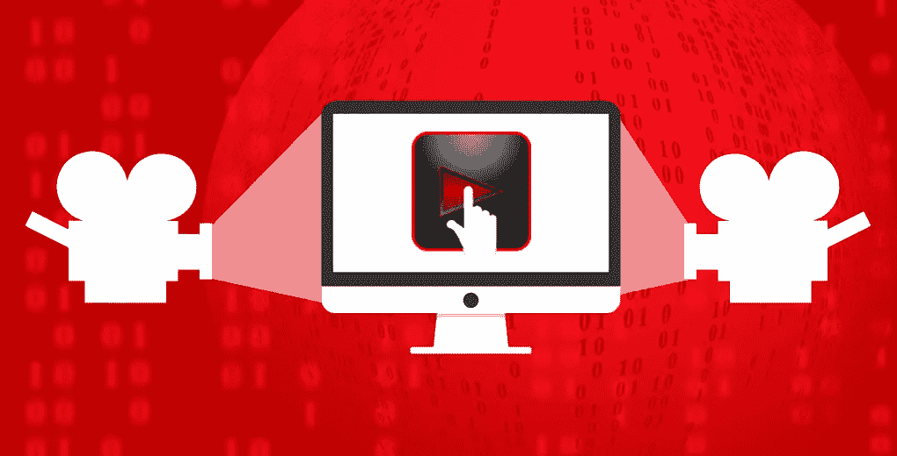

# 每个数据科学家都必须观看的 11 个精彩的数据科学视频

> 原文：<https://medium.com/analytics-vidhya/11-superb-data-science-videos-every-data-scientist-must-watch-2ef092d39cb2?source=collection_archive---------2----------------------->

# 概观

*   展示 11 个数据科学视频，增强和扩展您当前的技能
*   我们将这些视频分为三个领域——自然语言处理(NLP)、生成模型和强化学习
*   了解这些视频中的概念如何工作，并构建您自己的数据科学项目！

# 介绍

我喜欢通过视频学习和理解[数据科学](https://courses.analyticsvidhya.com/courses/applied-machine-learning-beginner-to-professional?utm_source=blog&utm_medium=11-data-science-videos-every-data-scientist-must-know)概念。我根本没有时间翻阅书籍和文本来理解不同的观点和主题。相反，我通过视频更好地了解概念，然后挑选我想了解更多的主题。

像 YouTube 这样的平台上提供的话题的绝对质量和多样性从未停止令人惊讶。我最近从一个视频中了解到了令人惊叹的用于 NLP 的 XLNet 框架(我在下面提到过，供您参考)。这帮助我理解了这个概念，这样我就可以探索更多关于 XLNet 的东西了！

我坚信当我们学习任何概念或主题时，结构是非常必要的。我每次写文章都遵循这种方法。这就是为什么我将这些视频分为各自的领域，主要是自然语言处理(NLP)，生成模型和强化学习。

那么，你准备好通过这些迷人的视频深入探索数据科学的长度和广度了吗？

# 事不宜迟，这里有 11 个非常棒的数据科学视频:

## 自然语言处理

*   XLNet 解释道
*   Google Duplex 是如何工作的？
*   谷歌的诗歌特质:艺术与人工智能的结合

## 生成模型

*   深入可变自动编码器！
*   从音频创建面部动画
*   穆塞内学会了创作莫札特、邦·乔维等作品

## 强化学习

*   教计算机开车
*   了解 AlphaGo Zero 的工作原理
*   谷歌 DeepMind AI 学会走路
*   AI 学会玩 2048

## 奖金

*   Adobe 开发人工智能来检测 ps 过的人脸

# 自然语言处理

点击这里，查看分析 Vidhya 在 NLP [上的精彩课程。](https://courses.analyticsvidhya.com/courses/natural-language-processing-nlp?utm_source=blog&utm_medium=11-data-science-videos-every-data-scientist-must-know)

## XLNet 解释道

XLNet 是目前 NLP 中最热门的框架。如果你想在这个领域开创事业，你只需*必须*意识到它是什么以及它是如何运作的。最近偶然看到这个视频，想尽快分享给社区。

XLNet 是最新的 NLP 框架。它在 20 个 NLP 任务上超过了谷歌的 BERT，并在其中 18 个任务上取得了最先进的结果。非常非常令人印象深刻。

**请务必在这里** **查看我们关于 XLNet 及其强大功能的文章** [**。**](https://www.analyticsvidhya.com/blog/2019/07/6-powerful-open-source-machine-learning-github-repositories-data-scientists/?utm_source=blog&utm_medium=11-data-science-videos-every-data-scientist-must-know)

下面的视频清晰地解释了最初的 XLNet 研究论文。*注意:你可能需要事先了解一些* [*NLP 概念*](https://www.analyticsvidhya.com/blog/2019/06/understanding-transformers-nlp-state-of-the-art-models/?utm_source=blog&utm_medium=11-data-science-videos-every-data-scientist-must-know) *才能真正掌握 XLNet 的内部工作原理。*

## Google Duplex 是如何工作的？

还记得桑德尔·皮帅在 Google I/O 2018 的主题演讲中推出 Google Duplex 时，让全世界为之疯狂的场景吗？我记得我完全敬畏地听着人工智能发出的超现实的叫声。

数据科学和 NLP 社区花了一些时间来解释 Google Duplex 实际上是如何工作的。它非常强大，有可能改变我们与机器的交互方式。

所以百万美元的问题——谷歌双工通过图灵测试了吗！？你看完这个视频后决定:

## 谷歌的诗歌特质:艺术与人工智能的结合

我是一名艺术家，任何艺术形式与人工智能相结合的前景都非常诱人。在一个对人工智能充满恐惧的世界里，这样的应用非常受欢迎。

谷歌的 POEMPORTRAITS AI 已经使用 NLP 技术对 19 世纪的诗歌进行了训练。你可以贡献一个词来创造你自己的诗歌。看看这个令人惊叹的概念是如何运作的:

# 生成模型

## 深入可变自动编码器！

这是我们最喜欢的强化学习专家之一史云光·斯特兰布鲁格，来自他精彩的 ArxivInsights 频道。

[变分自动编码器(VAEs)](https://www.analyticsvidhya.com/blog/2018/05/essentials-of-deep-learning-trudging-into-unsupervised-deep-learning/?utm_source=blog&utm_medium=11-data-science-videos-every-data-scientist-must-know) 是具有不同应用的强大的生成模型。你可以生成人脸或者合成你自己的音乐，或者使用 VAEs 去除图像中的噪音。

我很喜欢这个视频。史云光首先介绍了基本的自动编码器，然后进入 VAEs 和解开 beta-VAEs。相当专业，但解释得漂亮而简洁，是典型的史云光风格。

*史云光将重返今年的* [*DataHack 峰会*](https://www.analyticsvidhya.com/datahack-summit-2019/?utm_source=blog&utm_medium=11-data-science-videos-every-data-scientist-must-know) *这样你就可以听到他的消息并见到他本人了！*

## 从音频创建面部动画

当我看到标题时，我立即被视频吸引住了。这是最好的生成模型！您不仅可以从音频中生成面部动画，还可以为同一音频生成不同的情感。面部表情看起来非常自然。

如果你没有遵循两分钟的文件，你就错过了。他们定期制作视频，以通俗易懂的方式介绍最新进展。这是一个频道的瑰宝。

## 穆塞内学会了创作莫札特、邦·乔维等作品

两分钟文件档案的另一个条目。

OpenAI 的 MuseNet 是一个深度神经网络，可以用不同的乐器生成音乐作品，并结合不同的风格。它使用与 GPT-2 相同的通用无监督技术，结果令人惊讶。

没听说过 GPT 2 号吗？这是一个与 XLNet 不相上下的 NLP 框架。点击此处查看 MuseNet 的工作方式:

# 强化学习

## 教计算机开车

自动驾驶汽车一直让我着迷。自动驾驶汽车项目的庞大规模令人震惊。无论是硬件方面还是数据科学方面，都有如此多的组件需要协调，才能使项目正常运行。

这是一个完美的视频，让初学者了解遗传编程和强化学习，以及如何使用它们来创建强大的应用程序。西蒙的个性让我着迷，直到最后一刻。

我绝对会独自尝试这个项目。

## 了解谷歌 DeepMind 的 AlphaGo Zero 是如何工作的

史云光的另一个伟大的视频。他解释了谷歌 DeepMind 关于 AlphaGo Zero 的热门论文。

AlphaGo Zero 是全面击败人类冠军 Lee Sedol 的原始 AlphaGo 程序的新版本。在继续学习 AlphaGo Zero 之前，我建议阅读我们关于[蒙特卡罗树搜索](https://www.analyticsvidhya.com/blog/2019/01/monte-carlo-tree-search-introduction-algorithm-deepmind-alphago/?utm_source=blog&utm_medium=11-data-science-videos-every-data-scientist-must-know)的文章，这是 AlphaGo 背后的算法。

AlphaGo Zero 使用强化学习击败世界领先的围棋选手，而不使用人类游戏的数据。

> *“AlphaGo Zero 通过 100 局 0 胜，三天超越 AlphaGo Lee 的实力，21 天达到 alpha go 大师的水平，40 天超过所有老版本。”*
> 
> *来源:* [*百科*](https://en.wikipedia.org/wiki/AlphaGo_Zero)

## 谷歌 DeepMind 的人工智能学会走路

这个视频既搞笑又有知识性。正是我学习新事物时喜欢的视频类型！看着人工智能学会走路很有趣。但与此同时，它让我惊叹于强化学习的力量。

该视频讨论了 3 篇论文，试图解释人工智能是如何学会走路的，并且理解起来非常简单。

## AI 学会玩 2048

你玩过 2048 游戏吗？一旦你掌握了窍门，就会超级上瘾。我以前很容易就能完成游戏，但现在不会了。作为一名数据科学爱好者，我打算在这个精彩视频的帮助下训练我的电脑玩这个游戏。

这是使用遗传编程和进化算法的另一个例子。

# 额外收获:Adobe 开发人工智能来检测 ps 过的人脸

Adobe 是图像和视频处理软件的市场领导者。其他公司也尝试过，但没有几家能接近 Adobe 的水平。

上个月，Adobe 宣布了检测篡改图像的研究成果。早该有人这么做了！鉴于 GANs 占领世界的速度之快，很快就不可能辨别真假了。

想象一下，唐纳德·特朗普向金正恩发起核战争挑战，然后声称这是一场彻头彻尾的骗局，并推卸所有责任！我们需要避免这些情况变成现实。这段视频展示了 Adobe 的算法是如何工作的，并试图打击假图像:

# 结束注释

我喜欢了解数据科学、机器学习和人工智能的最新研究。但是我发现看报纸很难。这需要大量的时间和精力，而不是每个数据科学专业人员都有的。我相信你们很多人都有同样的问题。观看视频是了解这些概念的理想方式。

然后，你可以挑选你感兴趣的地方，并尝试在此基础上展开一个项目或发表一篇博客文章。相信我，这是学习和吸收新的数据科学概念的好方法。

您最喜欢的数据科学频道或视频有哪些？下面评论里讨论一下吧。

*原载于 2019 年 7 月 4 日*[*https://www.analyticsvidhya.com*](https://www.analyticsvidhya.com/blog/2019/07/11-data-science-videos-every-data-scientist-must-watch/)*。*