# 数据科学面试中最常见的 12 个概率和统计问题

> 原文：<https://medium.com/analytics-vidhya/12-most-common-proabability-and-statistics-questions-for-data-science-interview-part-1-c2a64fd32363?source=collection_archive---------3----------------------->

下面是概率统计最常见的数据科学面试问题。

## 问题 1-关于任何分布，均值和标准差告诉你什么？

Ans- Mean 告诉我们关于分布的中心值，或者分布的中心值在哪里，标准差告诉你关于分布的扩散。

## 问题 2-什么是峰度和偏度？

Ans- Skewness 是对不对称性的度量，也可以定义为分布与正态分布的不同程度。

向右倾斜——这仅仅意味着离群值在右边。这里指的是>中值>模式

**左偏斜——这仅仅意味着离群值在左边。这里模式>中值>表示**

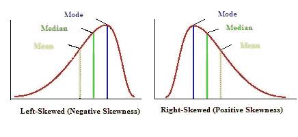

## 峰度——它被定义为分布的尾部与正态分布的尾部有多不同。

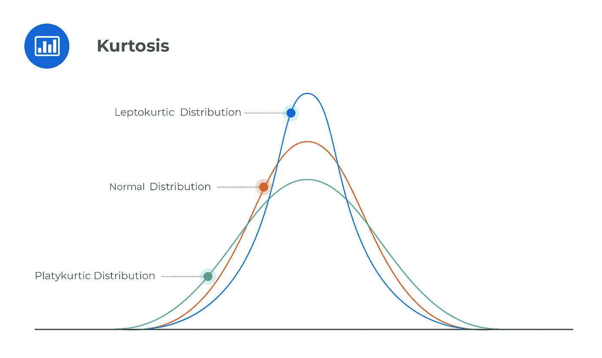

# 问题 3-如何做标准正态变量(z)和标准化？

让我们看看什么是 z，假设 z 是一个均值为 0，标准差为 1 的高斯分布随机变量。

现在，假设我们有一个高斯分布的随机变量 X，它有均值(u)和标准差(sd)，现在我们知道 X 可以取不同的值，所以假设 X 可以取(x1，x2，x3，x4，x5)

现在如果我们从 X 的每个观测值中减去均值(u)并除以 sd，我们将得到 z。

## 但是我们为什么要标准化呢？

我们进行这种标准化的主要原因是，当我们进行标准化时，我们知道 68%的数据都是假的。-2 对 2，85%的数据都是谎言。

我们知道 z 的一些性质，所以转换成标准的正态分布总是好的。

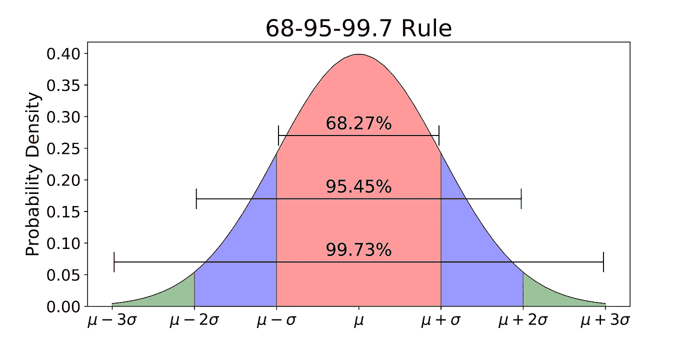

# 问题 4-什么是核密度估计？

这是平滑直方图到概率密度函数的过程。

从上图中我们可以看到，直方图被转换为密度函数，那么我们怎么做呢，在直方图的每一个点，比如说“5 ”,我们建立一个高斯核(见密度函数中的红线),取 5 作为平均值，我们将在直方图的每一个点重复这个过程，最后我们只是把出现在一个点的所有值相加，例如，在“5”有 3 个高斯核，我们将把这些核的值相加得到 pdf。

那么每个高斯核的标准差呢(我们已经固定了均值)，这里标准差也称为带宽。

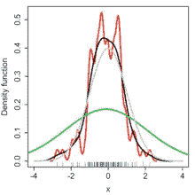

因此，如果我们使带宽过小，它将显示为上面的红线，如果我们使带宽过大，它将非常平坦，就像上面的绿色线，如果我们使它正常，它将看起来像黑色。

# 问题 5-采样定理和中心极限定理的重要性？

Ans-

## 抽样定理

它只是说，假设 X 是任意随机分布，不一定是高斯分布，假设我们取大小为 n 的随机样本，假设我们取 30，我们称之为(s1)，我们再取一个大小为 n 的随机样本，我们称之为(s2)，假设我们这样取 m 个样本，那么最后一个样本就是(sm)

如果我们要取所有样本的平均值，比如 s1 样本，x1 '是平均值，s2 样本，x2 '是平均值，依此类推。

x1 '，x2 '，x3'…。xm '(所有样本的平均值)

## xi 分布称为抽样均值的抽样分布。

假设有一个随机变量，其总体均值为μ，总体标准差为σ。如果选取大小为 *n* 的样本，则样本均值 x 的均值为μx =μ，标准差为σx =σ/平方根(n)。x 的标准差更低，因为通过取平均值，你平均出了极值，这使得原始随机变量的分布展开。

这一点我们将在中心极限定理中用到。

## 中心极限定理

**定理陈述——假设一个具有有限均值和标准差的随机变量 X(总体分布)形成任何分布。如果取一个大小为 *n* 的样本，那么样本平均值 x 随着 *n* 的增加而变成正态分布。**

让我们取一个随机变量 X(总体分布) ,它具有有限的平均值和标准偏差(帕累托分布具有无限的平均值和标准偏差),我们取大小为 n 的 m 个样本，比方说

s1、s2、s3…sm，然后我们取所有样本 x1′、x2′、x3′…的平均值..xm '，中心极限定理表示，如果我们绘制这些平均值的分布，它将趋于形成平均值等于人口分布的正态分布，方差将为(人口方差/n)。

**假设 m=1000，n=30，那么只需查看 30k 个数据点，我们就能够估计总体均值和总体方差，这是最基本的定理。**

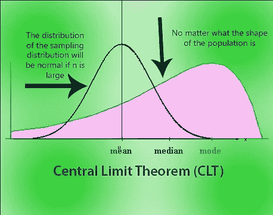

# 问题 6-Q-Q 情节的重要性？

Ans 6-有各种各样的东西来检查你的分布是否高斯，两个最常用的技术是

1.  Q-Q 图(分位数图)
2.  KS 测试(我们稍后会看到)

## 那么我们如何绘制 Q-Q 图呢？

假设我们有一个随机变量 X，我们从中取出 500 个观察值，比如 x1，x2…..x500。

这里我们不知道 X 的分布，在 QQ 图的末尾我们应该知道它是否正态分布。

要遵循的步骤

# 1.按升序排列 xi，并找出百分位数

(如果你不知道如何找到百分位数，或者什么是百分位数，假设我有 100 个值，我把它们按升序排列。

X={x1，x2，x3…x100 }，这里 x1

In this set, lets say i am ranking each value from 1 to 100 so first value will get rank 1 and the last value will get rank 100.

I can say that below the value of x10 or below the value of 10th rank or 10th percentile, ***10%的值位于*** 和 X10 以上或第 10 百分位以上， **90%的值位于。**

这就是百分位数的含义。

所以我们将得到最初 500 个样本的 100%的值

x5，x10，x15，…. x500 {这些是百分位值}

**x5 是只有 1%的值位于其下的值(因为这里的样本大小是 500 而不是 100)**

**x10 是只有 2%的值位于其下的值**

**x25 是只有 5%的值位于其下的值**

# 2.第二步是创建一个随机变量 Y，它具有正态分布，均值=0，标准差=1。

我们将再次选取 500 个观察值，对它们进行分类并找出它们百分位数

假设我们有 y1，y2，y3…y100(和我们最初的分布 X 一样)

让我提醒你，我们不知道 X 的分布是什么，这就是为什么我们使用 Q-Q 检验来确定 X 的分布是否是高斯/正态分布。

# 3.第三步是在 X 和 Y 之间绘制 QQ 图

所以我们有{x1，y1}，{x2，y2}，{x3，y3}……{x100，y100}

我们将绘图，如果所有点都在同一条线上，这意味着 X 是正态分布的，但不需要均值= 0 和标准差=1。

如果所有点不在同一条直线上，就意味着 X 不是正态分布的。

在下图中，点最终偏离，这意味着样本分位数不是正态分布的。

如果观察数量很少，很难解释 QQ 图。

*Q-Q 图也用于通过同样的方法检验两个随机变量 X 和 Y 是否具有相同的分布。*

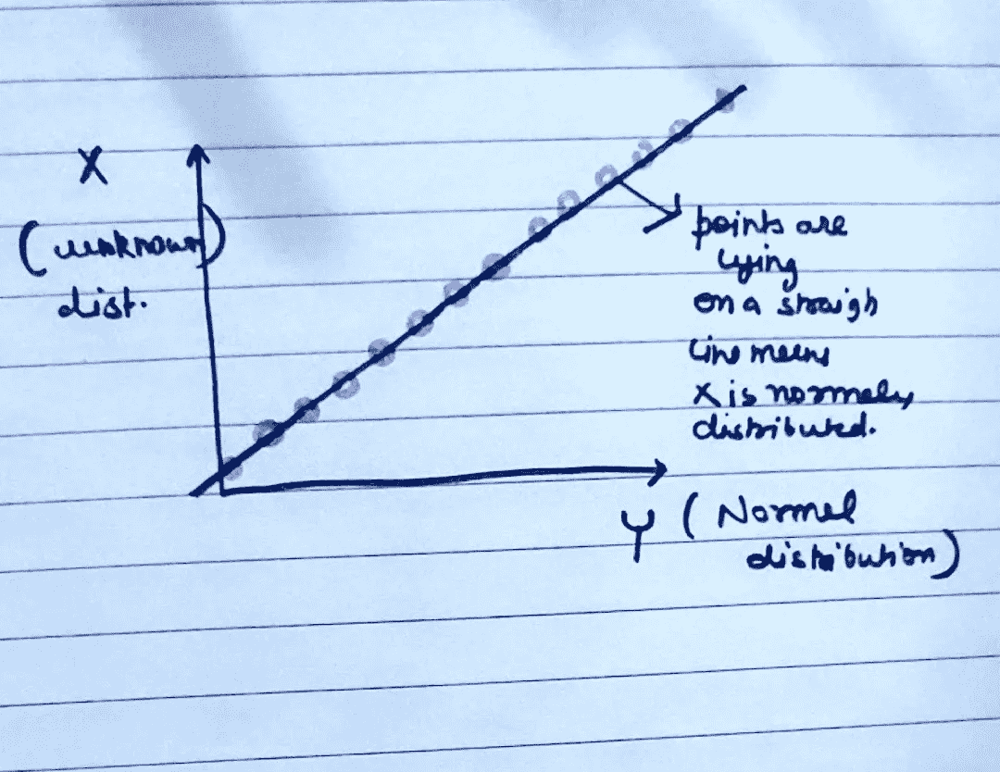

## 密码

***导入 scipy.stats 为 stats***

***导入 numpy 为 np***

***进口 pylab***

***stats . proplot(Y，dist= 'norm '，plot=pylab)***

***pylab.show***

## 问题 7-什么是均匀分布？

Ans-7 统计学中的一种概率分布，其中所有结果的可能性相等。一副[牌](https://www.investopedia.com/terms/d/deck.asp)有均匀的分布，因为抽到一颗心、一根梅花、一颗钻石或一张黑桃的可能性是相等的。一枚硬币也是均匀分布的，因为在掷硬币时，正面或反面的概率是相同的。

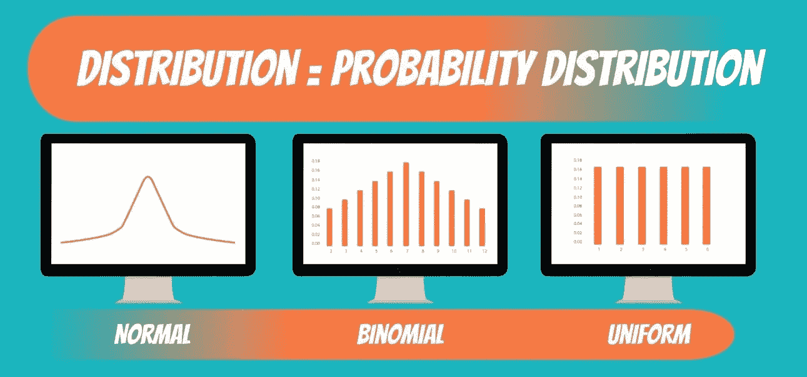

## 问题 8-什么是离散和连续均匀分布？

Ans 8-

1.  分离的

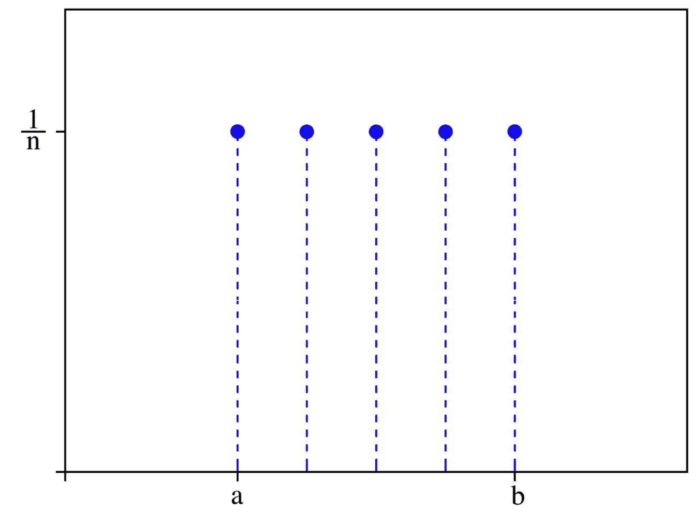

2.连续的

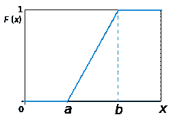

## 问题 9-如何随机抽样数据点？

ans 9-简单随机抽样是用于定量社会科学研究和一般科学研究*的[抽样方法](https://www.thoughtco.com/sampling-designs-used-in-sociology-3026562)中最基本和最常见的类型。*简单随机抽样的主要好处是，人口中的每个成员都有平等的机会被选中参加研究。这意味着它保证所选择的样本具有总体的代表性，并且样本是以无偏的方式选择的。反过来，从样本分析中得出的统计结论将[有效](https://www.thoughtco.com/validity-definition-3026737)。​

创建一个简单的随机样本有多种方法。这些方法包括抽签法、使用随机数表、使用计算机以及有或没有替换的抽样。

# 抽样的抽签方法

创建一个简单随机样本的抽奖方法听起来就像它一样。研究人员随机挑选数字，每个数字对应一个主题或项目，以创建样本。为了以这种方式创建一个样本，研究人员必须确保在选择样本总体之前，这些数字是充分混合的。

# 补替抽样法

[替换抽样](https://www.thoughtco.com/sampling-with-or-without-replacement-3126563)是一种随机抽样的方法，在这种方法中，可以不止一次地选择群体的成员或项目，将其包含在样本中。假设我们有 100 个名字写在一张纸上。所有这些纸片都被放入一个碗里并混合在一起。研究人员从碗里挑选一个名字，记录信息以将该人包括在样本中，然后将名字放回碗里，混淆这些名字，并选择另一张纸。刚刚被抽样的人有同样的机会再次被选中。这就是所谓的置换取样。

# 不重复抽样

无替换抽样是一种随机抽样方法，在这种方法中，总体中的成员或项目只能被选择一次以包含在样本中。使用上面的同一个例子，假设我们把 100 张纸放在一个碗里，混合它们，并随机选择一个名字包含在样本中。然而，这一次，我们记录信息以将那个人包括在样本中，然后将那张纸放在一边，而不是放回碗里。在这里，群体中的每个元素只能选择一次。

## 问题 10-解释伯努利和二项分布？

Ans 10-

**伯努利分布** -当你有两个结果，得到一个结果的概率是 p，得到另一个结果的概率是 1-p 时，使用这种分布。这种分布是离散分布。

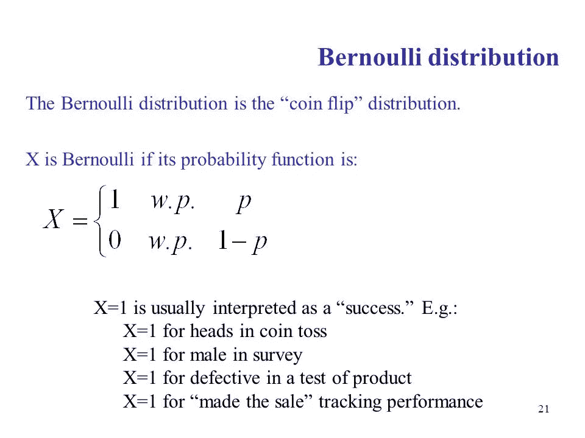

**二项式分布-****二项式分布**可以简单地认为是重复多次的实验或调查中成功或失败结果的概率。二项式是一种分布类型，它有**两种可能的结果**(前缀“bi”表示两个或两次)。例如，掷硬币只有两种可能的结果:正面或反面，而参加测试可能有两种可能的结果:通过或失败。

*   二项式公式中的第一个变量 n 代表实验运行的次数。
*   第二个变量 p 代表一个特定结果的概率。

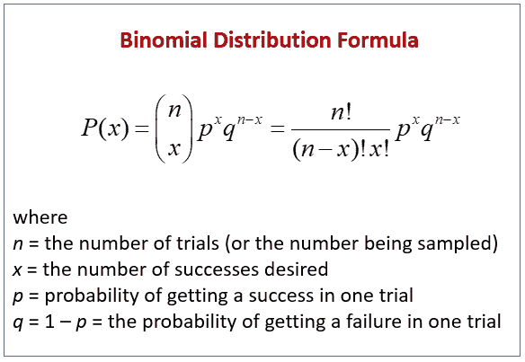

## 问题 11-什么是切布雪夫不等式？

这是一个非常有趣的话题，现在假设我有一个随机变量 X，它表示学校、办公室或任何地方所有学生的身高。

**情况 1**——假设我们知道 X 的分布是高斯分布。

现在，当我们知道它是高斯分布时，我们知道高斯分布遵循 68%、95%和 99.7%的规则，这意味着 68%的总数据位于第一标准差之间，95%的总数据位于第二标准差之间，99.7%的总数据位于第三标准差之间。

我们可以很容易地绘制出数据的 cdf，并可以回答任何问题，例如，假设我们知道平均值= 150 厘米，标准偏差= 10 厘米，那么根据这一规则，95%的总数据位于第二个标准偏差之间。

p(u-2σ

**CASE2** -如果我们不知道分布，让我们举个例子，假设我们有一个随机变量 X，它告诉我们这个国家所有人的工资，但我们不知道分布，但利用中心极限定理，我们得到平均值和标准差，我们必须确保平均值应该是有限的，标准差必须是非零和有限的。

现在的问题是，我们能知道多少%的工资取决于第二个标准差，也就是 p(u-2σ

Lets say u=40k and σ=10k, now can we know what % of individuals have a salary in range of [20k, 60k] which is just under second standard deviation.

Here comes CHEBSEV’S INEQUALITY, IT SAYS,

## P(|X-u|≥kσ)≤1/k²

where k is a constant value

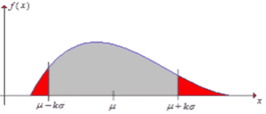

P(X≥u+kσ AND X≤u-2σ)≤1/k²

It can be written as

## P(u-2σ≤ X ≤u+2σ) > 1-(1/k)吗

现在我们可以很容易地回答这个工资问题，因为 u-2σ= 20，u+2σ=60，由此我们得到 k=2，因此从这里

P(20 <x>1-(1/4)</x>

P(20 <x>0.75，意味着至少 75%的人的工资在这个地区之间。</x>

## 问题 12-解释 BOX COX 变换？

**Ans 12-**

**因此，装箱考克斯变换是将帕累托分布转换成高斯分布数学技巧。**

**让我们了解一下 Box Cox 是如何工作的**。

假设我们有一个帕累托分布(X ),它的数据点是 x1，x2，x3…xn

第一步

boxcox(X)= lamda

所以基本上你要给 box-cox 的 n 个观测值，它会给你 lamda。

现在，box cox 将如何给你 lamda，涉及到许多数学，没有必要进入数学。

所以让我们假设盒子 Cox 是一个盒子，n 个观察值在里面，lamda 在外面。

**第二步**

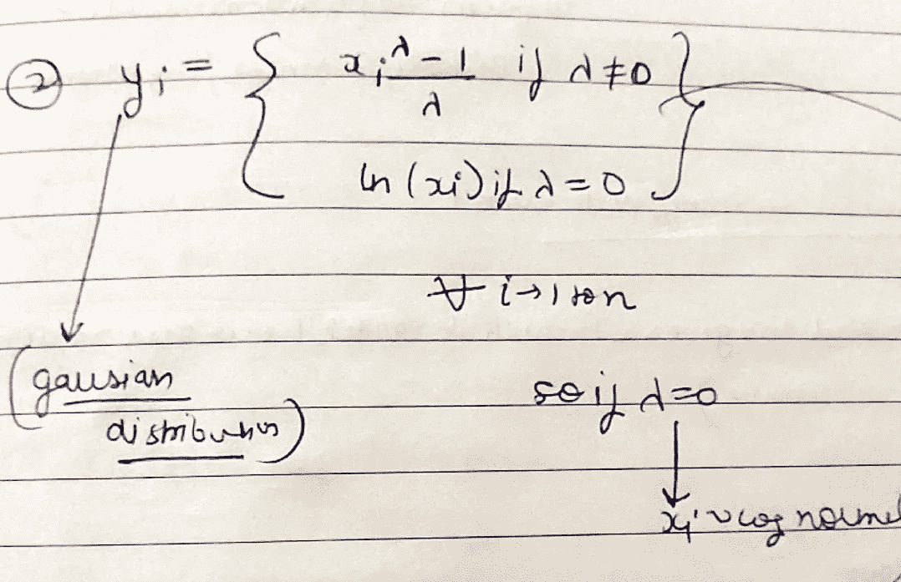

现在从上图中，我们可以清楚地理解，如果我们在步骤 1 中得到的 lamda 是“0 ”,那么只要取(xi)的对数就会得到高斯分布，否则我们必须使用上图中的公式。

【BOX COX 的代码

`*scipy.stats.boxcox(X,lamda=* “ ”)`

字面上是一行代码，但却是理解的重要一步。

## 感谢阅读，享受学习机器学习…

# 尼舍什·戈吉亚

*   ***如果你喜欢这个，*** [***跟我来这里***](/@nishesh.kumar) ***了解更多***
*   ***对通敌感兴趣？下面就来连线一下***[***insta gram***](https://www.instagram.com/nishesh_gogia/)