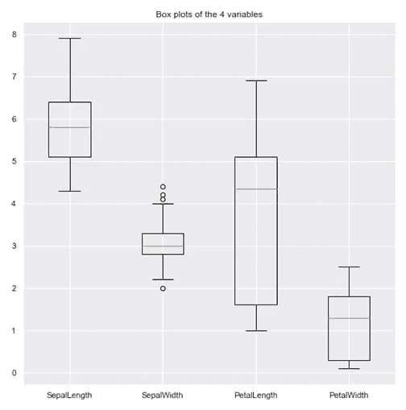
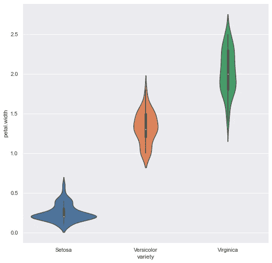

# 12 个带 Python 插图的单变量数据可视化

> 原文：<https://medium.com/analytics-vidhya/12-uni-variate-data-visualizations-with-illustrations-in-python-a8fbdad4bd04?source=collection_archive---------22----------------------->

> *“一图胜千言”。*

**这句话绝对适用于数据可视化，因为传达的信息比老话更有价值。**

数据可视化是使用图表、图形等可视化元素来表示数据的过程。这有助于从数据中获得有意义的见解。它旨在揭示数据背后的信息，并进一步帮助查看者看到数据中的结构。

数据可视化将使任何接触数据科学最少的人都可以获得科学发现，并帮助人们轻松地交流信息。应当理解，人们对特定数据集采用的可视化技术取决于个人的喜好和偏好。

# 可视化数据的需求:

*   了解数据的趋势和模式
*   分析数据的频率和其他此类特征
*   知道数据中变量的分布。
*   将不同变量之间可能存在的关系可视化

以数据为特征的感兴趣变量的数量将其分类为**单变量、双变量或多变量**。例如，如果数据只包含一个感兴趣的变量，那么它就是单变量数据。进一步，根据数据的特性，可以分为**分类/离散**和**连续**数据。

在本文中，主要关注的是**单变量数据**可视化(数据以一维方式可视化)。出于说明的目的，考虑**‘iris’**数据集。iris 数据集包含 3 类，每类 50 个实例，其中每类涉及一种类型的 iris 植物。数据集中涉及的不同变量是萼片长度、萼片宽度、花瓣长度、花瓣宽度(连续变量)和种类变量(分类变量)。尽管数据集本质上是多变量的，但对于单变量分析，我们一次只考虑一个感兴趣的变量。

我们首先导入所需的库和数据集。你可以在这里下载 python 笔记本和数据集[。](https://drive.google.com/file/d/19RVxG_wRlOY1sqNwkUWcSTQ8HrYYM7_U/view?usp=sharing)

最初在中的数据集。csv 格式使用 pandas 的 *pd.read_csv( )* 函数加载到数据帧 df 中。然后，它显示数据帧 df。

在分析任何数据集之前，检查数据变量的数据类型。然后，人们可以决定单变量数据可视化的正确方法。

数据类型

*。dtypes* 属性用于知道数据集中变量的数据类型。Pandas 根据它们的类型以不同的格式存储这些变量。Pandas 将*分类变量存储为‘对象’*，另一方面，*连续变量存储为 int 或 float* 。用于单变量数据可视化的方法也取决于数据变量的类型。

在本文中，我们使用库 matplotlib 和 seaborn 来可视化 iris 数据。我们用 Matplotlib 库来画基本的图。Seaborn 库基于 matplotlib 库，它为单变量数据提供了多种可视化技术。

# 可视化单变量连续数据:

单变量数据可视化图有助于我们理解枚举属性以及特定数据变量的描述性摘要。这些图有助于理解数据变量中观察值的**位置/方位**、其**分布**和**分散**。单变量图有两种类型:1) **枚举**图和 2) **汇总**图

# 单变量枚举图:

这些图列举/显示了数据中的每个观察值，并提供了关于单个数据变量上观察值分布的信息。我们现在来看看不同的枚举图。

## 1.单变量散点图:

这绘出了对应于指数/观察值的同一变量的不同观察值/值。考虑绘制变量‘萼片长度(厘米)’:

输入(使用 Matplotlib 的单变量散点图)

输出(使用 Matplotlib 的单变量散点图)

使用 matplotlib 的 *plt.scatter()* 函数绘制一元散点图。scatter()函数需要两个参数来绘制。因此，在本例中，我们将变量“sepal.width”与作为数据帧索引(df.index)存储的相应观测值相对应。

然后使用 seaborn 库的 *sns.scatterplot()* 函数，通过考虑其多样性来可视化相同的图。

输入(使用 Seaborn 的单变量散点图)

输出(使用 Seaborn 的单变量散点图)

seaborn 中一个有趣的特性是“色调”参数。在 seaborn 中，色调参数决定了数据框中的哪一列应该用于颜色编码。这有助于根据数据值所属的类别来区分数据值。色调参数将分组变量作为其输入，使用它将产生具有不同颜色的点。传递给“hue”的变量可以是分类的，也可以是数字的，尽管颜色映射在后一种情况下会有不同的表现。

> ***注意*** *:* 每个函数都有各种各样的参数可以使用，以产生更好的结果。如果使用 Jupyter notebook，可以使用“Shift+Tab”快捷键来查看所用功能的各种参数。

## 2.线形图(带标记) :

折线图通过线段连接数据点来可视化数据。它类似于散点图，只是测量点是有序的(通常按其 x 轴值)并用直线段连接。

输入(Matplotlib 中带标记的线图)

输出(Matplotlib 中带标记的线图)

默认情况下，matplotlib *plt.plot()* 函数使用线形图绘制数据。

之前我们讨论过 seaborn 的色相参数。虽然 matplotlib 中没有这样的自动化选项，但是可以使用 pandas 的 *groupby()* 函数来绘制这样的图形。

**注意**:上图中也实现了 matplotlib 中设置标题、字体大小等方法。

**所用功能的说明:**

*   *图形(figsize=())* :设置图形的大小
*   *plt.title()* :设置标题
*   *PLT . xlabel()/PLT . ylabel()*:在 X 轴/Y 轴上设置标签
*   *df.groupby( )* :根据传递给函数的参数对数据帧的行进行分组
*   groupby()函数返回按传递的标准变量和标准变量分组的数据帧。
*   循环的*用于根据数据点的变化绘制每个数据点。*
*   *plt.legend()* :给图形添加一个图例(图例描述图形中看到的不同元素)。
*   *plt.show()* :展示剧情。

函数 *plt.plot()* 的“markevery”参数被赋值为“1 ”,这意味着它将从第一个数据点开始绘制每第一个标记。有多种标记样式，我们可以将它们作为参数传递给函数。

*sns.lineplot()* 函数也可以可视化线图。

输入(Seaborn 中带标记的线图)

输出(Seaborn 中带标记的线图)

在 seaborn 中，轴上的标签是根据传递用于绘图的列自动设置的。然而，如果想要改变它，也可以使用 set()函数。

> ***注*** *:* 经常会有这样的情况，人们想要探究单个连续变量的分布如何受到第二个分类变量的影响。seaborn 库提供了各种各样的图，帮助在单变量分布之间进行这种类型的比较。本文讨论了三种样地:带状样地、群体样地(在列举样地下)和小提琴样地(在总结样地下)。上面图中提到的色调参数也有类似的用途。

## 3.带状图:

带状图类似于散点图。它通常与其他类型的图一起使用，以便进行更好的分析。它用于可视化变量数据点的分布。

*sns.striplot ( )* 函数用于绘制带状图:

输入(带状图)

输出(带状图)

这也有助于将每个类别的变量分布绘制成单独的数据点。默认情况下，该函数会创建一个垂直带状图，其中连续数据点的分布沿 Y 轴绘制，类别沿 X 轴隔开。在上面的情节中，没有考虑类别。考虑类别有助于更好地可视化，如下图所示。

输入(带状图类别)

输出(带状图类别)

## 4.群体图:

与带状图类似，群图为单变量数据提供了一种可视化技术，以查看连续变量中值的分布。带状图和群集图之间的唯一区别在于，群集图会自动展开变量的数据点以避免重叠，从而提供更好的数据视图。

*sns.swarmplot( )* 函数用于绘制群体图:

输入(群体图)

输出(群体图)

变量“萼片宽度”根据类别的分布:

输入(群体图类别)

输出(群体图类别)

# 单变量汇总图:

这些图比枚举图更简洁地描述了变量的位置、分散和分布。在汇总图中检索每个单独的数据值是不可行的，但它有助于有效地表示整个数据，从中可以对整个数据集做出更好的结论。

## 5.直方图:

直方图类似于条形图，显示落在不同类别间隔或范围内的值的计数或相对频率。直方图显示连续样本数据的形状和分布。它还帮助我们理解数据分布的偏斜度和峰度。

使用 matplotlib *plt.hist()* 函数绘制直方图:

输入和输出单元格(Matplotlib 中的直方图)

seaborn 函数 *sns.distplot()* 也可用于绘制直方图。

输入(锡伯恩的直方图)

输出(Seaborn 的直方图)

kde(内核密度)参数被设置为 False，以便只查看直方图。有许多参数，如面元(指示绘图中允许的直方图中面元的数量)、颜色等；其可以被设置以获得期望的输出。

## 6.密度图:

密度图就像直方图的平滑版本。通常，在密度图中使用核密度估计来显示变量的概率密度函数。绘制作为核心的连续曲线，以生成整个数据的平滑密度估计。

绘制变量“花瓣长度”的密度图:

输入(使用熊猫的密度图)

输出(使用熊猫时的密度图)

输入(Seaborn 的密度图)

输出(Seaborn 的密度图)

我们使用 pandas *df.plot()* 函数(基于 matplotlib 构建)或 seaborn 库的 *sns.kdeplot()* 函数来绘制密度图。许多功能，如阴影、分布类型等，都可以使用函数中的可用参数进行设置。默认情况下，使用的核是高斯核(这会产生一条高斯钟形曲线)。此外，其他图形平滑技术/过滤器也是适用的。

## 7.地毯图:

地毯图是一种非常简单，但也是一种理想合法的表示分布的方式。它由每个数据点的垂直线组成。在这里，高度是任意的。分布的密度可以通过刻度线的密集程度得知。

rug plot 和 histogram 之间的联系非常直接:histogram 只是沿着数据的范围创建条柱，然后绘制一个高度等于每个条柱中的刻度数的条柱。在地毯图中，所有数据点都绘制在单个轴上，每个轴对应一个刻度线或线条。

与边缘直方图相比，rug plot 在分布的可读性方面有所欠缺，但它在数据表示方面更加紧凑。地毯是一个很短很长的点符号显示，每个点符号代表一个独特的价值。垂直管道符号|通常用于最小化重叠。地毯地块可能不被认为是主要的地块选择，但在某些情况下，它可以是一个很好的支持者地块。

绘制可变萼片的地毯。长度' :

输入和输出单元

> ***注*** *:* 在少数情况下，可能需要设置各轴数值的范围。在上图中，plt.subplots()函数返回一个图形对象和轴对象。使用传递给 set_xlim()方法的 axes 对象“ax ”,设置 X 轴上要考虑的值的范围。

核密度估计可以与地毯一起绘制，这可以提供对数据的更好理解。

在 matplotlib 中，没有创建地毯图的直接函数。因此，scipy.stats 模块用于创建所需的内核密度分布，然后使用 *plt.plot()* 函数和地毯一起绘制。

输入(在 Matplolib 中绘制地毯和高斯分布)

输出(在 Matplolib 中绘制地毯和高斯分布)

**所用方法的说明:**

*kde.gaussian_kde( )* 函数使用高斯核生成一个核密度估计。在单变量数据的当前情况下，该函数将一维数组作为输入数据集。为了得到所需的一维数组，首先使用函数 *to_numpy()* 将数据帧转换为 numpy 数组，然后使用 *np.hstack()* 函数将输入数组的序列水平(即按列)堆叠，形成一个数组。这个一维数组“rdf”然后被作为输入传递给 *kde.gaussian_kde()* 函数。使用 *np.arange()* 函数指定要考虑的值范围和步长。然后，使用 *plt.plot()* 获取绘图。

Seaborn 库提供了一个更直接、更简单的函数来可视化这样一个带有许多参数的图。

输入(在 Seaborn 绘制地毯和高斯分布图)

输出(绘制 Seaborn 中的地毯和高斯分布)

## 8.箱线图:

箱线图是一种非常有用的标准化方法，它基于五个数字的汇总(最小值、第一个四分位数、第二个四分位数(中值)、第三个四分位数、最大值)来显示数据的分布。它有助于理解数据分布的这些参数，并且对检测异常值非常有帮助。

(来源:leansigmacorporation.com)

变量“sepal.width”的绘图框绘图:

输入(Matplotlib 中的方框图)

输出(Matplotlib 中的方框图)

在一帧中绘制所有变量的箱线图:

由于箱线图用于连续变量，首先创建一个没有“变化”列的数据框。然后使用 *drop( )* 函数从数据帧中删除该列，并指定 axis=1 来表示它。

输入(使用 Matplotlib 绘制所有变量的方框图)

输出(使用 Matplotlib 绘制所有变量的方框图)

在 matplotlib 中，单独提及标签以在输出中显示它。

《海边的箱线图》的绘制；

输入(Seaborn)

产量(Seaborn)

绘制一帧中所有变量的箱线图:

输入(使用 Seaborn 的所有变量的箱线图)

输出(使用 Seaborn 的所有变量的箱线图)

将 pandas 函数 *pd.melt()* 应用于修改后的数据帧，然后将其传递给 *sns.boxplot()* 函数。

## 9.距离图() :

seaborn 库的 *distplot()* 函数在前面的 rug plot 部分已经提到过。该函数将 matplotlib *hist()* 函数与 seaborn *kdeplot()* 和 *rugplot()* 函数结合在一起。

投入

输出

## 10.小提琴情节:

Violin 图与 box 图非常相似，只是在每一侧增加了一个旋转的核密度图。它显示了数量数据在一个(或多个)分类变量的几个级别上的分布，以便对这些分布进行比较。

资料来源:r-bloggers.com

输入(Matplotlib 中所有变量的小提琴图)

输出(Matplotlib 中所有变量的 Violin 图)

我们使用 *plt.violinplot( )* 函数。布尔参数“showmedians”被设置为 True，因此会为每个变量标记中间值。小提琴图有助于理解变量的估计密度。

在 seaborn 库中，用于绘制小提琴图的函数也是类似的。

输入(锡伯恩的小提琴情节)

输出(锡伯恩的小提琴情节)

根据数据集中提到的物种“多样性”比较变量“萼片宽度”:

输入(根据 Seaborn 中的类别的小提琴情节)

输出(根据 Seaborn 中的类别绘制的小提琴图)

# 可视化分类变量:

## 11.条形图:

条形图是二维轴上的单变量数据可视化图。一个轴是指示类别的类别轴，而第二个轴是显示该类别的数值的数值轴，由条形的长度指示。

*plot.bar()* 函数绘制分类变量的条形图。 *value_counts()* 返回一个包含变量中唯一值计数的序列。

输入(使用熊猫的条形图)

输出(使用熊猫的条形图)

seaborn 库的 *countplot()* 函数获得了一个类似的条形图。使用 *sns.countplot()* 函数时无需单独计算计数。

因为这种变化是平均分布的，所以我们得到了高度相等的条形。

输入(Seaborn 的计数图)

输出(Seaborn 的计数图)

## 12.饼图:

饼图是最常用的方法，用于显示每个类别所占的数字比例。

使用 *plt.pie()* 函数绘制饼图。因为类别是平均分布的，所以在饼图中平均划分各部分。然后通过将值数组传递给“labels”参数来添加标签。

输入(使用熊猫的饼图)

输出(使用熊猫的饼图)

可以使用 *DataFrame.sample( )* 函数创建一个随机样本。 *sample()* 函数的 frac 参数表示要返回的轴项目的分数。

*pie()* 函数的“startangle”参数以特定角度逆时针旋转所有东西。此外，startangle 的默认值为 0。“autopct”参数允许用户使用 Python 字符串格式显示百分比值。

从数据帧中创建随机样本

输入(使用熊猫的饼图)

输出(使用熊猫的饼图)

> 大多数有助于单变量数据可视化的方法已经在本文中进行了概述。如前所述，查看数据所承载的结构和信息的能力在于其可视化呈现。

# 参考资料:

1.  https://www.rpubs.com/harshaash/Univariate_analysis
2.  https://www.wikipedia.org/[(每个情节的基本素材)](https://www.wikipedia.org/)
3.  [https://matplotlib.org/](https://matplotlib.org/)
4.  [https://seaborn.pydata.org/](https://seaborn.pydata.org/)

*原载于 2020 年 7 月 29 日 https://www.analyticsvidhya.com***。**