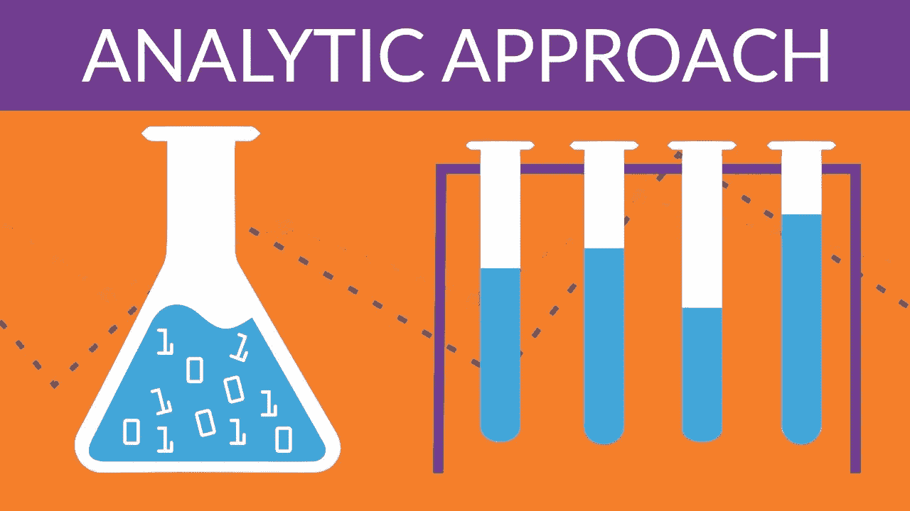
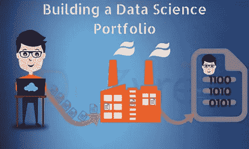
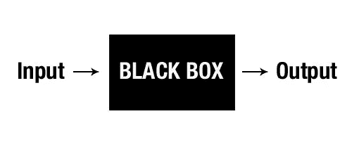
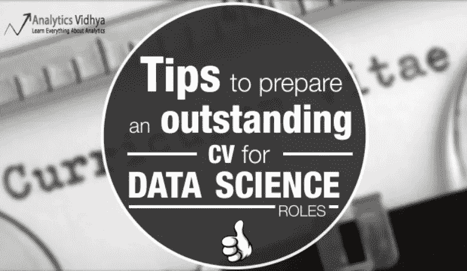
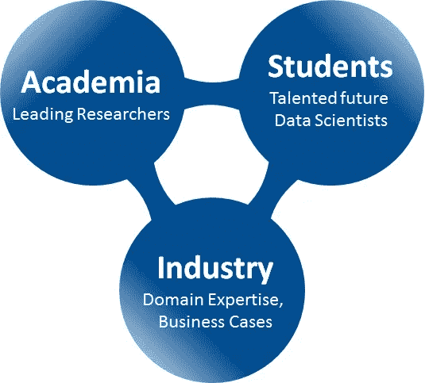
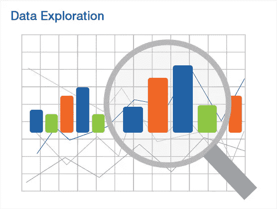
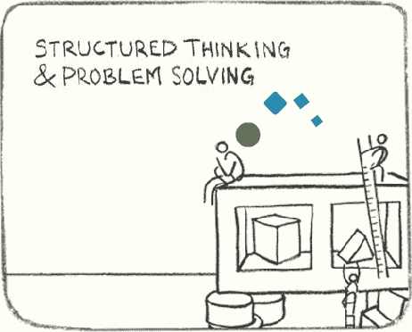

# 业余数据科学家常犯的 13 个错误以及如何避免？

> 原文：<https://medium.com/analytics-vidhya/13-common-mistakes-amateur-data-scientists-make-and-how-to-avoid-them-98818ad7e0fa?source=collection_archive---------3----------------------->

所以你决定数据科学是你的领域。越来越多的企业变得由数据驱动，世界变得越来越互联，看起来每个企业都需要数据科学实践。所以，对数据科学家的需求是巨大的。更好的是，每个人都承认该行业人才短缺。

然而，成为一名数据科学家并不容易。它需要问题解决、结构化思维、编码和各种技术技能的结合才能真正成功。如果你来自一个非技术和非数学的背景，你很有可能通过书籍和视频课程学到很多东西。这些资源中的大部分都没有告诉你行业对数据科学家的要求是什么。

这就是为什么有抱负的数据科学家正在努力弥合自学和现实工作之间的差距。

在这篇文章中，我讨论了业余数据科学家犯的主要错误(我自己也犯了一些)。我还提供了适用的资源，旨在帮助您在数据科学之旅中避免这些陷阱。

# 目录

1.  学习理论概念而不应用它们
2.  在不学习先决条件的情况下直接学习机器学习技术
3.  仅仅依靠证书和学位
4.  假设你在 ML 竞赛中看到的是现实生活中的工作
5.  关注模型的准确性，而不是领域中的适用性和可解释性
6.  在简历中使用过多的数据科学术语
7.  让工具和库优先于业务问题
8.  没有花足够的时间探索和可视化数据(好奇心)
9.  没有解决问题的结构化方法
10.  尝试同时学习多种工具
11.  没有以一致的方式学习
12.  回避讨论和竞争
13.  没有提高沟通技巧

# 1.学习理论概念而不应用它们

*来源:认知类——YouTube*

正如我在关于 [**AV 的练习问题**](https://www.analyticsvidhya.com/blog/2018/07/learn-and-test-your-machine-learning-skills-with-avs-new-practice-problems-and-free-courses/) 的文章中提到的那样——掌握机器学习技术背后的理论是很好的。但是如果你不应用它们，它们只是理论上的概念。当我开始学习数据科学时，我犯了同样的错误-我学习了书籍和在线课程，但并不总是应用它们来解决问题。

所以当我面对一个挑战或问题，而我有机会应用我所学的一切时，我连一半都记不住！要学的东西太多了——算法、推导、研究论文等等。很有可能你会中途失去动力而放弃。我亲眼看到这种情况发生在许多试图进入这一领域的人身上。

## 如何避免这种错误？

你的学习过程必须在理论和实践之间保持健康的平衡。一旦你学会了一个概念，就去谷歌上找一个你能用到它的数据集或问题。你会发现你比以前更好地保留了这个概念。还可以使用 [AV 的 DataHack 平台](https://datahack.analyticsvidhya.com/contest/all/)参加练习题和正在进行的比赛。

你将不得不承认你不可能一下子学会所有的东西。当你练习的时候填补空白，你会学到更多！

# 2.在不学习先决条件的情况下直接学习机器学习技术

*来源:伦敦帝国理工学院——YouTube*

大多数想成为数据科学家的人受到机器人视频或令人敬畏的预测模型的启发，在某些情况下甚至是高薪。可悲的是(抱歉让你失望了！)，在你到达那里之前，还有很长的路要走。

在你应用这些技术解决问题之前，你应该先了解它们是如何工作的。学习这些将有助于你理解一个算法是如何工作的，你可以做些什么来微调它，也将有助于你建立在现有的技术之上。数学在这里起着重要的作用，所以了解某些概念总是有帮助的。在一个日常的企业数据科学家的角色中，你可能不需要知道高级微积分，但有一个高层次的概述肯定有帮助。

如果你有一个好奇的想法，或者想进入一个研究角色，在进入核心机器学习之前，你需要知道的四个关键组成部分是:

*   线性代数
*   结石
*   统计数字
*   可能性

## 如何避免这种错误？

就像房子是一砖一瓦建造的一样，数据科学家也是所有独立部分的总和。有大量的资源可以帮助你学习这些主题。我在下面提到了每个主题的一个资源，应该可以帮助您开始:

您还可以查看 Analytics Vidhya 的“[数据科学简介](https://trainings.analyticsvidhya.com/courses/course-v1:AnalyticsVidhya+DS101+2018T2/about)”课程，其中包括一个关于统计和概率的综合模块。

# 3.仅仅依靠证书和学位

*来源:CIO.com*

啊，招聘经理和招聘人员最讨厌的事情。自从数据科学变得超受欢迎以来，认证和学位几乎无处不在。浏览一下我的 LinkedIn feed，至少有 5 张认证图片被自豪地展示出来。虽然获得这一认证绝非易事，但仅仅依靠它只会招致灾难。

成千上万有抱负的数据科学家在网上开设了太多这样的课程。如果他们曾经给你的数据科学简历增加了独特的价值，那也不再是这样了。招聘经理不太在乎这些纸——他们更看重你的知识，以及你如何在现实生活中应用这些知识。

这是因为与客户打交道、处理截止日期、了解数据科学项目生命周期的工作方式、如何设计您的模型以适应现有的业务框架，这些只是作为一名成功的数据科学家您需要知道的一些事情。仅仅一个证书或学位不会让你有资格获得它。

## 如何避免这种错误？

不要误解我的意思——证书是有价值的，但只有当你在课堂之外应用这些知识，并将其公之于众的时候。使用真实世界的数据集和你做的任何分析，确保你写了它。创建自己的博客，发布在 LinkedIn 上，并从社区中寻求反馈。这表明你愿意学习，并且有足够的灵活性来征求建议并把它们运用到你的项目中。

你应该接受实习的想法(不管你的经验水平如何)。你将学到很多关于数据科学团队如何工作的知识，这将在你参加另一场面试时让你受益。

如果你正在寻找下一个项目，你来对地方了。我们这里有一个很棒的 [**项目列表**](https://www.analyticsvidhya.com/blog/2018/05/24-ultimate-data-science-projects-to-boost-your-knowledge-and-skills/) 按难度划分。现在就开始吧。

# 4.假设你在 ML 竞赛中看到的是现实生活中的工作

这是目前有抱负的数据科学家最大的误解之一。竞赛和黑客马拉松为我们提供了干净、一尘不染的数据集(好吧——我有点过火了，但你已经掌握了诀窍)。你下载它们，然后开始解决问题。即使是那些包含缺失值的列的数据集，也不需要你绞尽脑汁——找出一种插补技术并填空。

不幸的是，现实世界的项目不是这样的。有一个端到端的管道，需要和一群人一起工作。你几乎总是不得不处理杂乱和不干净的数据。俗话说，花 70-80%的时间收集和清理数据是正确的。这是令人筋疲力尽的部分，你(很可能)不会喜欢，但这最终会成为例行公事的一部分。

此外，我们将在下一点中更详细地讨论这一点，较简单的模型将优先于任何复杂的堆叠系综模型。准确性并不总是最终目标，这是你在工作中会学到的最有反差的东西之一。

## 怎么才能避免这个错误呢？

具有讽刺意味的是，否定这种误解的关键因素之一是经验。你获得的经验越多(实习在这种情况下很有帮助)，你就能更好地区分这两者。这就是社交媒体派上用场的地方——联系数据科学家，询问他们的经验。

此外，我建议浏览一下这个 Quora 主题 ，在这里，来自世界各地的数据科学家就这个问题提供了他们的意见。在竞赛排行榜上获得好成绩对于衡量你的学习进度非常重要，但面试官想知道你如何优化你的算法以产生影响，而不是为了提高准确性。了解数据科学项目是如何工作的，团队有哪些不同类型的角色(从数据工程师到数据架构师)，并从这个意义上构建您的答案。

浏览这个 [**LinkedIn 帖子**](https://www.linkedin.com/pulse/standard-methodology-analytical-models-olav-laudy/?trk=prof-post) ，它解释了分析模型的标准方法。

# 5.关注模型的准确性，而不是领域中的适用性和可解释性

*资料来源:设计工作室*

如上所述，准确性并不总是企业所追求的。当然，一个预测贷款违约准确率达到 95%的模型是好的，但是如果你不能解释这个模型是如何建立的，是什么特征导致了这个模型，以及你在建立这个模型时的想法，你的客户会拒绝这个模型。

你很少会发现一个深度神经网络被用于商业应用。向客户解释神经网络(更不用说深度网络)如何与隐藏层、卷积层等一起工作是不可能的。第一个偏好是，并且将永远是，确保我们能够理解模型下面发生了什么。如果你不知道拒绝贷款申请的原因是年龄、家庭成员人数还是以前的信用记录，那么企业将如何运营？

另一个关键方面是你的模型是否适合组织的现有框架。如果生产环境不支持，使用 10 种不同类型的工具和库将会失败。您将不得不用更简单的方法从头开始重新设计和重新训练模型。

## 怎么才能避免这个错误呢？

防止自己犯这种错误的最好方法是与业内人士交谈。经验是最好的老师。选择一个领域(财务、人力资源、营销、销售、运营等。)并接触人们，了解他们的项目是如何运作的。

除此之外，练习制作更简单的模型，然后向非技术人员解释。然后给你的模型增加复杂性，一直这样做，直到你都不明白下面发生了什么。这将教会你什么时候停止，以及为什么在实际应用中简单的模型总是被优先考虑。

# 6.在简历中使用过多的数据科学术语

如果你以前做过，你就会知道我在说什么。如果你的简历目前有这个问题，马上整改！你可能知道太多的技巧和工具，但是简单地把它们列出来会让潜在的招聘经理失去兴趣。

你的简历是你完成了什么以及你是如何做到的——而不是简单记下的事情清单。当招聘人员看你的简历时，他/她希望以简洁和概括的方式了解你的背景和你的成就。如果半页都是模糊的数据科学术语，如线性回归、XGBoost、LightGBM，没有任何解释，你的简历可能无法通过筛选。

## 怎么才能避免这个错误呢？

消除简历混乱的最简单的方法是使用要点。只列出你用来完成某事的技巧(可能是一个项目或一场比赛)。写一行关于你是如何使用它的——这有助于招聘人员理解你的想法。

当你申请新的或入门级的工作时，你的简历需要反映出你能给公司带来什么样的潜在影响。你将申请不同领域的职位，因此有一套模板可能会有所帮助——只需改变故事，以反映你对特定行业的兴趣。

[**Kunal Jain**](https://www.analyticsvidhya.com/blog/2014/11/tips-prepare-cv-data-science-roles/)的这篇文章是为数据科学职位准备优秀简历的绝佳资源。

# 7.让工具和库优先于业务问题

*来源:数据科学实验室*

我们举个例子来理解为什么这是个错误。假设你已经得到了一个关于房价的数据集，你需要预测未来房地产的价值。有 200 多个变量，包括建筑数量、房间、租户数量、家庭规模、庭院大小、是否有水龙头等。你很有可能不知道一些变量意味着什么。你仍然可以建立一个精确度很高的模型，但是你不知道为什么某个变量被删除了。

事实证明，这个变量在现实世界中是一个至关重要的因素。这是一个灾难性的错误。

拥有扎实的工具和库知识是非常好的，但是这只能让你做到这一步。将这些知识与该领域提出的业务问题相结合是真正的数据科学家介入的地方。你至少应该意识到你感兴趣(或者正在申请)的行业的基本挑战。

## 怎么才能避免这个错误呢？

这里有很多可供探索的选择:

*   如果你申请的是某个特定行业的数据科学家职位，那就仔细阅读该领域的公司是如何使用数据科学的
*   如果可能的话，搜索特定行业的数据集，并尝试使用它们。这将会是你简历中非常突出的一点
*   阅读《纽约时报》 关于为什么领域知识是数据科学的主要驱动力的精彩文章

# 8.没有花足够的时间探索和可视化数据

数据可视化是数据科学的一个非常好的方面，但是许多有抱负的数据科学家更喜欢浏览它并进入模型构建阶段。这种方法在竞争中可能行得通，但在实际工作中肯定会失败。理解你得到的数据是你要做的最重要的事情，你的模型结果会反映这一点。

通过花时间去了解数据集和尝试不同的图表，你会对你所面临的挑战或问题有更深入的了解。你会惊讶地发现，仅仅通过这样做，你就能获得多少洞察力！模式和趋势出现，故事被讲述，最精彩的部分是什么？可视化是向客户展示你的发现的最佳方式。

作为一名数据科学家，你需要天生的好奇心。这是数据科学的伟大之处之一——你越好奇，你就会问越多的问题。这有助于更好地理解你得到的数据，也有助于解决你一开始不知道存在的问题！

## 怎么才能避免这个错误呢？

练习！下次处理数据集时，在这一步花更多的时间。你会惊讶于它为你带来的洞察力。提问！问问你的经理，问问领域专家，在网上搜索解决方案，如果找不到，问问社交媒体。这么多选择！

为了帮助您开始，我在下面提到了一些资源，您可以参考一下:

# 9.没有解决问题的结构化方法

*资料来源:MindMatters.co.in*

结构化思维在许多方面帮助了数据科学家:

*   它帮助你将问题陈述分解成逻辑部分
*   它帮助你想象问题陈述是如何产生的，以及你如何设计你的方法
*   它有助于最终用户或客户以一种符合逻辑且易于理解的方式理解框架的顺序

有更多的理由说明为什么拥有一个结构化的思维模式是有帮助的。你可以想象，没有一个结构化的思维模式是违背直觉的。你的工作和解决问题的方法将是随意的，当你面对一个复杂的问题时，你将会迷失自己的方向，等等。

当你去参加数据科学面试时，你不可避免地会得到一个案例研究、猜测估计和难题。由于面试室充满压力的气氛和时间的限制，面试官会看你如何组织你的想法以达到最终的结果。在许多情况下，**这可能是获得工作的决定性因素或决定性因素。**

## 怎么才能避免这个错误呢？

你可以通过简单的训练和严格的方法获得一种结构化的思维模式。我在下面列出了几篇文章，可以帮助你在这个关键方面开始:

# 10.尝试同时学习多种工具

这个我看了太多次了。由于困境和每个工具提供的独特特性，人们倾向于尝试一下子学习所有的工具。这是一个坏主意——你最终将什么都不会。工具是执行数据科学的手段，而不是最终目标。

## 怎么才能避免这个错误呢？

选择一个工具，坚持下去，直到你掌握它。如果你已经开始学习 R，那么不要被 Python 所诱惑(还没有)。坚持使用 R，从头到尾学习它，然后尝试将另一种工具整合到您的技能组合中。用这种方法你会学到更多。

每个工具都有一个很棒的用户社区，当你遇到困难时，你可以利用它。使用我们的 [**论坛**](https://discuss.analyticsvidhya.com/) 提问，在线搜索素材，不要放弃。目的是通过工具学习数据科学，而不是通过数据科学学习工具。

如果你还没有决定你应该使用哪种工具，看看这篇精彩的文章 ，它列出了每种工具的优点和缺点(如果你对此感兴趣，它还包括了 SAS)。

# 11.没有以一致的方式学习

*资料来源:布鲁克斯集团*

这一条适用于所有数据科学家，而不仅仅是新生。我们很容易分心。我们学习一段时间(比如说一个月)，然后休息两个月。在那之后试图回到最佳状态是一场噩梦。大多数早期的概念都被遗忘了，笔记丢失了，感觉就像我们刚刚浪费了过去的几个月。

这一点我也亲身经历过。由于我们正在进行的各种事情，我们找到借口和理由不回去学习。但这最终是我们的损失——如果数据科学像打开教科书、死记硬背一样简单，那么今天每个人都将成为数据科学家。它需要坚持不懈的努力和学习，而当人们意识到这一点时已经太晚了。

## 怎么才能避免这个错误呢？

为自己设定目标。绘制一张时间表，贴在墙上。计划好你想怎么学，学什么，给自己设定最后期限。例如，当我想学习神经网络时，我给自己几周时间，然后通过参加黑客马拉松比赛来测试我所学到的东西。

你已经决定成为一名数据科学家，所以你应该准备好投入时间。如果你不断找借口不学习，这可能不适合你。

# 12.回避讨论和竞争

*来源:面试技巧咨询*

这是我们在以上几点中看到的一些东西的组合。有抱负的数据科学家倾向于避免在网上发布他们的分析，害怕受到批评。但是如果你没有收到来自社区的反馈，你就不会成为一名数据科学家。

数据科学是一个讨论、想法和头脑风暴非常重要的领域。您不能坐在孤岛中工作，您需要协作并理解其他数据科学家的观点。同样，人们不参加比赛是因为他们觉得自己不会赢。这是一种错误的心态！你参加这些比赛是为了学习，而不是为了赢。胜利是奖励，学习是目标。

## 怎么才能避免这个错误呢？

这相当简单——开始参与讨论和竞赛！不在前 5%也没关系。如果你从整个过程中学到了一项新技术，你就凭自己的力量赢了。

# 13.没有提高沟通技巧

来源:吉姆·哈维

沟通技能是数据科学家必须具备的最被低估和最少被谈论的方面之一。我还没有遇到一门课程真正强调这一点。你可以学习所有最新的技术，掌握多种工具，做出最好的图表，但是如果你不能向你的客户解释你的分析，你将成为一名失败的数据科学家。

不仅是客户，你还将与不精通数据科学的团队成员一起工作，如 IT、人力资源、财务、运营等。你可以确定面试官会全程监控这方面。

假设你已经用逻辑回归建立了一个信用风险模型。作为一个思考练习，花一分钟时间思考你将如何向一个非技术人员解释你是如何得出最终结论的。如果你使用了任何技术词汇，你需要尽快解决这个问题！

## 如何避免这种错误？

如今，大多数数据科学家都来自计算机科学背景，所以我理解这可能是一项令人望而生畏的技能。但要成为一名成功的数据科学家，爬上阶梯，你别无选择，只能打磨自己人格的这一部分。

我发现最有帮助的事情之一是向非技术人员解释数据科学术语。这有助于我衡量我对问题的阐述程度。如果你在一家中小型公司工作，找一个营销或销售部门的人，和他们一起做这个练习。从长远来看，这对你会有很大的帮助。

互联网上有很多免费资源可以帮助你入门，但是请记住，实践是软技能的关键。确保你今天就开始这样做。

# 结束注释

这绝对不是一个详尽的列表——有抱负的数据科学家往往会犯很多其他错误。但这些是我见过的最常见的，我的目的，如前所述，是帮助其他人(尽可能)避免它。

我很想听听你对这些建议的想法，以及你对类似问题的个人经历。使用下面的评论部分让我知道！

*原载于 2018 年 7 月 12 日*[*【www.analyticsvidhya.com】*](https://www.analyticsvidhya.com/blog/2018/07/13-common-mistakes-aspiring-fresher-data-scientists-make-how-to-avoid-them/)*。*