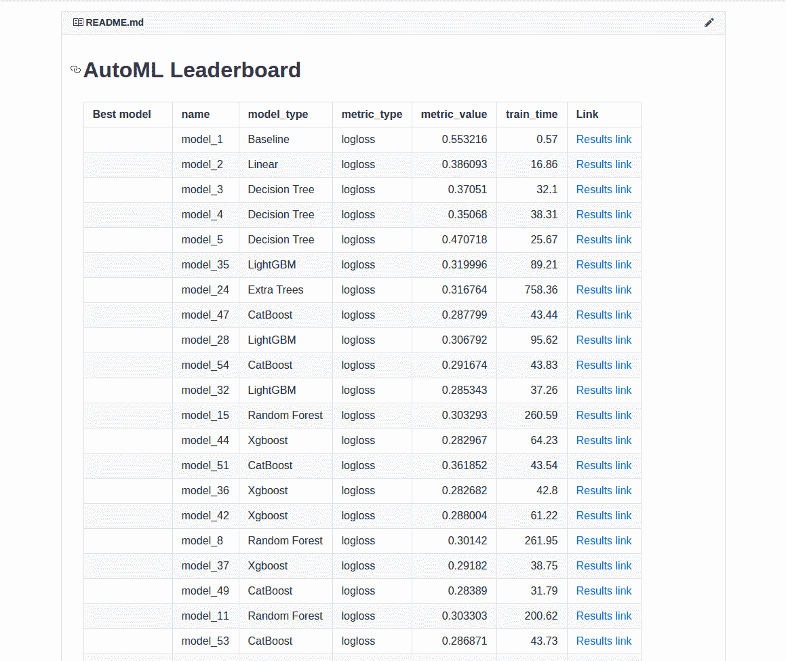
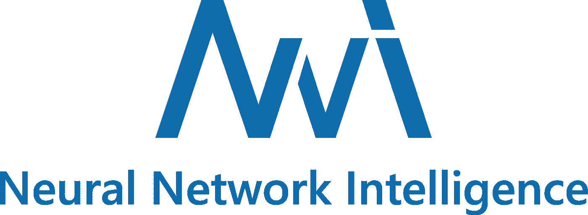
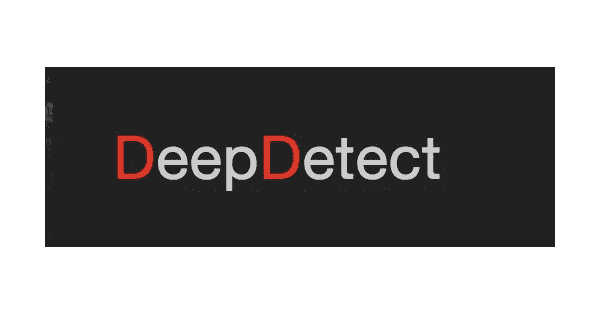
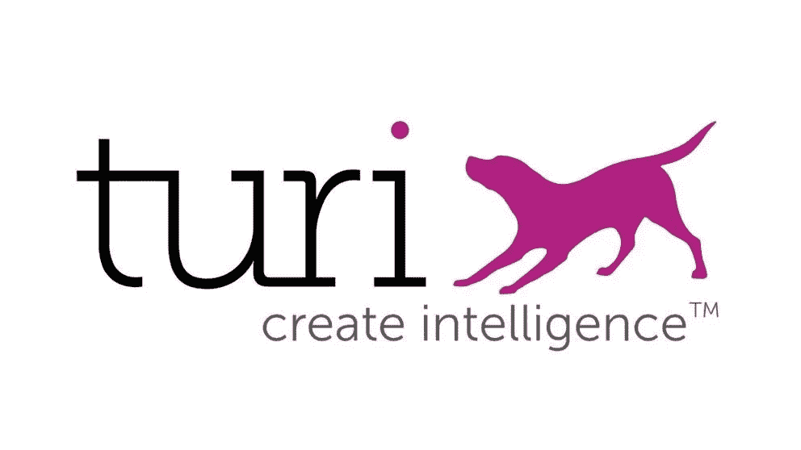
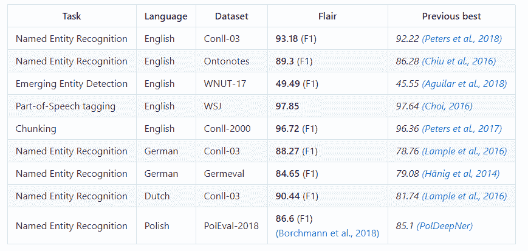

# 2020 年你需要知道的 15 个未被发现的开源机器学习框架。

> 原文：<https://medium.com/analytics-vidhya/15-undiscovered-open-source-machine-learning-frameworks-you-need-to-know-in-2020-77ad6e6f109d?source=collection_archive---------26----------------------->

## 在你的下一个机器学习项目中有用的 ML 框架。

来自 [Pexels](https://www.pexels.com/photo/low-angle-shot-of-high-rise-building-2096578/?utm_content=attributionCopyText&utm_medium=referral&utm_source=pexels) 的[垃圾手](https://www.pexels.com/@trashhand?utm_content=attributionCopyText&utm_medium=referral&utm_source=pexels)的照片

机器学习是当今发展最快的新兴技术之一。机器学习在不同计算领域的应用正在迅速普及。

这不仅仅是因为廉价而强大的硬件的存在。也是因为越来越多的 [**免费开源**](https://opensource.com/resources/what-open-source) [**机器学习**](https://machinelearningmastery.com/types-of-learning-in-machine-learning/) **框架**，让开发者可以轻松实现机器学习。

这种广泛的开源机器学习框架让数据科学家和机器学习工程师能够构建、实施和维护机器学习系统，生成新的项目，并创建新的有影响力的机器学习系统。

选择一个机器学习框架或库来解决您的用例涉及到进行评估，以决定什么适合您的用例。有几个因素对此评估很重要，例如:

*   易用性。
*   市场(社区)的支持。
*   跑步速度。
*   开放性。

# 这篇文章是写给谁的？

这篇文章是写给学完理论后想把知识用到实践中的人的。

它也适用于那些希望为他们未来的 ML 项目探索其他潜在的开源机器学习框架的人。

现在，这里列出了尚未发现的开源框架或库，企业和个人可以使用它们来构建机器学习系统。

# 1.阻碍

> *Blocks 是一个框架，帮助你在 Theano 之上构建神经网络模型。目前，它支持和提供，构造参数化的 ano 操作，称为“砖块”，模式匹配，以选择大型模型算法中的变量和砖块，以优化您的模型，并保存和恢复训练。* [*格氏储存库*](https://github.com/mila-iqia/blocks)

你还可以了解到 [Fuel](https://github.com/mila-udem/fuel) ，主要为 Blocks 开发的数据处理引擎。

编程语言:Python
Github 链接:[https://github.com/mila-iqia/blocks](https://github.com/mila-iqia/blocks)

# 2.分析动物园

> *Analytics Zoo 提供了一个统一的数据分析和人工智能平台，将 TensorFlow、Keras、PyTorch、Spark、Flink 和 Ray 程序无缝地整合到一个集成管道中，可以透明地从笔记本电脑扩展到大型集群，以处理生产大数据。* [*分析动物园知识库*](https://github.com/intel-analytics/analytics-zoo)

何时应该使用 Analytics Zoo 开发您的人工智能解决方案:

*   你想容易地原型化人工智能模型。
*   当缩放对您很重要时。
*   当您想要将自动化流程添加到机器学习管道中时，例如特征工程和模型选择。

该项目由[英特尔分析公司维护。](https://github.com/intel-analytics)

编程语言:Python
Github 链接:[https://github.com/intel-analytics/analytics-zoo](https://github.com/intel-analytics/analytics-zoo)

# 3.ML5.js

> *Ml5.js 旨在让艺术家、创意程序员和学生等广大受众能够接触到机器学习。该库在浏览器中提供对机器学习算法和模型的访问，构建在*[*tensor flow . js*](https://js.tensorflow.org/)*之上。*[*【ml5 . js 资源库】*](https://github.com/ml5js/ml5-library)

ml5.js 的灵感来源于[加工](https://processing.org/)和 [p5.js](https://p5js.org/) 。

这个开源项目由 NYU 互动电信/互动媒体艺术项目以及世界各地的艺术家、设计师、学生、技术人员和开发人员开发和维护。

**注:**该项目目前正在开发中。

编程语言:Javascript
Github 链接:[https://github.com/ml5js/ml5-library](https://github.com/ml5js/ml5-library)

# 4.阿达内特

> ***AdaNet*** *是一个轻量级的基于 TensorFlow 的框架，用于在最少的专家干预下自动学习高质量的模型。AdaNet 建立在最近的 AutoML 努力之上，在提供学习保证的同时，变得快速和灵活。重要的是，AdaNet 提供了一个通用框架，不仅用于学习神经网络架构，还用于学习集成以获得更好的模型。*[*【AdaNet 资源库】*](https://github.com/tensorflow/adanet)

AdaNet 提供了熟悉的 API，如 Keras，用于培训、评估和服务生产中的模型。

编程语言:Python
Github 链接:[https://github.com/tensorflow/adanet](https://github.com/tensorflow/adanet)

# 5.Mljar

如果您正在寻找一个创建原型模型和部署服务的平台，Mljar 是您的正确选择。Mljar 倾向于搜索不同的算法，并执行超参数调整以找到最佳模型。

它还通过在云中运行所有计算并最终创建集合模型来快速提供结果。然后，它从 AutoML training 创建降价报告。

Mljar 可以为以下项目训练 ML 模型:

*   二元分类，
*   多类分类，
*   回归。

Mljar 提供了两种类型的接口:

*   Mljar API 上的 Python 包装器。
*   在网络浏览器中运行机器学习模型。

编程语言:Python
Github 链接:[https://github.com/mljar/mljar-supervised](https://github.com/mljar/mljar-supervised)。

# 6.ConvNetJS

> *Javascript 中的深度学习。在你的浏览器中训练卷积神经网络(或者普通的)。*[*【convnetjs 库】*](https://github.com/karpathy/convnetjs)

和 Tensorflow.js 一样，ConvNetJS 也是一个 JavaScript 库，支持在你的 web 浏览器中训练不同的深度学习模型。不需要 GPU 等重软件。

ConvNetJS 支持:

*   神经网络模块。
*   为图像训练卷积网络。
*   回归和分类成本函数。
*   强化学习模块，基于深度 Q 学习。

**注:**未主动维护。

编程语言:Javascript
Github 链接:[https://github.com/karpathy/convnetjs](https://github.com/karpathy/convnetjs)

# 7.NNI(神经网络智能)

> ***【NNI(神经网络智能)*** *是一个轻量级但功能强大的工具包，帮助用户* ***自动化*** [*特征工程*](https://github.com/microsoft/nni/blob/master/docs/en_US/FeatureEngineering/Overview.md)*[*神经架构搜索*](https://github.com/microsoft/nni/blob/master/docs/en_US/NAS/Overview.md)*[*超参数调优*](https://github.com/microsoft/nni/blob/master/docs/en_US/Tuner/BuiltinTuner.md)*[*该工具管理自动机器学习(AutoML)实验，* ***分派并运行*** *实验的试验任务，这些试验任务由调整算法生成，以在* ***不同的训练环境*** *中搜索最佳的神经架构和/或超参数，如*](https://github.com/microsoft/nni/blob/master/docs/en_US/Compressor/Overview.md) [*本地机器*](https://github.com/microsoft/nni/blob/master/docs/en_US/TrainingService/LocalMode.md) *，* [*远程服务器*](https://github.com/microsoft/nni/blob/master/docs/en_US/TrainingService/RemoteMachineMode.md) *， *[*NNI 知识库*](https://github.com/Microsoft/nni)*****

***什么时候应该考虑使用 NNI***

*   *如果你想尝试不同的 AutoML 算法。*
*   *如果您想在不同的环境中运行 AutoML 试用作业。*
*   *如果你想在你的平台上支持 AutoML。*

*注:微软的开源项目。*

*编程语言:Python
Github 链接:[https://github.com/Microsoft/nni](https://github.com/Microsoft/nni)*

# *8.Datumbox*

**

> *Datumbox 机器学习框架是一个用 Java 编写的开源框架，允许快速开发机器学习和统计应用程序。该框架的主要重点是包括大量的机器学习算法&统计方法，并能够处理大规模数据集。[*【DatumBox 库】*](https://github.com/datumbox/datumbox-framework)*

*Datumbox 为不同的任务提供了许多预先训练的模型，如垃圾邮件检测、情感分析、语言检测、主题分类等。*

*编程语言:Java
Github 链接:[https://github.com/datumbox/datumbox-framework](https://github.com/datumbox/datumbox-framework)*

# *9.XAI(ML 的可解释工具箱)*

> *XAI 是一个机器学习库，其核心是人工智能可解释性。XAI 包含各种工具，可用于分析和评估数据和模型。XAI 库由伦理人工智能研究所(Institute for Ethical AI)维护，它是基于负责任的机器学习的原则而开发的。[*【XAI 知识库】*](https://github.com/EthicalML/xai)*

*负责任的机器学习的 8 项原则包括:*

*   *人类扩增*
*   *偏倚评估*
*   *通过证明的可解释性*
*   *可重复操作*
*   *置换策略*
*   *实际精确度*
*   *隐私信任*
*   *数据风险意识*

*想了解更多关于 XAI 的信息，你可以在 Tensorflow London 查看这个[演讲。它包含了对这个库的定义和原则的深入了解。](https://www.youtube.com/watch?v=GZpfBhQJ0H4)*

*XAI 目前处于早期开发阶段，当前版本是 0.05 (Alpha)。*

*编程语言:Python
Github 链接:[https://github.com/EthicalML/xai](https://github.com/EthicalML/xai)*

# *10.柏拉图*

**

*Plato 是一个灵活的框架，可以在不同的环境中开发任何对话式 AI 代理。Plato 是为对话式人工智能背景有限的用户和该领域经验丰富的研究人员设计的。它提供了一个清晰易懂的设计，集成了现有的深度学习和贝叶斯优化框架，减少了编写代码的需求。*

*它支持通过文本、语音和对话行为进行交互。要了解柏拉图研究对话系统是如何工作的，请在这里阅读文章。*

***注:** Plato 是优步的一个开源项目。*

*编程语言:Python
Github 链接:[https://Github . com/Uber-research/Plato-research-dialogue-system](https://github.com/uber-research/plato-research-dialogue-system)*

# *11.深度检测*

**

> **DeepDetect 是一个用 C++编写的机器学习 API 和服务器。它使最先进的机器学习易于使用并集成到现有的应用程序中。
> DeepDetect 实现了对图像、文本、时间序列和其他数据的监督和非监督深度学习的支持，重点是简单易用、测试和连接到现有应用程序。它支持分类、对象检测、分割、回归和自动编码器。* [*DeepDetect 库*](https://github.com/jolibrain/deepdetect)*

*DeepDetect 依赖于外部机器学习库，例如:*

*   *梯度增强库 [XGBoost](https://github.com/dmlc/xgboost) 。*
*   *深度学习库( [Caffe](https://github.com/BVLC/caffe) ， [Tensorflow](https://tensorflow.org/) ， [Caffe2](https://caffe2.ai/) ， [Torch](https://pytorch.org/) ， [NCNN](https://github.com/Tencent/ncnn) ，以及 [Dlib](http://dlib.net/ml.html) )。*
*   *用 [T-SNE](https://github.com/DmitryUlyanov/Multicore-TSNE) 聚类。*
*   *与[的相似性搜索惹恼](https://github.com/spotify/annoy/)和[失败](https://github.com/facebookresearch/faiss)。*

**

*DeepDetect 由 Jolibrain[在其他不同贡献者的帮助下设计、实现和支持。](http://jolibrain.com/)*

*编程语言:C++
Github 链接:[https://github.com/jolibrain/deepdetect](https://github.com/jolibrain/deepdetect)*

# *12.细流*

> *Streamlit——构建定制 ML 工具的最快方式。*

*Streamlit 是一个非常棒的工具，它允许数据科学家、ML 工程师和开发人员为他们的机器学习项目快速构建高度交互式的 web 应用程序。*

*Streamlit 不需要任何 web 开发知识。如果你懂 Python，那么你就可以开始了！*

*它还支持热重新加载，这意味着当你编辑和保存文件时，你的应用程序会实时更新。*

*看看 Streamlit 的运行情况:*

**

*编程语言:Javascript & Python
Github 链接:[https://github.com/streamlit/streamlit](https://github.com/streamlit/streamlit)*

# *13.多巴胺*

**

> **多巴胺是强化学习算法快速原型化的研究框架。它旨在满足用户对一个小的、容易搜索的代码库的需求，在这个代码库中，用户可以自由地试验各种大胆的想法(推测性的研究)。* [*多巴胺储存库*](https://github.com/google/dopamine)*

*多巴胺的设计原则包括:*

*   *简单的实验。*
*   *灵活发展。*
*   *紧凑可靠。*
*   *可复制。*

*去年(2019 年)，多巴胺将其网络定义转换为使用 **tf.keras.Model** 。先前基于 **tf.contrib.slim** 的网络已被移除。*

*要了解如何使用多巴胺，请查阅[合作实验室笔记本](https://github.com/google/dopamine/tree/master/dopamine/colab)。*

***注意:**多巴胺是 Google 的开源项目。*

*编程语言:Python
Github 链接:[https://github.com/google/dopamine](https://github.com/google/dopamine)*

# *14.TuriCreate*

**

> *TuriCreate 是一个用于创建定制核心 ML 模型的开源工具集。*

*使用 TuriCreate，您可以完成不同的 ML 任务，如图像分类、声音分类、对象检测、风格转换、活动分类、图像相似性推荐、文本分类和聚类。*

*该框架使用简单、灵活且可视化。它适用于大型数据集，并且随时可以部署。经过训练的模型可以立即在 iOS、macOS、tvOS 和 watchOS 应用中使用，无需任何额外的转换。*

*查看 2019 年[WWDC](https://developer.apple.com/videos/play/wwdc2019/420/)和 2018 年[WWDC](https://developer.apple.com/videos/play/wwdc2018/712/)的 TuriCreate 讲座，了解更多关于 TuriCreate 的信息。*

***注:**turcreate 是苹果公司的一个 0pen 源码项目。*

*编程语言:Python
Github 链接:[https://github.com/apple/turicreate](https://github.com/apple/turicreate)*

# *15.天资*

**

*Flair 是一个简单的自然语言处理(NLP)框架，由柏林洪堡大学开发并开源。Flair 是 [**PyTorch 生态系统**](https://pytorch.org/ecosystem/) 的官方组成部分，用于数百个工业和学术项目。*

> **Flair 允许您将我们最先进的自然语言处理(NLP)模型应用于您的文本，例如命名实体识别(NER)、词性标注(PoS)、词义消歧和分类。* [*天赋库*](https://github.com/flairNLP/flair)*

*Flair 在一系列自然语言处理任务上优于以前最好的方法:命名实体识别、词性标注和组块。看看这张表:*

**

***注** : F1 分数是一个评估指标，主要用于分类任务。F1 分数考虑了出席班级的分布情况。*

*在这篇[文章中学习如何使用 Flair 嵌入来执行文本分类。](https://www.analyticsvidhya.com/blog/2019/02/flair-nlp-library-python/)*

*编程语言:Python
Github 链接:[https://github.com/flairNLP/flair](https://github.com/flairNLP/flair)*

# *结论*

*在开始构建机器学习应用程序之前，您需要从众多选项中选择一个 ML 框架。这可能是一项艰巨的任务。*

*因此，在做出最终决定之前，评估几个选项是很重要的。上面提到的开源机器学习框架可以帮助任何人高效、轻松地构建机器学习模型。*

*你想知道 T21 最流行的机器学习框架是什么吗？以下是大多数数据科学家和机器学习工程师大部分时间使用的列表。*

*   *张量流*
*   *Pytorch*
*   *法斯泰*
*   *克拉斯*
*   *sci kit-学习*
*   *微软认知工具包*
*   *Theano*
*   *咖啡 2*
*   *DL4J*
*   *MxNet*
*   *H20*
*   *雅阁。网*
*   *阿帕奇火花*

*如果你学到了新的东西或者喜欢阅读这篇文章，请分享给其他人看。也可以随意发表评论。在那之前，下一篇文章再见！也可以通过 Twitter [@Davis_McDavid](https://twitter.com/Davis_McDavid) 联系到我。*

*本文最初发表于 [freecodecamp。](https://www.freecodecamp.org/news/15-undiscovered-open-source-machine-learning-frameworks-you-need-to-know-in-2020/)*

****最后一件事:*** *在以下链接阅读更多类似这样的文章。**

* [## 如何在你的机器学习项目中写配置文件？

### 用配置文件管理参数和初始设置。

medium.com](/analytics-vidhya/how-to-write-configuration-files-in-your-machine-learning-project-47bc840acc19)  [## 如何用 Python 日志模块运行机器学习实验

### 有时候“打印”并不是一个好主意

medium.com](/analytics-vidhya/how-to-run-machine-learning-experiments-with-python-logging-module-9030fbee120e)  [## 通过案例研究介绍使用机器学习的异常检测。第二部分

### 使用 PyOD 工具包识别欺诈性信用卡交易。

medium.com](/analytics-vidhya/introduction-to-anomaly-detection-using-machine-learning-with-a-case-study-part-two-f78243f74d2f)*