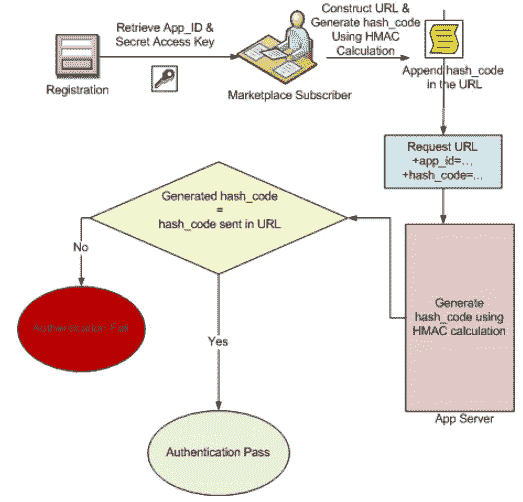
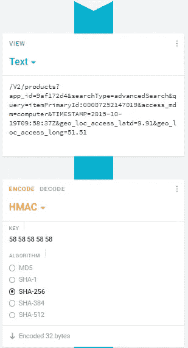
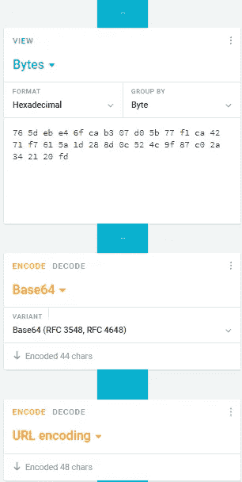
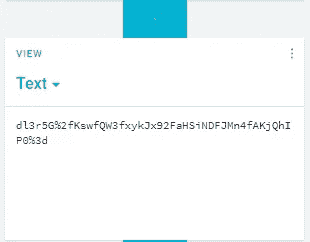

# 1WorldSync 的 API HMAC 身份验证 Python 示例

> 原文：<https://medium.com/analytics-vidhya/1worldsyncs-api-hmac-authentication-a-python-sample-31c446b945ca?source=collection_archive---------15----------------------->



图表来源:[1 世界同步内容 1 API HMAC 指南](https://marketplace.api.1worldsync.com/api/doc/1WorldSync_Content1_API_HMAC_Guide_v1.2.pdf)

在本文中，我们将讨论如何使用哈希消息认证码(HMAC)正确地对 1WorldSync 的 Content1 API 进行身份验证，使用 Python 作为编码语言。

若要开始，您需要 1WorldSync 客户端 id 和客户端密码。为了获得客户端凭据，您必须是订阅的开发人员。有关如何订阅的更多信息，请参考 Content1 API HMAC 指南。

HMAC =哈希消息验证码。1WorldSync Content1 APIs 利用 HMAC 认证来验证正在进行的调用。HMAC 认证的过程包括构建一个 ***定制字符串*** ，需要使用一个秘密密钥对其进行散列，返回一个散列码。然后将哈希代码附加到请求 URL 的末尾，以验证身份验证。

我们将使用《Content1 API HMAC 指南》中的示例重复验证步骤，但是使用 Python 而不是 Java。

# **Python 包**

```
import hashlib
import hmac
import base64
import urllib
from datetime import datetime
import requests as r
```

# 变量

声明变量，例如 API 协议、域、路径和查询参数。

```
**########## API Protocol, Domain, and Path ##########**protocol = 'https://'
domain = 'marketplace.api.1worldsync.com'
path = 'V2/products'**########## Query Parameters ##########****# Required  Parameters #**app_id = '9af172d4'             #client id         
secretKey = 'XXXXX'             #client secret    
searchType ='advancedSearch'    
access_mdm ='computer' 
field = 'itemPrimaryId'         
upc = '00007252147019'          
query = "{}:{}".format(field, upc)**"""
Hard coded timestamp for sample. For real time authentication, use commented timestamp derived using datetime package.
"""**

timestamp = '2015-10-19T09:58:37Z'  
#timestamp = datetime.utcnow().strftime('%Y-%m-%dT%H:%M:%SZ') **# Optional Parameters #**geo_loc_access_latd = 9.91      # Latitude
geo_loc_access_long = 51.51     # Longitude
```

# 哈希代码

***第一步:构建自定义字符串哈希***

```
string_to_hash = "/{}?app_id={}&searchType={}&query={}&access_mdm={}&TIMESTAMP={}&geo_loc_access_latd={}&geo_loc_access_long={}".format(path, app_id, searchType, query, access_mdm, timestamp, geo_loc_access_latd,geo_loc_access_long)
```

参数在字符串中的组织顺序也非常重要，因为如果顺序改变，生成的哈希代码会有所不同。要确定变量的顺序，请参考在线 Content1 产品搜索 API 工具的产品部分中参数的出现顺序。

链接:[https://marketplace.api.1worldsync.com/api/V2/](https://marketplace.api.1worldsync.com/api/V2/)

要查看产品搜索 API 工具，请单击“产品”标题旁边的“展开操作”。

***第二步:哈希字符串&返回哈希码***

为了散列，被散列的数据和用于散列的密钥必须被转换成字节。使用的散列算法是安全散列算法 256 (SHA-256)。

```
**# Hashing Custom String #**message = bytes(string_to_hash, 'utf-8') #data bytes
secret = bytes(secretKey, 'utf-8') #key bytes
hash = hmac.new(secret, message, hashlib.sha256)**# Retrieving Hash Code #**hash_code = base64.b64encode(hash.digest())
urlencoded_hash = urllib.parse.quote(hash_code).replace('/','%2F')
```

结果，创建了一个包含哈希代码的 HMAC 对象，这是 API 请求中所需要的。HMAC 对象中的散列码被称为*摘要*。此外，根据 Content1 指南，哈希代码必须经过 Base 64 编码和 URL 编码。

*注意:urllib 包在 url 编码时不会将“/”转换为其各自的十六进制表示形式，“%2F”。因此，转换是通过替换操作强制进行的。*

**哈希码:***dl3r5G % 2 fkswfqw3fxykjx 92 fahsindfjmn 4 fakjqhip 0% 3D*

# API 获取请求

***第一步:构建请求 URL***

```
requestURL= "{}/{}/{}?app_id={}&searchType={}&query={}&access_mdm={}&TIMESTAMP={}&geo_loc_access_latd={}&geo_loc_access_long={}&hash_code={}".format(protocol, domain, path , app_id, searchType, urllib.parse.quote(query), access_mdm, urllib.parse.quote(timestamp), geo_loc_access_latd,geo_loc_access_long,urlencoded_hash) 
```

*注意:查询和时间戳参数是在请求 URL 中编码的 URL。为了安全起见，URL 对任何包含特殊字符或空格的参数进行编码。*

在这个阶段，当向 [Content1 API 在线工具](https://marketplace.api.1worldsync.com/api/V2/)提供相同的参数时，来自 Python 的请求 URL 可以通过与返回的请求 URL 进行比较来验证。

***第二步:发出获取请求***

```
**# Making the GET Request #** response = r.get(requestURL)
```

# Cryptii

*Crptii* 是一款开源的在线编码和加密工具。这个工具可以用来测试和调试哈希加密。在下面的图表中，解释了对自定义字符串进行哈希处理并为我们正在处理的示例返回正确格式化的哈希代码的流程。



*HMAC 密钥:58 58 58 58 58(十六进制)= XXXXX(字符)，示例中使用的密钥。*



# **链接**

1.  [内容 1 API HMAC 指南](https://marketplace.api.1worldsync.com/api/doc/1WorldSync_Content1_API_HMAC_Guide_v1.2.pdf)
2.  [内容 1 产品搜索 API 指南](https://marketplace.api.1worldsync.com/api/doc/1WorldSync_Content1_Product_Search_API_Guide_v3.1.6.7.pdf)