# 线性代数上的 2 个主要概念-应该知道！

> 原文：<https://medium.com/analytics-vidhya/2-major-concepts-on-linear-algebra-should-know-9376b35c5125?source=collection_archive---------28----------------------->

线性代数是数据科学的先决条件，因此在本文中，我们将尽可能以最简单的方式研究和理解几个真正重要的主题。

## 在跳入线性代数之前，什么是线性代数？

矩阵是线性变换，将向量从一个空间映射到另一个空间。

在数学中，矩阵是按行和列排列的数字、符号或表达式的矩形阵列。

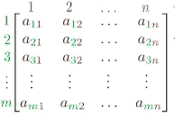

图片:谷歌

## 向量:

记住，向量总是以原点为根，即(0，0)。

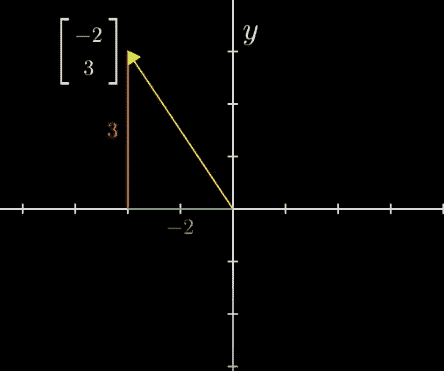

向量的图形表示。

> 记住线性代数中的每一个题目都围绕着 2 个概念:
> 1。**矢量加法**
> 2。**向量乘法**

要添加两个向量，移动第二个向量，使其尾部位于第一个向量的头部，然后从原点测量其坐标。

# 向量加法

假设，我们想要添加这两个向量:

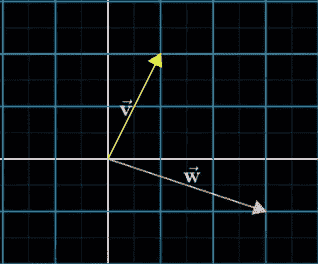

向量 v 和 w

第一步:将第二个向量(w)的尾部向第一个向量(v)的尖端移动。

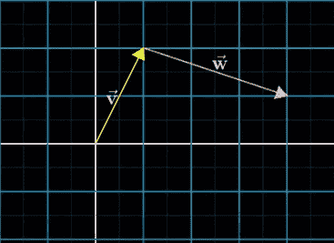

第二步:从第一个向量(v)的尾部到第二个向量(w)的顶端画一条直线。

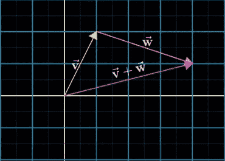

求和。

## 表示向量加法的数学形式:

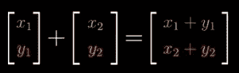

# **向量乘法:**

给定一个向量 v，如果我们想把它乘以 2:

步骤 1:画出向量 v (3，1)

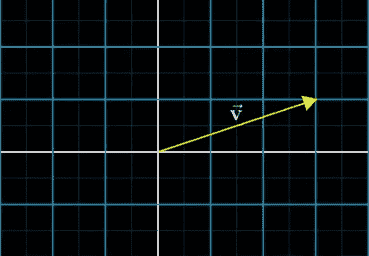

步骤 2: **拉伸**向量，使其长度为初始向量两倍(缩放 2 倍)。

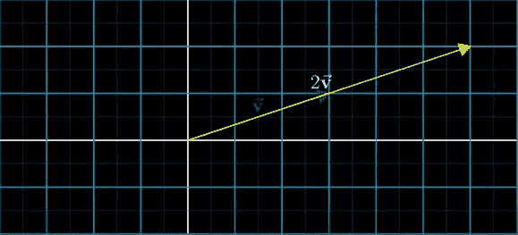

另一个例子，给定一个小于 1 的数字，我们用给定的比例将向量向下挤压。

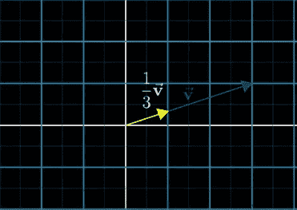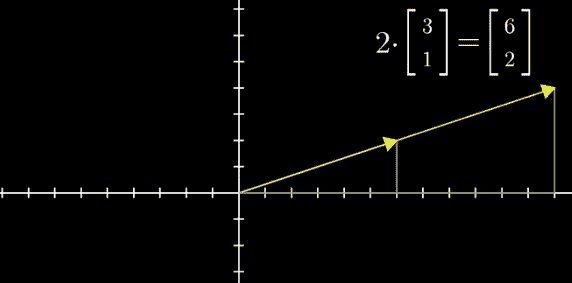

点积的表示。

> R 记住把一个**单一向量想象成一个箭头**而对于**多重向量，把它想象成点。**

# 矩阵是线性变换

所以基本上转换是函数的另一个词，一个接受输入并为每个输出输出的函数。

> 不幸的是，没有人能被告知矩阵是什么。你得自己去看。
> 
> -莫斐斯

线性代数中的一种变换，它接受一个向量并吐出另一个向量。

线性变换的重要性质:

1.  在变换过程中，所有的线都必须保持直线，不能弯曲。
2.  原点必须固定在一个地方。

矩阵变换一个给定的向量，也就是说，它给我们一个基于矩阵的新向量。

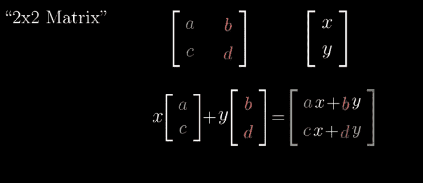

这里，[a b c d]是矩阵，而[x y]是要转换成的向量

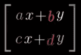

->来源: [3Blue1Brown](https://www.youtube.com/results?search_query=3blue1brown+linear+algebra) YouTube 频道。

我将在接下来的博客中提供更多关于数据科学线性代数的内容。请务必关注我和团队 AV ,了解关于有趣的机器学习/统计/数据科学主题的更多更新。

## 让我们通过 [LinkedIn](https://www.linkedin.com/in/lokeshrathi/) 联系，帮助增加知识和联系。