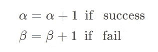
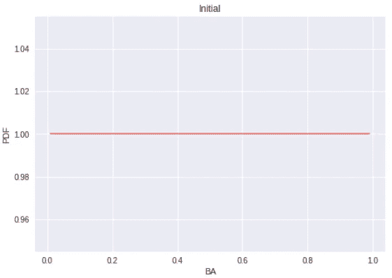
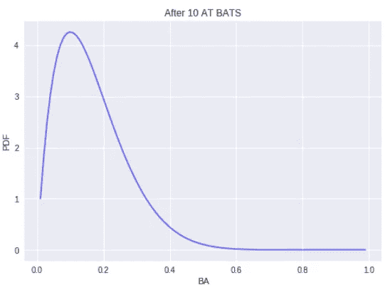
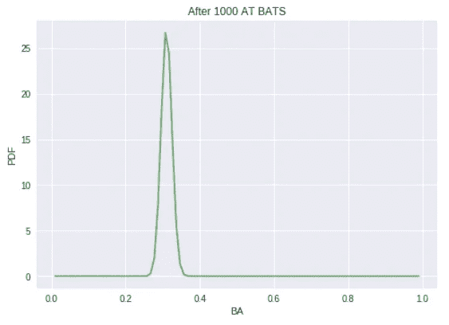
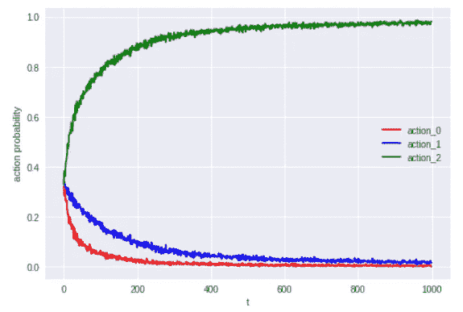

# 关于多臂土匪你需要知道的两件事——温柔地接触贝塔和汤普森

> 原文：<https://medium.com/analytics-vidhya/2-things-you-need-to-know-about-multi-armed-bandit-a-gentle-touch-on-beta-and-thompson-15cdbf901ce0?source=collection_archive---------16----------------------->

照片由来自[佩克斯](https://www.pexels.com/photo/slot-machines-3021120/?utm_content=attributionCopyText&utm_medium=referral&utm_source=pexels)的[达莉亚·桑尼科娃](https://www.pexels.com/@dariabuntaria?utm_content=attributionCopyText&utm_medium=referral&utm_source=pexels)拍摄

想象你在赌场玩得很开心。有许多老虎机，每台机器有不同的支付率。作为一个有逻辑的人，你想把你的钱放在有最大预期回报的机器上。这就是多兵种土匪问题的由来。我们将在这里涵盖两个最基本的概念:贝塔分布和汤普森抽样。

# 贝塔分布

我们使用**贝塔分布**来模拟最简单形式的多臂强盗问题，即二元结果/回报。在赌场的例子中，当结果是成功时，每台机器将支付 1 美元的奖励，当结果是失败时，支付 0 美元的奖励。我们的目标是识别成功概率最高的机器。贝塔分布是在区间[0，1]上定义的一族连续概率分布，区间由两个正形状参数参数化，用 *α* 和 *β* 表示，它们作为随机变量的指数出现并控制分布的形状。更多信息可在[这里](https://en.wikipedia.org/wiki/Beta_distribution)找到。

> 我们使用 **Beta 分布**来表示以下两个重要属性:
> 
> 1.贝塔分布被定义在 0 和 1 之间，它与我们的估计量的范围相关。
> 
> 2.后验概率是具有更新参数的β。

以棒球为例。击球率(BA)是评价一个球员的指标，我们想为一个真实 BA 为 30%的新球员估算 BA。由于新球员没有任何击球历史，我们可以假设估计的 BA 的分布遵循 Beta(1，1)，即我们的估计在 0 和 1 之间平均分布。

随着游戏的进展，我们可以收集更多的数据，并对玩家的 BA 做出更好的估计。利用β的性质，我们观察到在 10 AB(在蝙蝠时)之后，估计的 BA 为~10%，但是在 1000 AB 之后非常接近真实值 30%([代码](https://github.com/colawhite/abtesting/blob/master/multi_armed_bandit_intro.ipynb))。

# 汤普森取样

继续讨论，我们使用 3 个带有 Beta 分布的老虎机来解释 Thompson 采样的工作原理。槽 0、1 和 2 的真实成功概率分别是 0.7、0.8 和 0.9，然而概率是未知的。我们的目标是识别成功概率最高的机器。

同样，由于我们没有信息，我们假设所有 3 台机器都具有相同的先验分布 Beta(1，1)，即 3 台机器被选中进行实验的可能性相同。在开始时间 t = 0，我们运行 1000 个实验，并观察到机器 0、1 和 2 分别被选择 324、345 和 331 个实验。然后，我们使用实验结果更新三台机器的β分布的 *α* 和 *β* ，然后使用更新后的β作为接下来 1000 次实验在时间 t = 1 的新先验概率。我们继续这个过程，直到 t = 1000，结果如下所示([代码](https://github.com/colawhite/abtesting/blob/master/BernThompson_basic.ipynb))。汤普森抽样让我们能够识别真正的最佳机器(机器#2)。这个例子也被称为贝塔-伯努利强盗。

# 概述

读完这篇文章你应该知道 1)什么是贝塔分布，为什么我们假设贝塔分布；以及 2)如何应用 Thompson 采样来解决最简单的多臂土匪问题。下次见！

# 参考

1.  [https://arxiv.org/pdf/1707.02038.pdf](https://arxiv.org/pdf/1707.02038.pdf)
2.  [https://en.wikipedia.org/wiki/Beta_distribution](https://en.wikipedia.org/wiki/Beta_distribution)