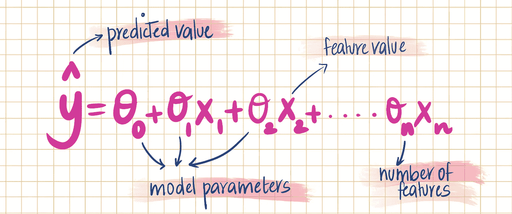
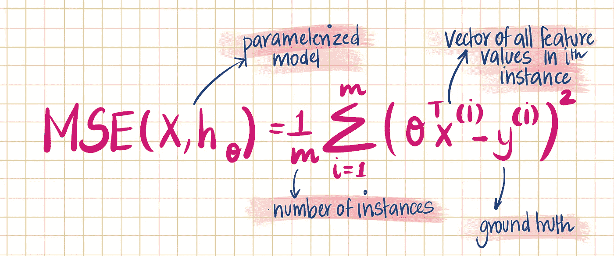
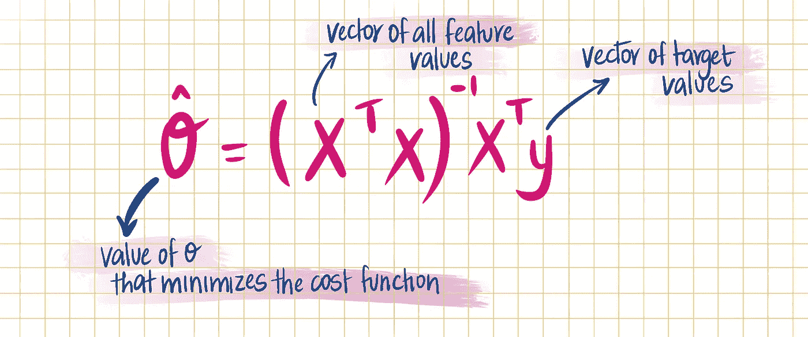
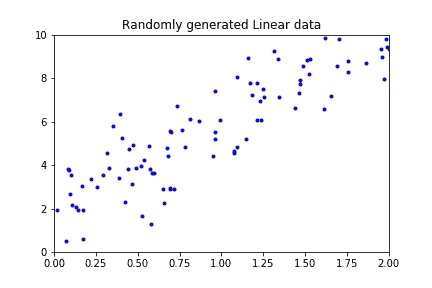
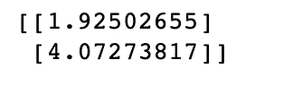
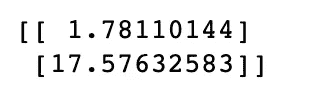
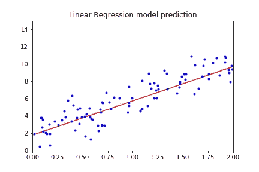
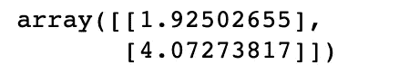
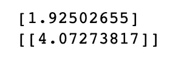

# 训练线性回归模型的两种方法-第 1 部分

> 原文：<https://medium.com/analytics-vidhya/2-ways-to-train-a-linear-regression-model-part-1-e643dbef3df1?source=collection_archive---------3----------------------->


最简单的监督机器学习模型之一是*线性回归*。在本帖中，我们将讨论训练线性回归模型的两种不同方法。

在详细解释每一个之前，让我快速地列出它们:

1.列车使用*闭式方程*

2.列车采用*梯度下降*

第一种方式*直接*计算最适合模型的模型参数，第二种方式*迭代计算*。我将在本帖中讨论封闭型方程，并将创建第二部分，讨论梯度下降及其变体。

**但是首先，线性模型是如何做出预测的？**

线性回归包括通过数据找到最合适的直线。这条最佳拟合线就是我们所说的回归线。线性模型通过计算输入要素的加权和以及一个称为*偏差*项的常数来进行预测

线性回归模型预测的方程可以由下式给出:



**我们如何训练这个模型？**

你看到等式中不同的θ了吗？这些被称为*模型参数。为了训练一个模型，我们需要找到使成本函数*最小化的θ(模型参数)的值。有两种方法可以做到这一点！但首先，让我们定义我们的成本函数。

回归模型最常见的性能度量是 RMSE。因此，我们需要找到使 RMSE 最小的θ值。但实际上，最小化 MSE 要容易得多。假设我们试图最小化的成本函数是*均方误差。*使用下面的等式计算 MSE



现在我们已经定义了成本函数，让我们继续前进，进入寻找最佳模型参数值(θ)的第一种方法。

1.  **“封闭形式”方程**

有一个数学方程可以直接计算模型参数。这个方程叫做*正规方程。*你可以在这里阅读更多关于正规方程[。法线方程由下式给出:](https://www.geeksforgeeks.org/ml-normal-equation-in-linear-regression/)



但是把我们所有的值代入这个方程。我们将能够计算出使我们的成本函数最小化的最佳模型参数。简单对吗？让我们在线性生成的数据上测试该等式。

```
X = 2*np.random.rand(100,1)
#add X0 = 1 to each instance(bias term)
X_b = np.c_[np.ones((100,1)), X]
y = 2+4*X +np.random.randn(100,1)fig = plt.figure()
plt.plot(X,y,"b.")
plt.axis([0,2,0,10])
plt.title("Randomly generated Linear data")
plt.show()
fig.savefig('result1.png')
```



```
# Normal equation
theta_cap = np.linalg.inv(X_b.T.dot(X_b)).dot(X_b.T).dot(y)print(theta_cap)
```



我们用来生成数据的函数是 2+4x+噪声。法线方程已经计算出足够接近的θ0 和θ1 值！让我们写一些代码来做预测

```
X_new = np.array([[0],[4]])
X_new_b = np.c_[np.ones((2,1)), X_new]y_predict = X_new_b.dot(theta_cap)
print(y_predict)plt.plot(X_new, y_predict,"r-")
plt.plot(X,y,"b.")
plt.title("Linear Regression model prediction")
plt.axis([0,2,0,15])
plt.show()
```



而正规方程计算 X^T X 的逆，计算复杂度几乎是 O(n^3)，如果你还没搞清楚这是不好的！在 O(n^2 时间有另一种方法可以解决这个问题。这种方法使用称为 ***奇异值分解的矩阵分解技术来计算 X 的*伪逆*。*** 简单来说，SVD 将矩阵 **X** 分解为 3 个矩阵的矩阵乘法。更多关于 SVD 的信息可以在[这里](/@abdullatif.h)找到。使用 Numpy 的线性代数模型中的 *pinv()* 函数可以实现这一点。

```
np.linalg.pinv(X_b).dot(y)
```



**为什么奇异值分解比正规方程更有效？**

a.正规方程只有在 X^T X 可逆或奇异时才有效。另一方面，伪逆总是被定义的。

b.如上所述，SVD 比正规方程具有更少的计算复杂度。

但是当*特征和实例的数量很大*时，这两种方法都非常慢。这就是为什么下一种训练模型的方法可能更适合这种情况。我将在我的第二部分文章中讨论这个问题。

让我们通过对生成的数据集进行简单的 Scikit-Learn 线性回归实现来结束这篇文章，并看看我们是否可以获得类似于由 Normal Equation 计算的模型参数。

```
from sklearn.linear_model import LinearRegression
lin_reg = LinearRegression()
lin_reg.fit(X,y)
print(lin_reg.intercept_)
print(lin_reg.coef_)
```



你瞧，确实如此！注意 sklearn 如何给出与计算 *pinv()相同的结果。*那是因为 sklearn 计算 x 的伪逆。

**结论**

在这篇博客中，我们了解到:

1.  线性模型如何进行预测—线性回归的一般方程
2.  如何训练一个模型并使代价函数最小化——**均方误差**的方程
3.  使用封闭形式方程训练线性回归模型的第一种方法——**正规方程**
4.  法线方程的简单实现
5.  使用**奇异值分解**计算*伪逆*
6.  线性回归的 Scikit-learn 实现

如果你喜欢这个博客，请留下掌声或评论。它让我知道我的博客是有帮助的:)祝大家学习愉快！

**参考文献**

1.用 Scikit-Learn 和 TensorFlow 进行机器学习:构建智能系统的概念、工具和技术。奥雷连·杰龙的书。