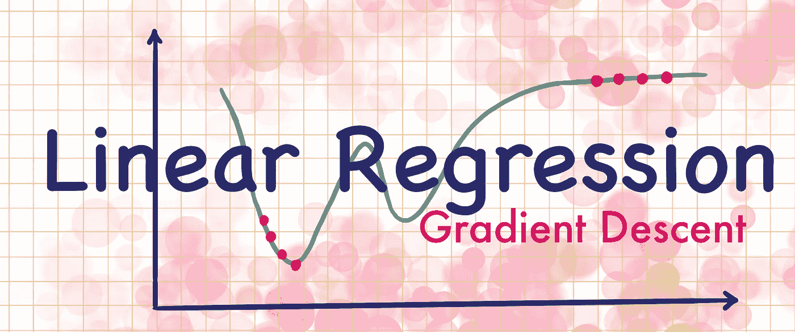
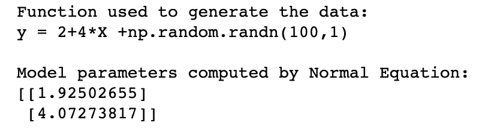
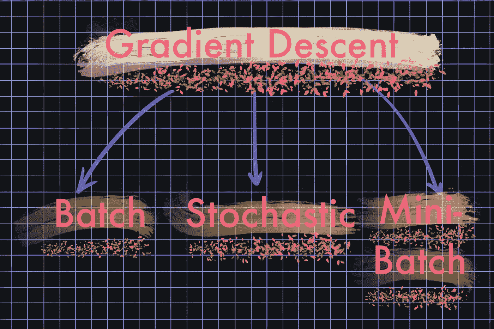
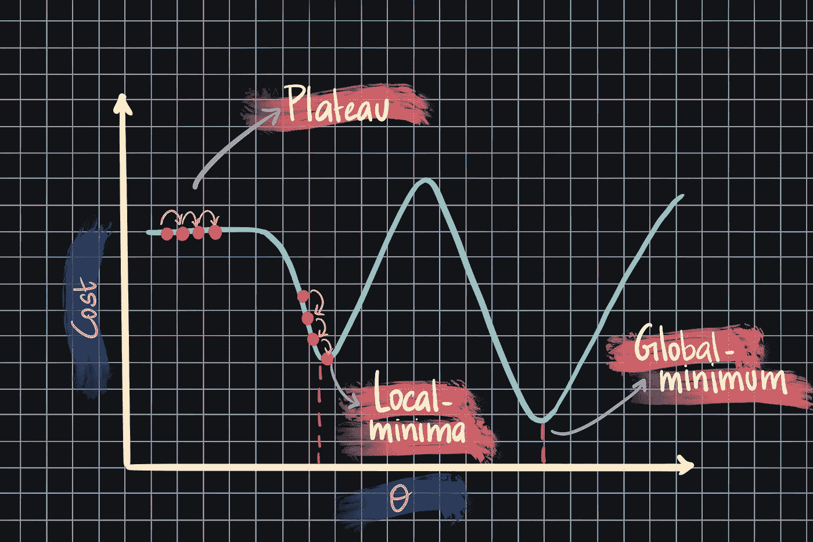
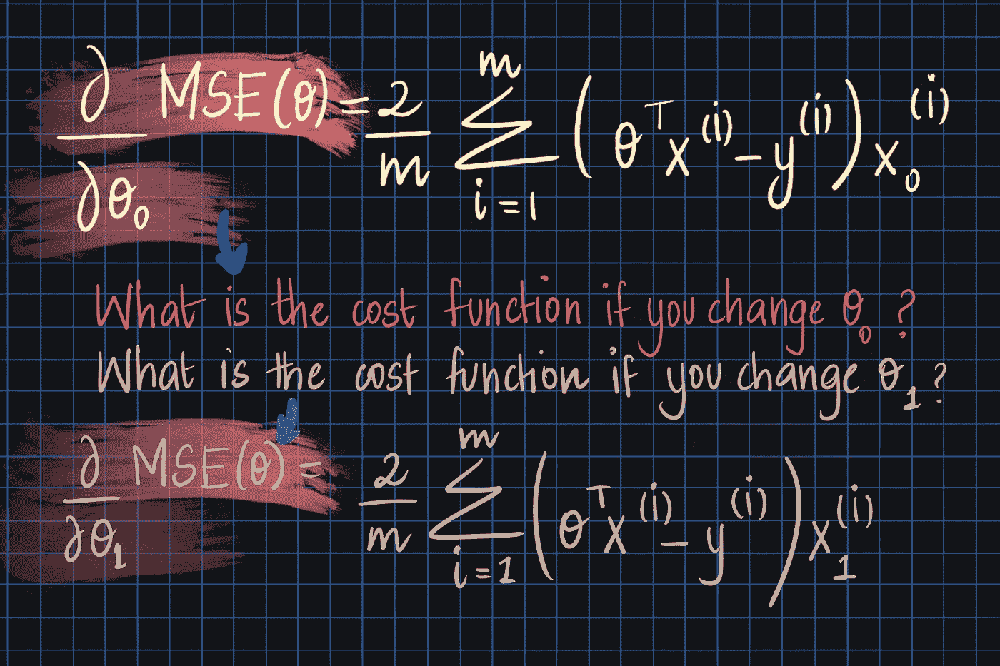
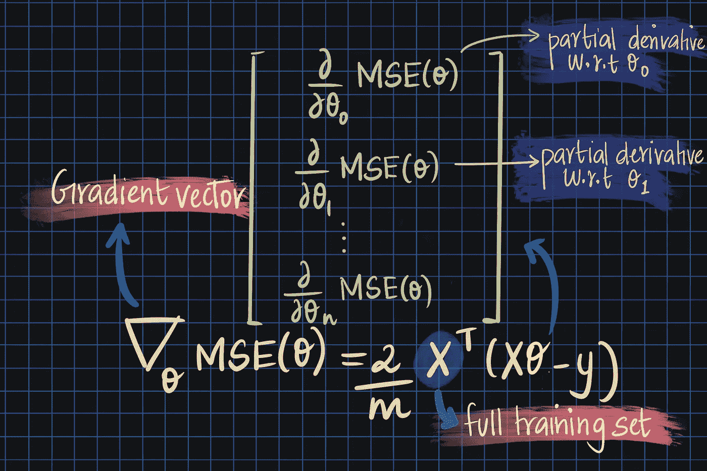
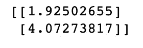
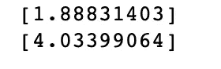

# 训练线性回归模型的两种方法-第 2 部分

> 原文：<https://medium.com/analytics-vidhya/2-ways-to-train-a-linear-regression-model-part-2-fdeb50fc58fa?source=collection_archive---------15----------------------->

在之前的[帖子](https://jeffyjacob.medium.com/2-ways-to-train-a-linear-regression-model-part-1-e643dbef3df1)中，我们讨论了如何使用**正态方程直接计算最适合训练集*的线性回归模型的模型参数(θ)。***在本帖中，我们将讨论使用**梯度下降的第二种训练方式。**



计算正常方程听起来很简单，它给我们的模型参数接近用于生成数据的原始函数的参数。*那么，我们为什么需要第二种培训方法呢？*



法线方程计算θ值 1.9 和 4.0，接近原始参数 2 和 4

原因是，当数据集包含大量实例或大量特征时，*法线方程*和 *SVD* 方法非常慢。如果数据集太大，甚至无法放入内存，该怎么办？你必须采用一种*非核心学习*技术。幸运的是，**梯度下降**就是其中之一。

# **梯度下降**

G 梯度下降法是一种优化技术(并不局限于线性回归)，能够找到一系列问题的最佳解决方案。

> “梯度下降的一般思想是反复调整参数，以最小化成本函数”Aurelien Geron 的机器实践学习

**梯度下降的步骤**

1.  从给θ分配随机值开始——这一步称为*随机初始化*步骤。
2.  接下来，反复调整这些值，直到算法收敛到最小成本函数。

梯度下降有几种不同的变体。各有利弊。它们列举如下:



我们稍后将讨论更多细节。但是现在让我们来谈谈成本函数 MSE(均方误差)以及它如何影响我们的搜索。根据成本函数，对最优解的搜索变得更有挑战性或不那么有挑战性。例如，MSE 成本函数看起来像一个漂亮、规则的碗形。其他成本函数可能具有平台、脊和洞，使得梯度下降更难找到最优解。

*2 GD 面临的挑战*(我从现在开始这样称呼梯度下降)*有:*

1.  收敛到局部最小值而不是全局最小值。
2.  长时间被困在高原上

下图描述了这两种挑战:



幸运的是，线性回归的成本函数 MSE 是碗形的，因此最优解位于碗的底部。它就是我们所说的一个*凸*和*连续*的函数。这对我们意味着什么？我们保证只有一个全局最优解！

让我们重申我们在这里试图做的事情:我们试图找到最佳的模型参数，使训练集上的成本函数最小化。我们使用一种叫做*梯度下降*的优化技术来迭代搜索模型参数空间。跟我到目前为止？好的，太好了！

# **批量梯度下降**

B *atch GD 在每个 GD 步骤使用整批训练数据。*如果您有大量实例，这可能会非常慢，但是它可以很好地扩展大量的特性(比普通方程快得多)。

> *批量 GD 在每个 GD 步骤使用整批训练数据。*

我还告诉你一个梯度下降中很重要的参数叫做*“学习率”。*选择一个好的学习率很重要，因为小的学习率会导致算法收敛得太晚，而大的学习率可能会错过全局最优。您可以将学习率视为超参数，并使用*网格搜索来确定它。*

要实现梯度下降，您需要计算成本函数相对于每个模型参数的偏导数。MSE 相对于θ0 和θ1 偏导数如下所示:



这些被计算并存储在称为*梯度矢量*的矢量中。梯度向量如下所示:



请注意，梯度矢量指向上坡。为了下山(碗的尽头)，我们需要从学习率中减去它。看起来我们有所有的方程式来实现它。所以我们来试试吧！

```
eta = 0.1
n_iterations = 1000
m = 100 # number of instancestheta = np.random.randn(2,1)
for itr in range(n_iterations):
    gradient_vector = 2/m *X_b.T.dot(X_b.dot(theta) - y)
    theta = theta - eta *gradient_vector
print(theta)
```



我们得到了与**正规方程**完全相同的结果。在线性回归中使用批量 GD 的一个优点是，我们可以保证在正确的学习速率下，算法最终会收敛到全局最优。

**使用梯度下降的缺点**

1.  我们知道批处理 GD 在每一步都需要整个数据集。因此，如果你有一个很大的训练集，它会变得非常慢。
2.  其次，批量 GD 通常会陷入局部最小值，因为成本函数下降非常缓慢，并且与其他变量(如随机 GD)相比*非常规则*，随机 GD 可以跳出局部最小值，因为如果其*不规则*。当然，这对我们来说不是问题，因为我们的成本函数没有局部最小值。

# **随机梯度下降**

术语“随机”的意思是*随机决定。*随机 GD 正是这么做的。它在每一步的训练集中随机选取一个实例。渐变是基于该单个实例计算的。因此，使用这种方法在巨大的数据集上进行训练是可能的。

> 它在每一步的训练集中随机选取一个实例。

随机 GD 是*非常不规则，*意思是到处都是！成本函数不断上下跳动。最终它会接近最小值，但即使这样，它也会继续反弹，而不是稳定下来。因此，我们不能保证模型参数值是最佳的。但是他们可能非常接近。

但由于其不规则性，不太容易陷入局部最优。它会从那里弹开的！让我们看看随机 GD 的 sklearn 实现:

> 随机性是好事也是坏事！

```
#sklearn implementation of Stochastic GDfrom sklearn.linear_model import SGDRegressor
sgd_reg = SGDRegressor(max_iter = 500, tol = 1e-3, penalty = None, eta0 = 0.1)
sgd_reg.fit(X, y.ravel())
print(sgd_reg.intercept_)
print(sgd_reg.coef_)
```



# **小批量梯度下降**

如果你理解了批量和随机 GD，那么迷你批量就没那么难了。它会随机挑选一组称为“小批量”的实例。小批量的优势在于它比随机批量更有规律，这意味着它更接近全局最优。

> 它会随机挑选一组称为“小批量”的实例。

这些类型之间唯一的主要区别是它们遍历参数空间的方式。批次 GD 可以被认为是一条朝向最小值的平滑线，它在那里停止。随机和小批量 GD 在遍历的方式上比较曲折，继续走来走去。

您可以使用 SGDRegressor 的 *partial_fit* 方法实现小批量 GD。有关实现的更多详细信息，请查看此[文章](https://adventuresindatascience.wordpress.com/2014/12/30/minibatch-learning-for-large-scale-data-using-scikit-learn/)。

# **结论**

在这篇博客中，我们了解到:

1.  训练线性回归模型的第二种方法(当数据集很大时)-使用梯度下降。第一种方法，参考我之前的[博客](https://jeffyjacob.medium.com/2-ways-to-train-a-linear-regression-model-part-1-e643dbef3df1)。
2.  MSE 代价函数的性质——*凸*和*连续*函数
3.  梯度下降的不同挑战。
4.  批量 GD 的简单实现
5.  随机 GD 的 Scikit-Learn 实现
6.  批量、随机、小批量梯度下降——其优点和缺点。

如果你喜欢这个博客，请留下掌声或评论。它让我知道我的博客是有帮助的:)祝大家学习愉快！

# **参考文献**

1.用 Scikit-Learn 和 TensorFlow 进行机器学习:构建智能系统的概念、工具和技术。奥雷连·杰龙的书。