# Web 开发的 20 个最佳代码扩展| 2020 年 8 月

> 原文：<https://medium.com/analytics-vidhya/20-best-vs-code-extensions-for-web-development-aug-2020-b02ac82bc860?source=collection_archive---------4----------------------->

## 使用这些扩展，让您的生活更轻松，享受编程的乐趣


VS 代码并不完美。

它很棒，但并不完美。仍然缺少许多重要的东西。

幸运的是，VS Code 最大的优势之一是它的社区，它不知疲倦地工作来贡献自己缺少的功能。

从更好的 git 集成，通过拼写检查器，到集成的 SVG 编辑器。这里列出了一些最好的，社区已经提供。

# 更漂亮—代码格式化程序

*by beauty**790 万安装*

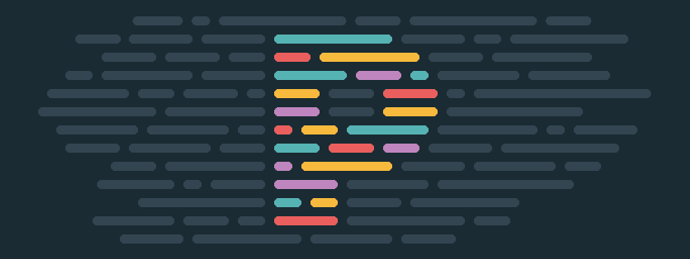

自动格式化代码的最流行的 VS 代码扩展。它支持 JavaScript，TypeScript，CSS，SCSS，HTML，Markdown 等等。

它将使用你的项目目录中的[更漂亮的](https://prettier.io/)配置文件，以及 VS 代码设置作为后备。

👉 [**下载**](https://marketplace.visualstudio.com/items?itemName=esbenp.prettier-vscode)

# 埃斯林特

*Dirk Baeumer 1050 万次安装*


[来源](https://marketplace.visualstudio.com/items?itemName=dbaeumer.vscode-eslint)

这个扩展将流行的 ESLint 集成到 VS 代码中。它将帮助你找到&修复你代码中的问题。

它使用安装在项目目录或全局安装中的 ESLint 库作为后备。您可以在[扩展页面](https://marketplace.visualstudio.com/items?itemName=dbaeumer.vscode-eslint)上找到安装和配置说明。

👉 [**下载**](https://marketplace.visualstudio.com/items?itemName=dbaeumer.vscode-eslint)

# 吉特朗斯

*Eric Amodio 610 万次安装*


[来源](https://marketplace.visualstudio.com/items?itemName=eamodio.gitlens)

这个扩展对于任何开发者来说都是必不可少的。它提供了普通 VS 代码所没有的所有 git 功能。它可以很容易地取代大多数独立的 Git 程序。

只是一些我最喜欢的功能。

*   完整存储库视图
*   文件和行历史视图
*   当前行和状态栏错误
*   提交搜索和比较

完整的特性列表可以是一整本书。如果您只安装列表中的一个扩展，就用这个吧。

**👉**下载下载

# Visual Studio 智能代码

*微软 660 万次安装*

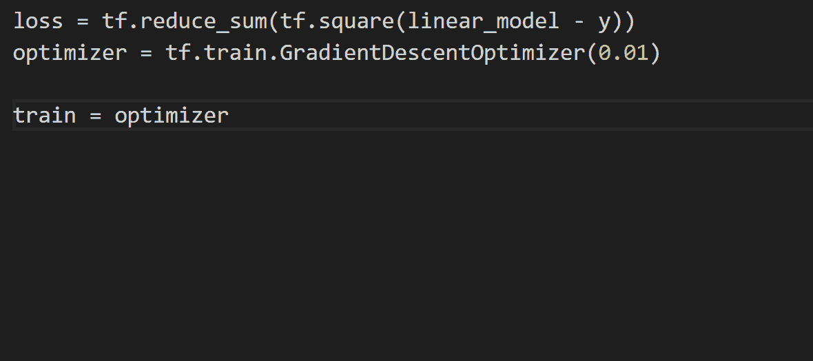

[来源](https://marketplace.visualstudio.com/items?itemName=VisualStudioExptTeam.vscodeintellicode)

该扩展将把最相关的完成建议移到顶部。这听起来可能没什么，但实际上真的很好。我无法想象没有它的生活，我相信你也会喜欢它的。

在写作的时候，它与 JavaScript，TypeScript，Python 和 Java 兼容。

👉 [**下载**](https://marketplace.visualstudio.com/items?itemName=VisualStudioExptTeam.vscodeintellicode)

# 远程开发

*微软在所有 3 个扩展中安装了大约 600 万个*

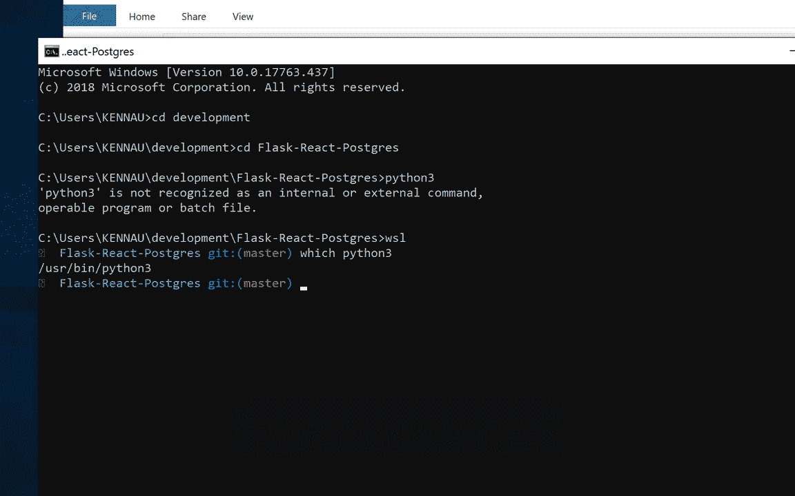

[来源](https://marketplace.visualstudio.com/items?itemName=ms-vscode-remote.remote-wsl)

这实际上是一个扩展包，允许你打开一个容器中的任何文件夹，在一个远程机器/虚拟机上或者在 [WSL](https://docs.microsoft.com/en-us/windows/wsl/) 中。

我特别喜欢将它与 WSL 一起使用，并认为它是任何 WSL 编码工作流的必备工具。

👉 [**下载**](https://marketplace.visualstudio.com/items?itemName=ms-vscode-remote.vscode-remote-extensionpack) 包含所有 3 个扩展的整个包…

…或者只选择您需要的扩展

*   [**远程—宋承宪**](https://marketplace.visualstudio.com/items?itemName=ms-vscode-remote.remote-ssh)
*   [**远程—集装箱**](https://marketplace.visualstudio.com/items?itemName=ms-vscode-remote.remote-containers)
*   [**远程— WSL**](https://marketplace.visualstudio.com/items?itemName=ms-vscode-remote.remote-wsl)

# Chrome 调试器

*微软 620 万次安装*


[来源](https://marketplace.visualstudio.com/items?itemName=msjsdiag.debugger-for-chrome)

这个扩展允许你从 VS 代码内部调试运行在 Chrome 浏览器中的 JavaScript 代码。

它也可以和其他支持 Chrome DevTools 协议的浏览器一起工作，比如 Vivaldi。

**其他浏览器的调试器也可用:**

*   火狐浏览器的调试器
*   【Edge 的调试器

这个扩展将很快被 [JavaScript 调试器](https://marketplace.visualstudio.com/items?itemName=ms-vscode.js-debug-nightly)所取代，它应该会成为 VS Code 的新内置调试器。但目前还是不错的选择。

👉 [**下载**](https://marketplace.visualstudio.com/items?itemName=msjsdiag.debugger-for-chrome)

# Git 图

*由 mhutchie 605k 安装*


[来源](https://marketplace.visualstudio.com/items?itemName=mhutchie.git-graph)

GitLens 唯一缺少的一个特性是库的可视化图形。但是这个扩展解决了这个问题。

您可以一目了然地查看整个提交历史。

**👉** [**下载**](https://marketplace.visualstudio.com/items?itemName=mhutchie.git-graph)

如果你不喜欢这个，你可能会发现 GitHistory 是个不错的选择。

# 括号对着色程序 2

*由 CoenraadS 提供 120 万次安装*


[来源](https://marketplace.visualstudio.com/items?itemName=CoenraadS.bracket-pair-colorizer-2)

当你的代码中有很多括号、大括号和圆括号时，很难找到每个代码块的开始和结束位置。

通过用相同的颜色标记匹配的括号对，它可以让您轻松找到您所在的范围。

您甚至可以自定义颜色以及匹配哪些令牌。

> 这个扩展有两个版本，即使第一个版本有更多的下载，你也应该使用第二个版本。更快更准。

👉 [**下载**](https://marketplace.visualstudio.com/items?itemName=CoenraadS.bracket-pair-colorizer-2)

如果你想参加🌈彩虹异能更上一层楼，检出 [**缩进彩虹**](https://marketplace.visualstudio.com/items?itemName=oderwat.indent-rainbow) 。除了对代码前面的缩进，它做同样的事情。

# 使…变成彩色

*由 kamikiller to 130k 安装*

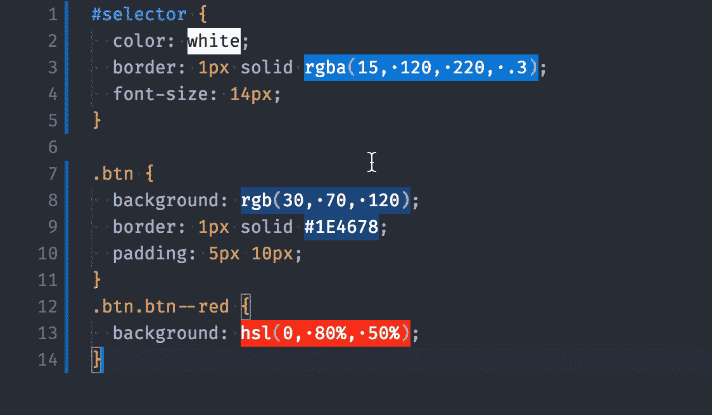

[来源](https://marketplace.visualstudio.com/items?itemName=kamikillerto.vscode-colorize)

帮助您可视化 CSS 颜色。甚至可以使用预处理变量和 CSS 自定义属性。

如果你使用 CSS-in-JS 库，比如 styled-components 或者 emotion，你应该把 JavaScript 添加到`settings.json`中的 languages 数组中

```
"colorize.languages": [
    /* ... */
    "javascript",
    "javascriptreact",
    /* if you use typescript */
    "typescript",
    "typescriptreact"
]
```

如果您还想添加其他语言，请查看所有可用的语言标识符[](https://code.visualstudio.com/docs/languages/identifiers)**。**

**👉 [**下载**](https://marketplace.visualstudio.com/items?itemName=kamikillerto.vscode-colorize)**

# **颜色选择器**

***由安塞基 580k 安装***

**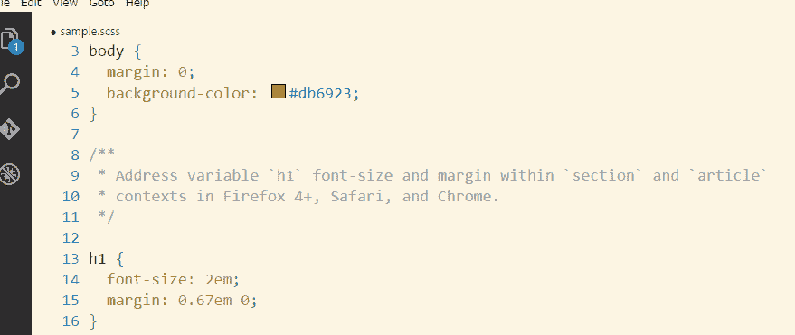**

**[来源](https://marketplace.visualstudio.com/items?itemName=anseki.vscode-color)**

**如果你经常使用 CSS，这本书很适合你。它允许你修改和转换任何颜色，使用任何颜色空间和符号。**

**不像内置的颜色选择器，它可以在任何文件中工作，所以如果你使用 CSS-in-JS，它是完美的。**

**有多种样式的 picker 小部件，从小型到超大，都有很棒的东西。**

****👉** [**下载**](https://marketplace.visualstudio.com/items?itemName=anseki.vscode-color)**

****注意:**如果拾色器显示不正确，试试这个(从官方扩展页面):**

1.  **如果对话框显示不正确，将`colorHelper.disableGpu`设置为`1`。**
2.  **如果这个问题还没有解决，将`colorHelper.disableShadow`设置为`true`。**
3.  **如果这个问题还没有解决，将`colorHelper.disableTransparent`设置为`true`。**
4.  **如果还没有解决，请访问[支持页面](https://github.com/anseki/vscode-color/issues)。**

# **待办事项突出显示**

***由瓦优刘 110 万安装***

**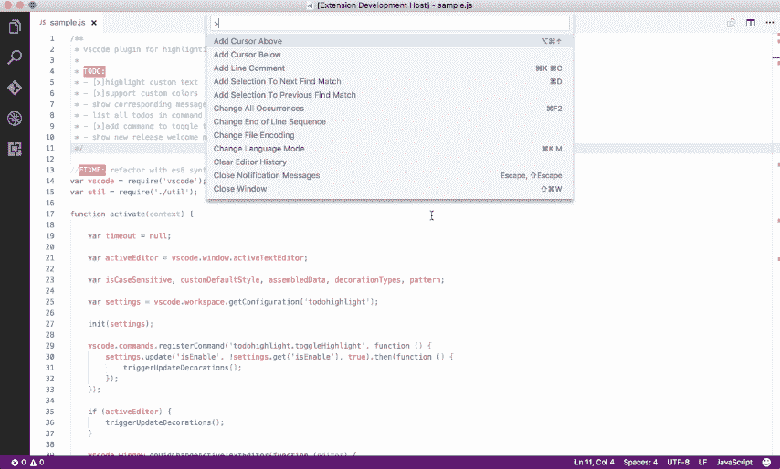**

**[来源](https://marketplace.visualstudio.com/items?itemName=wayou.vscode-todo-highlight)**

**我喜欢在代码中添加`TODO`注释，但是我经常忘记它们。如果你和我一样，这个扩展将是你的救命稻草。**

**它突出显示了所有的`TODO`和`FIXME`以及其他注释，让人无法错过。**

**最重要的是，它是完全可定制的。**

****👉** [**下载**](https://marketplace.visualstudio.com/items?itemName=wayou.vscode-todo-highlight)**

# **代码拼写检查器**

***街边软件 160 万次安装***

****

**[来源](https://marketplace.visualstudio.com/items?itemName=streetsidesoftware.code-spell-checker)**

> **为什么我需要代码拼写检查器？ *—我，不久前***

**其实真的很有帮助。它帮助您避免变量名、注释以及最重要的:正文中令人尴尬的错别字。如果你将鼠标悬停在带下划线的单词上并点击“快速修复”,它会向你显示建议，并允许你将该单词添加到你的词典中。**

**最让我惊讶的是它处理 camelCase 和其他我们命名变量和函数的常见方式有多好。**

> ***默认情况下，扩展只支持英语，但有很多附加词典可用。只要在扩展市场上搜索“拼写检查”，你就会找到它们。***

****👉** [**下载**](https://marketplace.visualstudio.com/items?itemName=streetsidesoftware.code-spell-checker)**

**如果你安装了很多扩展，你的状态栏可能会变得非常拥挤。这里有一个关于如何驯服这种混乱的提示👇**

# **版本镜头**

***由 pflannery 476k 安装***

**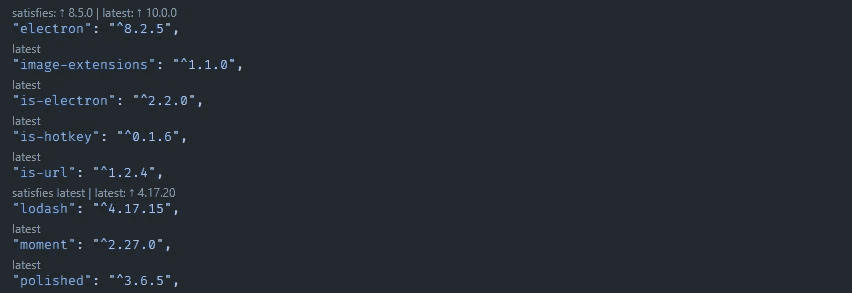**

**我很惊讶更多的人不知道这个扩展。**

**它显示了您的`package.json`中所有 NPM 软件包的最新版本。它甚至提供了包版本的自动完成功能，这样你就可以准确地看到哪些版本是可用的，而不用检查 NPM。**

**👉 [**下载**](https://marketplace.visualstudio.com/items?itemName=pflannery.vscode-versionlens)**

# **GitHub 拉请求和问题**

***由 GitHub 680k 安装***

**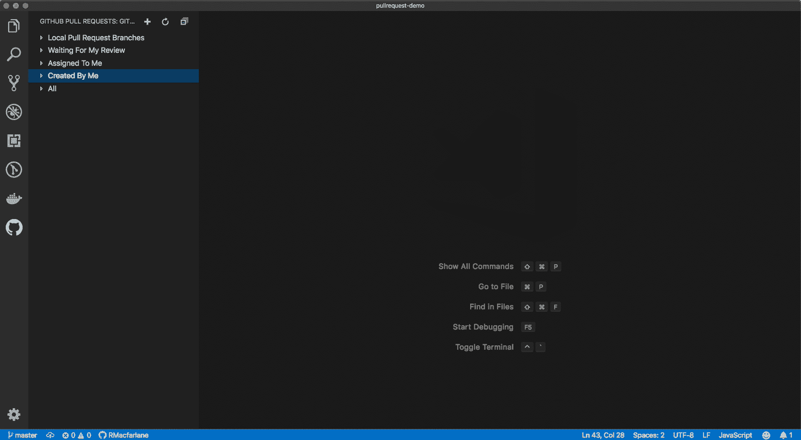**

**[来源](https://marketplace.visualstudio.com/items?itemName=GitHub.vscode-pull-request-github)**

**如果你经常处理 GitHub pull 请求和问题，你应该看看这个官方的 GitHub 扩展。**

**其中，它允许您直接从 VS 代码中浏览 PRs 并与之交互。**

**👉 [**下载**](https://marketplace.visualstudio.com/items?itemName=GitHub.vscode-pull-request-github)**

# **Svg 预览**

***由西蒙·西弗克 40k 安装***

**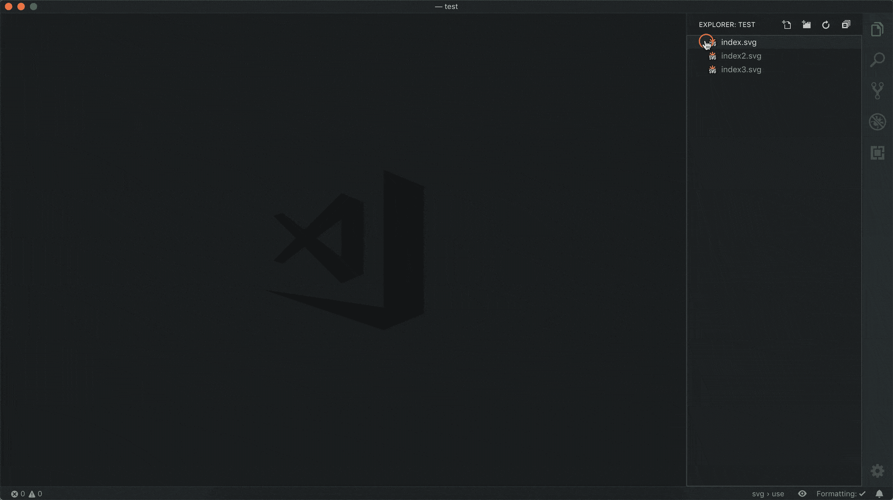**

**[来源](https://marketplace.visualstudio.com/items?itemName=SimonSiefke.svg-preview)**

**预览自定义 SVG 图标和插图的好方法。您甚至可以编辑 SVG 代码并实时查看变化。**

**使用鼠标移动图像，使用鼠标滚轮放大/缩小图像。**

**该扩展提供了两个选项:“自动打开”和“缩放以适应”。我建议关闭“自动打开”，因为它会变得很烦人。您可以使用键盘快捷键`ctrl+alt+p`或使用标签栏上的按钮打开预览(就像使用 markdown 一样)。**

**您还可以为预览提供自定义样式，说明在扩展页面上。**

****👉** [**下载**](https://marketplace.visualstudio.com/items?itemName=SimonSiefke.svg-preview)**

# **切换报价**

***由 brites now 39k 安装***

**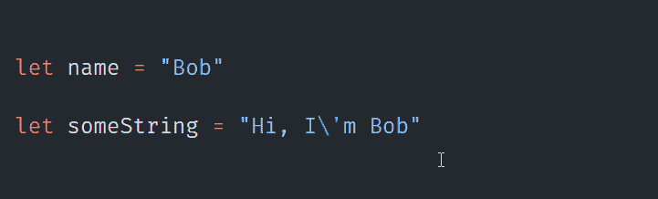**

**名字说明了一切。它允许你通过键盘快捷键切换不同的报价。**

**当您想要用[模板文字](https://developer.mozilla.org/en-US/docs/Web/JavaScript/Reference/Template_literals)快速替换一个普通字符串时特别有用。**

****👉** [**下载**](https://marketplace.visualstudio.com/items?itemName=BriteSnow.vscode-toggle-quotes)**

# **零钱盒**

***由 wmaurer 328k 安装***

**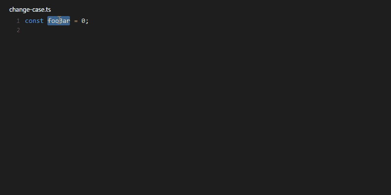**

**[来源](https://marketplace.visualstudio.com/items?itemName=wmaurer.change-case)**

**下一个简单但很棒的类别是:零钱盒。它允许你…你猜对了:改变大小写😛。**

**它允许您在`camelCase`、`snake_case`、`CONSTANT_CASE`等之间快速切换。**

**您可以直接从命令选项板更改大小写。但是在我看来，最好的使用方法是将`extension.changeCase.commands`命令绑定到一个快捷键上。它会打开一个下拉列表，包含所有可能的转换选项和预览。**

**是的，它支持多个光标。**

****👉** [**下载**](https://marketplace.visualstudio.com/items?itemName=wmaurer.change-case)**

# **Windows 终端集成**

***由 Daniel Imms 2k 安装***

**如果你在 windows 上编程，并且没有使用新的 Windows 终端，你就错过了。**

**这个简单的扩展允许你在 Windows 终端中从 VS 代码侧边栏打开任何文件夹。最棒的是。你甚至可以选择个人资料。CMD？PowerShell？巴什？选择权在你。**

****👉** [**下载**](https://marketplace.visualstudio.com/items?itemName=Tyriar.windows-terminal)**

# **项目管理人**

***Alessandro Fragnani 110 万次安装***

**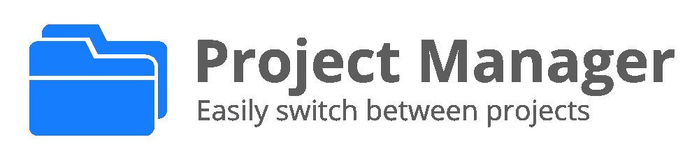**

**[来源](https://marketplace.visualstudio.com/items?itemName=alefragnani.project-manager)**

**这是一个非常简单的扩展，允许你保存并在你的项目之间快速转换。**

**👉 [**下载**](https://marketplace.visualstudio.com/items?itemName=alefragnani.project-manager)**

# **进口成本**

***由 Wix 730k 安装***

**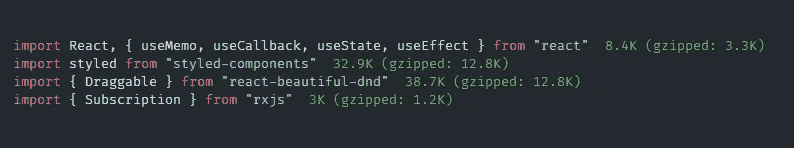**

**如果你疯狂进口，这个扩展会提醒你放慢速度🤪**

**我并没有一直启用它，它也不能让您准确地看到您的包有多大，但是我喜欢不时地打开它，**

**👉 [**下载**](https://marketplace.visualstudio.com/items?itemName=wix.vscode-import-cost)**

**感谢阅读。如果我错过了你最喜欢的扩展，请在评论中告诉我，我可能会把它添加到列表中。**

## **您可能会感兴趣的其他文章:**

**[](/web-dev-beyond/best-free-programming-fonts-2020-f243a6b4749a) [## 11 种 2020 年最佳免费编程字体

### 找到你最喜欢的编程字体，编码连字和开源。

medium.com](/web-dev-beyond/best-free-programming-fonts-2020-f243a6b4749a) [](/@hadrysmateusz/custom-list-styles-using-marker-710ad80ce760) [## 使用::marker 自定义列表样式

### 只用几行现代 CSS 就能让你的列表脱颖而出

medium.com](/@hadrysmateusz/custom-list-styles-using-marker-710ad80ce760) [](/web-dev-beyond/the-only-20-css-selectors-you-need-to-remember-ee78b90b3020) [## 你需要知道的 20 个 CSS 选择器

### 确保你知道这些重要的 CSS 选择器

medium.com](/web-dev-beyond/the-only-20-css-selectors-you-need-to-remember-ee78b90b3020)**