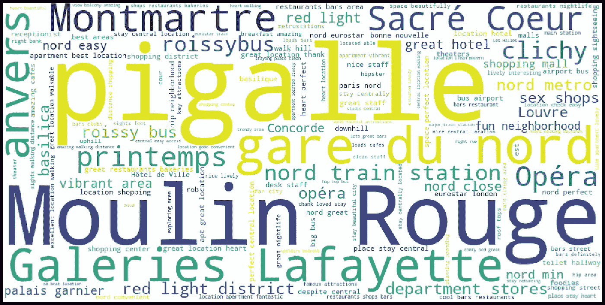

# 如果你计划去巴黎旅行，你需要看看 20 块彩色的板子

> 原文：<https://medium.com/analytics-vidhya/20-colorful-boards-you-need-to-see-if-you-plan-a-trip-to-paris-88e7bc586da3?source=collection_archive---------15----------------------->

# **简介**

T2:我想你计划去巴黎旅行，你想知道巴黎不同的名胜。你的第一反应可能是抓起一本旅游书籍，仔细研究它。然而，巴黎是如此的丰富，以至于你可能会因为要涵盖的项目数量而气馁。你的第二个反应可能是向朋友寻求建议，但是你可能会被他或她自己的观点所影响。

相反，如果你可以通过彩色的图板获得巴黎每个街区的层次和综合视图，让你即时看到每个地区的特征，会怎么样？如果你觉得这个想法很吸引人，邀请你阅读这篇文章！

这篇文章的动机是从旅游的角度对巴黎的不同地区进行比较研究。为了做到这一点，我们使用了 Airbnb 的公共数据集，该数据集由大约 130 万条评论组成，其中大约 80 万条评论是用英语写的。对这些评论进行分析，并对提取的信息进行可视化总结。

在文章的第一部分，我提供了数字统计数据，并获得了客观的信息，让你可以深入了解每个地区的氛围。在这篇文章的第二部分，提供了一个基于客户写的评论的更定性的见解。

我想回答的主要问题如下:

*   我们在巴黎的哪个区域有更多的 Airbnb 位置优惠？
*   根据你想要的氛围，你应该选择哪个街区？
*   在每个街区，描述兴趣点和氛围最相关的词是什么？

# **第一部分:想象巴黎的街区**

在深入统计细节之前，让我们先看看一张信息丰富的巴黎地图。下面的地图提供了巴黎不同街区的行政概况(图摘自[此处](https://fr.m.wikipedia.org/wiki/Liste_des_quartiers_administratifs_de_Paris#/media/Fichier%3ALes_quartiers_de_paris.png)):

巴黎行政地图

在谷歌地图[上也可以获得一个漂亮的互动视图，这里的街区名称与 Airbnb 数据集中的名称相匹配，除了“Entrepô”被重命名为“Enclos-Saint-Laurent”。](https://www.google.com/maps/d/viewer?mid=1Nz_Xy7AT3WBh45YEzm-uOWmBIQE&msa=0&ll=48.858837861817754%2C2.3308540708196688&z=13)

既然你对巴黎的地理更熟悉了，让我们转向更定量的分析。

# **第二部分:统计分析**

分析的第一步是提供每个社区的 Airbnb 公寓数量。这允许在选择区域之前从数字的角度了解报价。

每个社区的 AirBnB 公寓数量

另一个方面，你可能会考虑到的是，你可以期待在每个街区的气氛。为了深入了解这个问题，我在下图中给出了每个社区中用作 Airbnb 设施的公寓的百分比。

请注意，每个区的公寓数量和人口统计数据是由法国负责经济和统计研究的机构 Insee 提供的。这个分析我用的是 2016 年的数字。

每个社区 AirBnB 公寓的百分比

在列表的顶部，你可以看到像证券交易所、坦普尔、卢浮宫或市政厅这样的中心区，它们包含了很高比例的 Airbnb 公寓。对他们来说，平均比例是 10%左右。这将对你在这些地区的街道上行走时感受到的氛围产生很大的影响，因为这些地方可能会挤满游客。这也意味着周围的商店和设施将偏向于旅游用途。

为了更深入地了解这一特征，我们可以计算 Airbnb 床位相对于人口的百分比。这将是一个更准确的指标，因为在之前的统计中，我们没有考虑公寓的大小。

AirBnB 床位相对于人口的数量

这张图表比上一张更能说明问题，而且百分比也大不相同。我们特别看到，在列表的顶部，我们有达到 15%到 20%百分比的区域。前面描述的对大气和设施的影响甚至更明显。

比较上面的第一个和最后一个数字，我们可以尝试捕捉每个街区的吸引率。实际上，对于某些地区来说，Airbnb 公寓的比例很高，而且只有少量公寓可供使用。这些地区大多位于市中心，被认为是城市中最具旅游价值的部分。我们可以通过计算“吸引率”在一条曲线中捕捉到这一点，吸引率是 Airbnb 床位相对于人口的百分比除以可用公寓数量。该指标被标准化为其最大值为 1。

上图是本章的最终量化指标，总结了到目前为止提供的所有数据。当你导航到图表的顶部时，你会发现需求很高的区域，有少量 Airbnb 公寓可供使用，但游客密度很高。随着你在图中向下移动，你将会有更容易预订的旅游区。

根据您要查找的内容，您可以在以下列表中做出选择:

*   如果你首先关心的是靠近主要的旅游景点，并且你不介意被高密度的游客包围(并支付更高的价格！)，你应该选择图顶部的一个邻域。
*   如果你喜欢享受地道的巴黎体验，周围游客很少，价格较低，并且不介意远离市中心，那么你应该选择地图上较低的地区。

当然，所有的中间选择都允许找到一个好的折衷方案！

# **第三部分:视觉表现**

在帖子的最后一部分，我提取了在每个社区的评论中出现最多的主要话题，以捕捉他们的主要兴趣点和氛围。

作为初步任务，我使用以下过程清理了评论:

*   我只选择了用英语写的评论，因为这是数据集中最具代表性的语言
*   我过滤掉了用于语法目的但不传达信息的单词(停用词)
*   我使用 nltk 命名实体识别来识别著名地点的名称，以避免将“Notre Dame”等视为两个单词而不是一个单词
*   我过滤掉了评论中出现的 Airbnb 主机的名字，因为它们是特定于该地区的，否则就会出现在结果中

清理之后，我通过对每个地区的评论进行分组，为每个社区构建了一个大文档，最终有 20 个巨大的评论，我分析了每个地区最典型的单词或表达。如果一个词经常出现在它的大评论中，而较少出现在其他邻居的评论中，则该词是特定于某个邻居的(即使用了 [TF-IDF 指标](https://en.wikipedia.org/wiki/Tf%E2%80%93idf))。

不同的结果显示在下面的 20 个单词云中，每个区一个。每朵云包含每个邻域最有代表性的 150 个单词。然后，您可以探索不同的项目，并对不同评论中讨论的感兴趣的主题进行分层可视化，以了解每个社区的氛围和兴趣点。

## 卢浮宫(75001):

## 证券交易所(75002):

## 坦普尔(75003):

## 市政厅(75004):

## 先贤祠(75005):

## 卢森堡(75006):

## 波旁宫(75007)

## 爱丽诗(75008):

## 奥普拉(75009):

## entrept(75010):

## Popincourt (75011):

## 鲁伊(75012):

## 戈贝林(75013):

## 天文台(75014):

## 沃吉拉德(75015):

## 帕西(75016):

## 巴蒂尼奥勒-蒙索(75017):

## 布特斯-蒙马特(75018):

## 布特斯-肖蒙(75019):

## 梅尼蒙坦(75020):

# 结论

在这篇文章中，我们提供了数字和视觉上的见解来比较巴黎的不同街区。我们使用了 AirBnB 的数据集，包含大约 130 万条评论，其中大约 80 万条是英文评论。特别是:

*   我们提供了几个统计指标，让你对每个地区的氛围有所了解
*   对于每个社区，我们提供了代表评论主要内容的词云

现在轮到你玩了:你可以探索不同的云，并尝试识别每个单词所指的内容。祝你旅途愉快！

要查看这个分析的细节，你可以去访问我的 [Github](https://github.com/MoussaAbdi/AirBnB_Paris) 。