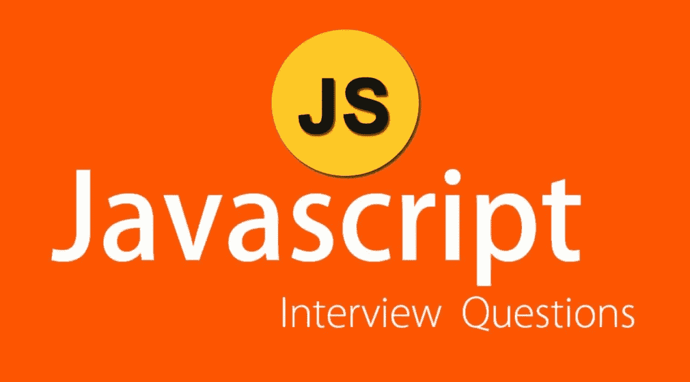

# 20 个棘手的 JavaScript 面试问题！！！你一定要知道！！

> 原文：<https://medium.com/analytics-vidhya/20-tricky-javascript-interview-questions-you-must-have-to-know-77e6c4ab860f?source=collection_archive---------8----------------------->

图片来自谷歌图片

在本文中，我们将探讨 20 个棘手的 javascript 面试问题，帮助你更好地准备即将到来的工作面试。你也可以考虑一下你口袋里的这些资源……[问题](https://thatjsdude.com/interview/dom.html#domRapidFire)

# **1。** **从 DOM 中获取一个元素有哪些不同的方法？**

**Ans:** 我们可以使用下面的方法从 DOM 中获取一个元素。

***getElementById:****获取具有所提供 Id 的元素。*

****getElementsByClassName*:**通过提供类名来获取 nodelist (nodelist 不是数组，而是类似数组的对象)。*

****getElementsByTagName:***根据提供的标记名获取节点列表。*

****query selector***:您将传递 CSS 样式选择器(jquery style)，这将返回 DOM 中第一个匹配的元素。*

****query selector all:***通过对所有匹配的元素进行深度优先的前序遍历，返回一个非活节点列表。非实时意味着，选择元素后的任何更改都不会反映出来。*

# ***2。****null 和 undefined 有什么区别？***

***Ans:*Undefined***表示已经声明了一个变量，但是还没有给出那个变量的值。*

****null*** 是表示没有值的值。null 是明确定义给变量的值。*

# ***3。** **什么叫事件冒泡？***

***Ans:** 当一个事件发生在一个元素上时，它首先在这个元素上运行处理程序，然后在它的父元素上运行，然后在其他父元素上运行。*

# ***4。** **什么是高阶函数？***

***答:**高阶函数是可以返回一个函数或接收一个或多个具有函数值的自变量的函数。这意味着函数中的函数。*

# *5.**= =和= = = =有什么区别？***

***Ans:**`==`(抽象相等)和`===`(严格相等)的区别在于，`==`按值比较，`===`按值和类型比较。*

# ***6。****`**var, let,**`**和** `**const**` **关键词有什么区别？*****

*****答:**用`var` 声明的变量意味着变量可以通过那个函数访问，即使我们在一个块中声明了那个变量。***

***用 `let`和`const`关键字声明的变量是块范围的。这意味着变量只能在我们声明它的那个块 `{}`上被访问。我们不能改变那些用`const`声明的变量的值。***

# *****7。** **什么是箭头功能？*****

*****Ans:** 在 ES6 中它引入了箭头功能。在 arrow 函数中，我们只需要 `()`括号和`=>`箭头符号，那么我们就不需要 return 语句，因为如果我们只有一个表达式或值要返回，Arrow 函数就会隐式返回。***

# ***8。**ES6 或 ECMAScript 2015 有哪些新特性？*****

*****Ans:** Arrow 函数、类、模板字符串、增强的对象文字、对象析构、承诺、生成器、模块、符号、代理、集合、默认函数参数、Rest 和 Spread、使用 let 和 const 的块作用域。***

# *****9。** **什么是回调函数？*****

*****Ans:** 我们可以将函数作为参数传递给其他函数，并在外部函数内部调用它们。这在 JavaScript 中是有效的，我们称之为“回调”。***

# *****10。****Spread 运算符和 Rest 运算符有什么区别？*****

*****Ans:**Spread 操作符和 Rest 参数有相同的操作符…区别在于 Spread 操作符，它将一个数组的单个数据扩展到另一个数据，而 Rest 参数在函数或数组中使用，以获得所有的参数或值，并将它们放入一个数组中或提取它们的一些片段。***

# *****11。** **南是什么？还有怎么检查一个值是不是 NaN？*****

*****Ans:** 在 ES6 或 ECMAScript 2015 中，建议我们使用`Numbers.isNaN`方法，因为它检查值是否为 **NaN** 或者我们可以让我们的帮助器函数检查这个问题，因为在 JavaScript **中，NaN** 是唯一不等于自身的值。***

# *****12。** **什么是模板文字？*****

*****答:**模板文字是在 JavaScript 中生成字符串的一种新方法。我们可以通过使用反勾号或反引号符号来创建模板文字。***

# ***13。 **什么是对象析构？*****

***对象析构是一种新的、更干净的从对象或数组中获取或提取值的方式。***

# ***14。 **什么是‘9’+6。*****

*****Ans:** 96。如果加号 `(+)` 操作符的一个操作数是一个字符串，它会将其他数字或布尔值转换为字符串并执行连接。出于同样的原因，“2true 将返回“2true”。***

# ***15。**new 关键字是做什么的？*****

*****Ans:**new 关键字与构造函数一起使用来生成对象***

***在 JavaScript 中。***

******这个新关键字做 4 件事。******

***它创建一个空对象。***

***b 将空对象赋给这个值。***

***该函数将从 functionName.prototype 继承。***

***如果没有使用显式 return 语句，d 将返回此。***

# *****1** 6。有什么价值！你好。***

*****Ans:** 假。 `!` 不是。如果您将`!`放在 truthy 值的前面，它将返回 false。使用`!!` (double)是一种通过避免 `==` 比较的隐式类型转换来检查真假的巧妙方法。***

# *****17。** **默认参数是什么？*****

*****答:**默认参数是一种在 JavaScript 中定义默认变量的新方法，它在 ES6 或 ECMAScript 2015 版本中可用。***

# ***18。 **如何检查一个值是否是数组？*****

*****答:**我们可以从数组全局对象中使用`array.isArray` 方法来检查一个值是否是一个数组。当传递给它的参数是一个数组时，它返回 true，否则返回 false。***

# *****19。** **把字符串转换成数字最快的方法是什么？*****

***答:根据 MDN 文档[的说法](https://developer.mozilla.org/en-US/docs/Web/JavaScript/Reference/Operators/Arithmetic_Operators#Unary_plus), `’+’ (unary operator)`是将字符串转换成数字的最快方法。***

# ***20。**Java script 中有哪些处理异步代码的方法？*****

*****Ans:** 下面给出了 javascript 中处理异步的几种方法。***

******回调******

******承诺******

******异步/等待******

******像 async.js、蓝鸟等库。******

> ***我希望你自己找到这些问题的答案并记下来，通过这个过程你可以在面试中表现得更好。***

***快乐编码；)***