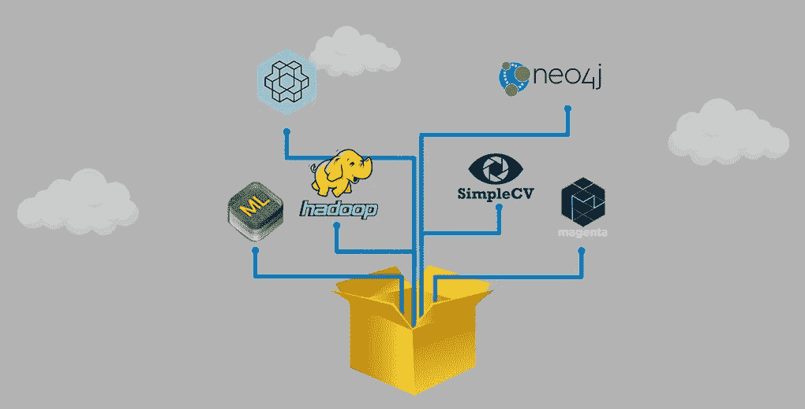
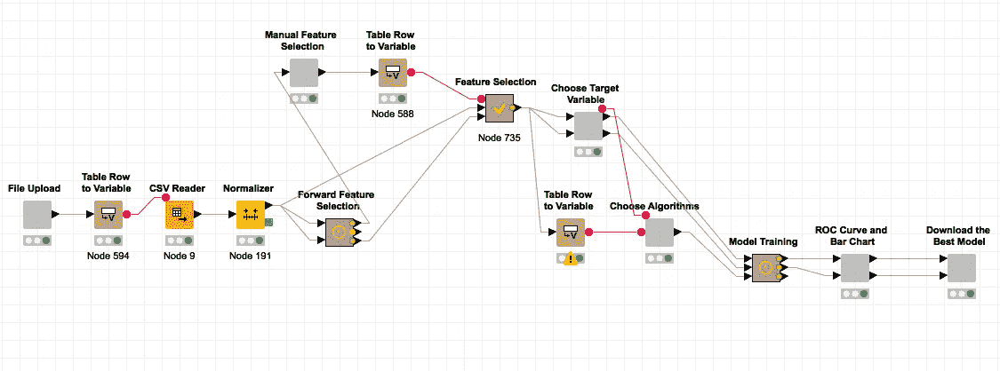
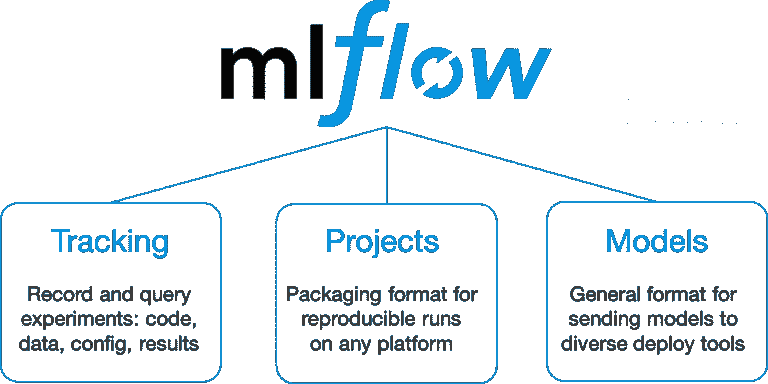
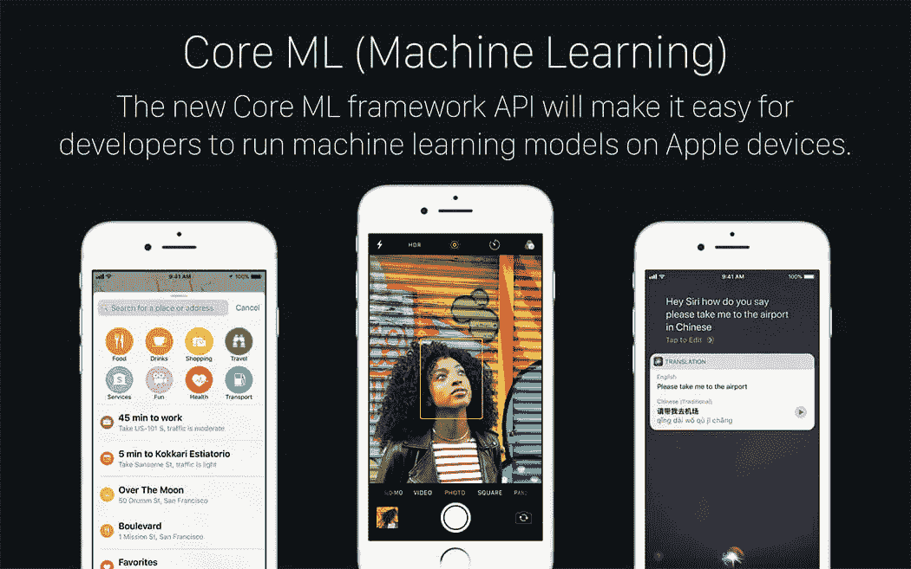
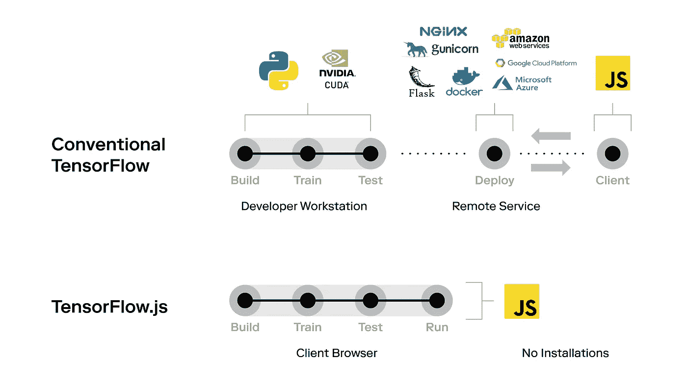
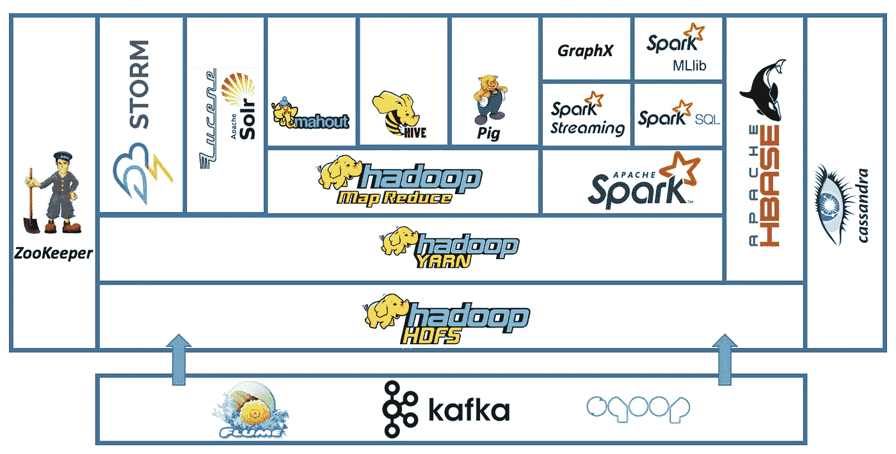
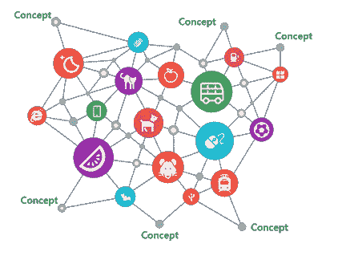
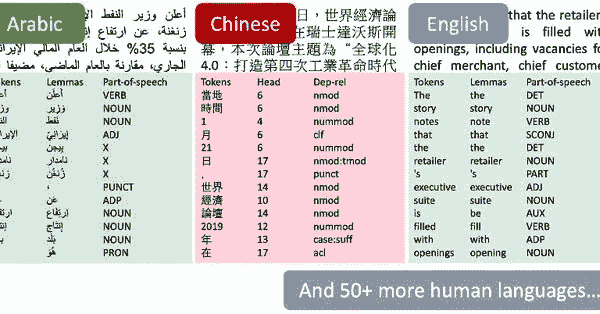

# 21 个必须知道的机器学习开源工具，你可能没有使用(但是应该使用！)

> 原文：<https://medium.com/analytics-vidhya/21-must-know-open-source-tools-for-machine-learning-you-probably-arent-using-but-should-f605b94d9b06?source=collection_archive---------3----------------------->

您必须已经知道流行的开源工具，如 R、Python、Jupyter notebooks 等等。但是，在这些流行工具之外还有一个世界——一个存在秘密机器学习工具的地方。这些并不像它们的同行那样杰出，但对于许多机器学习任务来说却是救命稻草。

在本文中，我们将看看 21 个这样的用于[机器学习](https://courses.analyticsvidhya.com/courses/applied-machine-learning-beginner-to-professional?utm_source=blog&utm_medium=21-open-source-machine-learning-tools)的开源工具。我强烈建议您花些时间仔细阅读我提到的每一个类别。除了我们通常在课程和视频中学到的东西，还有很多东西要学。

# 面向非程序员的开源机器学习工具

对于来自非编程和非技术背景的人来说，机器学习可能显得复杂。这是一个广阔的领域，我可以想象第一步会有多艰难。一个没有编程经验的人能在机器学习上取得成功吗？

事实证明，可以！这里有一些工具可以帮助你跨越鸿沟，进入著名的机器学习世界:

*   [**优步·路德维希**](https://uber.github.io/ludwig/) :路德维希允许我们在不需要编写代码的情况下训练和测试深度学习模型。您只需要提供一个包含数据的 CSV 文件、一个用作输入的列列表和一个用作输出的列列表——Ludwig 会完成剩下的工作。

*   [**KNIME**](https://www.knime.com/)**:**KNIME 允许您使用拖放界面创建整个数据科学工作流。这种可视化实现整个模型工作流的方法非常直观，在处理复杂的问题陈述时非常有用。

*   [**Orange**](https://www.analyticsvidhya.com/blog/2017/09/building-machine-learning-model-fun-using-orange/)**:**你不必知道如何编码，就能使用 Orange 来挖掘数据、处理数字并获得洞察力。

有很多有趣的免费和开源软件，它们提供了很好的可访问性来进行机器学习，而无需编写(大量)代码。

在硬币的另一面，有一些付费的现成服务你可以考虑，比如 [Google AutoML](https://cloud.google.com/automl/) 、 [Azure Studio](https://azure.microsoft.com/en-us/services/machine-learning-studio/) 、[深度认知](https://deepcognition.ai/)，以及[数据机器人](https://www.datarobot.com/)。

# 用于模型部署的开源机器学习工具

部署机器学习模型是您应该知道的最容易被忽略但却是最重要的任务之一。它几乎肯定会在面试中出现，所以你最好熟悉这个话题。

这里有一些框架，可以让你更容易地将自己喜欢的项目部署到现实世界的设备上。

*   [**ml flow**](https://www.analyticsvidhya.com/blog/2018/06/mlflow-an-open-source-machine-learning-platform-that-works-with-any-library-algorithm-and-tool/)**:**ml flow 旨在与任何机器学习库或算法一起工作，并管理整个生命周期，包括机器学习模型的实验、可再现性和部署。

*   [**苹果的 CoreML**](https://www.analyticsvidhya.com/blog/2017/09/build-machine-learning-iphone-apple-coreml/)**:**CoreML 是一个流行的框架，可以用来将机器学习模型集成到你的 iOS/Apple Watch/Apple TV/MacOS 应用中。CoreML 最好的一点是，你不需要关于神经网络或机器学习的广泛知识。双赢！

*   [**TensorFlow Lite**](https://www.tensorflow.org/lite)**:**tensor flow Lite 是一套帮助开发者在移动(Android 和 iOS 均可)、嵌入式和物联网设备上运行 tensor flow 模型的工具。
*   [**tensor flow . js**](https://www.analyticsvidhya.com/blog/2019/06/build-machine-learning-model-in-your-browser-tensorflow-js-deeplearn-js)**—**tensor flow . js 可以成为你在 web 上部署机器学习模型的首选。它是一个开源库，允许您在浏览器中构建和训练机器学习模型。

# 面向大数据的开源机器学习工具

大数据是一个研究如何分析、系统地提取信息或处理数据集的领域，这些数据集太大或太复杂，传统的数据处理应用软件无法处理。想象一下，一天处理数百万条推文进行情感分析。这感觉像是一个巨大的任务，不是吗？

放心吧！以下是一些可以帮助您处理大数据的工具。

[**Hadoop**](https://www.analyticsvidhya.com/blog/2014/11/hadoop-mapreduce/)**:**Hadoop 项目是处理大数据最突出和最相关的工具之一。Hadoop 是一个框架，允许使用简单的编程模型跨计算机集群分布式处理大型数据集。

*   [**Spark**](https://www.analyticsvidhya.com/blog/2016/09/comprehensive-introduction-to-apache-spark-rdds-dataframes-using-pyspark/)**:**Apache Spark 被认为是大数据应用 Hadoop 的天然继承者。这个开源大数据工具的关键点是，它填补了 Apache Hadoop 在数据处理方面的空白。有趣的是，Spark 既可以处理批量数据，也可以处理实时数据。
*   [**Neo4j:**](https://neo4j.com/)**Hadoop 未必是所有大数据相关问题的明智选择。例如，当您需要处理大量网络数据或与图形相关的问题(如社交网络或人口统计模式)时，图形数据库可能是最佳选择。**

****

# **4.用于计算机视觉、自然语言处理和音频的开源机器学习工具**

> **如果我们想让机器思考，我们需要教它们看东西**
> 
> ***-费博士-李非谈计算机视觉***

*   **[**SimpleCV**](http://simplecv.org/)**:**如果你从事过任何计算机视觉项目，你一定用过 OpenCV。但是你遇到过 SimpleCV 吗？SimpleCV 让您可以访问 OpenCV 等几个高性能的计算机视觉库，而不必首先了解位深度、文件格式、色彩空间、缓冲区管理、特征值或矩阵与位图存储。这使计算机视觉变得容易了。**

****

*   ******:**你有没有使用过创意应用程序，让你用智能手机的摄像头扫描文件或购物账单，或者只需拍一张支票就能把钱存入银行账户？所有这些应用程序都使用我们称之为 OCR 或光学字符识别软件。Tesseract 就是这样一个 OCR 引擎，它能够识别超过 100 种语言。它也可以被训练识别其他语言。****
*   ****[**Detectron**](https://github.com/facebookresearch/Detectron)**:**Detectron 是脸书 AI Research 的软件系统，实现了最先进的物体检测算法，包括 [Mask R-CNN](https://arxiv.org/abs/1703.06870) 。它是用 Python 编写的，由 [Caffe2](https://github.com/caffe2/caffe2) 深度学习框架提供支持。****

********

*   ****[**Stanford NLP:**](https://www.analyticsvidhya.com/blog/2019/02/stanfordnlp-nlp-library-python/)Stanford NLP 是一个 Python 自然语言分析包。这个库最好的部分是它支持 70 多种人类语言！****

********

*   ****[Bert-as-a-service 使用 Bert 作为句子编码器，并通过 ZeroMQ 将其作为服务托管，允许您仅用两行代码将句子映射为固定长度的表示。](https://github.com/hanxiao/bert-as-service)****
*   ****[**Google Magenta**](https://magenta.tensorflow.org/)**:**这个库提供了操作源数据(主要是音乐和图像)的实用程序，使用这些数据来训练机器学习模型，最终从这些模型中生成新的内容。****

****[**LibROSA**](https://librosa.github.io/librosa/)**:**LibROSA 是一个用于音乐和音频分析的 Python 包。它为创建音乐信息检索系统提供了必要的构件。当我们使用深度学习进行语音转文本等应用时，它在音频信号预处理中使用得很多。****

# ****用于强化学习的开源工具****

****谈到机器学习，RL 是热门话题。[强化学习](https://www.analyticsvidhya.com/blog/tag/reinforcement-learning/) (RL)的目标是训练智能代理，使其能够与环境互动并解决复杂的任务，并在现实世界中应用于机器人、无人驾驶汽车等。以下是一些对 RL 最有用的培训环境:****

*   ****[**Google Research Football**](https://ai.googleblog.com/2019/06/introducing-google-research-football.html)**:**Google Research Football Environment 是一个新颖的 RL 环境，代理旨在掌握世界上最受欢迎的运动——足球。这种环境为您培训 RL 代理提供了大量的控制，观看视频了解更多信息:****

*   ****[**open ai Gym**](https://www.analyticsvidhya.com/blog/2019/04/introduction-deep-q-learning-python/)**:**Gym 是一个开发和比较强化学习算法的工具包。它支持教导代理从走路到玩游戏，如乒乓球或弹球。在下面的 gif 中，你可以看到一个正在学习走路的代理。****

********

*   ****[**Unity ML Agents**](https://unity3d.com/machine-learning)**:**Unity Machine Learning Agents Toolkit(ML-Agents)是一个开源的 Unity 插件，使游戏和模拟成为训练智能代理的环境。通过简单易用的 Python API，可以使用强化学习、模仿学习、神经进化或其他机器学习方法来训练代理。****

********

*   ****[**马尔默项目**](https://www.microsoft.com/en-us/research/project/project-malmo/) **:** 马尔默平台是一个建立在《我的世界》之上的复杂的人工智能实验平台，旨在支持人工智能的基础研究。它是由微软开发的。****

# ****结束注释****

****从上面的工具可以明显看出，当我们考虑数据科学和人工智能相关的项目时，开源是必由之路。我可能只是触及了冰山的一角，但是有许多工具可用于各种任务，使您作为一名数据科学家的生活变得更加轻松，您只需要知道从哪里开始。****

****你认为哪些工具应该出现在这个列表中？在下面写下你的最爱，让社区知道！****

*****原载于 2019 年 7 月 11 日*[*【https://www.analyticsvidhya.com】*](https://www.analyticsvidhya.com/blog/2019/07/21-open-source-machine-learning-tools/)*。*****