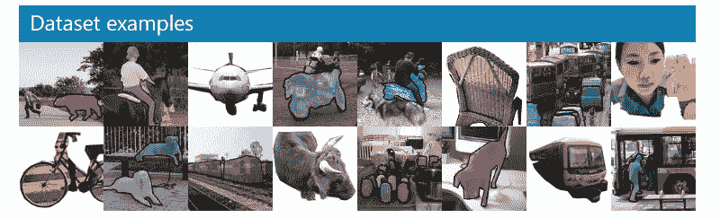
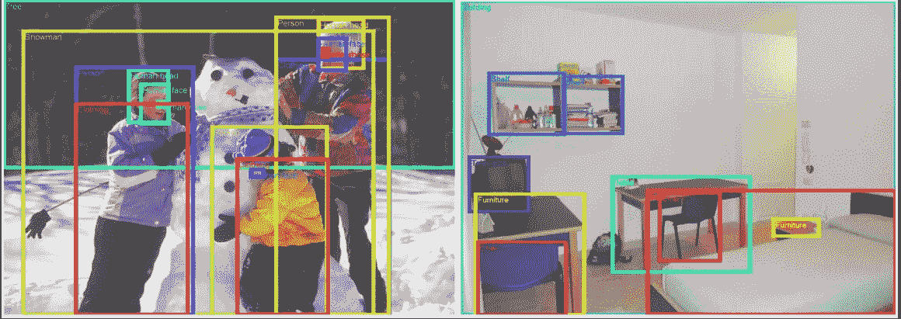
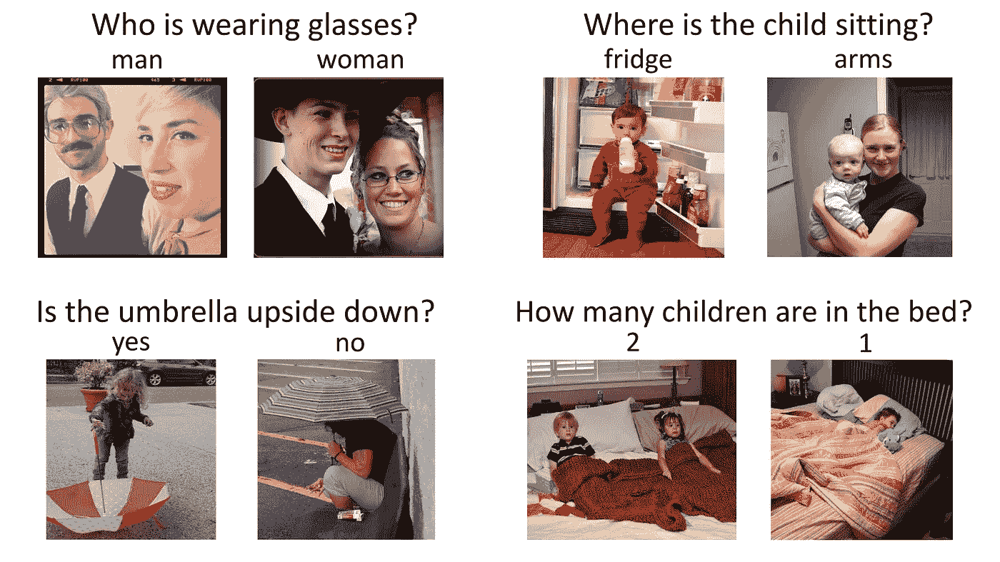
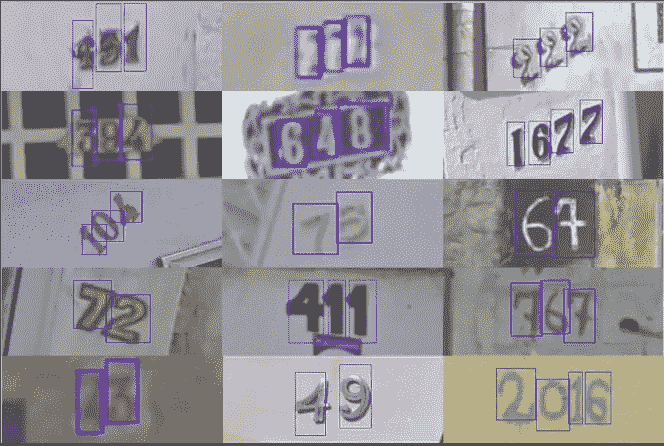
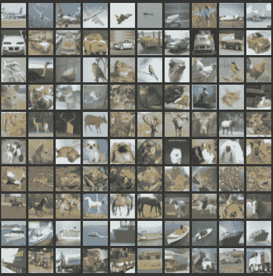
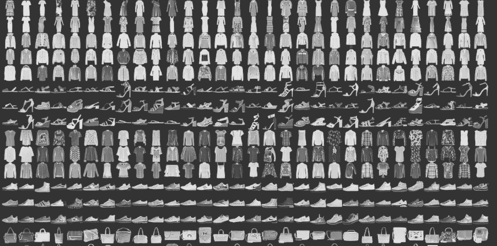
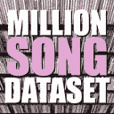

# 每个数据科学家都必须使用的 25 个用于深度学习的开放数据集

> 原文：<https://medium.com/analytics-vidhya/25-open-datasets-for-deep-learning-every-data-scientist-must-work-with-1232371569a1?source=collection_archive---------2----------------------->

*每个深度学习爱好者必备的项目集合！*

# 介绍

深度学习(或者说生活中的大部分领域)变得更好的关键是实践。练习各种问题—从图像处理到语音识别。这些问题中每一个都有其独特的细微差别和方法。

但是你能从哪里得到这些数据呢？你现在看到的很多研究论文都使用了私有的数据集，这些数据集通常不向公众公开。如果你想学习和应用你新获得的技能，这就成了一个问题。

如果您已经面临这个问题，我们有一个解决方案。我们整理了一份公开可用数据集的列表供您阅读。

**在这篇文章中，我们列出了一组高质量的数据集，每个深度学习爱好者都应该努力应用和提高他们的技能。**处理这些数据集将使你成为一名更好的数据科学家，你学到的知识将对你的职业生涯有着不可估量的价值。我们还包含了具有最先进(SOTA)结果的论文，供您浏览和改进您的模型。

# 如何使用这些数据集？

首先，这些数据集非常庞大！因此，确保你有一个快速的互联网连接，对你可以下载的数据量没有/非常高的限制。

有很多方法可以使用这些数据集。你可以用它们来应用各种深度学习技术。您可以使用它们来磨练您的技能，了解如何识别和构建每个问题，思考独特的用例并发布您的发现供所有人查看！

**数据集分为三类——图像处理、自然语言处理、音频/语音处理。**

让我们开始吧！

# 图像数据集

# [MNIST](https://datahack.analyticsvidhya.com/contest/practice-problem-identify-the-digits/)

MNIST 是最受欢迎的深度学习数据集之一。这是一个手写数字的数据集，包含 60，000 个样本的训练集和 10，000 个样本的测试集。这是一个很好的数据库，可以在真实世界的数据上尝试学习技术和深度识别模式，同时在数据预处理方面花费最少的时间和精力。

**大小:** ~50 MB

**记录数量:**10 类 70，000 张图像

**SOTA** : [轿厢间动态路由](https://arxiv.org/pdf/1710.09829.pdf)

# [可可小姐](http://cocodataset.org/#home)

COCO 是一个大规模和丰富的对象检测，分割和字幕数据集。它有几个特点:

*   对象分割
*   语境中的识别
*   超像素素材分割
*   33 万张图片(超过 20 万张)
*   150 万个对象实例
*   80 个对象类别
*   91 个物品类别
*   每张图片 5 个标题
*   25 万人有关键点

**大小:** ~25 GB(压缩)

**记录数量:** 33 万张图片，80 个对象类别，每张图片 5 个标题，25 万人带关键点

厌倦了数据集？解决[关于深度学习的真实生活项目](https://trainings.analyticsvidhya.com/courses/course-v1:AnalyticsVidhya+CVDL101+CVDL101_T1/about?utm_source=blog&utm_medium=comprehensive-collection-deep-learning-datasets)

# [ImageNet](http://www.image-net.org)

ImageNet 是根据 [WordNet](https://wordnet.princeton.edu) 层级组织的图像数据集。WordNet 包含大约 100，000 个短语，ImageNet 平均提供了大约 1000 张图片来说明每个短语。

**大小:** ~150GB

**记录数量:**图像总数:~ 150 万；每个具有多个边界框和各自的类别标签

**SOTA** : [深度神经网络的聚合残差变换](https://arxiv.org/pdf/1611.05431.pdf)

# [打开图像数据集](https://github.com/openimages/dataset)

Open Images 是一个包含近 900 万个图片 URL 的数据集。这些图像已经用跨越数千个类的图像级标签边界框进行了注释。该数据集包含 9，011，219 幅图像的训练集、41，260 幅图像的验证集和 125，436 幅图像的测试集。

**容量:** 500 GB(压缩)

**记录数量:** 9，011，219 张标签超过 5k 的图片

**SOTA** : Resnet 101 图像分类模型(在 V2 数据上训练):[模型检查点](https://storage.googleapis.com/openimages/2017_07/oidv2-resnet_v1_101.ckpt.tar.gz)、[检查点自述](https://storage.googleapis.com/openimages/2017_07/oidv2-resnet_v1_101.readme.txt)、[推理码](https://github.com/openimages/dataset/blob/master/tools/classify_oidv2.py)。

# [VisualQA](http://www.visualqa.org)

VQA 是一个包含关于图像的开放式问题的数据集。这些问题需要对视觉和语言的理解。该数据集的一些有趣特征是:

*   265，016 幅图像(可可和抽象场景)
*   每张图片至少 3 个问题(平均 5.4 个问题)
*   每个问题 10 个基本事实答案
*   每个问题 3 个看似合理(但可能不正确)的答案
*   自动评估指标

**大小:** 25 GB(压缩后)

**记录数量:** 265，016 个图像，每个图像至少 3 个问题，每个问题 10 个基本事实答案

**SOTA** : [视觉问答的技巧和诀窍:2017 年挑战的收获](https://arxiv.org/abs/1708.02711)

# [街景门牌号(SVHN)](http://ufldl.stanford.edu/housenumbers/)

这是用于开发对象检测算法的真实世界图像数据集。这需要最少的数据预处理。它类似于此列表中提到的 MNIST 数据集，但具有更多标记数据(超过 600，000 张图像)。这些数据是从谷歌街景中查看的门牌号收集来的。

**尺寸:** 2.5 GB

**记录数量:**10 类 630420 张图像

**SOTA** : [虚拟对抗训练的分布平滑](https://arxiv.org/pdf/1507.00677.pdf)

# [CIFAR-10](http://www.cs.toronto.edu/~kriz/cifar.html)

该数据集是用于图像分类的另一个数据集。它由 10 个类的 60，000 个图像组成(在上面的图像中，每个类表示为一行)。总共有 50，000 个训练图像和 10，000 个测试图像。数据集分为 6 个部分— 5 个训练批次和 1 个测试批次。每批有 10，000 张图像。

**大小:** 170 MB

**记录数量:**10 类 60，000 张图像

**SOTA** : [振动筛规则化](https://openreview.net/pdf?id=S1NHaMW0b)

# [时尚-MNIST](https://github.com/zalandoresearch/fashion-mnist)

时尚 MNIST 由 60，000 幅训练图像和 10，000 幅测试图像组成。这是一个类似 MNIST 的时尚产品数据库。开发人员认为 MNIST 已被过度使用，因此他们创建了这个数据集作为该数据集的直接替代。每幅图像都是灰度的，并与 10 个类别的标签相关联。

**大小:** 30 MB

**记录数量:**10 类 70，000 张图像

**SOTA** : [随机擦除数据增强](https://arxiv.org/abs/1708.04896)

# 自然语言处理

# [IMDB 评论](http://ai.stanford.edu/~amaas/data/sentiment/)

这是电影爱好者的梦想数据集。它是用于二元情感分类的，并且拥有比该领域中任何以前的数据集更多的数据。除了训练和测试回顾的例子，还有更多未标记的数据可以使用。原始文本和预处理单词包格式也包括在内。

**大小:** 80 兆字节

**记录数量:**25000 条用于训练的高度极性电影评论，25000 条用于测试的高度极性电影评论

**SOTA** : [学习结构化文本表征](https://arxiv.org/abs/1705.09207)

# [二十个新闻组](https://archive.ics.uci.edu/ml/datasets/Twenty+Newsgroups)

顾名思义，这个数据集包含有关新闻组的信息。为了管理这个数据集，从 20 个不同的新闻组中收集了 1000 篇新闻组的文章。文章有典型的特征，如主题、签名和引用。

**大小:** 20 MB

**记录数量:**来自 20 个新闻组的 20，000 条消息

**SOTA** : [用于文本分类的深度卷积网络](https://arxiv.org/abs/1606.01781)

# [感知 140](http://help.sentiment140.com/for-students/)

Sentiment140 是可用于情感分析的数据集。一个受欢迎的数据集，它是开始您的 NLP 之旅的最佳选择。情绪已经被预先从数据中剔除了。最终数据集具有以下 6 个特征:

*   推特的极性
*   推文的 id
*   推文的日期
*   该查询
*   高音喇叭的用户名
*   推文的文本

**大小:** 80 MB(压缩)

记录数量:1，60，000 条推文

**SOTA** : [在最先进的情感数据集上评估最先进的情感模型](http://www.aclweb.org/anthology/W17-5202)

# [WordNet](https://wordnet.princeton.edu/)

在上面的 ImageNet 数据集中提到过，WordNet 是一个大型的英语同义词库。同义词集是一组同义词，每个同义词描述一个不同的概念。WordNet 的结构使它成为 NLP 的一个非常有用的工具。

**大小:** 10 MB

**记录数量:** 117，000 个 synset 通过少量的“概念关系”链接到其他 synset。

**SOTA** : [Wordnets:技术水平和前景](https://aclanthology.info/pdf/R/R11/R11-1097.pdf)

# [Yelp 评论](https://www.yelp.com/dataset)

这是 Yelp 出于学习目的发布的开放数据集。它由数百万用户评论、企业属性和来自多个大都市地区的 200，000 多张图片组成。这是全球 NLP 挑战中非常常用的数据集。

**大小:** 2.66 GB JSON，2.9 GB SQL，7.5 GB 照片(全部压缩)

**记录数量:**520 万条评论，17.4 万个商业属性，20 万张图片，11 个大都市

**SOTA** : [专心卷积](https://arxiv.org/pdf/1710.00519.pdf)

# [维基百科文集](http://nlp.cs.nyu.edu/wikipedia-data/)

这个数据集是维基百科全文的集合。它包含来自 400 多万篇文章的近 19 亿个单词。使这个强大的 NLP 数据集的原因是你可以通过单词、短语或段落本身的一部分进行搜索。

**大小:** 20 MB

**记录数量:**440 万篇，包含 19 亿字

**SOTA** : [突破 Softmax 瓶颈:高级 RNN 语言模型](https://arxiv.org/pdf/1711.03953.pdf)

# [博客作者文集](http://u.cs.biu.ac.il/~koppel/BlogCorpus.htm)

这个数据集由从 blogger.com 数千名博客作者那里收集的博客帖子组成。每个博客都作为一个单独的文件提供。每个博客至少包含 200 个常用英语单词。

**大小:** 300 MB

记录数量: 681，288 条帖子，超过 1.4 亿字

**SOTA** : [用于大规模作者归属的字符级和多通道卷积神经网络](https://arxiv.org/pdf/1609.06686.pdf)

# [各种语言的机器翻译](http://statmt.org/wmt18/index.html)

该数据集由四种欧洲语言的训练数据组成。这里的任务是改进目前的翻译方法。您可以参与以下任何语言配对:

*   英汉和汉英
*   英语-捷克语和捷克语-英语
*   英语-爱沙尼亚语和爱沙尼亚语-英语
*   英语-芬兰语和芬兰语-英语
*   英语-德语和德语-英语
*   英语-哈萨克语和哈萨克语-英语
*   英语俄语和俄语英语
*   英语-土耳其语和土耳其英语

**尺寸:** ~15 GB

**记录数量:**~ 3000 万句及其翻译

**SOTA** : [你所需要的只是关注](https://arxiv.org/abs/1706.03762)

在此参与关于[自然语言处理](https://trainings.analyticsvidhya.com/courses/course-v1:AnalyticsVidhya+NLP101+2018_T1/about?utm_source=blog&utm_medium=comprehensive-collection-deep-learning-datasets)的真实项目。

# 音频/语音数据集

# [自由口语数字数据集](https://github.com/Jakobovski/free-spoken-digit-dataset)

这个列表中的另一个条目受到了 MNIST 数据集的启发！这个是为了解决在音频样本中识别语音数字的任务而创建的。这是一个开放的数据集，因此希望随着人们不断贡献更多的样本，它将继续增长。目前，它包含以下特征:

*   3 个扬声器
*   1，500 个录音(每个扬声器每个数字 50 个)
*   英语发音

**大小:** 10 MB

**记录数量:** 1，500 个音频样本

**SOTA** : [使用样本级 CNN 架构的基于原始波形的音频分类](https://arxiv.org/pdf/1712.00866)

# [免费音乐档案(FMA)](https://github.com/mdeff/fma)

FMA 是一个用于音乐分析的数据集。数据集由全长和 HQ 音频、预先计算的特征以及音轨和用户级元数据组成。这是一个为评估和平号上的几项任务而创建的开放数据集。以下是数据集包含的 csv 文件列表及其内容:

*   `tracks.csv`:所有 106，574 首曲目的元数据，如 ID、标题、艺术家、流派、标签和播放次数。
*   `genres.csv`:所有 163 个流派 id 及其名称和父项(用于推断流派层次和顶级流派)。
*   `features.csv`:用 [librosa](https://librosa.github.io/librosa/) 提取的共同特征。
*   `echonest.csv`:由 [Echonest](http://the.echonest.com/) (现 [Spotify](https://www.spotify.com/) )为 13129 首曲目子集提供的音频功能。

**尺寸:** ~1000 GB

**记录数量:** ~10 万首曲目

**SOTA** : [学习从音频中识别音乐流派](https://arxiv.org/pdf/1803.05337.pdf)

# [舞厅](http://mtg.upf.edu/ismir2004/contest/tempoContest/node5.html)

该数据集包含交际舞音频文件。许多舞蹈风格的一些特征摘录以真实的音频格式提供。以下是数据集的一些特征:

*   实例总数:698
*   持续时间:~30 秒
*   总持续时间:~20940 秒

**大小:** 14GB(压缩)

**记录数量:** ~700 个音频样本

**SOTA** : [一种考虑异质音乐风格的多模型节拍跟踪方法](https://pdfs.semanticscholar.org/0cc2/952bf70c84e0199fcf8e58a8680a7903521e.pdf)

# [百万首歌曲数据集](https://labrosa.ee.columbia.edu/millionsong/)

**百万首歌曲数据集**是一百万首当代流行音乐曲目的音频特征和元数据的免费集合。其目的是:

*   鼓励商业规模的算法研究
*   为评估研究提供参考数据集
*   作为使用 API(例如 Echo Nest)创建大型数据集的快捷替代方法
*   为了帮助新的研究人员在 MIR 领域起步

数据集的核心是一百万首歌曲的特征分析和元数据。数据集不包含任何音频，仅包含派生要素。样本音频可以从哥伦比亚大学提供的服务中获取。

**尺寸:** 280 GB

**记录数量:**PS——是一百万首歌！

**SOTA** : [百万歌曲数据集挑战赛推荐系统的初步研究](http://www.ke.tu-darmstadt.de/events/PL-12/papers/08-aiolli.pdf)

# [图书馆员](http://www.openslr.org/12/)

这个数据集是大约 1000 个小时的英语演讲的大规模语料库。数据来源于 LibriVox 项目的有声读物。它已经被适当地分割和对齐。如果你正在寻找一个起点，在[kaldi-asr.org](http://www.kaldi-asr.org/downloads/build/6/trunk/egs/)检查已经准备好的声学模型，这些模型是在这个数据集上训练的，在[http://www.openslr.org/11/](http://www.openslr.org/11/)检查适合评估的语言模型。

**尺寸:** ~60 GB

**记录数量:** 1000 小时演讲

**SOTA** : [Letter-Based Speech Recognition with Gated ConvNets](https://arxiv.org/abs/1712.09444)

# [VoxCeleb](http://www.robots.ox.ac.uk/~vgg/data/voxceleb/)

VoxCeleb is a large-scale speaker identification dataset. It contains around 100,000 utterances by 1,251 celebrities, extracted from YouTube videos. The data is mostly gender balanced (males comprise of 55%). The celebrities span a diverse range of accents, professions and age. There is no overlap between the development and test sets. It’s an intriguing use case for isolating and identifying which superstar the voice belongs to.

**Size:** 150 MB

**Number of Records:** 100,000 utterances by 1,251 celebrities

**SOTA** : [VoxCeleb: a large-scale speaker identification dataset](https://www.robots.ox.ac.uk/~vgg/publications/2017/Nagrani17/nagrani17.pdf)

# Analytics Vidhya Practice Problems

# [Twitter Sentiment Analysis](https://trainings.analyticsvidhya.com/courses/course-v1:AnalyticsVidhya+TSA001+2018_T1/about?utm_source=blog&utm_medium=comprehensive-collection-deep-learning-datasets)

For your practice, we also provide real life problems and datasets to get your hands dirty. In this section, we’ve listed down the deep learning practice problems on our DataHack platform.

Hate Speech in the form of racism and sexism has become a nuisance on twitter and it is important to segregate these sort of tweets from the rest. In this Practice problem, we provide Twitter data that has both normal and hate tweets. Your task as a Data Scientist is to identify the tweets which are hate tweets and which are not.

**Size:** 3 MB

**Number of Records:** 31,962 tweets

# [Age Detection of Indian Actors](https://datahack.analyticsvidhya.com/contest/practice-problem-age-detection/)

This is a fascinating challenge for any deep learning enthusiast. The dataset contains thousands of images of Indian actors and your task is to identify their age. All the images are manually selected and cropped from the video frames resulting in a high degree of variability interms of scale, pose, expression, illumination, age, resolution, occlusion, and makeup.

**Size:** 48 MB (Compressed)

**Number of Records:** 19,906 images in the training set and 6636 in the test set

**SOTA:** [动手深度学习——年龄检测练习题解决方案](https://www.analyticsvidhya.com/blog/2017/06/hands-on-with-deep-learning-solution-for-age-detection-practice-problem/)

# [城市声音分类](https://datahack.analyticsvidhya.com/contest/practice-problem-urban-sound-classification/)

该数据集由来自 10 个类别的 8000 多个城市声音摘录组成。本练习题旨在向您介绍常见分类场景中的音频处理。

**大小:**训练集— 3 GB(压缩)，测试集— 2 GB(压缩)

**记录数量:**10 类城市声音的 8732 个标记声音摘录(< =4s)

如果你知道其他开放数据集，你推荐给开始深度学习/非结构化数据集之旅的人，请随时提出建议，并说明理由，为什么应该包括它们。

如果理由充分，我会把他们列入名单。请在评论部分告诉我们您使用这些数据集的体验。还有快乐的深度学习！

不确定，如何开始你的深度学习之旅？使用我们的[学习路径进行深度学习](https://trainings.analyticsvidhya.com/courses/course-v1:AnalyticsVidhya+LP_DL_2019+2019_T1/about?utm_source=blog&utm_medium=comprehensive-collection-deep-learning-datasets)。

*原载于 2018 年 3 月 29 日*[*https://www.analyticsvidhya.com*](https://www.analyticsvidhya.com/blog/2018/03/comprehensive-collection-deep-learning-datasets/)*。*