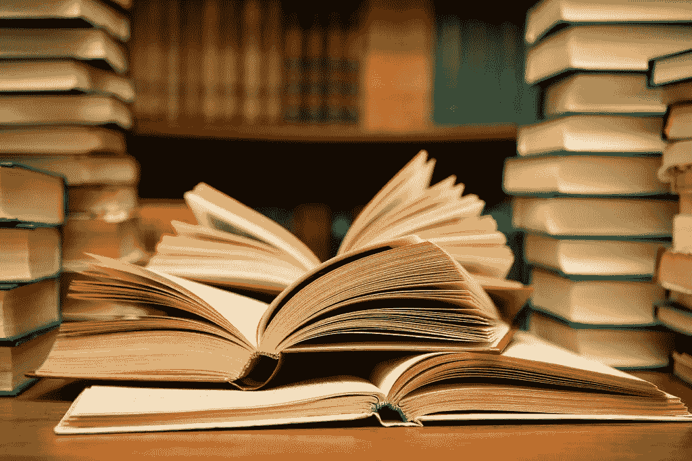
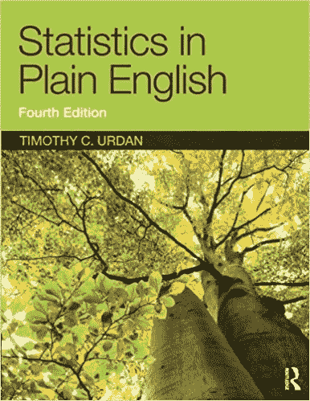
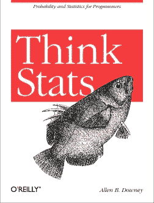
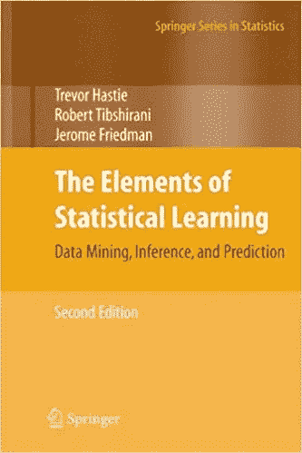
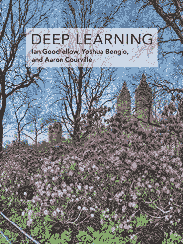
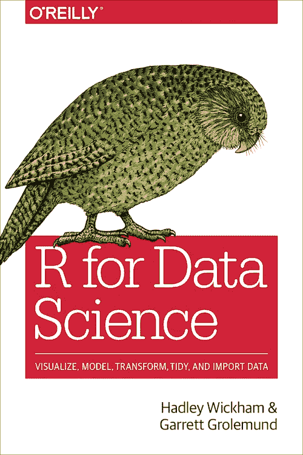
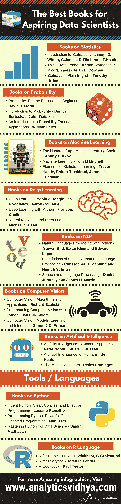

# 每个数据科学家都应该阅读的 27 本令人惊叹的数据科学书籍

> 原文：<https://medium.com/analytics-vidhya/27-books-every-data-scientist-should-read-7b051607595?source=collection_archive---------0----------------------->

来自世界各地的书籍的精心策划的列表，涉及数据科学的不同和巨大的分支。

每个人都有自己的学习方式。帮助我进入数据科学的是书籍。没有什么比向浓缩在几百页中的知识世界敞开心扉更好的了。书籍有一种魔力和诱惑力，这是我在其他学习媒介中从未发现过的。

> *“如果你只看别人都在看的书，你只能想到别人都在想的东西。”—村上春树*

自学数据科学可能是一项非常艰巨的任务！如今，学习的方式多种多样——mooc、研讨会、学位、文凭、文章等等。但是将他们放在一个结构中，专注于成为数据科学家的[结构化路径](https://trainings.analyticsvidhya.com/courses/course-v1:AnalyticsVidhya+LPDS2019+LPDS2019_T1/info?utm_source=booksarticle&utm_medium=blog)是至关重要的。

但是有数百本关于数据科学的书籍。你如何选择从哪里开始？哪些书籍是学习某项技术或领域的理想选择？虽然这个问题没有放之四海而皆准的答案，但我已经尽了最大的努力，把名单缩减到了我们不久将会看到的这 27 本书。

为了让你更容易理解，我把这些书分成了不同的领域:

*   统计学书籍
*   概率书籍
*   关于机器学习的书籍
*   关于深度学习的书籍
*   关于自然语言处理(NLP)的书籍
*   关于计算机视觉的书籍
*   关于人工智能的书籍
*   关于工具/语言的书籍

# 奖金:

在文章的底部，你会发现一张精美的信息图表，上面提到了每本书。你可以把它当作“阅读”书架，当你在列表中往下看的时候把它们划掉！ ***您还可以*** [***下载本信息图的高分辨率副本***](https://discuss.analyticsvidhya.com/t/download-hd-infographic-27-essential-data-science-books/75604) *。它是 PDF 格式的，非常适合打印。*

事不宜迟，让我们直入主题吧。

# 统计学书籍

# [用简单英语统计](https://www.amazon.in/Statistics-Plain-English-Third-1/dp/041587291X)

**作者:**蒂莫西·乌尔丹

我带着这本书的美丽开始了我的统计世界之旅。它是为绝对的初学者而写的，以一种让你再次回来的方式。文章的写作风格和所提供的解释与标题——用浅显的英语写的统计数据是相称的。你可以把它推荐给任何一个非技术人员，他们会掌握这些话题的窍门，这太好了！

# [思考统计:程序员的概率和统计](http://greenteapress.com/thinkstats/thinkstats.pdf)

**作者:**艾伦·唐尼

你会发现这本书位于大多数数据科学书单的首位。这本书附有大量资源。使用上面的链接到书的主页，你会看到像数据文件，代码，解决方案等资源。这对了解 Python 基础的人来说尤其有用。该语言用于演示真实世界的例子。

# [统计学习入门](http://www-bcf.usc.edu/~gareth/ISL/ISLR%20Seventh%20Printing.pdf)

作者:加雷斯·詹姆斯，丹妮拉·威滕，特雷弗·哈斯蒂和罗伯特·蒂布拉尼

空前的经典。这本书是我遇到的大多数机器学习课程推荐或参考的，它写得太好了。它涵盖了基本统计学以及机器学习技术。这本书最棒的一点是，每个概念都用 r 语言的案例进行了解释。所以一旦你掌握了编程，你就可以随时回来再次尝试每个概念。有什么比通过多次练习来加深概念更好的方法呢？

# 概率书籍

# [概率:对于热情的初学者](https://www.amazon.in/Probability-Enthusiastic-Beginner-David-Morin/dp/1523318678)

**作者:**大卫·莫兰

初学者的理想书籍。这是为大学生写的，所以所有想从头开始学习概率的人都会喜欢这种写作方式。所有的基础知识都包括在内——组合学、概率规则、贝叶斯定理、期望值、方差、概率密度、普通分布、大数定律、中心极限定理、相关性和回归。

# [概率介绍](https://www.math.dartmouth.edu/~prob/prob/prob.pdf)

作者:j·劳里·斯内尔和查尔斯·米勒·格林斯特德

另一本介绍基本概率概念的书。和上面的书一样，这本书是以大学研究生为对象编写的综合文本。你可能会问，为什么我一直重复这句话。这是因为我想强调，如果有一个地方可以从头开始学习，那就是为以前从未涉足这一领域的学生写的书。

# [概率论及其应用简介](https://www.amazon.com/Introduction-Probability-Theory-Applications-Vol/dp/8126518057)

**作者:**威廉·费勒

正如这本书的描述所说，这是概率论理论和实际应用的完整指南。如果你真的想深入概率的世界，我推荐你读读这篇文章。这是一个非常全面的文本，可能不适合初学者的口味。如果你学习概率只是为了进入数据科学，你可以阅读上面提到的两本概率书中的任何一本。

# 关于机器学习的书籍

# [百页机器学习书](http://www.themlbook.com/)

**作者:**安德烈·布尔科夫

我喜欢这本书。在阅读了大量试图从各种角度和视角教授机器学习的书籍后，我努力找到一本可以简洁地总结困难主题和方程的书。直到安德烈·布尔科夫设法用 100 多页的篇幅完成了它。它写得很好，很容易理解，并得到了像彼得·诺维格这样的思想领袖的认可。还需要我多说吗？无论是新手还是老手，每个数据科学家都应该接触到这本书。

# [机器学习](https://www.amazon.in/Machine-Learning-Tom-M-Mitchell/dp/1259096955)

**作者:**汤姆·米切尔

在大肆宣传之前，汤姆·米切尔(Tom Mitchell)关于机器学习的书是理解各种技术和算法背后的数学的最佳文本。我建议在开始之前先复习一下你的数学。但是你不需要任何 AI 或者统计学的背景就能理解这些概念。这是我在 ML 上读的第一本书！它价格适中，所以绝对值得加入你的收藏。

# [统计学习的要素](https://web.stanford.edu/~hastie/Papers/ESLII.pdf)

作者:特雷弗·哈斯蒂，罗伯特·蒂布拉尼和杰罗姆·弗里德曼

我们带来了哈斯蒂和蒂伯沙拉尼的另一首经典歌曲！这是我们之前提到的“统计学习导论”的自然延续。虽然与那本书有一些重叠，但这本书更深入地研究了我们所说的机器学习算法。除了常见的最大似然法技术之外，还涵盖了神经网络、矩阵分解、谱聚类等主题。

# 关于深度学习的书籍

# [深度学习](https://www.deeplearningbook.org/)

作者:伊恩·古德菲勒、约舒阿·本吉奥和亚伦·库维尔

多棒的摇滚明星作者名单啊！《深度学习》这本书被广泛认为是初学者的最佳资源。它分为三个部分:应用数学和机器学习基础，现代实用深度学习框架和深度学习研究。这是迄今为止深度学习社区中被引用最多的书。把它放在你的床边，崇拜它，经常参考它——无论何时你开始深度学习之旅，它都会是你的伴侣。

# [用 Python 进行深度学习](https://www.amazon.com/Deep-Learning-Python-Francois-Chollet/dp/1617294438)

**作者:**弗朗索瓦·乔莱

学习深度学习(或机器学习)的一种非常酷的方式是与理论并行编程。这就是 Francois Chollet 在《用 Python 进行深度学习》一书中遵循的方法。使用流行的 Keras 库教授概念。弗朗索瓦是 Keras 的创造者，那么谁更适合教你这个话题呢？我还建议在 Twitter 上关注弗朗索瓦——我们可以从他身上学到很多东西。

# [神经网络和深度学习](http://neuralnetworksanddeeplearning.com/)

**作者:**迈克尔·尼尔森

这是一本免费的在线书籍，旨在了解为深度学习提供动力的核心组件——神经网络。我很喜欢这本书的写作方式。它采用实用的教学方法，并从初学者的角度看待深度学习主题。在这本书里，你不会学到任何编程语言——这是一本很好的老式教科书，讲述了神经网络背后的深刻见解。

# 关于自然语言处理(NLP)的书籍

# [用 Python 进行自然语言处理](https://www.nltk.org/book/)

作者:史蒂文·伯德、伊万·克莱因和爱德华·洛珀

这本书集中的另一本书坚持边做边学的方针。您将学到 Python 概念，否则您将不会有，并将使用 NLTK 库(自然语言工具包)在 NLP 的世界中导航。虽然这不应该是你学习 NLP 的唯一参考资料(这个领域太复杂了)，但它提供了这个主题的一个相当不错的介绍。

# [统计自然语言处理基础](https://www.cs.vassar.edu/~cs366/docs/Manning_Schuetze_StatisticalNLP.pdf)

**作者:**克里斯托弗·曼宁和辛里奇·舒茨

大约二十年前出版，这本书仍然是自然语言处理的优秀入门。这是一个非常全面的指南，介绍了 NLP 中更广泛的子主题，如文本分类、词性标注、概率解析等。作者提供了一个数学和语言学基础的严格覆盖面。再说一遍，这本书非常详细，所以请记住这一点。

# [语音和语言处理](https://web.stanford.edu/~jurafsky/slp3/ed3book.pdf)

**作者:**丹尼尔·茹拉夫斯基和詹姆斯·马丁

这本书的重点是在自然语言和语音范围内的实际应用和科学评价。我把这本书包括进来是为了扩展我们的视野，让我们不局限于文本，也看看语音识别。为什么不呢？这是一个如今蓬勃发展的研究领域，每天都有大量的应用出现。Jurafsky 和 Martin 写了一本关于 NLP 和计算语言学的深度书籍。这个是大师们自己出的。

# 关于计算机视觉的书籍

# [计算机视觉:算法与应用](http://szeliski.org/Book/)

**作者:**理查德·塞利斯基

在本书中探索各种常见的计算机视觉技术，尤其是用于分析和解释图像的技术。虽然这篇文章发表于近 9 年前，但 Richard Szeliski 举例说明的例子和方法在今天仍然适用。这是一个全面的文本，采取科学的方法来解决基本的视觉挑战。我上面链接的网站包含了这本书的免费 PDF 版本

# [用 Python 编程计算机视觉](http://programmingcomputervision.com/)

**作者:**扬·埃里克·索莱姆

在你开始阅读这本很棒的书之前，去我上面链接的网站下载数据集、代码笔记本并克隆那里提到的 GitHub 库。他们是计算机视觉世界实际操作入门的优秀伙伴。正如作者所言，“在学习用 Python 编写的清晰示例的过程中，您将学习对象识别、3D 重建、立体成像、增强现实和其他计算机视觉应用的技术。”

# [计算机视觉:模型、学习和推理](http://www.computervisionmodels.com/)

**作者:**西蒙·普林斯博士

这本书从零开始，向我们介绍概率的概念，并从那里迅速加快步伐。虽然这里介绍的一些框架已经出现了更高级的版本，但这本书仍然与当前的环境相关。超过 70 个算法已经被介绍并且正文被超过 350 个插图美丽地补充。如果你喜欢这种学习方式，该网站还包含 PowerPoint 幻灯片。

# 关于人工智能的书籍

# [人工智能:现代方法](http://aima.cs.berkeley.edu/)

**作者:**斯图尔特·拉塞尔和彼得·诺维格

斯图尔特·罗素和彼得·诺维格写的书？我被说服了。它是人工智能领域的权威书籍。100 多个国家的 1300 多所大学在其课程中引用了这本书。考虑到作者是谁，看到这本书长达 1100 页就不足为奇了。涵盖了人工智能组件的长度和宽度——语音识别、自动驾驶汽车、机器翻译和计算机视觉等，这可以被认为是人工智能的圣经。

# [人类的人工智能](https://www.amazon.in/Artificial-Intelligence-Humans-Fundamental-Algorithms-ebook/dp/B00HAT0APE)

**作者:**杰夫·希顿

人工智能的基础算法是什么？这本书在短短的 222 页中包含了大量的技术知识。这是关于人工智能背后的技术(维度、距离度量、聚类、误差计算、爬山、Nelder Mead 和线性回归)的系列书籍的第一卷。还有一个[附带站点](https://www.heatonresearch.com/aifh/vol1/)，其中包含了书中引用的示例+一个包含代码的 [GitHub 库](https://github.com/jeffheaton/aifh)。

# [主算法](https://www.amazon.in/Master-Algorithm-Pedro-Domingos/dp/0141979240/ref=tmm_pap_swatch_0?_encoding=UTF8&qid=&sr=)

**作者:**佩德罗·多明戈斯

如果你正在寻找一本关于人工智能的技术书籍，这不是它。然而，它是一部关于机器学习如何重塑商业、政治、科学和战争的大师级著作。这是一本深思熟虑、发人深省的书，讲述了人工智能目前的状况，以及它最终可能会把人类带向何方。我们会找到一个能够从数据中获取所有知识的单一算法(或“主算法”)吗？加入佩德罗·多明戈斯寻找答案的行列。

# 关于 Python 的书籍

# [流畅的 Python:清晰、简洁、有效的编程](https://www.amazon.in/Fluent-Python-Concise-Effective-Programming-ebook/dp/B0131L3PW4)

**作者:**拉马尔霍

有太多的资源可以学习 Python，但是没有什么能像一本好的老式书一样教你编程。正如你可能从一本编码书中所期待的，这是一本帮助你理解 Python 如何工作以及如何编写出色而有效的 Python 代码的实践指南。卢西亚诺·拉马尔霍还介绍了一些在数据科学项目中经常使用的流行库。这本书长达 794 页，值得一读。

# [编程 Python:强大的面向对象编程](https://www.amazon.in/Programming-Python-4e-Mark-Lutz/dp/0596158106)

**作者:**马克·卢茨

等等，又一本 Python 书？！如果你认为上面的书教会了你所有你需要知道的关于 Python 的知识，请再想一想。这是一门庞大的编程语言，还有更多的内容需要介绍。一旦你从卢西亚诺·拉马尔霍的书里掌握了基本原理，看看马克·卢茨的这本书。有各种主题的深入教程:数据库、网络、文本处理、图形用户界面等。吨和吨的例子包括在内。编程极客必读。

# [掌握 Python 数据科学](https://www.amazon.in/Mastering-Python-Science-Samir-Madhavan-ebook/dp/B010T266OW?tag=googinhydr18418-21)

**作者:**小马德哈万

到目前为止，我们学习 Python 的两本书都是从编程的角度来看这门语言的。现在是时候从数据科学的角度来学习了。哪些数据科学库是常用的，如何使用？如何在 Python 中创建数据可视化并挖掘模式？你如何编码先进的数据科学/机器学习技术来建立模型？萨米尔·马德哈万在这篇精彩的文章中回答了这些以及更多的问题。

# 关于 R 的书

# [R 代表数据科学](https://r4ds.had.co.nz/)

**作者:**加勒特·格罗勒蒙德和哈德利·威克姆

任何稍微听说过 R 编程的人都会对 Hadley Wickham 的作品有所了解。他在这种语言方面的工作是无与伦比的——我可以继续谈论他。我怎么推荐这本书都不为过。您将学习如何将不同种类的数据导入 R，不同的数据结构，以及如何转换、可视化和建模您的数据。通过用 r 编写代码学习数据科学的完美书籍。

# [R 为大家](https://www.amazon.in/R-Everyone-Advanced-Analytics-Graphics/dp/9332539243)

**作者:**贾里德·p·兰德

我甚至在听说 Python 之前就已经学会了 R way。它在我心中有一个特殊的位置，贾里德·兰德的《为每个人而战》在其中起了很大的作用。我通过我的一个熟人得到了这本书，并立即被它写得如此之好所吸引。它声称是为“所有人”设计的，名副其实。如果你来自非技术和非统计背景，这是一本很棒的书。

# [R 食谱](https://www.amazon.in/Cookbook-Recipes-Analysis-Statistics-Graphics/dp/9350233797?tag=googinhydr18418-21&tag=googinkenshoo-21&ascsubtag=_k_EAIaIQobChMIqZ3q0uvy3wIV2SMrCh0M3w3nEAYYASABEgJmJ_D_BwE_k_&gclid=EAIaIQobChMIqZ3q0uvy3wIV2SMrCh0M3w3nEAYYASABEgJmJ_D_BwE)

**作者:**保罗·蒂特

R Cookbook 是你初露头角的数据科学阅读清单上的一个极好的补充。它包含了 200 多种实用的方法，可以帮助你开始在 r 中分析和操作数据。每种方法关注一个不同的问题。它是为初学者、中级用户和高级从业者准备的。无论是学习新的编程技能，还是复习你的概念，这本食谱都适合每个人。

正如所承诺的，这是涵盖我们在本文中看到的所有书籍的完整信息图:

*原载于 2019 年 1 月 17 日*[*www.analyticsvidhya.com*](https://www.analyticsvidhya.com/blog/2019/01/27-amazing-data-science-books-every-data-scientist-should-read/)*。*