# 27 位鼓舞人心的女性在数据科学领域开辟了一条新路

> 原文：<https://medium.com/analytics-vidhya/27-inspiring-women-blazing-a-trail-in-the-data-science-world-4b99208a478a?source=collection_archive---------1----------------------->

*认识并向数据科学领域的杰出女性致敬！*

# 介绍

今年妇女节，我们在 [Analytics Vidhya](https://analyticsvidhya.com) 庆祝女性在数据科学中的力量。

世界各地的女性正在数据科学领域开辟道路，还有什么比今天更好的日子来纪念和感谢她们呢？有很多女性数据科学家(但在我们看来还不够)和领导者激励着女性和男性。

女性擅长沟通，在团队中培养积极的氛围，解决问题，问正确的问题(在一大堆其他事情中！).这些都是主要的领导素质，我们希望在 2019 年看到更多女性担任数据科学领导职务。

让我们看看那些每天都在做这一切并激励我们成为更好的自己的女性。我鼓励你在社交媒体上关注他们，了解他们的成就。

以及所有的女性，**妇女节快乐**！

# 艾米莉·格拉斯伯格·桑兹

作为 Coursera 数据科学负责人，她的任务是通过数据驱动的决策和产品建立一个更好的学习平台。她是哈佛大学的经济学博士。她在哈佛期间获得了一系列令人印象深刻的奖项和荣誉。你可以在我们的 [DataHack 广播播客中听到她的声音。](https://www.analyticsvidhya.com/blog/2018/08/datahack-radio-episode-4-coursera-data-science-emily-glassberg-sands/)

# [卡拉金特里](https://medium.com/u/ab3f4b7d032b?source=post_page-----4b99208a478a--------------------------------)

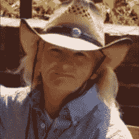

Carla 目前在 Samtec Inc .担任数字营销经理，她拥有 20 多年的工作经验，曾在强生、好时、卡夫等公司任职。她是一个非常受欢迎和活跃的社交媒体用户，她的帖子总是值得一读，因为它们的知识非常宝贵。卡拉是我们 DataHack 电台播客的最早嘉宾之一。

# 莫妮卡·罗加蒂

Monica 是独立的数据科学和人工智能顾问。她帮助公司从技术和战略上充分利用他们的数据。她之前曾担任 Jawbone 的数据副总裁，LinkedIn 的高级数据科学家，目前也是斯坦福大学的客座讲师。

# 雅艾尔·加滕

Yael 是苹果公司 Siri 分析、评估和数据工程总监，她的任务是通过使用数据作为客户的声音来改善 Siri。此前，她曾在 LinkedIn 担任数据科学总监。她还在各种创业公司担任顾问，并在各种会议上发表重要意见。

# 莎拉·诺拉维

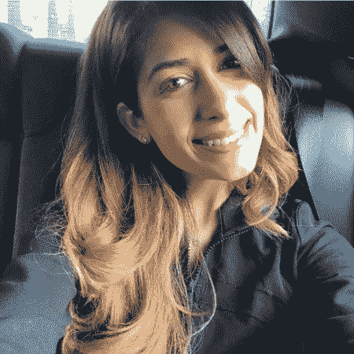

Sarah 目前在 Operam 担任高级数据科学家。她是 LinkedIn 上最受欢迎、最乐于助人的人物之一。Sarah 定期发布旨在帮助有抱负的数据科学家进入该领域的内容，并随时提供有用和有见地的建议。

# [卡西·科济尔科夫](https://medium.com/u/2fccb851bb5e?source=post_page-----4b99208a478a--------------------------------)

凯西是谷歌的首席决策科学家。她是数据科学领域的知名演讲者，经常以清晰的方式写下她在该领域的想法。在她的 [DataHack 广播播客](https://www.analyticsvidhya.com/blog/2018/10/datahack-radio-decision-intelligence-google-cloud-cassie-kozyrkov/)中，她带我们走进了她在谷歌的生活，以及她是如何从谷歌的一名统计学家变成现在的角色的。

# [凯特·斯特拉赫妮](https://medium.com/u/fc065d3295b8?source=post_page-----4b99208a478a--------------------------------)

Kate 是数据可视化大师，也是 LinkedIn 上领先的数据科学声音。她激励了无数有抱负的数据科学专业人士开始用数据讲故事。我非常欣赏她的画面技巧和她用自己的知识回报社会的意愿。请务必查看她的课程— [Tableau 视觉最佳实践:从优秀走向卓越！](https://courses.analyticsvidhya.com/courses/tableau-visual-best-practices-go-from-good-to-great?utm_source=datasciencewomenarticle&utm_medium=blog)

# [荣博士](https://www.linkedin.com/in/jeannette-wing-1b88a63/)

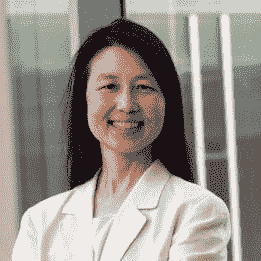

Jeannette Wing 博士是 Avanessians 数据科学研究所的主任，也是哥伦比亚大学的计算机科学教授。她在学术界和业界拥有超过 40 年的经验，没有人比她更适合就计算机科学如何发展，以及它如何与数据科学世界相融合给出观点。这就是我们在[本期 DataHack 电台节目](https://www.analyticsvidhya.com/blog/2018/09/datahack-radio-data-science-podcast-jeanette-wing/)中与她谈论的话题！

# [克里斯汀·凯尔勒](https://medium.com/u/8be51bb10c2f?source=post_page-----4b99208a478a--------------------------------)

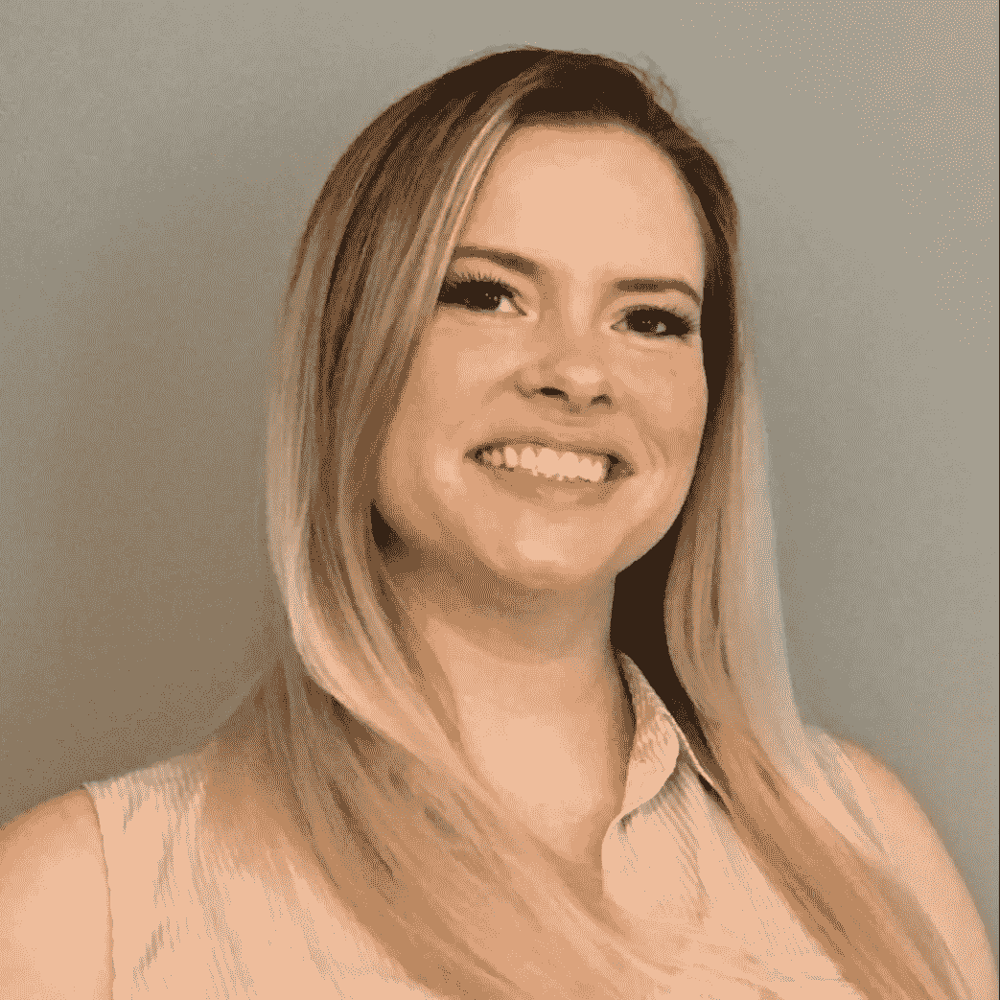

Kristen 是一名拥有 9 年经验的数据科学家，在商业领域提供创新和可行的机器学习解决方案。像 Kate 一样，她是 LinkedIn 上领先的数据科学声音，并且总是与社区分享她丰富的知识。多年来，她采访了许多数据科学家，并根据她的经验创建了“[提升你的数据科学简历](https://courses.analyticsvidhya.com/courses/up-level-your-data-science-resume?utm_source=datasciencewomenarticle&utm_medium=blog)课程。

# [张文炜](https://www.linkedin.com/in/shangxuanzhang/)

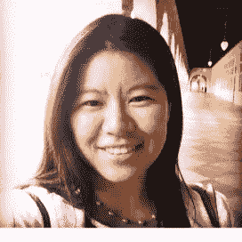

Vivian 是广受欢迎的纽约数据科学院的首席技术官兼首席数据科学家。她在研究和数据科学领域有将近十年的经验。2016 年 8 月，她入选了《福布斯》评选的“数据分析领域的 9 位女性领军人物”名单。

# [雷切尔·托马斯](https://medium.com/u/ee56d0bac1b7?source=post_page-----4b99208a478a--------------------------------)

fast.ai 的联合创始人瑞秋(Rachel)入选《福布斯》“20 位 ai 不可思议的女性”之一。Fast.ai 已经为来自世界各地的 10 万多名学生开设了课程。她也是一位非常受欢迎的作家和主题演讲人，她的文章被翻译成各种其他语言。

# [艾琳娜·格雷瓦尔博士](https://medium.com/u/c6aa02a6fa42?source=post_page-----4b99208a478a--------------------------------)

埃琳娜博士是 Airbnb 的数据科学主管。她领导着一个由 100 多名数据科学家组成的团队。她毕业于耶鲁大学经济学和政治学专业，并在印度工作了一年，致力于为患有急性腹泻的儿童提供清洁水的项目。

# 贾娜·艾格斯

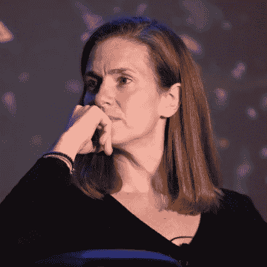

Jana 是 Nara Logics 的首席执行官，这是一家专注于将大数据转化为智能行动的人工智能公司。她在商业行业拥有超过 25 年的经验，是一名活跃的演讲者，也是各种人工智能初创公司的贡献者。

# 凯特琳·斯莫伍德

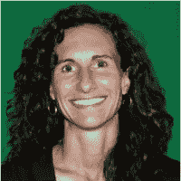

凯特琳是网飞大学科学与分析副总裁。她的团队开发了新的模型和算法，直接改善了网飞的服务。在网飞，她之前领导着一个由数学家、统计学家和数据科学家组成的团队，从事算法研究、开发和预测建模，为您带来使用网飞的无缝体验。她是数据科学界的领军人物之一。

# [达芙妮·柯勒](https://medium.com/u/e9ca5cf8ba3a?source=post_page-----4b99208a478a--------------------------------)

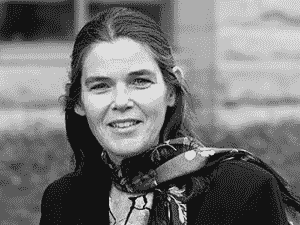

达芙妮是超受欢迎的在线学习平台 Coursera 的联合创始人。她在斯坦福大学任教近 19 年。她的研究领域包括人工智能及其在生物医学科学中的应用。她获得了各种奖项和荣誉，包括 ACM Infosys 奖、麦克阿瑟基金会奖学金等等。

# [梅勒妮·米切尔教授](https://www.linkedin.com/in/melanie-mitchell-08a04a6/)

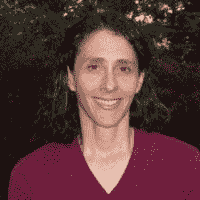

Melanie Mitchell 是波特兰州立大学的计算机科学教授，也是多本人工智能书籍的作者。她在学术界、计算机科学和人工智能领域拥有三十多年的经验。她向我们讲述了人工通用智能(AGI)以及我们实现这一目标所面临的挑战。

# AV 界的女性

在这一部分，我们要表扬一些经常为我们的 AV 社区做出贡献的女性。

# 帕芙琳·考尔

Pavleen 是一个数据可视化向导。她的 Tableau 系列，从初学者到高级，在社区中获得了令人难以置信的好评。她是一名大学毕业生，也是一名数据科学的狂热爱好者。数据科学的未来和她在一起很光明！

# [Shilpi Bhabhra](https://www.linkedin.com/in/shilpi-bhabhra-3a78268/)

Shilpi 在 Flipkart 领导零售和市场分析业务。她的专长是推动基于数据的产品和业务决策。在她 14 年的工作经验中，她领导了多个在零售和营销领域实施的数据科学项目。

# [帕鲁尔·潘迪](https://medium.com/u/7053de462a28?source=post_page-----4b99208a478a--------------------------------)

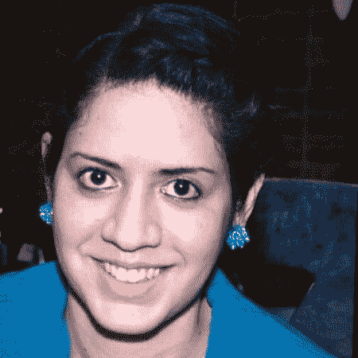

Parul 是你在机器学习和人工智能领域遇到的最好的作家之一。她写全面的文章，把复杂的概念分解成易于消化的信息。LinkedIn 数据科学领域最平易近人、最博学的人物之一。

# [迪维娅·乔杜里](https://www.linkedin.com/in/divyachoudhary28/)

Divya Choudhary 是一名数据科学家，目前正在加州沙无然大学攻读数据科学硕士学位。Divya 在攻读硕士学位之前有 4 年的工作经验，是一名计算机科学工程师，她的职业生涯从分析师到决策科学家再到数据科学家。

# [斯里什蒂·古普塔](https://www.linkedin.com/in/guptasrishti/)

Srishti 致力于训练深度学习模型，并建立端到端的 ML 管道，以在 Hike 中部署它们，用于各种数据科学问题，如推荐、图像风格化、增长等。Srishti 拥有佐治亚理工学院的机器学习硕士学位，在加入 Hike 担任当前职位之前曾在苹果公司工作。

# [马唐吉斯里](https://www.linkedin.com/in/mathangi-sri-b092455/)

Mathangi 是 PhonePe 的数据科学主管。她在构建世界级数据科学解决方案和产品方面拥有超过 15 年的丰富经验。她广泛致力于构建聊天机器人和文本挖掘见解的产品化。她在直观客户服务、室内定位和用户配置文件领域拥有 5 项专利授权和 20 多项专利。

# Prathrna Bhat

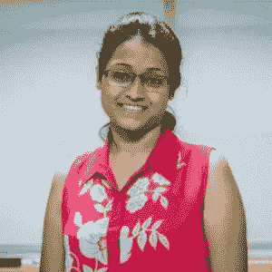

Prarthana Bhat 是 Flutura Desicion Science and Analytics 的数据科学家。Prarthana 精通 SQL、R 和商业智能。她是 Analytics Vidhya 的积极贡献者，也是第一位在 Analytics Vidhya 排名前三的女性数据科学家。她在数据行业拥有超过 5 年的经验。

# 安查尔·古普塔

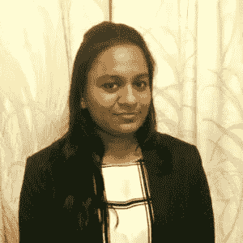

安查尔是 Paisabazaar.com 大学的数据科学家。她是分析 Vidhya 黑客马拉松的定期参与者，经常为 AV 的 Slack 频道做出贡献。

# 普雷蒂·阿加瓦尔

Preeti 是摩根大通公司的助理副总裁..她还是孟买的 Analytics Vidhya 数据科学志愿者。她在电信和银行领域拥有超过 11 年的经验。她热爱数据科学，希望将自己的知识传播给全世界。Preeti 毕业于那格浦尔大学。

# [Tanvi Purohit](https://www.linkedin.com/in/tanvi-purohit-87310a115/)

Tanvi Purohit 是德勤的顾问。她精通 RDBMS，对数据科学领域充满热情。她有超过 5 年的工作经验，其中 4 年时间都在处理数据。她从事数据仓库和数据分析工作，是一名训练有素的战略家。Tanvi 也是孟买的 AV 志愿者。

# [艾西瓦娅·辛格](https://www.analyticsvidhya.com/blog/author/aishwaryasingh/)

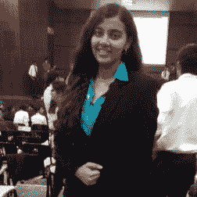

Aishwarya 以实习生的身份加入 Analytics Vidhya，并在她的数据科学角色中崭露头角。她喜欢阅读和学习，这与她作为数据科学专业人员的日常角色非常吻合。Aishwarya 也是一名优秀的作家，写了大量关于各种数据科学技术的文章，主要侧重于时间序列分析。

最后，请注意，这绝不是一个详尽的列表。在数据科学领域，有很多优秀的女性在引领潮流，如果你知道她们，请在下面的评论中公布她们的名字和链接。

# [学](https://www.analyticsvidhya.com/blog)，[比拼，黑](https://datahack.analyticsvidhya.com/)，[录用](https://www.analyticsvidhya.com/jobs/#/user/)。

*原载于 2019 年 3 月 8 日 www.analyticsvidhya.com***。**