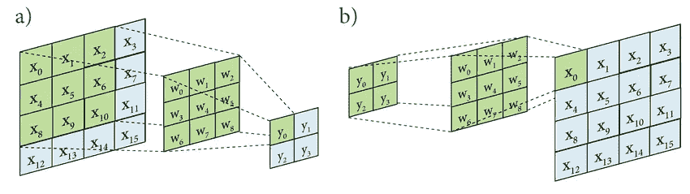
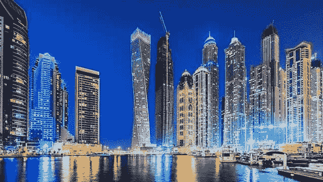
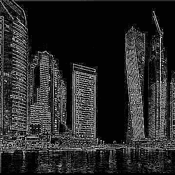

# 使用 Python 和 NumPy 的 2D 卷积

> 原文：<https://medium.com/analytics-vidhya/2d-convolution-using-python-numpy-43442ff5f381?source=collection_archive---------0----------------------->



2D 卷积在创建卷积神经网络或仅用于模糊、锐化、边缘检测等一般图像处理过滤器时非常有用。它们基于使用内核并遍历输入图像来创建输出图像的思想。如果你是卷积的新手，我会高度推荐 deeplearning.ai 在卷积神经网络上的播放列表。

在这篇文章中，我们将实现一个 2D 卷积，然后使用 2D 卷积将边缘检测内核应用于图像。

# 进口

为了实现 2D 卷积，我们需要两个库:

```
import cv2 
import numpy as np
```

OpenCV 将用于预处理图像，而 NumPy 将用于实现实际的卷积。

# 预处理图像

为了获得 2D 卷积的最佳效果，通常建议您对图像进行灰度处理。为此，我们可以编写一个方法。我们先来看看:

```
def processImage(image):
```

这个方法将有一个参数，它将是图像文件的名称。您将希望确保您的图像存储在与 python 文件相同的目录中，否则您可能必须指定完整的路径。要读取内容并将其转换为灰度，我们可以添加以下代码行:

```
image = cv2.imread(image) 
image = cv2.cvtColor(src=image, code=cv2.COLOR_BGR2GRAY) 
return image
```

当使用 OpenCV 读取图像时，默认模式是 BGR，而不是 RGB，因此我们希望将 code 参数指定为 BGR2GRAY，从而允许我们将 BGR 图像转换为灰度图像。然后我们将返回新的图像。

全过程图像方法:

# 2D 卷积

要开始 2D 卷积方法，我们需要以下方法标题:

```
def convolve2D(image, kernel, padding=0, strides=1):
```

使得图像和内核由用户指定，并且图像周围的默认填充为 0，默认步幅为 1。

下一件事，我们必须做的是应用互相关到我们的内核，这可以通过使用 NumPy 非常容易地完成，只需水平翻转矩阵，然后垂直。这看起来像:

```
kernel = np.flipud(np.fliplr(kernel))
```

然后，我们需要计算输出图像的矩阵大小。这可以通过以下公式非常简单地实现:


这必须在每个维度(x，y)上实现。首先，我们必须收集图像和内核的 x 和 y 尺寸。这可以通过以下方式实现:

```
xKernShape = kernel.shape[0] 
yKernShape = kernel.shape[1] 
xImgShape = image.shape[0] 
yImgShape = image.shape[1]
```

然后，我们可以对每个输出维度应用大小公式:

```
xOutput = int(((xImgShape — xKernShape + 2 * padding) / strides) + 1) yOutput = int(((yImgShape — yKernShape + 2 * padding) / strides) + 1)
```

然后我们可以用推导出的维度创建一个新的矩阵:

```
output = np.zeros((xOutput, yOutput))
```

这种方法特别依赖于在每一侧均匀填充。首先，我们要检查填充是否为 0，如果是，为了避免错误，我们不想应用不必要的操作。所以我们从下面的条件语句开始:

```
if padding != 0:
```

然后我们用填充的维度创建一个新的零数组。这可以通过以下方式实现:

```
imagePadded = np.zeros((image.shape[0] + padding*2, image.shape[1] + padding*2))
```

注意:我们将填充乘以 2，因为我们在所有边上都应用了均匀的填充，所以填充 1 会将填充图像的尺寸增加 2。

然后，我们用实际图像替换填充图像的内部部分:

```
imagePadded[int(padding):int(-1 * padding), int(padding):int(-1 * padding)] = image
```

如果没有填充，我们有一个 else 语句使填充的图像等于图像:

```
else: 
    imagePadded = image
```

现在我们进入卷积的核心。我们必须遍历图像并应用元素乘法，然后对其求和，并将其设置为等于输出数组中的相应元素。首先，我们可以编写第一个循环:

```
for y in range(image.shape[1]):
```

这将用于遍历所有 y 维元素。然后我们有一个 break 语句:

```
if y > image.shape[1] — yKernShape: 
    break
```

这个语句允许我们检查我们是否在 y 方向上位于图像的末端。一旦我们到达图像矩阵的最右下角，它将退出完整的卷积。

然后我们有一个条件语句来考虑跨度:

```
if y % strides == 0:
```

这将确保步长等于指定的步幅量。

然后我们有一个循环，遍历 x 维中的每个元素:

```
for x in range(image.shape[0]):
```

我们接下来要检查的是内核是否在图像的最右边。如果是，那么它将脱离 x 循环，然后在 y 方向向下移动，并重新开始卷积过程。

```
if x > image.shape[0] — xKernShape: 
    break
```

最后，我们有主卷积运算符，它应用卷积，对元素求和，并将其附加到输出矩阵:

```
try:
   if x % strides == 0: 
      output[x, y] = (kernel * imagePadded[x: x + xKernShape, y: y + yKernShape]).sum() except: 
   break
```

最后我们返回输出！

```
return output
```

完整的卷积方法如下所示:

# 测试 2D 卷积；

我决定将边缘检测内核应用到我的 2D 卷积中。这是我最初的图像:



我使用的内核是:

```
kernel = np.array([[-1, -1, -1], [-1, 8, -1], [-1, -1, -1]])
```

我完整的 main 方法看起来像:

应用卷积后，我得到了以下边缘:



我认为可以肯定地说，它工作得相当好！我的完整代码可以在 Github 的这里找到。如果你有任何问题或者只是想表达一些想法，你可以在推特上联系我 [@samratdotjs](https://twitter.com/samratdotjs) ！

感谢您的阅读！