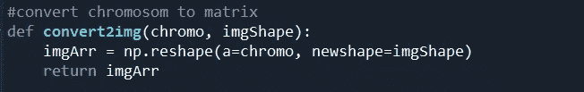

# 基于遗传算法的 2D 图像重建

> 原文：<https://medium.com/analytics-vidhya/2d-image-reconstruction-using-genetic-algorithm-e6ab1c2ea073?source=collection_archive---------3----------------------->

人工智能在今天有着广泛的含义，其中之一就是图像重建问题。

本文的目标是理解**遗传算法**并使用它来解决一个图像重建问题。在我进入技术细节之前。首先，让我荣幸地向您展示我们在这里试图实现的目标，以及我们读完这篇文章后可以做的事情。

重建图像的算法

你刚刚看到上面左边的一张随机图像正在自我重建，看起来和右边的一模一样。所以，这是一个非常简单的图像重建的例子，其中使用了 **2D 图像**。该图像只有 2 个像素值 0 和 1，但如果我们理解得好，我们可以使用相同的逻辑来解决具有 **RGB** 层的 **3D 图像**重建问题。

我们现在首先来看看我用来解决这个问题的算法是如何工作的。遗传算法是一种受查尔斯·达尔文的自然进化理论启发的搜索启发式算法。它反映了自然选择的过程，即选择最适合的个体进行繁殖，以产生下一代的后代。所以，是时候记起我们在学校的生物课了。为了理解这个算法，我们必须首先理解几个术语:

1.  **群体**:可以解决我们问题的一组可行选项被认为是一个群体。

2.**染色体**:他们只是组成群体的个体，拥有解决我们问题的潜力。

3.**基因**:这些是个体的特征，用一串来表示。你也可以把它看作染色体的一个元素位置。通常用二进制值来编码个体/染色体中的基因。

下图将帮助你理解上述概念。这里你可以看到 A1、A2、A3 和 A4 是**个体**或**染色体**。它们一起形成一个集合{A1，A2，A3，A4}，称为**群体**，每个个体由一些 0 和 1 组成，这些 0 和 1 是定义染色体或个体的基因。

现在，当我们理解了这些概念，让我们继续来看看新个体/染色体被修改以满足**要求的过程。**这个**要求**被称为**适应值**。在遗传算法中，我们*取染色体*和*对它们进行一些操作*，直到其中一条染色体最符合我们的要求或者最适合我们的目标。

让我们用一个小例子来理解它。

你被要求生成一个类似于 **0101** 的位序列，你从 **0011 开始。**您可以在该序列的每一步执行一次**操作**，比较结果是否与 **0101** 匹配。如果参加比赛，你将停止，否则继续。假设我们做的操作是**在每一步改变一位**，为了比较我们的位串和目标位串，我将取位差的绝对值**并取其和**。让我们动手去理解它。

**Step1:** 获取我们的输入和目标位串之间每个位的差值。(输入位以粗体显示)

|**0**–0 | = 0

|**0**–1 | = 1

|**1**–0 | = 1

| **1** - 1 |= 0

差值之和为 0+1+1+0 = 2…该值称为**适应值**，如果我们的随机输入字符串与目标位字符串相同，您可以看到该值将为 **0** 。

**第二步**:改变一个位/基因值

**0011** 是我们的输入字符串，所以让我将第一个值改为 1。获得 **1011** 。现在区别变成了。

|**1**–0 | = 1

|**0**–1 | = 1

|**1**–0 | = 1

|**1**–1 | = 0

1+1+1+0=3

喜欢明智的这个操作或行动，使这个小的变化继续和健身计算。如果适应值为 0，则此过程停止。也就是说，我们的随机输入最终收敛到与目标相同的形式。

同样的步骤也适用于遗传算法。只有在输入字符串或染色体或个体上进行的**操作或动作是不同的**并且**输入不是单个字符串而是群体**。下面的操作是在遗传算法中的染色体上执行的。

1.  **选择:**这个操作的思想是从种群中只选择几个最适合的个体。
2.  **交叉:**这是一个重要的操作，这里选择的个体根据排列成对分组，然后根据**交叉点**交换它们的基因/位/值。在下面的例子中，交叉点被设置在中间，因此在该点之后，基因将被交换。

交叉后，我们将得到后代 A3 为 **000111** 和 A4 为 **111000**

3.**突变:**在这个操作中，一些基因被随机选择并翻转或改变。这样做是为了保持群体内的多样性，防止趋同。

变化

# 履行

我们现在已经熟悉了这个理论，是解决这个问题的时候了。首先需要定义几个变量，这将有助于我们的过程。

使用的图像是 10*10 的图像。所以第一个任务是从 file 中读取它，并将其转换为长度为 100 的向量。从【face.png】的和*的【img 2 vector()】*读取图像矩阵后，将其存储在 *face* 变量中，然后使用 img2vector() 将其转换成一个矢量，存储在 *faceVector* 变量中。

阅读图像 face.png

从 10*10 的图像矩阵生成一个矢量

让我们看看使用的其他主要功能

将矢量转换为图像

创造一个群体

计算适应值

最佳亲本的选择

交叉函数

变异函数

特定迭代后保存图像

*convert2img()* 函数与 *img2vector()* 相反，将矢量转换为图像。这有助于我们找回图像。

*initialPopulation()* 函数给出了大小为 100 的 **n** 行/个体的群体(我们的目标向量的大小)。

*fitness_fun()* 取一个染色体和目标向量，返回适应值。 *CalPopFitness()* 只是对一个种群调用它，得到一个种群中所有染色体的适应值列表

这个函数 *getBestParents()* 根据适应值对父母排序，并返回 **n** 个最佳父母。

*。*

*crossover()* 函数做交叉。但是在从 n 个最佳选择亲本中进行交叉之前，基于排列 **nP2 进行配对。**然后以染色体大小的 1/50 的交叉点进行交叉。因此，在我们的例子中，它是 100*1/50=2。你可以根据我们的要求改变它。

*mutation()* 函数取变量 *mutation_percent* 定义的特定百分比的基因，并用随机值替换。这可以根据我们的选择来设置。

*saveImages()* :经过一定次数的迭代后，具有最佳适应值的染色体被保存，并被绘制以查看它与我们的目标图像有多相似。

这是迭代和调用我们的操作函数的部分。迭代的范围是可以改变的，我得到了 250 次迭代的匹配，这对你来说可能是不同的。我们还可以使用一个 while 循环，当适应值达到 0 时，该循环停止。

Tada！我们的算法准备好了。我希望您现在已经对 GA 有了基本的了解。试着去实现它，如果你对它有任何疑问，请在评论中告诉我。我没有分享完整的代码，因为我不希望这只是一个复制和粘贴的问题。:)

在你离开之前，请不要忘记给我一些**掌声**和**跟我来**，因为这将鼓励我做出更多贡献:)

我们可以在 [linkedin](https://www.linkedin.com/in/surajjeswara/) 上联系