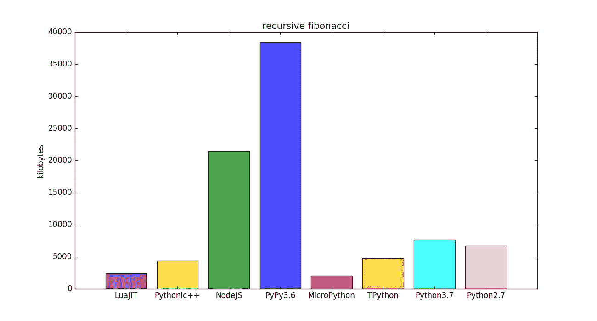

# 比 Python 快 2 倍

> 原文：<https://medium.com/analytics-vidhya/2x-faster-than-python-7c15ab0a9286?source=collection_archive---------14----------------------->

TPython 现在的速度是 Python3 的两倍，重量为 143KB，这使得它可以在浏览器中使用，当翻译到 WASM 时，它只有 220KB (gz 压缩)。TPython 甚至比[micro ython](https://github.com/micropython/micropython)还要小，396KB。虽然比 MicroPython 小，但 TPython 的 RAM 使用量要高得多，但这主要是由于垃圾收集器中未完成的工作，以及它的设计目标是以内存换取性能。MicroPython 是为微控制器设计的，而 TPython 是为运行在虚幻之类的游戏引擎中而设计的。标准 Python 对浏览器可行吗？libpython.3.7m.a 是 32MB，绝对不是。RustPython 呢，还是不行，22MB。

# Pystone 基准

上面橙色的 TPython 比青色的 Python3 快 2 倍。低于内存使用峰值。

就峰值内存使用而言，LuaJIT 和 MicroPython 是明显的赢家，python ++紧随其后。TPython 遗留垃圾收集器还需要工作，[修复](https://gitlab.com/hartsantler/tpythonpp/issues/1)正在进行中。

# 递归斐波那契基准

上面的 TPython(橙色)也比 Python3(青色)快 2 倍。这个基准测试很好地测试了调用函数的原始速度。我想知道为什么 LuaJIT 在这种情况下如此慢，通常它的速度是无与伦比的，但这可能是一个迹象，表明依赖 JIT 不是最好的方法。注意 TPython 只是一个优化的解释器，不是 JIT。

上面我们可以看到使用 JIT 技术的另一个缺点，那就是内存使用，NodeJS 和 PyPy 对于这样一个简单的基准测试都需要大量的内存使用。而 TPython 使用的内存比 Python3 少，甚至比 MicroPython 也差不了多少。请注意，TPython 使用 16 字节的堆栈分配结构作为其主要数据类型，其中包含类型信息、堆栈分配字符串或指针。Python 在堆上分配，所以它的原始数据类型是一个指针(8 字节)

## RustPython 只是一个闪亮的新玩具

RustPython 是大家都很兴奋的新产品，因为它是用 Rust 编写的，但它只是一个闪亮的新玩具，在速度或大小上永远无法与 tPython 相提并论。4864 个提交，128 个贡献者，除了让它慢下来，我想知道他们在做什么？他们说他们的目标是完全实现 python 语言规范，这是毫无意义的，因为如果你想要一个符合标准的 Python，那么你就使用用 C 编写的标准 Python，它与所有现有的 Python 模块兼容。难道他们没有看到 PyPy 是如何以同样的方式取代原始 Python 的吗？让我们看看 RustPython 在相同的基准测试中表现如何。

将近 30 秒来计算递归斐波那契，真的吗？Rust 的一个大问题是它给编码人员的印象是他们知道自己在做什么，并且可以通过并发获得很好的性能，但实际上如果你知道自己在做什么，你可能会使用 C++。