# 使用 Python 从影像数据中提取要素的 3 种初学者友好技术

> 原文：<https://medium.com/analytics-vidhya/3-beginner-friendly-techniques-to-extract-features-from-image-data-using-python-bd5e60e56876?source=collection_archive---------3----------------------->

# 概观

*   您知道可以使用机器学习技术处理图像数据吗？
*   深度学习模型是本月的热门话题，但并不是每个人都可以获得无限的资源——这就是机器学习的救星！
*   在本文中，了解如何使用 Python 从图像中提取要素

# 介绍

你以前处理过图像数据吗？也许你想[建立自己的物体检测模型](https://www.analyticsvidhya.com/blog/2018/10/a-step-by-step-introduction-to-the-basic-object-detection-algorithms-part-1/?utm_source=blog&utm_medium=3-techniques-extract-features-from-image-data-machine-learning)，或者只是想计算走进一栋大楼的人数。使用计算机视觉技术处理图像的可能性是无限的。

但是我最近在数据科学家中看到了一个趋势。人们坚信，当涉及到处理非结构化数据，特别是图像数据时，深度学习模型是前进的方向。深度学习技术无疑表现得极其出色，但这是处理图像的唯一方法吗？

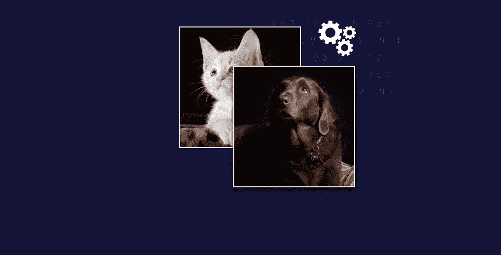

并不是所有人都像谷歌和脸书这样的科技巨头一样拥有无限的资源。那么，如果不通过深度学习的镜头，我们如何处理图像数据呢？

我们可以利用[机器学习](https://courses.analyticsvidhya.com/courses/applied-machine-learning-beginner-to-professional/?utm_source=blog&utm_medium=3-techniques-extract-features-from-image-data-machine-learning)的力量！没错——我们可以使用简单的机器学习模型，比如[决策树](https://www.analyticsvidhya.com/blog/2016/04/complete-tutorial-tree-based-modeling-scratch-in-python/?utm_source=blog&utm_medium=3-techniques-extract-features-from-image-data-machine-learning)或[支持向量机(SVM)](https://www.analyticsvidhya.com/blog/2017/09/understaing-support-vector-machine-example-code/?utm_source=blog&utm_medium=3-techniques-extract-features-from-image-data-machine-learning) 。如果我们提供正确的数据和特征，这些机器学习模型可以充分执行，甚至可以用作基准解决方案。

因此，在这篇初学者友好的文章中，我们将了解从图像中生成特征的不同方式。然后你可以在你最喜欢的[机器学习算法](https://www.analyticsvidhya.com/blog/2017/09/common-machine-learning-algorithms/?utm_source=blog&utm_medium=3-techniques-extract-features-from-image-data-machine-learning)中使用这些方法！

# 目录

1.  机器是如何存储图像的？
2.  用 Python 读取图像数据
3.  从图像数据中提取特征的方法#1:灰度像素值作为特征
4.  用于从图像数据提取特征的方法#2:通道的平均像素值
5.  从图像数据中提取特征的方法#3:提取边缘

# 机器是如何存储图像的？

让我们从基础开始。在我们看其他东西之前，了解我们如何在我们的机器上读取和存储图像是很重要的。考虑这个'*PD . read _【T1]'函数，但是对于图像。*

我将以一个简单的例子开始。请看下图:

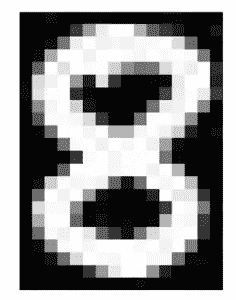

我们有数字 8 的图像。仔细看这张图片，你会注意到它是由一些小方块组成的。**这些被称为像素。**

然而，有一个警告。我们看到的是图像本身——它们的视觉形式。我们可以很容易地区分边缘和颜色，以识别图片中的内容。另一方面，机器很难做到这一点。它们以数字的形式存储图像。请看下图:

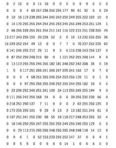

机器以数字矩阵的形式存储图像。这个矩阵的大小取决于任何给定图像中的像素数量。

> *假设一幅图像的尺寸是 180 x 200 或者 n x m，这些尺寸基本上就是图像的像素数(高 x 宽)。*

**这些数字或像素值表示像素的强度或亮度。**较小的数字(更接近零)代表黑色，较大的数字(更接近 255)代表白色。通过分析下面的图片，你会明白我们已经学到了什么。

下图的尺寸为 22 x 16，您可以通过计算像素数来验证:

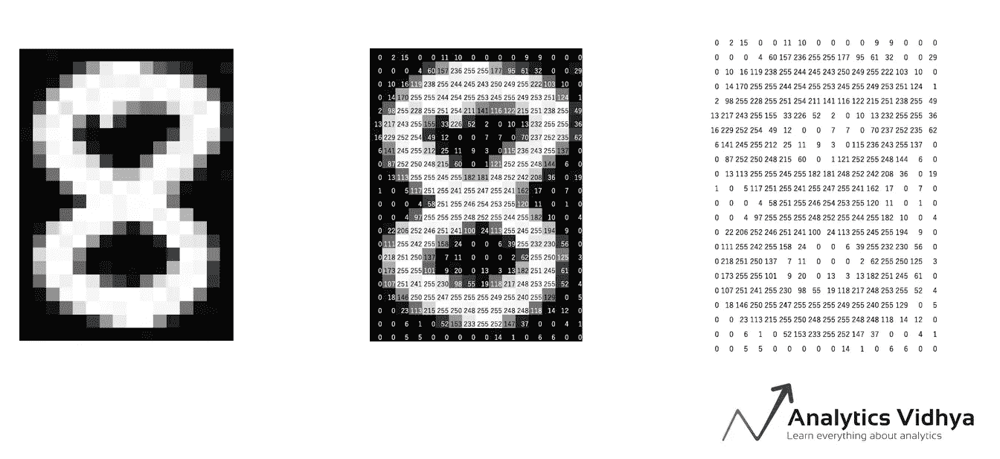

来源:[应用机器学习课程](https://courses.analyticsvidhya.com/courses/applied-machine-learning-beginner-to-professional/?utm_source=blog&utm_medium=3-techniques-extract-features-from-image-data-machine-learning)

我们刚刚讨论的例子是黑白图像。那么彩色图像(在现实世界中更普遍)呢？你认为彩色图像也以 2D 矩阵的形式存储吗？

> *彩色图像通常由多种颜色组成，几乎所有的颜色都可以由三原色(红、绿、蓝)生成。*

因此，在彩色图像的情况下，有三个矩阵(或通道)——红色、绿色和蓝色。每个矩阵的值在 0-255 之间，代表该像素的颜色强度。考虑下图来理解这个概念:

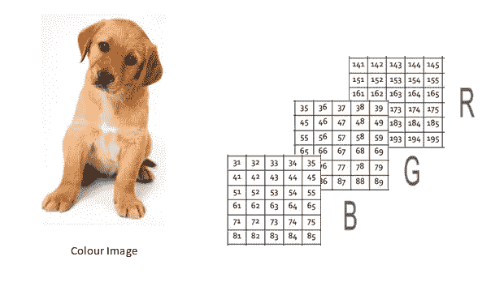

来源:[应用机器学习课程](https://courses.analyticsvidhya.com/courses/applied-machine-learning-beginner-to-professional/?utm_source=blog&utm_medium=3-techniques-extract-features-from-image-data-machine-learning)

我们在左边有一个彩色图像(就像我们人类看到的那样)。在右边，我们有三个矩阵用于三个颜色通道——红色、绿色和蓝色。这三个通道叠加形成一个彩色图像。

*注意，这些不是给定图像的原始像素值，因为原始矩阵会非常大，难以可视化。此外，还有各种其他格式的图像存储。RGB 是最流行的一种，因此我在这里提出了它。你可以在这里* *了解更多其他流行格式* [*。*](https://www.w3schools.com/cssref/css_colors_legal.asp)

# 用 Python 读取图像数据

让我们把理论知识付诸实践。我们将启动 Python 并加载一幅图像，看看矩阵是什么样子:

```
import pandas as pd
import numpy as np
import matplotlib.pyplot as plt
%matplotlib inline
from skimage.io import imread, imshow

image = imread('image_8_original.png', as_gray=True)
imshow(image)
```

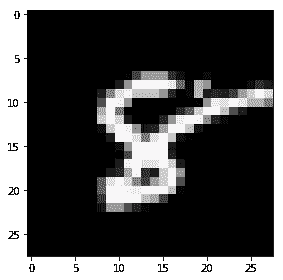

```
#checking image shape 
image.shape, image(28,28)
```

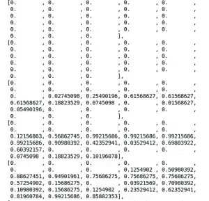

矩阵有 784 个值，这是整个矩阵的很小一部分。

现在让我们深入本文背后的核心思想，探索使用像素值作为特征的各种方法。

# 方法#1:灰度像素值作为特征

> *从图像创建特征的最简单方法是使用这些原始像素值作为单独的特征。*

以上面的图像为例(数字“8”)，图像的尺寸是 28 x 28。

你能猜出这张图片的特征数量吗？特征的数量将与像素的数量相同！因此，这个数字将是 784。

现在又有一个好奇的问题——我们如何把这 784 个像素排列成特征？嗯，我们可以简单地将每个像素值一个接一个地附加起来，以生成一个特征向量。下图对此进行了说明:

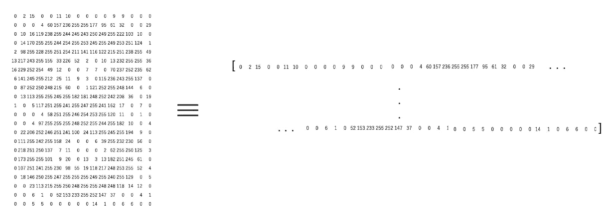

让我们用 Python 制作一个图像，并为该图像创建以下特征:

```
image = imread('puppy.jpeg', as_gray=True)                        image.shape, imshow(image)(650, 450)
```

这里的图像形状是 650 x 450。因此，特征的数量应该是 297，000。我们可以使用 NumPy 中的 *reshape* 函数来生成该图像，其中我们指定了图像的尺寸:

```
#pixel features                                               features = np.reshape(image, (660*450))                                               features.shape, features(297000,) 
array([0.96470588, 0.96470588, 0.96470588, ..., 0.96862745, 0.96470588, 0.96470588])
```

这里，我们有我们的特征—长度为 297，000 的 1D 数组。很简单，对吧？

但在这里，我们只有一个单一的通道或灰度图像。我们能对彩色图像做同样的事情吗？让我们来了解一下！

# 方法#2:通道的平均像素值

在读取上一节中的图像时，我们已经设置了参数 *'as_gray = True'* 。因此，我们在图像中只有一个通道，我们可以很容易地附加像素值。让我们删除参数并再次加载图像:

```
image = imread('puppy.jpeg')     
image.shape(660, 450, 3)
```

这一次，图像有一个维度(660，450，3)，其中 3 是通道的数量。我们可以像以前一样继续创建特征。在这种情况下，特征的数量将是 660*450*3 = 891，000。

或者，我们可以使用另一种方法:

> *我们可以生成一个新矩阵，其中包含所有三个通道的像素平均值，而不是分别使用三个通道的像素值。*

下图将让你更清楚地了解这个想法:

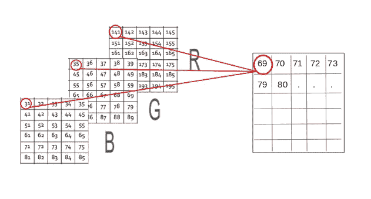

通过这样做，特征的数量保持不变，并且我们还考虑了来自图像的所有三个通道的像素值。让我们用 Python 来编码。我们将创建一个同样大小为 660 x 450 的新矩阵，其中所有值都被初始化为 0。该矩阵将存储三个通道的平均像素值:

```
image = imread('puppy.jpeg')
feature_matrix = np.zeros((660,450))                        feature_matrix.shape(660, 450)
```

我们有一个尺寸为(660 x 450 x 3)的 3D 矩阵，其中 660 是高度，450 是宽度，3 是通道数。为了获得平均像素值，我们将使用一个*用于*循环:

```
for i in range(0,iimage.shape[0]):
   for j in range(0,image.shape[1]):
        feature_matrix[i][j] = ((int(image[i,j,0]) + int(image[i,j,1]) + int(image[i,j,2]))/3)
```

新矩阵将具有相同的高度和宽度，但只有一个通道。现在，我们可以按照上一节中的相同步骤进行操作。我们将像素值一个接一个地附加起来，得到一个 1D 数组:

```
features = np.reshape(feature_matrix, (660*450))                        features.shape(297000,)
```

# 方法#3:提取边缘特征

假设我们得到了下图，我们需要识别图中的物体:

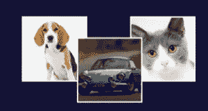

你一定在瞬间认出了这些物体——一只狗、一辆车和一只猫。在区分这些图像时，您考虑了哪些特征？形状可能是一个重要因素，其次是颜色或大小。如果机器也能像我们一样识别形状会怎么样？

类似的想法是提取边缘作为特征，并将其用作模型的输入。我希望你们思考一下这个问题——我们如何识别图像中的边缘？边缘基本上是颜色变化剧烈的地方。请看下图:

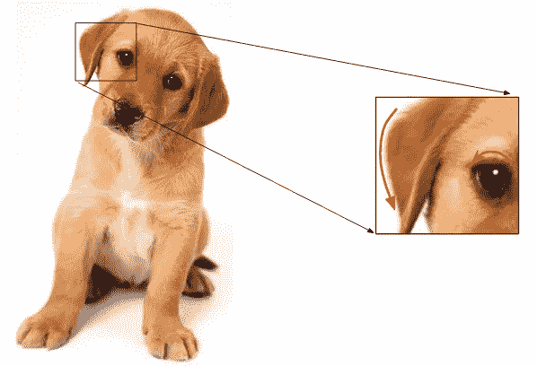

我在这里强调了两个方面。我们可以识别边缘，因为颜色从白色变为棕色(右图)和棕色变为黑色(左图)。我们知道，图像是以数字的形式表现的。因此，我们将寻找像素值变化剧烈的像素。

假设我们有以下图像矩阵:

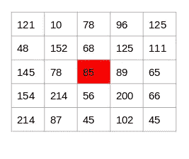

来源:[应用机器学习课程](https://courses.analyticsvidhya.com/courses/applied-machine-learning-beginner-to-professional/?utm_source=blog&utm_medium=3-techniques-extract-features-from-image-data-machine-learning)

为了识别一个像素是否是边缘，我们将简单地减去像素两边的值。在本例中，我们突出显示了值 85。我们将找到值 89 和 78 之间的差异。由于这个差别不是很大，我们可以说这个像素周围没有边缘。

现在考虑下图中高亮显示的像素 125:

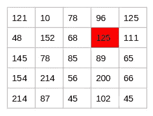

来源:[应用机器学习课程](https://courses.analyticsvidhya.com/courses/applied-machine-learning-beginner-to-professional/?utm_source=blog&utm_medium=3-techniques-extract-features-from-image-data-machine-learning)

由于该像素两侧的值之间的差异很大，我们可以得出结论，在该像素处有显著的转变，因此它是边缘。现在的问题是，我们必须手动完成这一步吗？

不要！有各种各样的内核可以用来突出显示图像中的边缘。我们刚刚讨论的方法也可以使用 Prewitt 核(在 x 方向)来实现。下面给出的是 Prewitt 内核:

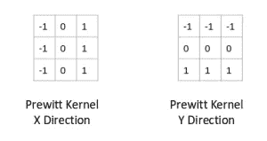

我们将所选像素周围的值乘以所选的核(Prewitt 核)。然后，我们可以将结果值相加以获得最终值。因为我们已经在一列中有-1，在另一列中有 1，所以将这些值相加相当于取差。

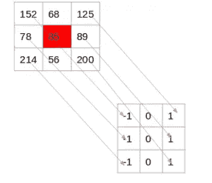

还有各种其他的内核，我在下面提到了四种最常用的内核:

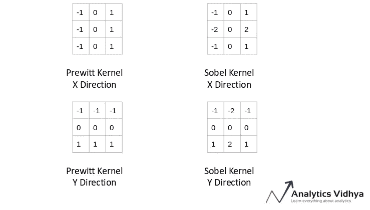

来源:[应用机器学习课程](https://courses.analyticsvidhya.com/courses/applied-machine-learning-beginner-to-professional/?utm_source=blog&utm_medium=3-techniques-extract-features-from-image-data-machine-learning)

现在让我们回到笔记本，为同一幅图像生成边缘特征:

```
#importing the required libraries
import numpy as np
from skimage.io import imread, imshow
from skimage.filters import prewitt_h,prewitt_v
import matplotlib.pyplot as plt
%matplotlib inline#reading the image 
image = imread('puppy.jpeg',as_gray=True)#calculating horizontal edges using prewitt kernel
edges_prewitt_horizontal = prewitt_h(image)
#calculating vertical edges using prewitt kernel
edges_prewitt_vertical = prewitt_v(image)imshow(edges_prewitt_vertical, cmap='gray')
```

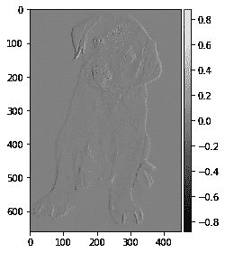

# 结束注释

这是一个友好的介绍，让您接触到图像数据。我觉得这是数据科学家工具箱中非常重要的一部分，因为目前生成的图像数量在迅速增加。

那么一旦你熟悉了这个话题，你能做什么呢？在我的下一篇文章中，我们将深入探讨接下来的步骤——很快下降！所以请关注这个空间，如果你对这篇文章有任何问题或想法，请在下面的评论区告诉我。

此外，这里有两个全面的课程，让你开始学习机器学习和深度学习:

*   [应用机器学习:从初学者到专业人士](https://courses.analyticsvidhya.com/courses/applied-machine-learning-beginner-to-professional/?utm_source=blog&utm_medium=3-techniques-extract-features-from-image-data-machine-learning)
*   [使用深度学习的计算机视觉](https://courses.analyticsvidhya.com/courses/computer-vision-using-deep-learning-version2?utm_source=blog&utm_medium=3-techniques-extract-features-from-image-data-machine-learning)

*原载于 2019 年 8 月 29 日*[*https://www.analyticsvidhya.com*](https://www.analyticsvidhya.com/blog/2019/08/3-techniques-extract-features-from-image-data-machine-learning-python/)*。*