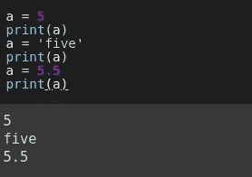

# Python 的 3 天:第 1 天

> 原文：<https://medium.com/analytics-vidhya/3-days-of-python-day-1-1e9934d865e5?source=collection_archive---------0----------------------->

## 装置

我期待你已经成功安装了 Python。

**1 — IDEs —闲散、崇高、魅力**

你可以尝试不同的 ide 和编辑器。Idle 也是很好的合作伙伴。默认情况下，Python 附带了 Idle。我个人的选择是 Pycharm，Sublime，Idle，Jupyter 笔记本。你应该尝试不同的编辑器和 ide，看看哪个更适合你。

**2 —丘比特笔记本**

如果你是为了机器学习而学习 Python，那么你应该试试 Jupyter Notebook。这里给出了[的安装说明。](https://jupyter.org/install)文档中解释了如何运行等所有说明。

我将集中讨论更多的例子。你应该自己尝试所有的命令。你不需要死记硬背所有的命令——只要把它们的概念搞清楚就行了。至于语法，你可以随时在网上查找。你应该试着学会如何使用它们。

如果你不想安装任何东西，那么使用 [Google Colab](https://colab.research.google.com/) 。

## **让我们开始**

## **1 —打印**

这用作在屏幕上打印内容的名称建议。它打印内容，然后也改变行。print 语句非常常用于调试程序。

**示例:-**

打印字符串

打印整数

印刷浮子

打印多个值

## 2-变量

这些用于存储不同类型的数据。在 Python 中，你不需要定义变量要存储什么类型的数据。它会自动检测。

**示例:-**

**字符串示例**

## 3 —输入

它用于获取用户的输入。从例子中会更清楚。只是尝试一下。它把每一个输入都当作一个字符串，因此如果想要一个整数和其他值，我们必须转换它们。从例子中会更清楚。

**示例:**

在上面的例子中，我使用了 *type()* 来获取变量的类，比如整数、字符串、浮点等等。我认为从上面的例子中一切都很清楚，因为它使用起来非常简单。

## 4-缩进

每种语言都有某种东西告诉编译器或解释器行的结束。或者表示哪些行应该在哪个函数或块下执行。在 Python 中，我们有一个非常有创意的方法来做这件事，即缩进。由于缩进的原因，Python 代码排列整齐，易于阅读。你需要一段时间来适应它，但是你会喜欢 Python 的这个特性。

**例如:**

刻痕

您可以看到在 print 语句之前有一些空格。表明打印声明属于上述声明。这就是 python 中使用缩进的概念来显示行尾的方式。编写一段代码。如果你使用一些好的编辑器，它会在你输入的时候自动缩进。所以现在你不能让你的代码变脏。这使得 Python 代码可读性更强，更容易理解。

## 5 —如果是，则为 elif

这些命令用于设置是否执行一组代码的条件。

**语法:**

句法

**例子:**

仅当等于时

仅当不等于时

否则

否则

如果，否则，elif

并且，或者

不

以上例子说明了很多。这是我们如何使用 if，else 和 elif。有许多比较运算符与这些语句一起使用，如 ***等于(==)*** 、 ***不等于(！=)*** *，* ***大于(> )*** ， ***小于(< )*** 等。在***和*** 中所有条件都应该为真，在 ***或*** 中如果一个条件为真，那么 if 的主体将被执行。在最后一个例子中，我们用了 not。如果条件为假，则返回 True，如果条件为真，则返回 False。

## 6-循环

再来说说循环。

通过使用循环，我们可以一次又一次地执行一组命令。举个例子就什么都清楚了。你应该更多地学习代码，以便学得更好。你对代码的实验越多，你学到的就越多。开始时，这些东西听起来会很奇怪，但只要开始使用它们，过一段时间后你就会感到舒服了。你的重点应该放在你想解决的问题上。

我们有***‘for’***循环和***‘while’***循环。

**示例:**

这里我用了 ***range()*** ，它是 Python 的一个内置函数。它产生数字。它的语法是:

起始编号是计数开始的地方，它将包含在计数中。结束编号是将生成的编号的极限，它不会包含在其中。步骤告诉如何增加数字。

Python 有布尔值**真**和**假**，保留 **T** 和 **F** 大写。上面是一个无限循环，因为没有终止条件。

还有其他功能和关键字，如**‘不在’**、**、【无】、**、【zip】、**、【枚举】、**等。这个我们在学习完 Python 的基本数据结构( **list** 、 **dict** 、 **tuple** 等)之后再讨论。).****

## 快乐学习！！