# Python 的三天:第二天

> 原文：<https://medium.com/analytics-vidhya/3-days-of-python-day-2-dda208dfe05f?source=collection_archive---------2----------------------->

# 数据结构

数据结构非常重要，因为我们需要有效的方法来处理数据。Python 有广泛使用的 List、Dict、Tuple 和 Set。我们将用实例详细讨论所有这些。你用得越多，你就会越适应它们。有许多操作可以在它们上面执行，你不必把它们都塞进去。只需了解可以执行哪些操作，并且在需要时可以搜索互联网并获取相关文档。所以把重点放在数据结构的属性上，放在可以用的地方。了解可以执行哪些操作，以及这些操作对您的工作有何帮助。

## 目录

它是 Python 中使用最多的数据结构。真的很神奇。你可以在列表中放入任何东西。数据类型无关紧要。从例子中会更清楚。你应该专注于如何使用它，而不是记住代码。当你开始使用它的时候，你会习惯这些代码。

**示例:-**

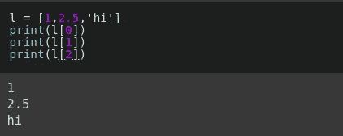

方括号用于创建列表。我们可以在列表中放入任何类型的值。

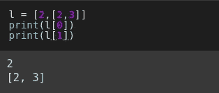

我们可以把一个列表放在一个列表中。

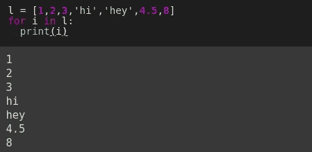

循环可以很容易地在一个列表上完成。通过使用的*和*操作符中的*，我们可以访问列表中的每个元素。*

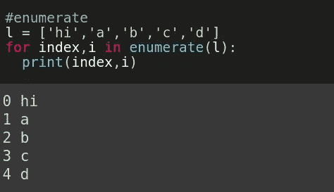

列举

我们使用 ***enumerate()*** 函数从列表中获取索引和元素。当我们必须在代码中对元素使用索引时，这是一个非常有用的函数。

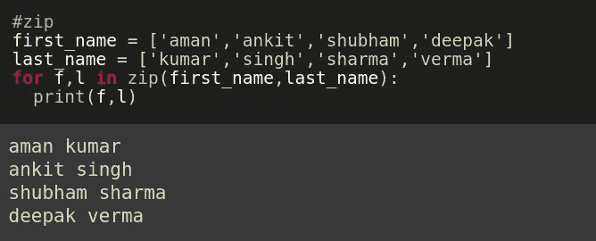

活力

***zip()*** 用于将两个或多个列表放在一起，同时遍历它们的元素。

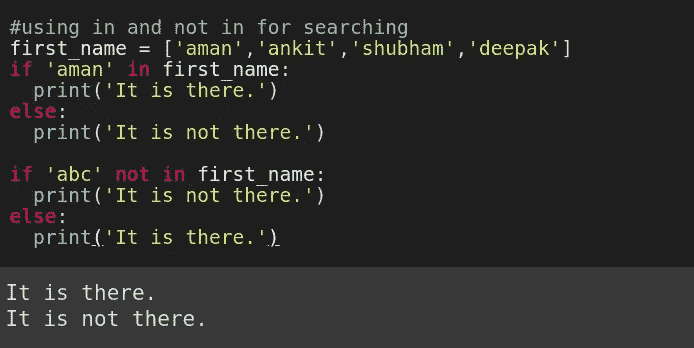

在和不在

我们使用中的*和*中的*来检查一个元素是否出现在一个列表中。这是一种非常方便的搜索方式。*

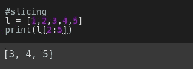

以上语法是切片的。您应该自己运行所有这些命令。如果你自己编码并做一些实验，我们会学到更多。

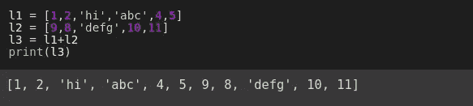

添加两个列表

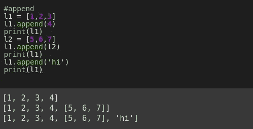

附加

要向列表中添加新元素，我们使用*函数。在上面的例子中，我们可以看到语法非常简单。*

*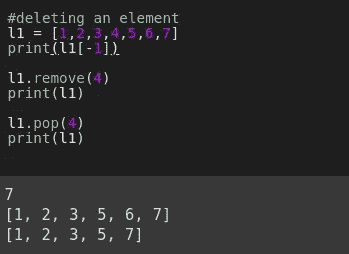*

*取出并弹出*

*在上面的例子中，使用了两个函数 ***remove()*** 和 ***pop()*** 。 ***remove()*** 删除作为参数传递的元素，而 ***pop()*** 删除出现在该索引处的元素。我们可以使用 **-1** 来访问列表中的最后一个元素，使用 **-2** 来访问倒数第二个元素，**等等**。*

*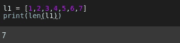*

*列表长度*

*为了找到列表的长度，我们使用 **len()** 函数。*

## *一组*

*与列表一样，您可以将任何类型的值放入集合中，但这些值将保持唯一。这意味着如果该值已经存在于其中，那么它将不会被再次添加到其中。*

***示例:-***

*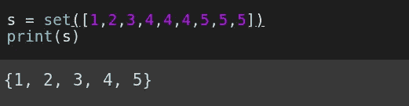**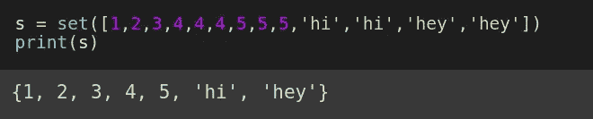*

*集合类似于列表，但是在集合中没有重复项。*

*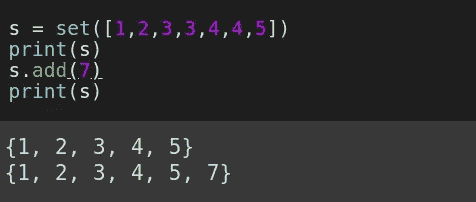*

*增加*

*我们使用 ***add()*** 函数向集合中添加一个新元素。*

*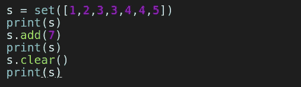*

****clear()*** 函数删除集合中存在的所有元素。*

*还有其他函数，但我只讨论对开始使用 Python 的初学者来说重要的函数。*

## *词典*

*我们将值存储在**键:值**对中。在 list 中，我们通过从零开始的索引来访问一个元素。但是在 ***dict*** 中，我们通过元素的键来访问元素。*

***示例:-***

*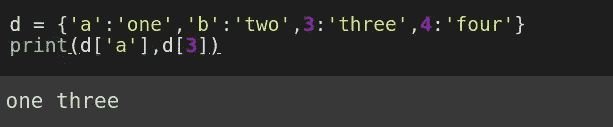**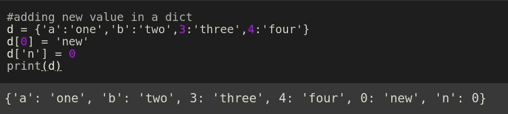*

*添加新的键:值对*

*添加新元素很简单。*

*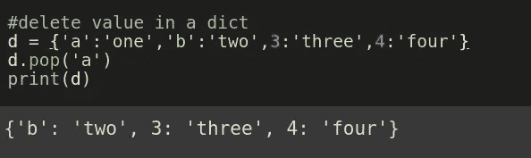*

*流行音乐*

*要删除一个元素，我们使用 ***pop()*** 函数并传递我们想要删除的键值。*

*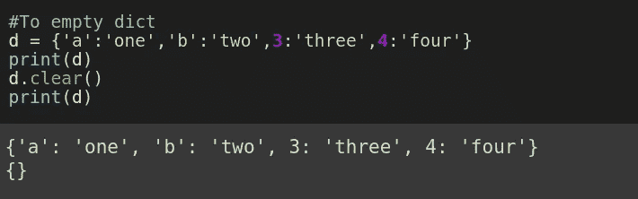*

*清楚的*

*我们使用 ***clear()*** 函数删除字典中的所有值。*

## *元组*

*与 List 不同，它是不可变的。一旦值被插入，我们就不能改变它。如果你现在没有得到它，不要担心。一旦你开始使用它们，你就会明白其中的区别。有了例子，你会更清楚:-*

*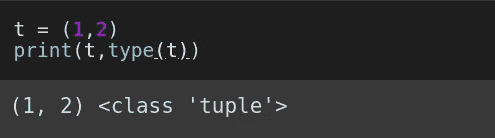*

*创建元组并检查类型*

*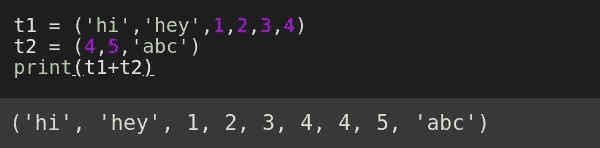*

*添加二元组*

*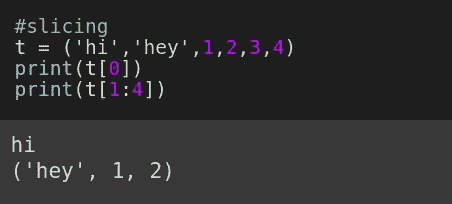*

*限幅*

*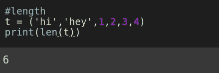*

*长度*

*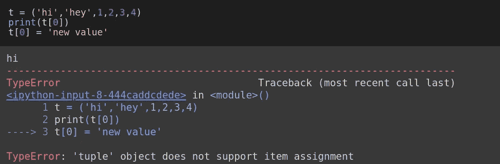*

*试图改变一个值*

*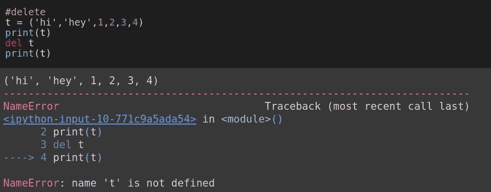*

*删除元组*

*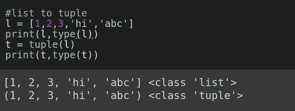*

*列表到元组*

## *功能*

*很多时候我们不得不一次又一次地执行同样的任务。我们用函数来表示它。函数使代码更具可读性，更易于理解和重用。将我们的任务分成不同的部分并在不同的功能中实现它们是一个很好的做法。为了创建一个函数，我们在 Python 中使用了 **def** 关键字。*

***例子:-***

*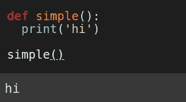**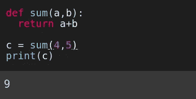**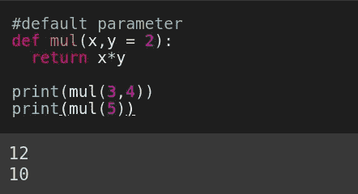**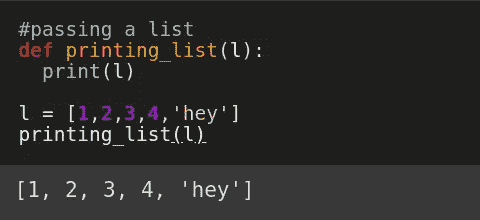**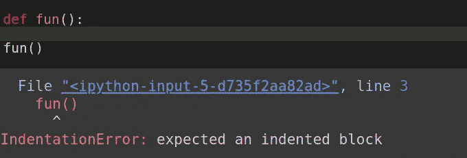**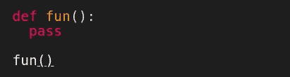*

***1 —定义***

*这个关键字用于定义一个函数。*

***2 —返回***

*为了给函数发送一些值，我们使用了 **return** 语句。*

***3 —通过***

*当我们不想执行任何任务或者我们必须为它写代码时。我们使用 **pass** 关键字来避免错误和运行其他代码。*

*现在，您应该练习所有这些命令。自己键入所有命令。不要复制和粘贴它们。你试得越多，你对这门语言就越有信心。*

## *快乐学习！！*