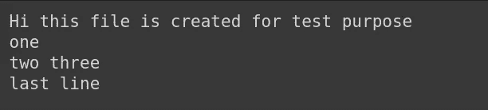

# Python 的三天:第三天

> 原文：<https://medium.com/analytics-vidhya/3-days-of-python-day-3-b11bbdf60d59?source=collection_archive---------3----------------------->


# 图书馆

Python 因其出色的库而闻名，几乎每个领域都有它的库。你想在任何领域工作，比如网络、网络开发、机器学习等等。，你会为他们找到很棒的图书馆。如果 Python 是你的第一语言，并且你是这个编程世界的新手，那么你可能想知道库的意义是什么？

这些是其他人写的代码，你可以使用。编写库有各种原因。

代码应该总是可重用的，这意味着其他人也可以很容易地使用我们的代码。

```
**import _****from _ import _****import _ as _**
```

在我们的代码中有各种各样的方法可以使用库。我们使用

```
**import** *library_name***from** *library_name* **import** *subpart_of_library***import** *library_name* **as** *name_given_by_us*
```

**例题** :-


Python 已经提供了一些基本的库，比如 os 等。其他的我们必须自己安装。就像上面的例子一样， **NumPy** 不是一个我们必须安装的基本库。我们用 **pip** 来表示。

首先，通过在 Jupyter 笔记本中键入以下命令来检查是否安装了 pip。


如果您正在任何其他编辑器中工作，请打开终端或 cmd 并键入以下命令。如果您看到一些输出，如安装了哪个版本的 pip，那么它就被安装了，您可以使用它来安装库。


如果没有出现这种情况，并且您没有 pip，那么您可以按照这里给出的说明[安装 pip。](https://www.makeuseof.com/tag/install-pip-for-python/)

# **使用文件**

让我们来读和写数据到一个文件。有不同类型的文件，如文本文件、 **CSV** (逗号分隔值文件)文件等。我们可以用 python 读取任何类型的文件。现在，我们将讨论两种类型的文件:文本和 CSV。

如何阅读它们？如何将数据写入其中？可以在它们上面应用什么不同的功能？

CSV 文件在机器学习中被大量使用，因为大量数据在 CSV 文件中共享，因为这是存储数据的有效方式。数据用逗号分隔。文本文件包含由换行符或制表符分隔的数据。

```
**open
with open() as f**
```

我们使用 **open()** 来读取或写入文件。如果我们将**与 open()** 一起使用，那么文件被隐式关闭，否则我们必须显式关闭它。

**举例** :-



文件内容

我们的文件包含上述数据。去创建一个文本文件，放一些数据进去，可能是几行。


一次读取整个文件


使用 open()作为读取

我们使用 open()函数来处理 Python 中的文件。第一个参数是文件的完整路径，第二个参数指定是以读模式还是写模式打开文件(“r”:read，“w”:write，“a”:append)。请务必检查是否打开了正确的路径。read()函数一次读取所有数据。


读一行

为了一次读取一行，我们使用 *readline()* 函数。如果我们调用 *readline()* ，它读取该行并将读取指针移动到下一行。因此，如果我们再次调用 *readline()* ，下一行将被打印。


为了写入文件，我们以写模式(‘w’)打开文件。要在文件中写东西，我们使用 *write()* 函数。并且输入应该是字符串格式。所以如果你想写一个整数值，那么就用 *str(int_value)* 把它转换成一个字符串。当我们以写模式打开一个文件时，它会删除文件的所有内容并从头开始写。


如果你想添加一些东西到已经存在的文件内容中，使用 append 模式(' a ')。如果你用这种模式写任何东西，它会在末尾添加。我们需要使用 *close()* 函数来关闭文件。关闭打开的文件以推动更改并释放控件是很重要的。

还有一种非常著名的文件类型是 CSV(逗号分隔值)。我个人选择打开这些类型的文件是熊猫。这是一个 Python 库，使得处理数据变得非常容易。这里就不详细讨论了。我只讨论了初学者应该知道的概念。这些概念将帮助您开始 Python 之旅。相信自己，用代码做越来越多的实验。

像*熊猫*一样，有一些库在机器学习中被大量使用。比如:- *NumPy* ， *Matplotlib* ， *Keras* ， *Tensorflow* ， *sklearn* 等。

# 一些提示

*   不要试图硬塞这些语句的语法。
*   关注事物是如何被使用的，并学习如何在你的工作或项目中使用它们。
*   专注于解决问题。
*   做一些个人项目。
*   当你遇到困难的时候就使用谷歌。
*   查阅文档了解语法以及如何使用这些命令。
*   语言学习应该循序渐进。在解决问题的过程中，当你遇到新的概念和库时，不断地向你的知识中添加它们。

## 快乐学习！！