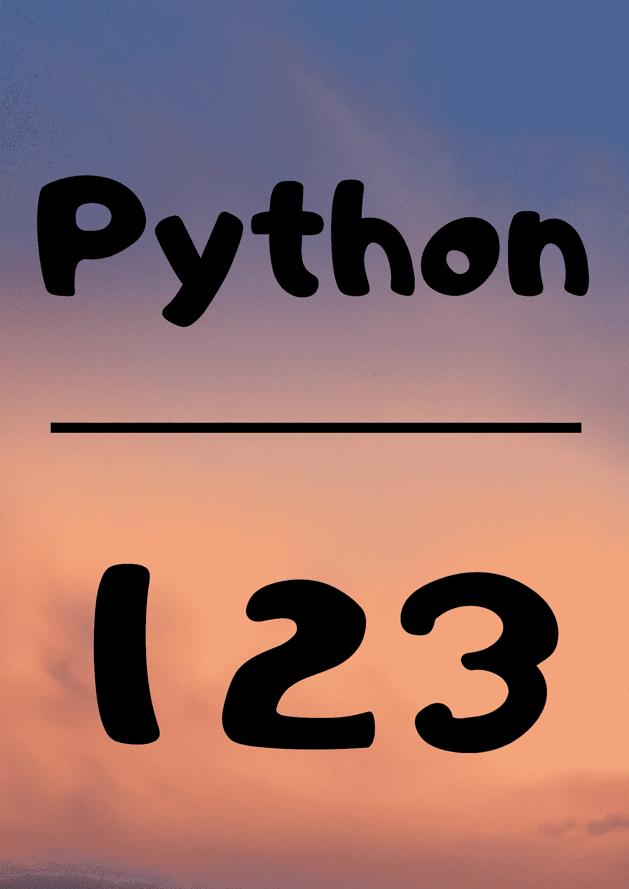

# Python 三日游:简介

> 原文：<https://medium.com/analytics-vidhya/3-days-of-python-introduction-cb742e2959fc?source=collection_archive---------1----------------------->

如今，Python 是市场上最流行的语言之一。如果你还没有学会，你可能会想这是怎么回事。Python 非常容易学，有很棒的库。一旦你学会了，你会发现用 python 开发东西是非常容易和有趣的。在后端，Python 使用 C 代码。它只是 C 代码的包装。Python 拥有巨大的社区支持。并随着其在机器学习、深度学习等方面的运用。它变得更受欢迎。也是程序员的首选。我想你现在已经很好地了解 Python 了。学习 Python 很容易，3 天就能学会。虽然你不会成为这方面的专家，但你会感到很舒服。在学习了基础知识之后，你只需要学习根据你的工作来使用这些库。不同的任务有不同的库。

## **1 — Python2 vs Python3**

你可能会碰到 Python2 对 Python3。让我保持这个简单的学习 Python3。我这么说是因为 Python2 太老了，它现在不支持很多库。据说 2020 年后 Python2 就不维护了。所以不要再想了。选择 Python3

## 2 —用于数据科学的 Python

Python 在数据科学方面非常出名。它有像 *Numpy* 、*熊猫*、 *Matplotlib* 、 *seaborn* 、 *Keras* 等图书馆。而这些在里面都很好用。这些都维护的很好。我们将稍后讨论所有这些事情，现在只是为了了解 Python 在数据科学中的广泛使用。

## 3 — Python 与 R

我应该学 Python 还是 R？

这是一个困扰数据科学初学者的著名问题。我不想深入细节，因为这两种语言都很棒。但不得不说 ***Python*** 比 ***R*** 更受欢迎。我的观点是，如果你是数学(非技术)背景，去和 T21 合作，你会更舒服。如果你是学计算机科学的技术出身。然后去找 ***Python*** 。

## Python 的应用

现在让我们讨论一些你可以用 Python 做的很棒的事情。这些应用程序将足以让你兴奋地学习 Python。

## Web 开发中的 Python

使用 Django、Flasks 等框架，我们可以很容易地将 Python 用于 web 开发。它的编码风格变化不大。我们必须学习网络上的东西是如何工作的，以及如何使用这些库的功能，我们准备好了。如果你想开发一个快速的 web 应用程序，用 Flask，如果你想开发一个有很多 web 应用程序的大型网站，用 Django。这些都有很好的文档记录，您可以很容易地开始使用它们。

## 6-Python 数据科学库

Python 在数据科学中被广泛使用，因为它有很好的库，并且易于编写代码。我们可以用几行代码完成很多任务。像 *Pandas* (用于处理数据) *Numpy* (数组操作) *Matplotlib* (数据可视化) *Tensorflow* 、 *Pytorch* 和 *Keras* 等库用于训练深度学习模型。

## 7 —自动化和刮擦

您可以轻松有效地自动化您的任务。你可以自动登录你的脸书账户，也可以自动发送 WhatsApp 信息。这些例子只是为了好玩，激励你学习 Python。收集数据刮是一个伟大的方式。网页抓取是指从网页中提取数据，并以所需的格式存储。我们可以使用像 *Selenium* 、 *Scrapy* 、 *BeautifulSoup* 等库来完成所有这些工作。

还有很多应用程序，比如开发游戏、应用程序等。你几乎可以用 Python 做任何事情，因为它有很棒的库。我希望你有足够的动力开始使用 Python。

## 8 —安装

安装 Python 非常容易。如果你使用的是像 Ubuntu 这样的 Linux 操作系统，那么它已经安装好了。如果你在 Windows 上工作，那么去 https://www.python.org/downloads/下载 Python。

## 第一天

## [第二天](/@karan_jakhar/3-days-of-python-day-2-dda208dfe05f?source=friends_link&sk=b227c320f241dea49217fb0745fd618a)

## [第三天](/@karan_jakhar/3-days-of-python-day-3-b11bbdf60d59?source=friends_link&sk=3c38d72a1f79339857fccabc4b7551c8)

## 快乐学习！！

## 关注我获取更多类似的内容。