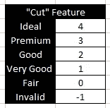

# 处理分类数据的 3 种简单方法——Python

> 原文：<https://medium.com/analytics-vidhya/3-easy-ways-to-handle-categorical-data-python-b43fbd81e227?source=collection_archive---------14----------------------->

埃德加·索托在 [Unsplash](https://unsplash.com?utm_source=medium&utm_medium=referral) 上拍摄的照片

## 介绍

NOIR 系统将数据分类为名义数据、顺序数据、区间数据和比率数据。现在，只需要对名词和序数有一个基本的了解。

*   **名词性:**没有任何隐含顺序的范畴。比如 A+ve，O-ve 等不同的血型。它们之间没有隐含的顺序。
*   **序数:**隐含排序的类别。例如，这种疾病可以分为几个阶段:发病期、急性期和慢性期。一次比一次严重。

名义数据类型和顺序数据类型的示例

分类特征可以是名义数据类型或序数数据类型。以下是几个例子:

iris . CSV:species[' setosa ' ' versicolor ' ' virginica ']

Seaborn Tips 数据集:性别、吸烟者、日期、时间是分类特征

分类特征不能由计算机直接处理。需要对它们进行编码，以便进行进一步的处理和分析。**编码**是将分类变量转换成二进制或数字对应变量。

编码示例

在这篇文章中，我将解释 Python 中 3 种简单的编码方式。

## 先决条件

*   熟悉 Google Colab 笔记本、Jupyter 笔记本(或任何其他等效工具)
*   对 Python 中熊猫数据框架和 sci-kit 学习库的基本理解。

## 让我们开始吧…

我们将从用 python 导入必要的库开始。

导入必要的库

**Seaborn** 库用于在 python 中绘制图形(类似于 matplotlib)。它还提供了对一些示例数据集的快速访问，这些数据集用于记录 seaborn 或为 bug 报告生成可重复的示例。可用数据集的列表可以使用 **get_dataset_names()** 获得，如下所示。

Seaborn 中可用数据集的列表

我将使用**“钻石”**数据集。请随意试验其他数据集，如 iris、titanic、planets 和 tips。

加载数据集:钻石

这个经典数据集包含近 54，000 颗钻石的价格和其他属性。我们还可以观察到数据集中没有缺失值。

数据集的形状和缺失值的百分比

使用 seaborn 和 matplotlib 可以用这些数据绘制出许多漂亮的图形，如下所示( [GitHub](https://github.com/athisha-rk/mediumArticlesRelatedFiles/blob/master/categorical_data.ipynb) )。

克拉与价格的散点图

深度与价格的散点图

分类特征是切割、颜色和透明度。在进一步处理之前，需要对这三个特征进行编码。

每个功能中的不同类别

**方法 1:使用切削特征的应用()**

apply()函数允许用户对数据帧中的每个特征值应用一个函数。当我们使用 apply()时，它给了我们将它映射到任何值的自由。如下所示，为“切割”完成映射。

CutEncoding()为值“cut”完成了映射

使用 apply()编码剪切

**方法二:对颜色特征使用标签编码器**

sk learn . preprocessing . label encoder()对 0 到 n-1 之间的值进行编码。在我们的数据中，颜色有 7 类。因此编码值的范围是从 0 到 6。下面的代码片段实现了这个目标。

颜色的标签编码(sklearn .预处理)

**方法三:使用 DummyEncoding 获得清晰特征**

pandas.get_dummies()将分类特征转换为指示器或虚拟变量。

**举例:**考虑一个拥有网球的小数据集？作为一个功能。网球的可能价值？是，不是，也许。get_dummies()的结果如下所示。

get_dummies 的插图()

当我们只关心某个特定特性的一个类时，get_dummies()会很有用。当我们试图筛选网球运动员时，数据被重新分组为网球运动员和非网球运动员。在这样的情况下，只有 Tennis_Yes 功能就足够了。

同样的概念可以应用于我们数据集中的“清晰性”。

清晰度的虚拟编码

**另一个简单的例子:虹膜数据集**

1.  使用 seaborn.load_dataset()加载数据集

加载虹膜数据集

2.对物种特征应用 LabelEncoder()

“物种”的标签编码

3.决赛成绩

## **有用的资源**

*   [从 kaggle](https://www.kaggle.com/shivam2503/diamonds) 下载数据集“钻石”
*   [分类数据. ipynb](https://github.com/athisha-rk/mediumArticlesRelatedFiles/blob/master/categorical_data.ipynb)

有很多方法来编码数据。这三个是其中最容易的。请在下面的评论区告诉我你的想法/问题:)