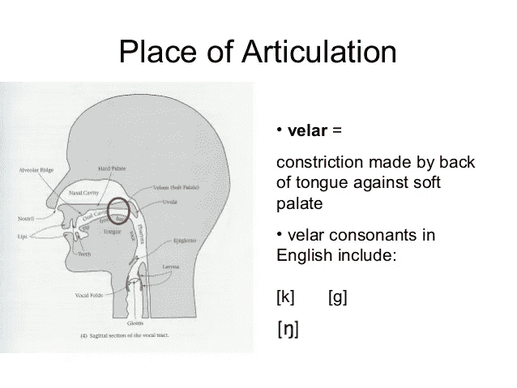
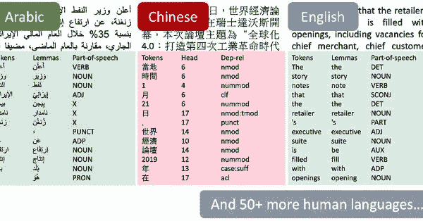

# 3 个重要的印度语言 NLP 库，你今天应该试试！

> 原文：<https://medium.com/analytics-vidhya/3-important-nlp-libraries-for-indian-languages-you-should-try-out-today-a4c2ed33d985?source=collection_archive---------9----------------------->

我们看到的大多数突破和最先进的框架都是用英语开发的。我一直想知道我们是否可以利用这一点，用本地语言构建 NLP 应用程序。


# 以下是我们将在本文中涉及的内容:

1.  印度次大陆的语言有哪些？
2.  使用 Python 对印度语言进行文本处理
3.  多语言自然语言处理研究的趋势

# 印度次大陆的语言有哪些？

印度次大陆由许多国家组成，维基百科是这样说的:

> 印度次大陆是一个术语，主要用于被印度洋包围的地理区域:孟加拉国、不丹、印度、马尔代夫、尼泊尔、巴基斯坦和斯里兰卡。

这些国家在语言、文化、烹饪等方面有很大的差异。

即使在印度本土，也有大量的语言在日常生活中使用，这本身就表明了能够用本地语言构建基于 NLP 的应用程序的基本需求。


# 使用 Python 对印度语言进行文本处理

有一些 Python 库我们可以用来执行文本处理和为印度语言构建 NLP 应用程序。我把它们放在这张图表中:


所有这些库都是研究人员和开发人员为了使用多种语言而积极利用和改进的突出项目。每个库都有自己的优势，这就是为什么我们将一个一个地探索它们。

# 1.印度语自然语言工具包


顾名思义， [iNLTK](https://github.com/goru001/inltk) 库是流行的 NLTK Python 包的印度语言等价物。这个库的目标是提供 NLP 应用程序开发人员需要的特性。

让我们探索一下这个图书馆的特色。

## 安装 iNLTK

iNLTK 依赖 PyTorch 1.3.1，因此您必须首先安装它:

```
pip install torch==1.3.1+cpu -f [https://download.pytorch.org/whl/torch_stable.html](https://download.pytorch.org/whl/torch_stable.html)
```

## 语言支持

iNLTK 目前支持印度次大陆的 12 种语言:


那是相当多样的语言集合！

## 设置语言

iNLTK 有针对不同语言的[语言模型](https://www.analyticsvidhya.com/blog/2019/08/comprehensive-guide-language-model-nlp-python-code/?utm_source=blog&utm_medium=3-important-nlp-libraries-indian-languages-python)，为了使用其中一个，我们必须先下载它的文件。我们将使用印地语文本，因此让我们将“印地语”设置为我们的语言:

```
from inltk.inltk import setup setup( 'hi' )
```

这将下载所有必要的文件，以便对印地语进行推断。

## 标记化

解决任何 NLP 任务的第一步是将文本分解成最小的单元或记号。iNLTK 支持我前面展示的所有 12 种语言的标记化:

让我们看看上面代码的输出:


北印度语的输入文本被很好地拆分成单词，甚至连标点符号都被捕捉到了。这是一项基本任务——现在让我们看看 iNLTK 的一些有趣的应用！

## 从给定的文本输入中生成相似的句子

由于 iNLTK 内部基于它所支持的每种语言的语言模型，我们可以做一些有趣的事情，比如给定一段文本，生成相似的句子！

第一个参数是输入句子。接下来，我们传递我们想要的相似句子的数量(这里是 5)，然后我们传递语言代码，对于印地语来说是“hi”。

这是模型的输出:


iNLTK 的这一特性对于 **text** **数据扩充**非常有用，因为我们可以通过填充具有相似含义的句子来增加训练数据中的句子。

## 识别文本的语言

在构建本地应用程序或处理多语言数据时，了解特定文本是用什么语言编写的非常有用。iNLTK 也提供了这个非常有用的功能:


上面是一个用**马拉雅拉姆语**写的句子的例子，iNLTK 可以正确识别。

## 提取嵌入向量

当我们为 NLP 任务训练基于机器学习或深度学习的模型时，我们通常通过一个[嵌入来表示文本数据，如 TF-IDF、Word2vec、GloVe](https://www.analyticsvidhya.com/blog/2017/06/word-embeddings-count-word2veec/?utm_source=blog&utm_medium=3-important-nlp-libraries-indian-languages-python) 等。这些嵌入向量捕获文本输入的语义信息，并且更容易用于模型(因为它们期望数字输入)。

iNLTK under the hood 利用训练语言模型的 [ULMFiT 方法](https://www.analyticsvidhya.com/blog/2018/11/tutorial-text-classification-ulmfit-fastai-library/?utm_source=blog&utm_medium=3-important-nlp-libraries-indian-languages-python)，因此它可以为给定的输入文本生成矢量嵌入。这里有一个例子:

我们得到两个嵌入向量，输入句子中的每个单词一个:


注意，每个单词都由嵌入的 400 维**表示。**

## 文本完成

文本完成是语言建模最令人兴奋的方面之一。我们可以在多种情况下使用它。由于 iNLTK 内部使用语言模型，您可以很容易地使用它来自动完成输入文本。

在这个例子中，我用了一个孟加拉语句子“今天天气很好”:

这里，第四个参数是调整模型的“随机性”来做出不同的世代(可以用这个值来玩)。该模型给出了一个提示输出:

```
'আবহাওয়া চমৎকারভাবে, সরলভাবে এক-একটি সৃষ্টির দিনক্ষণ'
```

这大致可以翻译成“天气很好，简直是创造的一天”(根据谷歌翻译)。这是一个有趣的平滑输出，不是吗？

我们可以经常使用语言模型的**文本生成**能力来**扩充**文本数据集，由于我们通常有**小型**本地语言数据集，iNLTK 的这个特性就派上了用场。

## 寻找两个句子之间的相似之处

iNLTK 提供了一个 API 来查找两段文本之间的语义相似性。这是一个非常有用的功能！我们可以使用相似性分数进行[特征工程](https://www.analyticsvidhya.com/blog/2018/08/guide-automated-feature-engineering-featuretools-python/?utm_source=blog&utm_medium=3-important-nlp-libraries-indian-languages-python)甚至[构建情感分析系统](https://www.analyticsvidhya.com/blog/2018/07/hands-on-sentiment-analysis-dataset-python/?utm_source=blog&utm_medium=3-important-nlp-libraries-indian-languages-python)。它是这样工作的:

上面我已经给了两句话作为输入。第一个大致翻译为“我喜欢食物”，而第二个在印地语中的意思是“我喜欢味道好的食物”。该模型给出的**余弦相似度为 0.67** ，这意味着句子非常接近，这是正确的。

除了余弦相似性，如果您想使用自定义距离度量，您可以将自己的比较函数传递给 **cmp** 参数。

此外，该库提供了许多有趣的特性，我强烈建议您查看 TK 的文档页面中的[以获取更多信息。](https://inltk.readthedocs.io/en/latest/api_docs.html#api)

# 2.印度自然语言程序库

我发现 [Indic NLP 库](http://anoopkunchukuttan.github.io/indic_nlp_library/)对于执行印度语言的高级文本处理任务非常有用。就像 iNLTK 的目标是使用本地语言的开发者一样，这个库是为在这个领域工作的研究人员准备的。

以下是官方文档对 Indic NLP 目标的描述:

> *" Indic NLP 库的构建是为了支持印度语言的大多数* ***通用文本处理*** *和 NLP 功能。*
> 
> *印度各种语言在* ***文字、音韵、语言句法、*** *等方面有着共性。这个库试图为* ***印度语言文本*** *提供一个通用的解决方案。”*

该库提供以下一组功能:

*   文本规范化
*   脚本信息
*   标记化
*   分词
*   脚本转换
*   古罗马化
*   标记
*   音译
*   翻译

在本文中，我们将逐一探索它们。但首先，让我们看看这个库支持的不同语言，以及哪些功能适用于哪些语言:


如您所见，Indic NLP 库支持的语言比 iNLTK 多一些，包括 **Konkani、Sindhi、Telugu、**等。让我们进一步探索图书馆吧！

## 安装印度语 NLP 库

您可以使用 pip 安装该库:

```
pip install indic-nlp-library
```

接下来，您必须下载包含不同语言模型的 resources 文件夹。您可以通过从 GitHub 克隆 **indic_nlp_resources** 存储库来做到这一点:

```
# download the resource git clone [https://github.com/anoopkunchukuttan/indic_nlp_resources.git](https://github.com/anoopkunchukuttan/indic_nlp_resources.git)
```

除了 API 之外，这个库还提供了一些对 NLP 有用的脚本。您可以克隆 GitHub 文件夹本身来获得它们:

```
# download the repo git clone [https://github.com/anoopkunchukuttan/indic_nlp_library.git](https://github.com/anoopkunchukuttan/indic_nlp_library.git)
```

现在所有的文件都已下载，您可以设置路径，以便 Python 知道在您的计算机上哪里可以找到这些文件:

由于资源的大小，上述步骤可能需要一些时间。一旦你完成了这些步骤，你就可以开始了！

## 将输入文本分割成句子

Indic NLP 库支持许多基本的文本处理任务，如规范化、单词级标记化等。但是我觉得有趣的是句子级别的标记化，因为不同的印度语言遵循不同的规则。

下面是一个如何使用这个句子分割器的例子:

以下是输出:

```
तो क्या विश्व कप 2019 में मैच का बॉस टॉस है? यानी मैच में हार-जीत में टॉस की भूमिका अहम है? आप ऐसा सोच सकते हैं। विश्वकप के अपने-अपने पहले मैच में बुरी तरह हारने वाली एशिया की दो टीमों पाकिस्तान और श्रीलंका के कप्तान ने हालांकि अपने हार के पीछे टॉस की दलील तो नहीं दी, लेकिन यह जरूर कहा था कि वह एक अहम टॉस हार गए थे।
```

现在，如果我告诉你，你可以对 Indic NLP 库支持的所有 15 种印度语言做同样的事情，会怎么样？很迷人，不是吗？

**各种印度文字的音译**

音译是指将一种语言中的单词转换成第二种语言的字母。请注意，这与“翻译”有很大不同，在“翻译”中，你也将单词本身转换成第二种语言，这样它的“意义”就得以保持。

这里有一个例子来说明区别:


以下是如何使用 Indic NLP 库执行音译的方法:

在上面的例子中，我们有一个用印地语写的句子，我们想将其音译为泰卢固语。这是模型的输出:

```
ఆజ మౌసమ అచ్ఛా హై౤ సూరజ ఉజ్జ్వల హై ఔర బారిశ కే కోఈ సంకేత నహీం హైం౤ ఇసలిఏ హమ ఆజ ఖేల సకతే హైం!
```

这是一个近乎完美的音译！

## 将印度语言转换成罗马文字

> *这个功能在处理* ***社交媒体数据*******非英语母语者*** *时会很有帮助，因为他们在帖子中时不时会混合使用* ***互换语言*** *。**

*英语遵循罗马字母，因此我们可以使用这个库将任何印度语言文本“音译”成英语:*

*下面是模型给出的输出:*

```
*aaja mausama achchaa hai. isalie hama aaja khela sakate hai !*
```

*很酷，不是吗？这是我们大多数人都能体会到的，因为很多时候我们用英语字母输入我们的本地语言(我指的是所有发短信的人！).*

## *理解一个字符的语音*

*一个字符的语音描述了该字符的语音属性(例如，它听起来如何，发音时舌头应该转动多少，等等。)*

*下面是一个定义字符“k”发音的语音属性示例:*

**

*印度次大陆语言的字母表有很强的语音，这就是为什么在 Indic NLP 库中，每个字符都有一个与之相关联的语音向量来定义其属性。*

*这有什么用？嗯，你可以基本上掌握一门新语言的特征，并学习它的几乎所有东西——从它是一个 ***元音还是辅音*** 到如何用 ***舌音*** 来发那个单词的音？*

*这里有一个例子，我们用简单的印地语字符'आ':*

*以下是输出:*

**

## *两个字听起来有多像？*

*许多语言都有多个发音相似或发音相似但在不同场合使用的字符。*

*在英语中，应该是字符“k”和“c”。在成长的过程中，我经常想知道为什么它被写成“学校”却被读作“学校”？这正是我在这里说的。*

*同样，在印地语中，我们有字符'क'和'ख'是混淆了很多，因为他们的声音非常相似。*

*让我们使用 Indic NLP 库来看看这些字符在发音上有多相似:*

*为了比较，我还使用了第三个字符'भ'。让我们看看模型给出了什么输出:*

**

*不出所料，'क'和'ख'的相似度高于'क'和'भ'.*

## *将单词分成音节*

**

*我们可以使用 Indic NLP 库将印度语言的单词拆分成音节。这真的很有用，因为语言有独特的规则来决定音节的构成。*

*例如，当我们考虑一般的印度语言，特别是印地语的情况时，你会注意到 ***matras*** 的概念在考虑音节时非常重要。这里有一个印地语的例子:*

**

*这种音节划分被称为**正字法音节划分**。让我们看看如何在 Python 中做到这一点:*

*我们输入了印地语单词'जगदीशचंद्र'，下面是输出:*

```
*ज ग दी श च ंद्र*
```

*注意各种音节是如何被正确识别的！如果想了解更多关于正字法音节划分的知识，可以阅读论文— [正字法音节作为相关语言之间 SMT 的基本单位](https://arxiv.org/pdf/1610.00634.pdf)。*

*现在我们已经学习了相当多的可以用印度语言执行的 NLP 任务，让我们进入 StanfordNLP 的下一步。*

# *3.斯坦福大学*

**

*[StanfordNLP](https://www.analyticsvidhya.com/blog/2019/02/stanfordnlp-nlp-library-python/?utm_source=blog&utm_medium=3-important-nlp-libraries-indian-languages-python) 是一个自然语言处理库，来自斯坦福大学自然语言处理研究小组。*

> **本库最显著的特点是支持大约* ***53 种人类语言*** *进行文本处理！**

*在这些语言中，StanfordNLP 支持属于印度次大陆的印地语和乌尔都语。*

*StanfordNLP 有利于生成计算语言学的特性，如命名实体识别(NER)、词性(POS)标记、依存句法分析等。让我们看一眼这个图书馆！*

***安装 StanfordNLP***

*1.安装 StanfordNLP 库:*

```
*pip install stanfordnlp*
```

*2.我们需要下载一种语言的特定模型来使用它。启动 Python shell 并导入 StanfordNLP:*

```
*import stanfordnlp*
```

*3.然后下载印地语的语言模型(“hi”):*

```
*stanfordnlp.download('hi')*
```

*这可能需要一段时间，具体取决于您的互联网连接。这些语言模型非常大(英语模型是 1.96GB)。*

**注意:使用 StanfordNLP 需要 Python 3.6.8/3.7.2 或更高版本。**

## *提取印地语的词性(POS)标签*

*StanfordNLP 带有内置处理器来执行五个基本的 NLP 任务:*

*   *标记化*
*   *多词令牌扩展*
*   *词汇化*
*   *词性标注*
*   *依存句法分析*

*让我们从创建文本管道开始:*

```
*nlp = stanfordnlp.Pipeline(processors = "pos")*
```

*现在，我们将首先获取一段印地语文本，并在其上运行 StanfordNLP 管道:*

```
*hindi_doc = nlp("""केंद्र की मोदी सरकार ने शुक्रवार को अपना अंतरिम बजट पेश किया. कार्यवाहक वित्त मंत्री पीयूष गोयल ने अपने बजट में किसान, मजदूर, करदाता, महिला वर्ग समेत हर किसी के लिए बंपर ऐलान किए. हालांकि, बजट के बाद भी टैक्स को लेकर काफी कन्फ्यूजन बना रहा. केंद्र सरकार के इस अंतरिम बजट क्या खास रहा और किसको क्या मिला, आसान भाषा में यहां समझें""")*
```

*一旦完成，StanfordNLP 将返回一个包含输入文本的 POS 标签的对象。您可以使用以下代码提取 POS 标签:*

*一旦我们调用 **extract_pos(hindi_doc)** 函数，我们将能够看到输入序列中每个单词的正确的 pos 标签及其解释:*

**

*关于 StanfordNLP 的一个有趣的事实是，它的 POS tagger 对大多数单词都表现准确。它甚至能够选择一个单词的时态(过去、现在或将来)，以及这个单词是基本形式还是复数形式。*

*如果您想了解更多关于 StanfordNLP 的内容，以及如何将它用于其他任务，请随意阅读本文。*

# *结束注释*

*在本文中，您可能已经注意到有一些有用的库可以在印度语言上执行 NLP，但是即使这样，与 spaCy、NLTK 和其他主要支持欧洲语言的 NLP 库相比，这些库在功能性方面还有很长的路要走。*

*好消息是，多语言 NLP 的研究在过去几年才兴起，你应该很快就能看到过多的选项可供选择。*

*你以前学过印度语言吗？你认为有一个图书馆应该在这个名单上吗？如果是，请在下面的评论中提及！*

**原载于 2020 年 1 月 23 日*[*【https://www.analyticsvidhya.com】*](https://www.analyticsvidhya.com/blog/2020/01/3-important-nlp-libraries-indian-languages-python/)*。**