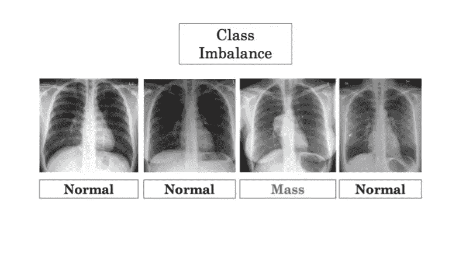
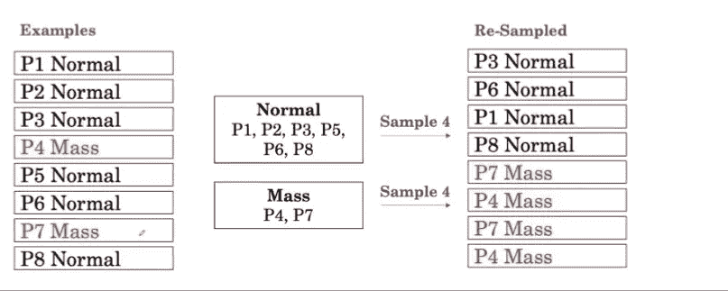
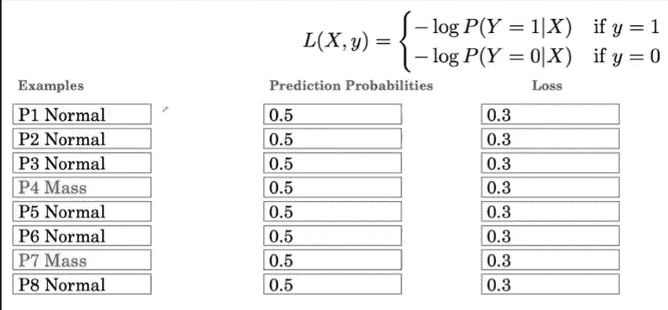
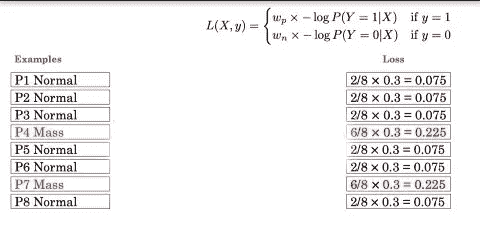
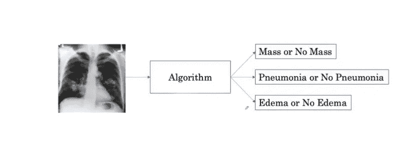
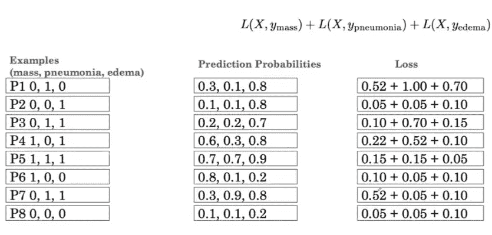
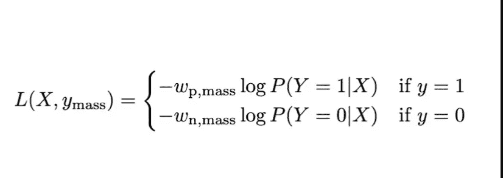

# 医学领域训练算法的 3 大挑战

> 原文：<https://medium.com/analytics-vidhya/3-main-challenges-for-training-algorithm-in-medical-field-f2cf29d4eecc?source=collection_archive---------13----------------------->

## 训练算法面临的挑战和解决方案

人工智能的进步不仅限于电子商务、聊天机器人、安全和天气预报，还超越了无数的医疗保健应用和医疗概念。

人工智能已被广泛应用于众多医疗领域，如疾病预测、诊断、手术机器人、药物推荐、遗传密码、专家系统等。

AI 或人工智能的使用通过简化医疗概念和技术重新定义和修改了当前的医疗实践标准，从而减少了患者和医疗保健从业者的耗时过程和压力。

> 医疗保健中的人工智能是指在理解、分析和解释复杂的医疗和保健数据时，使用复杂的算法和软件来模拟人类认知

如果不经过具有挑战性的阶段，人工智能的这种转折点应用就不会派上用场，特别是在算法的训练和初始阶段。

# 人工智能中训练算法面临的挑战

1.  阶级不平衡
2.  多任务
3.  数据量

**1。阶级不平衡**

注:肿块是指在 x 射线中看到的直径大于 3 厘米的受损组织或病变

类别不平衡是指医学数据集中疾病和非疾病的数量不相等，或者数据集中质量和正常的例子不相等。

在类别不平衡中，数据集中无疾病(正常)的人的例子可能比有疾病的人多，因为现实世界中无疾病的例子比疾病的例子多，所以由于数据集中疾病的例子很少，模型将预测不佳、错误分类疾病或预测在医学领域中致命的疾病的低概率。

阶级失衡的挑战可以通过以下方式解决:

*   重采样方法
*   加权损失

## **对数据集进行重采样**

重采样背后的想法是对数据集进行重新组织和重采样，以便在数据集中获得相同数量的疾病和非疾病样本。我们可以通过对疾病和非疾病，或者大众和正常的样本进行重新采样来实现这一点。在重采样中，质量和法线的一部分可能被过采样或欠采样

在上表中，有更多的正常示例，因此我们对质量进行了过采样以均衡数据集。

## **加权损失**

类别不平衡的问题可以用称为二元交叉熵损失的损失函数来追踪，它度量输出概率和期望标签之间的误差，并且还度量输出在 0 和 1 之间的分类模型的性能。

## 寻找总损失函数

## 正常:

损失=-log(1–0.5)= 0.3

损失=0.3

正常样本的总损失=损失 x 正常样本数

=0.3 x 6

=1.8

## 质量(疾病):

损失=-log(1–0.5)= 0.3

损失=0.3

大量样本的总损失=损失 x 大量样本的数量

=0.3 x 2

=0.6

通过这种计算，正常情况下的总损失比质量情况下的总损失对整个数据集的贡献更大，因此我们通过修改损失函数来解决这个问题。

## 修正损失函数:

## 使用修改的丢失函数:

计算加权损失:

Wp =负数/总数

Wn =正数/总数

Wp=6/8

Wn=2/8

## 正常:

L=0.3 x wn=0.3 x 2/8

L=0.075

## 正常情况下的总损耗=0.075 x 6

## =0.45

## 质量(疾病):

L=0.3 x wp=0.3 x 6/8

L=0.255

## 总质量损失=0.255 x 2

## =0.45

通过这些计算，质量和法向的总损失相等，从而解决了类别不平衡问题

# 2.多任务挑战

我们可以用单一的模型或算法对多种疾病的存在或不存在进行分类，这个过程称为多任务，在多任务中，我们用单一的模型来预测多种疾病。

我们使用相同的方法通过重采样方法来解决多任务中的类不平衡问题，我们也可以像前面一样修改类的损失函数，但是使用不同的公式

## 修正损失函数

# 3.数据大小挑战

在小数据集的情况下，假设我们没有足够的图像，比如 100、100 或 100 万的图像，我们可以应用一些技术向模型中添加更多的图像。

我们可以对图像进行一些变换，例如:

*   旋转图像
*   向侧面平移图像
*   更改图像的亮度
*   调整图像大小
*   放大图像

应用这些变化被称为数据扩充。

修改后的图像将被传递到模型中，以便拥有更多图像并增加模型的复杂性。

随着增强的应用，我们将在模型中有更多的图像，这将有助于我们消除欠拟合。

[https://link.medium.com/SW9Ubz06P8](http:// https://link.medium.com/SW9Ubz06P8)