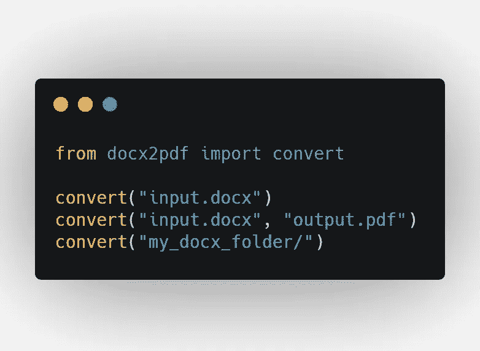
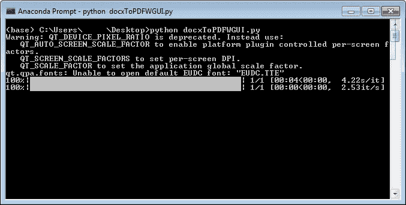

# 使用 Python 将 Docx 文件转换为 PDF 文件的 3 种方法

> 原文：<https://medium.com/analytics-vidhya/3-methods-to-convert-docx-files-into-pdf-files-using-python-b03bd6a56f45?source=collection_archive---------0----------------------->

你一直想把 Docx 文件批量转换成 pdf 吗？如果是的话，这些 python 脚本会让你的生活舒服很多。
这两种方法哪一种包含 GUI 另一种不包含。下面的例子略有不同，需要在系统上安装一个 Word 应用程序。要**安装 docx2pdf** :

第一个没有图形用户界面:

> pip 安装 docx2pdf

图 1\. Python 代码

**解释**:convert()函数有两个参数，一个是你要转换的文件的 abs 路径，另一个是你要保存的位置。您可以通过提供文件夹路径来进行批量转换。

该库还允许使用 CLI，而不是在单独的文件中编写代码。

图 2\. CLI 命令

要使用 GUI 实现这一点，您必须安装 PyQt5:

> pip 安装 PyQt5

图 3 .阻力下降英尺。批量将 docx 转换为 pdf

输出:

图 4 .用户必须拖放文件的主窗口

图 5 .处理窗口

图 6\. Docx 文件被转换成 PDF 格式

**解释:**有很多理论涵盖了所有用到的函数，但我们只会看到重要的。你可以通过查看下面的参考资料获得更多信息。

**QMimeData** 属于 **QtCore 模块**将数据存储在剪贴板上，然后在拖放过程中使用。

**drageenter event:**提供一个事件，当拖动动作进入时，该事件被发送到目标小部件。

**DragMoveEvent:** 在拖放动作正在进行时使用。

**DropEvent:** 是放置完成时发生的事件。

**hasUrls()** :如果对象可以返回 URL 列表，则返回 true 否则返回 false。

基本思想是使用 PyQt5 创建一个 GUI，PyQt。QtWidgets 使用 QListWidget 及其函数和 PyQt5。QtCore 获取文件的 URI 列表，基本上是文件的位置，然后在这个位置转换文件。

还有另一种将 Docx 文件转换为 PDF 的方法，需要在您的系统上安装 word 应用程序。

**先安装**这个:

> pip 安装 comtypes

图 7 .将 Docx 文件转换为 PDF 的另一种方法

以上代码在我的 Github 上:

 [## rahulbhatt1899/DocxToPDFwGUI

### 两个小 python 脚本将 docx 文件转换成 pdf。GitHub 是超过 5000 万开发者共同工作的家园…

github.com](https://github.com/rahulbhatt1899/DocxToPDFwGUI) 

**参考文献**:

 [## docx2pdf

### 在 Windows 或 macOS 上直接使用 Microsoft Word(必须安装)将 docx 转换为 pdf。在 Windows 上，这是…

pypi.org](https://pypi.org/project/docx2pdf/)  [## QtWidgets - PyQt v5.15.1 参考指南

### QtWidgets 模块包含的类提供了一组 UI 元素来创建经典的桌面风格的用户…

www.riverbankcomputing.com](https://www.riverbankcomputing.com/static/Docs/PyQt5/api/qtwidgets/qtwidgets-module.html)  [## PyQt -拖放

### 拖放的提供对用户来说非常直观。在许多桌面应用程序中，用户…

www.tutorialspoint.com](https://www.tutorialspoint.com/pyqt/pyqt_drag_and_drop.htm)