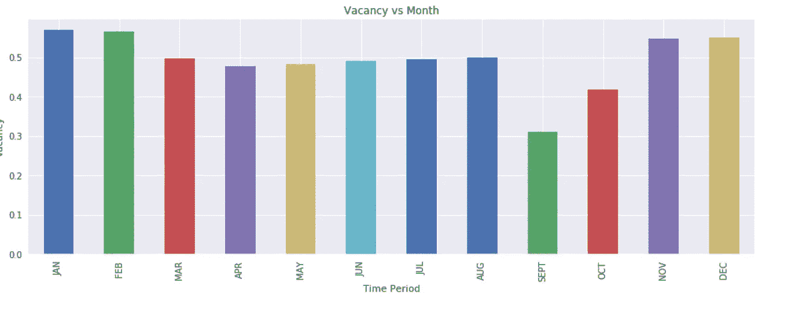
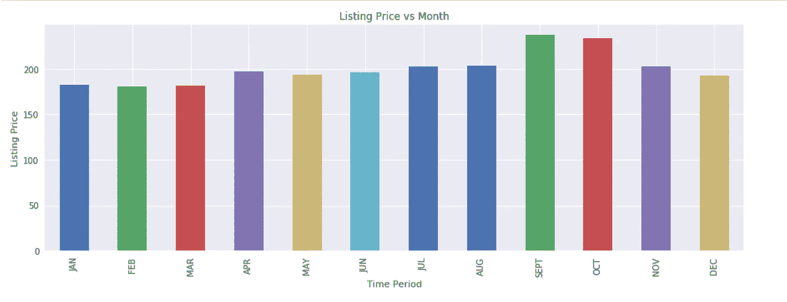
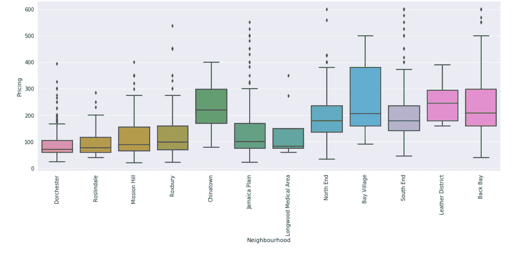
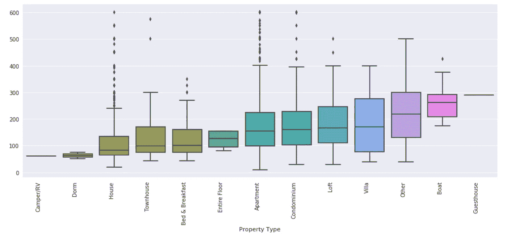
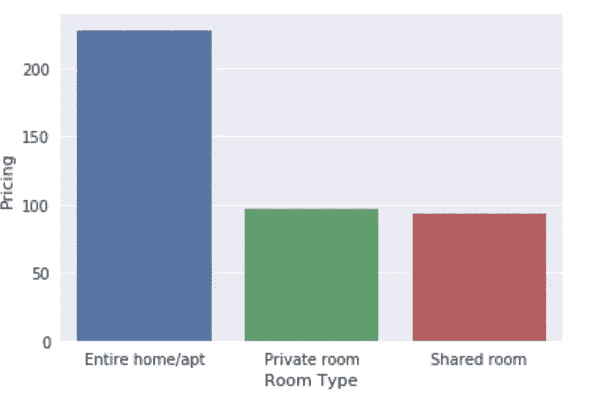
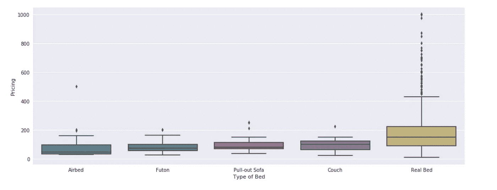
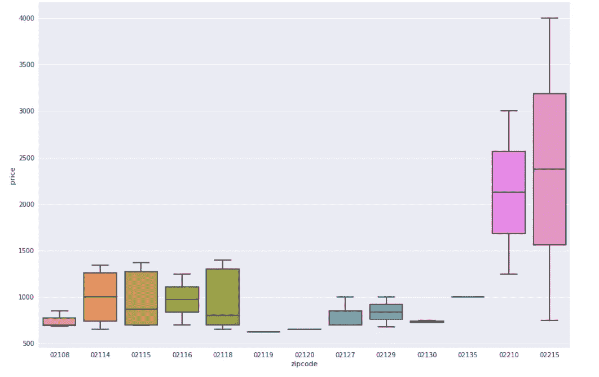

# 考虑去波士顿旅游时要考虑的 3 个最重要的因素

> 原文：<https://medium.com/analytics-vidhya/3-most-important-factors-to-consider-when-considering-a-visit-to-boston-1a2ec87b3a4f?source=collection_archive---------35----------------------->

波士顿

参观波士顿？

你是 Airbnb 的用户吗？

如果你对这些问题的回答是肯定的，那么继续读下去，了解各种因素，让你的钱发挥最大价值。

我将尝试使用 [**波士顿 Airbnb 数据集**](https://www.kaggle.com/airbnb/boston/download) 回答 3 个重要问题

*   波士顿**最繁忙的时期**是什么时候？另外，一年中的哪个时间是你游览波士顿的最佳时间？
*   对出租房定价影响最大的 **4 特征是什么？**
*   最昂贵的地区或邮政编码是什么？

# **波士顿最繁忙时期:**

**Airbnb 出租房的空置率与月租金**

从**职位空缺与月份**的关系图中我们可以看到，在**九月**和**十月**月份，职位空缺与其他月份相比要少得多。这很可能是因为波士顿的世界著名大学在这段时间录取学生。

一个有趣的趋势是，在冬季(11 月至 1 月)，空缺职位明显增多。这意味着与春夏的其他月份相比，波士顿在冬季并不那么繁忙。

下图显示了价格与月份的相关性。

**价格时间段相关性。**

如果我们试图将此与上面的图联系起来，我们可以看到**价格在最繁忙的月份**(9 月**和 10 月**)较高。

所以，如果你计划访问波士顿的原因不是为了大学和其他与商业相关的访问，那么最好和最便宜的时间似乎是二月和三月。

# **影响客房定价/租金的四种设施:**

根据我对这些数据的分析，我得出的结论是，定价受以下几点影响最大:

*   附近
*   属性类型
*   房间类型
*   床类型

## **1。邻里:**

下面的图是一个[箱形图。我们主要对“盒子”的中位数感兴趣。](https://towardsdatascience.com/understanding-boxplots-5e2df7bcbd51)

邻近价格相关性

很明显，在中间价最高的**皮革区**价格最高(大约 **$250** )。这意味着你在**皮革区**支付的平均租金比其他地区如**罗斯林代尔的租金要高。**这是真的，谷歌搜索[告诉我，平均租金约为 3000 美元以上，而美国全国平均租金为 950 美元。](https://www.niche.com/places-to-live/n/leather-district-boston-ma/)

所以，如果邻居对你来说不是一个重要的因素，那么你可以选择更便宜的地区，比如**罗斯林代尔(150 美元左右)。**

## 2.**房产类型:**

我们都知道每个人的梦想是拥有一个**船屋作为度假胜地**！对宾馆的需求也很大，尤其是与商务相关的活动。因此，物业类型与价格之间的关系在该地块进行了探索。

**物业类型与定价**

不出所料，船屋和宾馆(见图的右端)因其提供的奢华而花费不菲。

所以，如果你只是呆在那里而对奢侈品不感兴趣，那么你可以去找一个房子/宿舍。

3.**房间类型:**

房间类型也会影响价格/租金。让我们使用下面的箱线图来探索这方面的数据。

房型与价格

正如这里可以看到的，如果你想要一个完整的家，价格几乎是两倍。

所以，如果你的访问是短时间的，那么你可以去共用房间或私人房间。

4.**床类型:**

对于健康和快乐来说，没有什么比晚上睡个好觉更好的了！要睡个好觉，最重要的事情之一就是一张凉爽的床。因此，让我们在下面的方框图中看到 Airbnb 的床位价格相关性。

床的类型与价格

所以最便宜的是充气床垫和蒲团。“真正的床”很贵，但对我这样的酣睡者来说很重要。:)

因此，在我看来，你可以在普通的社区里租一张真正的床(私人的/合租的)会物有所值。

现在是我们的最后一点。

# 波士顿最昂贵的地区或邮政编码:

最昂贵的地区也是一个重要的点，因为它通常是在你的口袋里炸开洞的地区，但在几个街区内给你你需要的一切。

邮政编码与价格

邮政编码为 [02215](https://goo.gl/maps/28DaWbis5TBNgYHH7) 的地区是波士顿最昂贵的地区之一(考虑到高达 99%的成本)。

# 结论:

我用我的数据科学技能在 Airbnb 上展示了一些波士顿的数据。虽然这是一张展示的图片，但我鼓励你在这方面做更多的研究。如果你觉得我的分析有用，一定要回来找我。

# 参考资料:

如果您对此感兴趣，可以从 Git-Hub 存储库中获取相关代码:

[https://github.com/KIRANVASISHTA/Data-Science-Blog-Post](https://github.com/KIRANVASISHTA/Data-Science-Blog-Post)