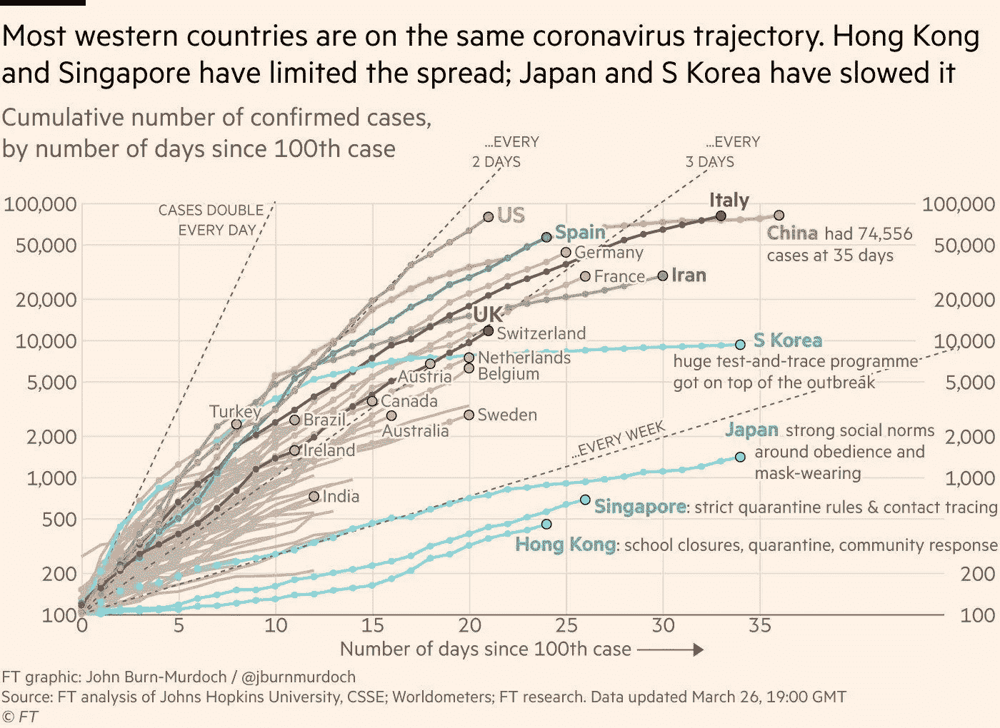
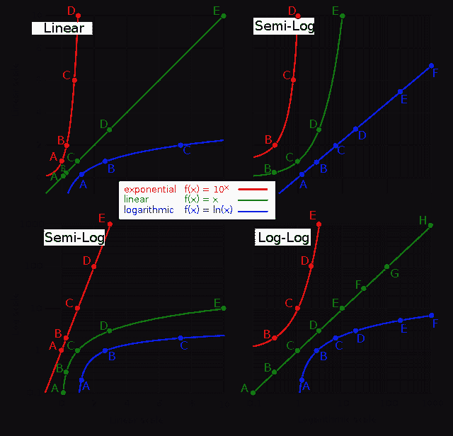
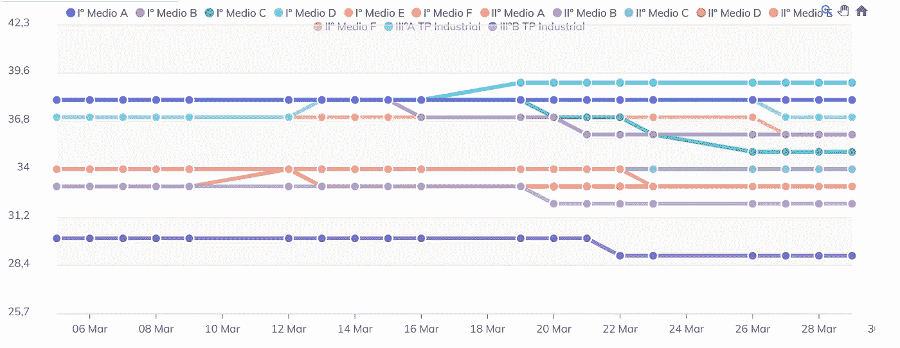
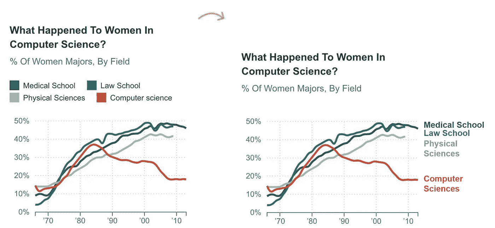
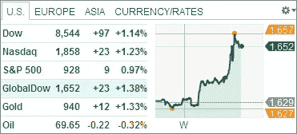

# 设计可视化图表的 3 个步骤

> 原文：<https://medium.com/analytics-vidhya/3-steps-to-design-your-visualized-charts-b3a94d315e3?source=collection_archive---------9----------------------->

数据可视化对于分析师、研究人员或科学家来说非常重要。几天前，我们在新闻、网站或幻灯片上看到许多可视化图表，以强调 COVID 19 的爆发和影响。今天，我想跟随这一趋势，将约翰·伯恩-默多克的图表作为一个很好的例子，并为你提供 3 个步骤，让你的图表变得更好。

来源:https://twitter.com/jburnmurdoch

# 第一步，复习材料

这里的材料是指你的数据。在你的数据集中有大量的列，对于一个图表，你必须了解你的主题是什么。在这一步，你必须决定**你想在图表中披露哪些信息**。在我们的例子中，图表中的数字是测试过程中的**确认案例。一些国家的病例较低，只是因为他们还没有开始测试。使用适当的关键数字是非常重要的。**

**时间范围**

此处图表的关键点是与他人进行比较并区分当前情况。所以我们需要把我们的数据**放在同一个页面**上。在示例情况下，时间框架从第 100 例确诊病例开始，这消除了第一例的日期差异和传输间隙。

# 第二步，决定你想从哪个角度向观众展示数据

在第一步之后，你可能会对你想呈现给观众的主题有一个清晰的地图。在这一步，你需要考虑**你想用什么样的图表**来展示。您有许多选择，如条形图、气泡图、直方图、树状图等等。我将在另一篇文章中讨论如何选择图表的类型。然后我们转移到下几点。

**X 轴、Y 轴**

*   想想你希望你的观众得到什么样的结论
*   比例:对数或线性或其他比例(**对数比例将小案件带到桌面**

线性刻度是显示数据的原始刻度。但是它会受到数据总数的影响。例如，当我们比较两个国家的疫情时，人口较多的国家可能在图表上显示更高的增长率或更大的数字，这可能会误导结论。考虑使用对数标度来消除基础问题，并把小的基础对象放在桌面上。

下图(来源:[https://www.wikiwand.com/en/Logarithmic_scale](https://www.wikiwand.com/en/Logarithmic_scale))显示对数标度(蓝色)相比线性标度(绿色)可以消除一些偏差。

线性、指数和对数标度

**单位**

使用**相同的 unite** 很重要。当你有**大数字的时候，**你可以考虑使用$K，$M 或者撇号在你的图表上做一个简单的显示。

# 第三步，优化你的图表

在这一步，我会提出一些要点，说明在基本图表完成后你需要改进的地方。

**颜色**

*   **通过使用颜色强调重要信息**。在我们上面的例子中，美国、英国和意大利被涂上了颜色，因为作者想要强调它们，而他把其他国家保持为灰色。
*   **对齐报表中的图表**。例如，您可能有两个关于国家收入部分的图表。在这种情况下，对于同一个国家，您需要在两个图表中使用相同的颜色。

**图例 VS 标签**

在使用图例或标签帮助观众理解您的图表时，您应该仔细考虑。这里来一张我觉得传奇不是它的好选择的图表。

需要映射的主题太多

在这张图表中，你可以看到明显不同的显示。可以感觉右手边的设计比较好读。

来源:[https://depictdatastudio.com/directly-labeling-line-graphs/](https://depictdatastudio.com/directly-labeling-line-graphs/)

**辅助线**

使用辅助线来帮助观众进入你的图表场景。对于下面的图表，它使用了辅助线来指出历史上一些有意义的价格，这有助于观众更多地了解这只股票。

辅助线有助于指出一段时间内的最高价和最低价

**片头**

将结论或发现贴在瓷砖上，让你的听众理解你想传达给他们的信息。我们的例子的标题非常明显，具体地传达了图表的信息。

> ***大部分西方国家都在同样的冠状病毒轨迹上。香港和新加坡限制了价差；日本和韩国已经放慢了速度。***

好了，这就是我想分享的三步秘诀。每个小话题都有一些我可以深入探究的细节。我会有更多关于这些细节的文章，敬请关注。