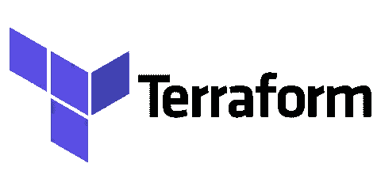

# 3 个将你从可怕的错误中拯救出来的方法

> 原文：<https://medium.com/analytics-vidhya/3-terraform-tips-will-save-you-from-terrible-mistakes-b379f40e501?source=collection_archive---------31----------------------->

2020 年 9 月 16 日

最初贴在这里的是->[https://ish-ar.io/terraform-blog-series-3-tips/](https://ish-ar.io/terraform-blog-series-3-tips/)

# 1.一个大的单一州文件是不会帮助你的。

当一个新用户开始使用 Terraform 时，在一个大的存储库和一个大的状态文件
下管理所有的基础设施代码似乎更容易(对于不知道什么是状态文件的人，请查看本页->[https://www.terraform.io/docs/state/index.html](https://www.terraform.io/docs/state/index.html)

然而，这种设计很快就会显示出它的缺点和局限性。

**为什么单声道状态文件在性能方面不是一个好主意？**

原因之一是在“地形图”命令中有一个动作叫做“刷新”。这一步意味着 Terraform 将要“将 Terraform 知道的状态(通过它的状态文件)与现实世界的基础设施相协调。”
如果有一个映射了整个基础设施的大型状态文件，而一个人只想更改一个 GKE 集群，那么就删除一个 EC2 实例或创建一个新的 bucket。
猜猜看？**这需要更新整个基础设施**(相信我，这需要一段时间！)

**但是基础设施的可靠性如何呢？**

如果有人对 mono 状态文件运行“terraform destroy ”,会发生什么？
是的。都没了。你必须重建基础设施。

如果有人使用新的 terraform 版本会怎么样？(例如:从 terraform 0.11 到 terraform 0.12)
每个人都必须升级 CLI 版本，如果你不走运，你可能还需要更新实际的 terraform 代码。还有其他原因，但是我确信我已经说得够清楚了:不要使用单一的状态文件！-.-'

# 2.Monorepo 是邪恶的。

有人可能会说:让我们把所有的东西放在一起，模块，代码，所有的东西都放在一个仓库里，但是放在不同的目录里，有不同的状态文件:太棒了。-'

相信我，当我说我见过 Terraform 最糟糕的事情:在不同的目录中使用符号链接共享/复制变量的存储库，我见过巨大的 mono 存储库，从 bash 脚本和 SQL 数据库生成的 terraform 文件，相信我，这并不新奇。

就代码可靠性而言，为什么大型存储库不是一个好主意？简单明了:它不可扩展。
现在想象一下，你是一个由 5 名工程师组成的小团队，将所有的基础设施代码放在一起似乎是一个好主意。
你们都有创建/删除/编辑 terraform 代码的权限，这样，你们就不必处理多个管道等。

然而一年后，你的 5 人小团队变成了 100 人。其他工程师现在希望使用 Terraform 来管理他们的基础设施(网络工程师、数据库管理员、数据工程师、数据科学家等)。).

管理权限、协调 terraform 变更以及创建一个能够满足每个人需求的完整管道/自动化将变得棘手(并非不可能)。

如果您已经在那个单一的存储库中使用了模块，那会怎么样呢？你将如何管理模块版本？糟糕的存储库结构设计会产生所有这些障碍。

如果你已经在那里了呢？
我的建议是从将模块转移到不同的仓库开始。
您也可以开始自动测试和标记模块。

完成第一步后，将您的基础设施分成几层，并开始在由该基础设施层的所有者管理的不同存储库中划分层。
这会很痛苦！
记住，一分耕耘，一分收获！

# 3.不要手动运行 Terraform:使用管道。

在这里，我也看到了最糟糕的事情。我曾经为一家公司工作，该公司曾经有一个松弛的频道，他们通过基本上发送类似“我正在使用 Terraform”或“Terraform 锁定”的信息来“锁定”terraform:我的意思是…真的吗？“锁定地形”？-.-'

拥有正确的编排和自动化将有助于您的团队不要覆盖彼此的更改。
如果你计划使用管道，我的建议是*不要*并行构建，在基础设施的微小部分上运行自动化。这样做，就不会有很长的管道，而是有着有效反馈循环的快速流动。

*始终标记您的基础设施代码*，并将其视为真正的软件/应用。

*运行测试。测试 Terraform 代码可能看起来很复杂，但有一些有用的工具，如“terratest”。
如果你对 Go 很熟悉，你可以学习 Hashicorp 关于使用 Terraform 进行单元测试的教程。*

*您应该有一个工具来处理配置项，另一个工具来运行部署。*
在我看来，理想的情况是 CI 工具推送一个包含测试过的 Terraform 代码的工件，而 deploy 挑选工件并部署它。

# 结论

运行 Terraform 的完美方式并不存在。
在大多数情况下，这取决于用例，但有一些错误，我会定义每个人都应该避免的常见错误。记住:良好的开端是成功的一半:)

*原载于*[*https://ish-ar . io*](https://ish-ar.io/terraform_blog_series_3_tips/)*。*