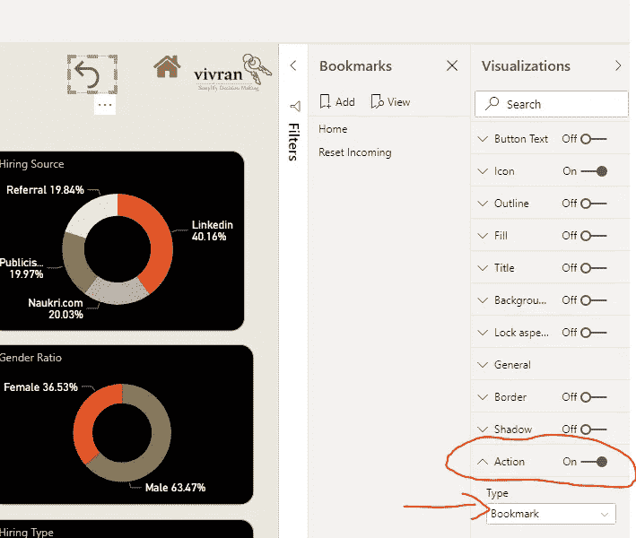
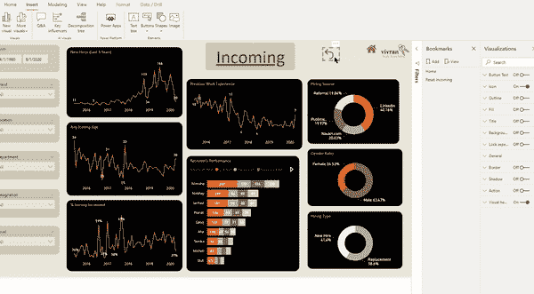

# 您应该知道的 3 个有用功能 Power BI 台式机

> 原文：<https://medium.com/analytics-vidhya/3-useful-features-you-should-know-power-bi-desktop-292a9bcbc044?source=collection_archive---------21----------------------->

Tobias van Schneider 在 [Unsplash](https://unsplash.com?utm_source=medium&utm_medium=referral) 上的照片

Power BI Desktop 具有多种有用的功能，可以节省时间和精力，并有助于简化和定制我们的报告。本文探讨了我经常使用的三个特性。

# 格式刷

这是最容易使用的功能，而且非常高效。利用这一点，我们可以在其他视觉效果上复制一个视觉效果的格式，就像其他办公产品(Excel、Word、PowerPoint)中的 Format Painter 一样。

步骤很简单。选择源格式>主页>格式刷>

选择第二个视觉对象以应用格式

# 刷新选定的表格

有时候，我们希望只更新数据模型中选定的表。如果是一个表，那么我们右键单击该表并选择“刷新”。

在不止一个表的情况下，我们可以一个接一个地重复上面的步骤，或者我们可以使用模型视图。

模型视图允许使用 CTRL 键对表进行多重选择

模型视图的[好处可以参考下面这篇文章。](https://www.vivran.in/post/benefits-of-model-view-in-power-bi)

# 重置页面

使用书签重置页面上的所有切片器和筛选器。

# 步骤 1:添加书签

打开书签窗格

视图>书签

添加一个没有在页面上应用切片器/过滤器的书签

添加书签保存当前报告位置(页面、应用的过滤器、选择的视觉效果)。点击书签导航到各自保存的视图。

书签窗格列出了报告中添加的所有书签。

在这个例子中，有两个书签。书签 Home 用于报告的第一页，书签 *Reset Incoming* 用于查看没有任何过滤器的第*页 Incoming* 。通过选择每个书签，我们可以在两个视图之间导航。

# 步骤 2:分配给按钮

插入>按钮>选择任何合适的按钮

选择按钮>可视化>动作>打开

文字>书签

书签>选择适当的书签(在这种情况下，重置传入)

或者，您可以添加任何形状或图像。以上所有步骤保持不变。

你可以参考关于[书签](https://www.vivran.in/post/power-bi-bookmarks)的详细文章。

注意:在 Power BI Desktop 中，您可以在按住 CTRL 键的同时用鼠标左键单击按钮，以使书签生效。在 Power BI 服务中，只需点击一下即可。

*我写关于*[*MS Excel*](https://www.vivran.in/my-blog/categories/excel)*[*权力查询*](https://www.vivran.in/my-blog/categories/powerquery)*[*权力毕*](https://www.vivran.in/my-blog/categories/powerbi)*[*权力中枢*](https://www.vivran.in/my-blog/categories/power-pivot)*[*DAX*](https://www.vivran.in/my-blog/categories/dax)*[*数据分析【数据*](https://www.vivran.in/my-blog/categories/data-analytics)*****

**[@imVivRan](https://twitter.com/imvivran)**