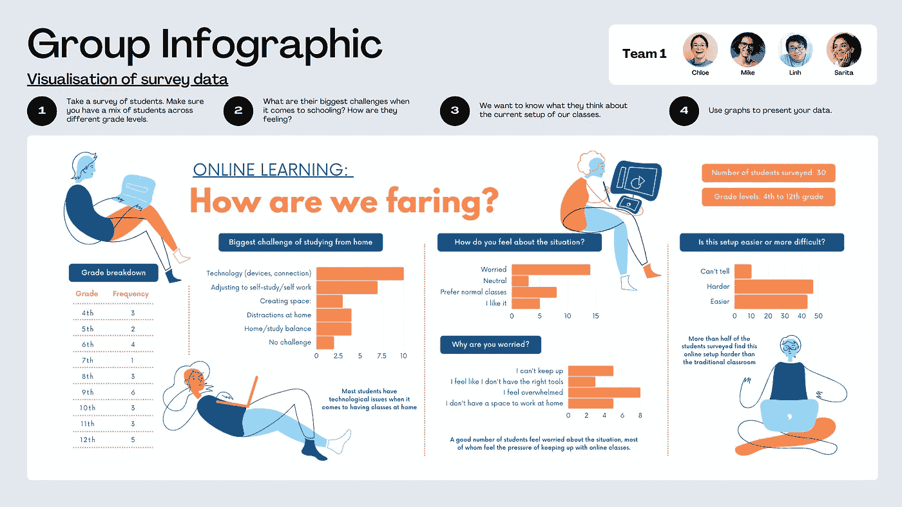
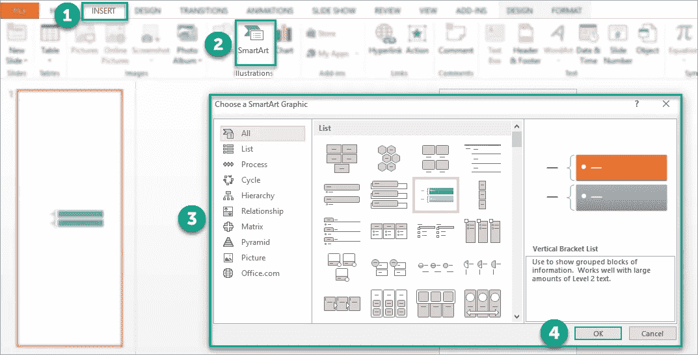
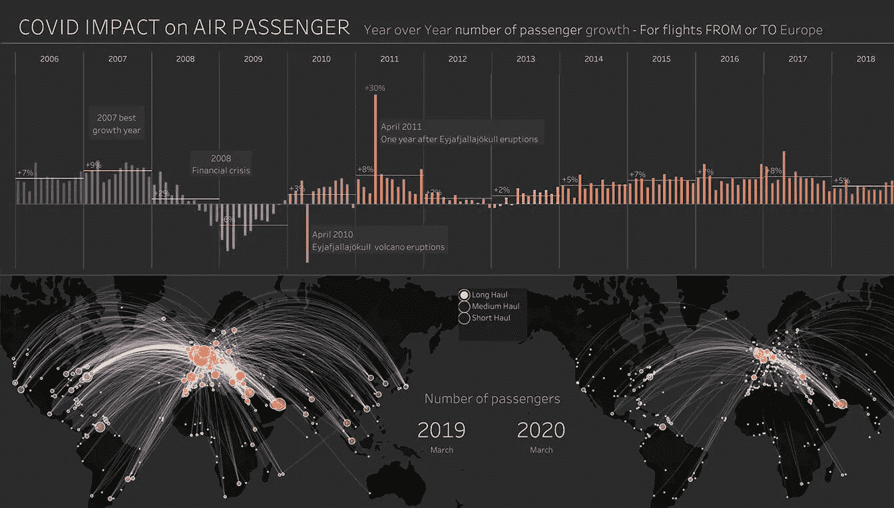
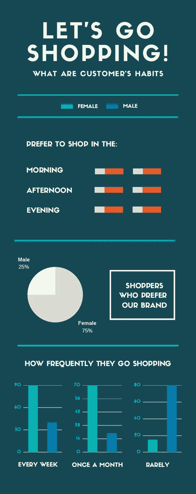

# 展示数据分析结果的 3 种方式

> 原文：<https://medium.com/analytics-vidhya/3-ways-to-present-your-data-analytics-findings-22a6ff8aa87d?source=collection_archive---------12----------------------->

# 概观

你是否想过如何向你的同事、老板或股东展示你的数据分析结果？你在想用最少的努力展示的最好方法吗？我想和你分享三种方法。

1.  **初学者—** 微软 Powerpoint
2.  **中级—** 画面
3.  **前进—** Canva + Powerpoint + Tableau

## 1.初学者

Powerpoint 一直是办公室工作人员的首选用户友好应用程序，尤其是在做演示时。SmartArt 是创建信息图最简单的方法之一。

转到**插入** > **SmartArt** 并点击**确定**选择图形

更重要的是，每个人都应该在自己的电脑上安装微软 powerpoint。因此，在将您的演示文稿发送给其他人时，应该不会有任何问题。有关如何在 powerpoint 中制作信息图的更多信息，您可以参考此处的。

## 2.中间者

Tableau 一直是世界领先的分析平台。不用编码，只需通过拖放方法就可以在几分钟内创建许多图表。在 [Tableau Public](https://public.tableau.com/en-us/gallery) 也有很多很棒的设计，大部分都是免费改编和使用的。

**当天即** — [探索新冠肺炎对出行的影响](https://public.tableau.com/en-us/gallery/exploring-impact-covid-19-travel?tab=viz-of-the-day&type=viz-of-the-day)

powerpoint 和 tableau 的不同之处在于，tableau 允许用户直接与信息图进行交互。其他用户可以更改过滤器、参数，甚至创建他们自己的具有编辑权限的个人仪表板。与 powerpoint 相比，powerpoint 是静态的，更倾向于管理报告或一般演示。

## 3.预付款

有时，创建漂亮的仪表板或信息图需要时间。我们可能没有时间在我们的信息图中创造美丽的图像。然而，如果我们使用标准的 powerpoint 元素(例如智能图表)或 tableau 标准图表，用户会感到无聊。这就是为什么坎瓦来救援了！Canva 中有许多预构建模板供您选择。无论是幻灯片、海报、信息图还是 instagram 帖子！

信息图来自 CANVA。我们可以以此为起点，定制颜色、文字，甚至添加我们自己的图像和图表。最棒的是——它可以导出为 powerpoint 或图像。因此，我们可以在 powerpoint 或 tableau 仪表板中使用它作为背景。这无疑为我们节省了大量时间！

# 结论

由于世界变化的速度如此之快，我们没有时间从头开始创造一切。这包括数据分析、演示甚至常见问题。我们需要学习的技能是如何找到更好的工具，帮助我们在最短的时间内传达我们的信息，而不影响信息的质量。