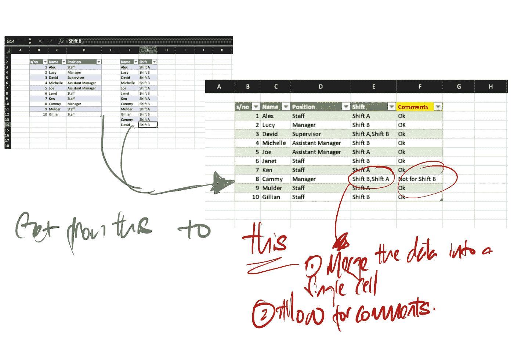
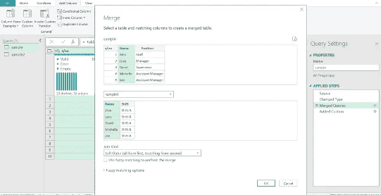
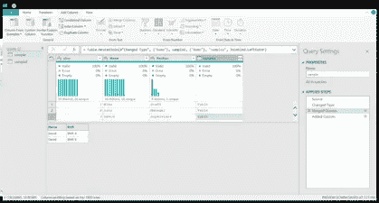
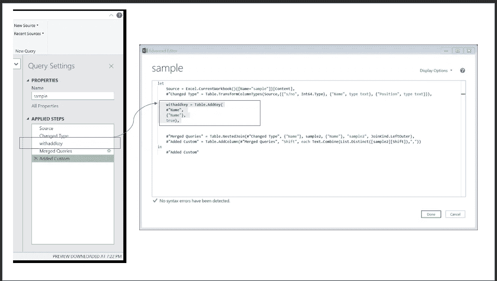
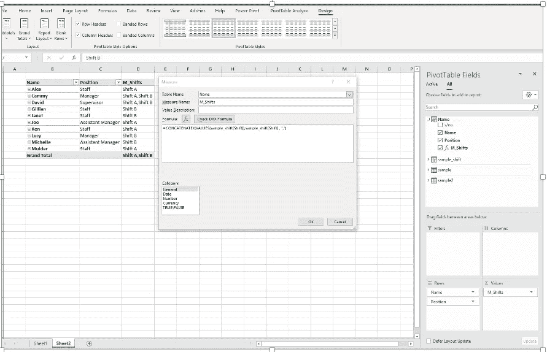

# 3 种替换 Vlookup 的方法

> 原文：<https://medium.com/analytics-vidhya/3-ways-to-replace-vlookup-ad87908da3dc?source=collection_archive---------19----------------------->

通常来说，分析师的角色是动态的，尤其是当你在商业、数据和技术之间搭起桥梁的时候。那是我的角色:)

所有有趣和令人兴奋的东西分析部分总是发生在最后，但有**重要**和**关键**但**无聊**和**平凡**的东西，如**数据清理**。

**数据清理**就是理解最终目标、数据，并开发一种模式来清理数据。
一种常见的数据清理模式是查找。只要你使用任何形式的电子表格，没有办法，你不使用 Excel 中的查找公式。我在办公室里每走 8 步，就能发现有人在用 Excel 上的 vloookup。
我们拥有的大部分数据总是不完整的，因此总是需要参照另一个数据集来获得更完整的图片。

> 这是我根据不同的目标和最终用户的使用或交互使用的 3 种主要的查找模式和技术。

1.  PowerQuery —合并

2.DAX —串联 x /值

3.python-PD . concat

# PowerQuery —合并

这是我最喜欢的移动方式之一。大多数时候，在我清理和转换数据之后，**我要求用户检查某些字段，并在相应的单元格中输入他们的注释，然后将其发送给我，以便我可以相应地处理它**。我处理的数据量很容易在 20k-2ml 行之间，因此 **vlookup 对我来说不适用，因为它很耗时，增加了文件大小**，并且它不能执行 power query 中提供的一些自动化过程。在 PowerQuery 中，合并类似于 excel 中的查找，但更好，因为它可以处理多对多。
我通常处理的数据是多对多的关系，我的用户通常需要一行中的所有数据。因此，我不得不压缩它，删除重复的数据，并以可读的格式呈现数据。



多对多并将数据压缩到一个唯一的单元格中



将两个表格合并在一起以提取您需要的信息。就像查字典一样



在本例中，您可以看到连接到该特定键的另外两个数据

```
Text.Combine(List.Distinct([Table][ColumnName]),"(delimiter)")
```

你们中的大多数人可能会开始合并更大的数据集。随着**合并**而来的是最常见的性能问题，这些是我更喜欢的**提升性能**的方法。

# 桌子。添加键

[https://docs.microsoft.com/en-sg/powerquery-m/table-addkey](https://docs.microsoft.com/en-sg/powerquery-m/table-addkey)
[https://blog . cross join . co . uk/2018/03/16/improving-of-a-merge-in-power-bi-and-excel-power-query-get transform/](https://blog.crossjoin.co.uk/2018/03/16/improving-the-performance-of-aggregation-after-a-merge-in-power-bi-and-excel-power-query-gettransform/)



table.addkey 示例

**表。缓冲器**

我真的不怎么用这个来提高速度，但这是一种技术。
[https://social . TechNet . Microsoft . com/Forums/en-US/2cc1b 370-9976-4a6b-add 1-91 EFC 1d 522d 7/when-to-use-table buffer？forum=powerquery](https://social.technet.microsoft.com/Forums/en-US/2cc1b370-9976-4a6b-add1-91efc1d522d7/when-to-use-tablebuffer?forum=powerquery)

# **DAX — Concatenatex(值))**

如果您在仪表板上显示数据，或者不需要您的输入，并且处理一对多关系，那么这种模式适合您。在计算列或度量中，有两种方法可以应用此公式，由于 DAX 执行公式的方式，我不推荐前者。

1.  计算列——尽管这是可能的，但如果你打算将它作为表格加载到 excel 中，我不推荐这种方法，因为如果你有大量数据，这将影响性能
2.  措施-我通常使用这种方法在数据透视表或 PowerBI 上呈现文本，最终用户只需要视觉辅助来做出某个决定或呈现某些事实
    [https://www . four moo . com/2018/05/08/DAX-concating-values-only-when-values-selected/](https://www.fourmoo.com/2018/05/08/dax-concatenating-values-only-when-values-are-selected/)



度量，连接/值

# python-Pandas PD。串联

```
pd.concat([df1,df2], axis = 1 )
```

如果我的数据太大而无法通过 PQ 处理，这通常是我的首选 PQ 是提高性能的变通方法。
但是我通常在 python 中编写完整的数据清理，而不是一点一点地编写，并为我的最终用户将导出文件加载到 PowerBI 或 excel 中

**结论**
如果您在通过 Excel 清理数据后需要来自最终用户的输入，那么 PowerQuery 是您最好的朋友，但是
如果您只是呈现数字和处理一对多数据集，那么 DAX 更适合您
如果性能是 PowerQuery 中的一个问题，那么 Python-PD . concat 是加快数据处理活动的一个很好的选择

如果您有这样的活动并且需要帮助，请随时写信给我或者分享您正在使用的其他合并模式。