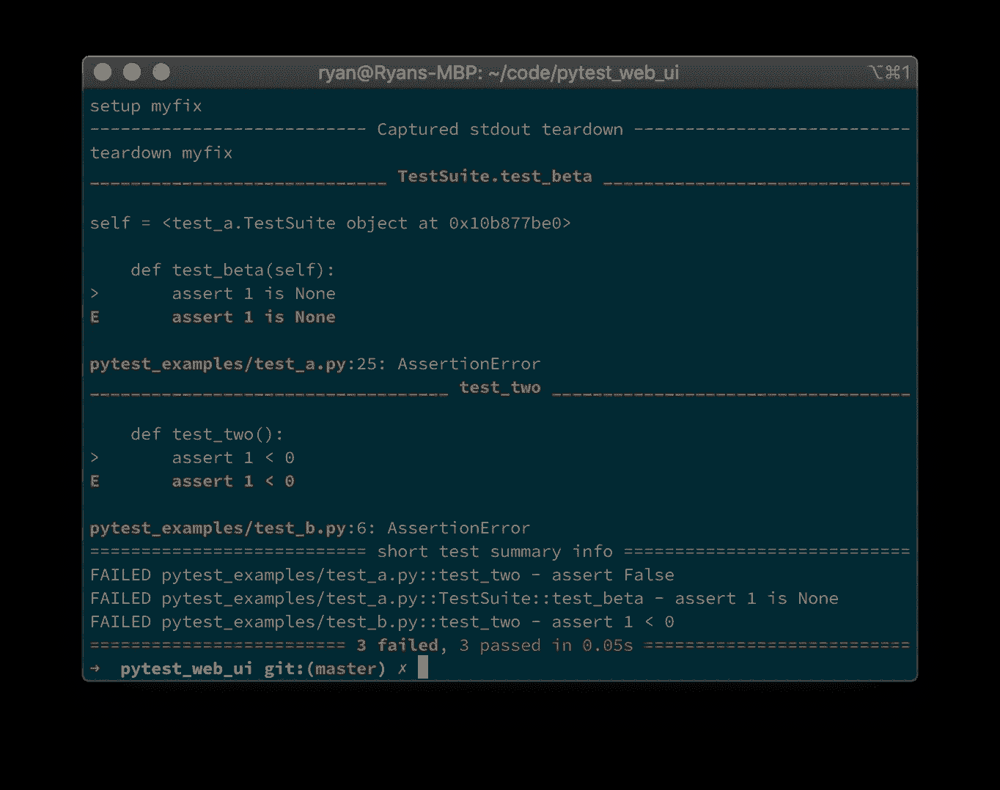
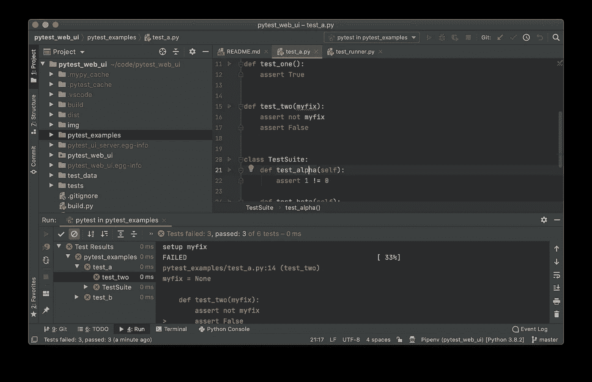
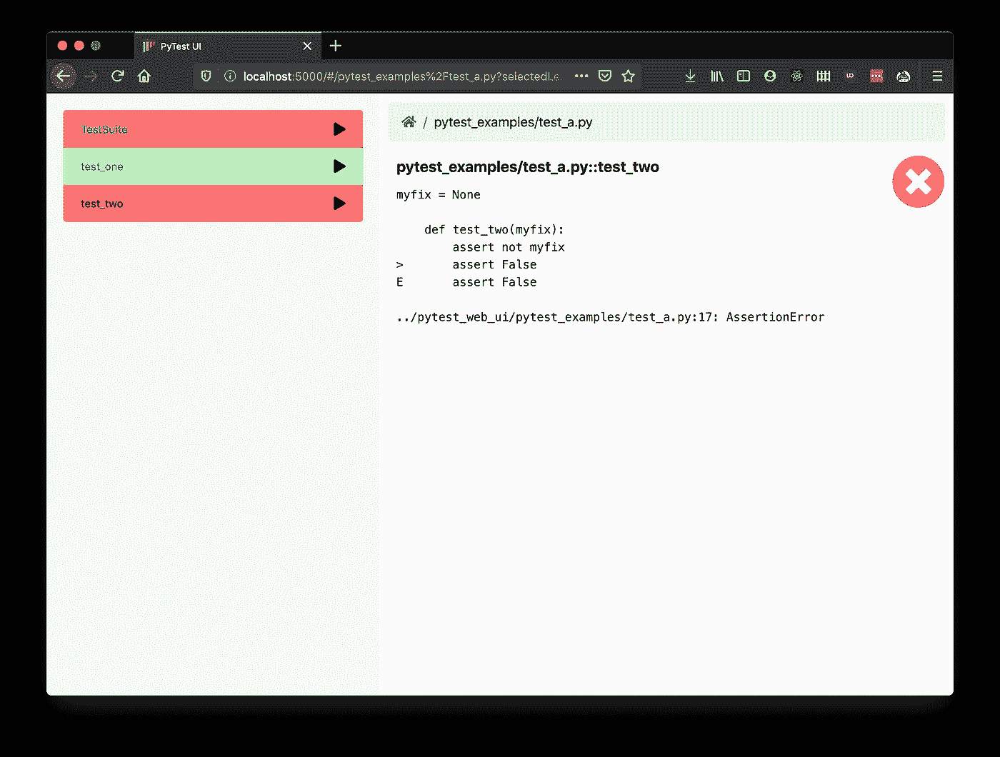

# 使用 PyTest 有效测试任何应用程序的 3 种方法

> 原文：<https://medium.com/analytics-vidhya/3-ways-to-test-any-application-effectively-with-pytest-35f2e99b2a1a?source=collection_archive---------13----------------------->

除了最琐碎的计算机程序之外，所有的程序都需要测试来证明程序确实如你所愿。测试软件有许多不同的方法，术语有时会令人困惑和重叠。对于每一种测试方法，要记住的最重要的事情是你要测试的**范围**:问问你自己，你是应该孤立地测试一小部分代码，单个应用程序或服务，还是许多服务的交互来形成一个整体解决方案？通常，您需要在开发周期的不同阶段在多个范围内进行测试。

# 为什么选择 PyTest？

> Python 是编写功能测试的优秀语言，不管你的应用程序是用什么语言编写的。

对于单元测试——孤立地测试一个代码单元，比如一个包、模块或类——你为单元测试选择的框架将会受到你为测试代码选择的语言的强烈影响(如果不是指定的话)。尽管有用，但是单元测试本身是不够的。即使你完全理解并测试了所有软件单元的接口，当它们连接在一起时，复杂的和潜在的意想不到的行为仍然会出现——这被称为“突现现象”，经常出现在[自然世界](https://en.wikipedia.org/wiki/Emergence)以及理论过程中，如[康威的生命游戏](https://en.wikipedia.org/wiki/Conway%27s_Game_of_Life)。驯服这种复杂性是功能测试的切入点。

功能测试包括运行应用程序或服务，发送一些受控的输入，并检查在合理的时间内是否收到预期的输出。对于后端服务，您可以在服务的监听地址上发送一个网络请求，并等待预期的响应；对于 UI 应用程序，您可能会单击 UI 中的一个项目，然后等待屏幕上呈现一些特定的文本。尽管功能测试可以由人工测试人员手动执行，但是自动化测试有许多优点——一旦编写好，脚本化测试在 CI 中反复运行就很便宜，可以捕捉回归或发现大多数时候都有效的特性。

Python 是编写功能测试的优秀语言，不管你的应用程序是用什么语言编写的。Python 被设计成易于学习，所以即使它不是你的主要语言，你也不应该觉得用它来读和写测试是个问题。因为 python 是一种高级动态语言，所以代码可能非常简洁，可读性强，没有类型声明或内存管理的混乱。最后，Python 非常适合需要大量 IO 交互的任务，并且有许多很棒的库用于联网(例如[请求](https://requests.readthedocs.io/en/master/)、 [scapy](https://scapy.readthedocs.io/en/latest/) )或控制用户输入(例如[PE expect](https://pexpect.readthedocs.io/en/stable/)、 [selenium](https://selenium-python.readthedocs.io/) )。

Python 自带了一个用于单元测试的内置库，但是对于 python 单元测试和一般功能测试，我强烈推荐看一下 [PyTest](https://docs.pytest.org/en/latest/) 。不像许多其他框架需要你学习一种方法调用的子语言，使用 PyTest 你可以简单地以你期望的方式使用 builtin `assert`语句。PyTest 能够分析代码中的断言语句，并给出有用的调试信息，说明断言失败的原因，而不是简单地告诉你“断言失败”。PyTest 还提供了 [fixtures](https://docs.pytest.org/en/latest/fixture.html) 作为一个强大的工具来处理设置和删除您正在测试的应用程序和服务，以及连接测试客户端。

当开发一个新特性时，当你在应用程序代码中发现并修复错误时，你通常会想要编写、运行并重新运行你的测试。减少迭代循环的时间和摩擦对于保持快节奏和减少挫折是很重要的。当然，您选择的应用程序语言的构建时间是一个问题，但是您如何使用您的测试框架也很重要。在这里，我将简要介绍三种不同的方法。

# 从终端



运行 PyTest 最常见的方式可能是从终端运行。对于大多数项目，您可以简单地从 repo 的根目录运行`pytest`来在一个批处理中运行您的所有测试——PyTest 将自动找到所有名称以`test`开头的模块，并运行以`test`开头的函数和方法。运行所有的测试可能需要一段时间，所以您可以像`pytest path/to/your/test.py`一样通过文件路径指定单独的测试脚本。可以像`pytest path/to/your/test.py::test_func`或`pytest path/to/your/test.py::TestClass::test_method`那样指定一个类的单个函数或方法。`-k`参数也可以用于运行所有匹配给定表达式的测试，因此`pytest -k abc`将运行名称中任何地方带有“abc”的所有测试。

虽然许多开发人员喜欢他们的终端，但在较大的项目中，当您需要键入较长的路径、测试名称并冒着打错字的风险时，它会有麻烦。此外，当运行许多测试时，在终端输出的许多屏幕中向上滚动以找到特定测试的失败细节可能会有点痛苦。图形解决方案可以帮助克服这两个限制。

# 来自你的 IDE: PyCharm



运行测试的第二种方式是从您的 IDE 中。上面展示的是 PyCharm(免费社区版)，这是一个流行的全功能 Python 开发 IDE。在 settings(工具-> Python 集成工具->测试)中首次将 PyTest 设置为默认测试运行程序后，您可以通过上下文菜单(或键盘快捷键)从文件资源管理器窗格(左侧)中的目录或模块运行测试。或者，您可以通过打开测试文件并单击编辑器窗格(右侧)中的绿色运行图标来运行特定的测试函数、类或方法。这两种方法都将运行所选的测试，并在测试运行器窗格(底部)中向您返回结果。结果被排列成一棵树，允许您快速挖掘并找到特定测试失败的详细原因。

与终端相比，PyCharm 提供了一个更友好的界面，既可以选择运行哪些测试，也可以浏览测试结果。另一方面，如果您主要不是 python 开发人员，您可能不希望为了编写测试而安装和学习全新的 IDE，那么在用于应用程序开发的同一编辑器或 IDE 中编写测试就不太需要上下文切换。尽管有些人喜欢他们的 ide，但是从头开始学习时，他们可能是复杂的野兽，而且通常使用一个能做好一件事的程序比使用一个代表多功能瑞士军刀的程序更好。

# 运行 PyTests 的独立 UI

因此，最理想的是有一个友好的图形用户界面来运行测试，这不需要您安装和学习特定于 Python 的 IDE。这就是 [pytest-commander](https://pypi.org/project/pytest-commander/) 能帮你的地方。



该工具通过在您的 web 浏览器中运行的 web 应用程序进行控制。它提供了您的测试模块以及它们包含的测试函数、类和方法的树形视图。测试可以单独运行(并重新运行),也可以按类或模块分组，之后您可以深入研究并探索结果。使用 python 包管理器`pip`入门很简单:

```
pip install pytest-commander
pytest_commander path/to/your/tests
```

当服务器启动时，您应该会自动看到一个浏览器窗口打开，web 应用程序正在运行，准备进行测试。

我承认这里有我个人的兴趣—我开发了这个工具！因此，如果您有任何问题或改进建议，请不要犹豫，在 [github](https://github.com/ryanc414/pytest_commander) 上提出问题。

# 概括起来

我们已经看到 Python 和 PyTest 如何适用于用任何语言编写的应用程序的功能测试。从您的终端运行测试是一种快速而简单的开始方式，但是对于从大量测试中选择和分析结果来说，可能会感到笨拙。像 PyCharm 这样的 IDE 为编写 Python 代码、运行测试等提供了一个全包，但是对于那些已经有了自己喜欢的编辑器或 IDE 的其他语言的开发者来说，可能就没有吸引力了。所以由 [pytest-commander](https://pypi.org/project/pytest-commander/) 提供的独立 UI 可以为轻松的测试提供一个更轻量级的解决方案。